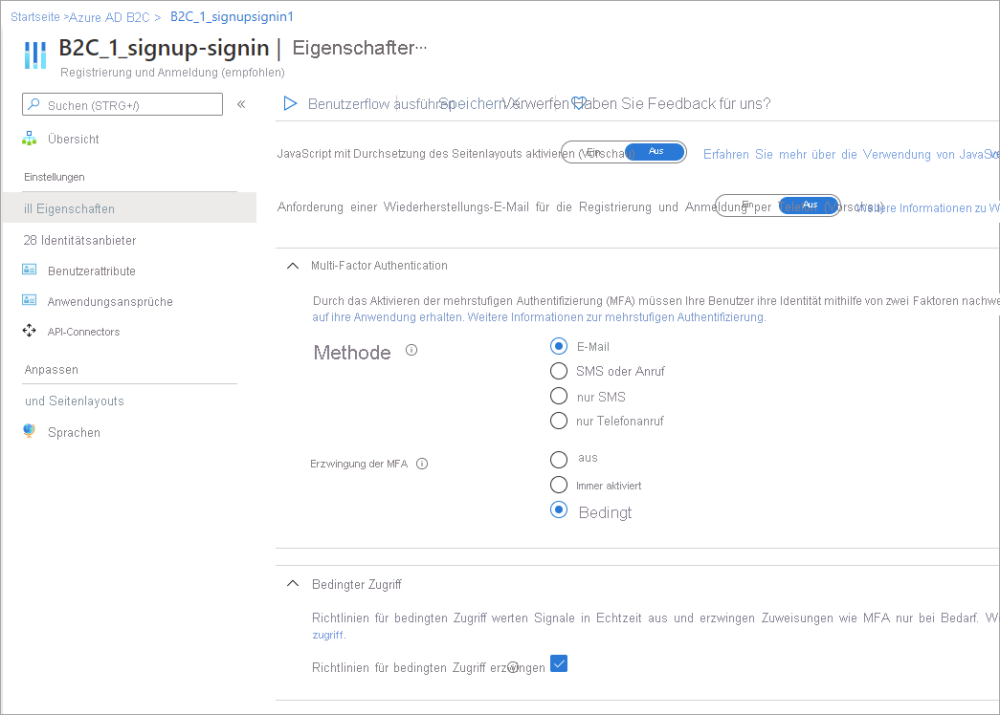

# Hinzufügen von bedingtem Zugriff zu Benutzerflows in Azure Active Directory B2C

[!INCLUDE [b2c-public-preview-feature](../../includes/active-directory-b2c-public-preview.md)]

Sie können Ihren Azure Active Directory B2C-Benutzerflows bedingten Zugriff hinzufügen, um Risikoanmeldungen für Ihre Anwendungen zu verwalten. Die Integration von Identity Protection und bedingtem Zugriff in Azure AD B2C ermöglicht das Einrichten von Richtlinien zur Erkennung von Verhalten, das auf eine Risikoanmeldung hindeutet, sowie zur Erzwingung von Richtlinien, die eine Benutzer- oder Administratoraktion erfordern. Bedingter Zugriff in Azure AD B2C-Benutzerflows umfasst folgende Komponenten:

- **Benutzerflow:** Erstellen Sie einen Benutzerflow, der den Benutzer durch den Anmelde- und Registrierungsprozess führt. Geben Sie in den Einstellungen des Benutzerflows an, ob Richtlinien für bedingten Zugriff aktiviert werden sollen, wenn ein Benutzer den Benutzerflow durchläuft.
- **Anwendung, die Benutzer zu dem Benutzerflow weiterleitet:** Geben Sie in der App den Benutzerflow-Endpunkt an, um Ihre App für die Weiterleitung von Benutzern zum entsprechenden Benutzerflow für die Registrierung/Anmeldung zu konfigurieren.
- **Richtlinie für bedingten Zugriff:** [Erstellen Sie eine Richtlinie für bedingten Zugriff](conditional-access-identity-protection-setup.md), und geben Sie die Apps an, für die die Richtlinie gelten soll. Wenn der Benutzer den Benutzerflow für die Registrierung/Anmeldung für Ihre App durchläuft, werden Risikoanmeldungen durch die Richtlinie für bedingten Zugriff anhand von Identity Protection-Signalen identifiziert, und bei Bedarf wird die passende Aktion für die Problembehebung angezeigt.

Bedingter Zugriff wird in den neuesten Versionen von Benutzerflows unterstützt. Richtlinien für bedingten Zugriff können im Rahmen der Erstellung neuer Benutzerflows oder auch bereits vorhandenen Benutzerflows hinzugefügt werden, sofern bedingter Zugriff von der Version unterstützt wird. Wenn Sie einem bereits vorhandenen Benutzerflow bedingten Zugriff hinzufügen möchten, müssen zwei Einstellungen überprüft werden:

- **Multi-Factor Authentication (MFA)** : Benutzer können jetzt für die mehrstufige Authentifizierung einen Einmalcode per SMS oder Sprachanruf oder ein Einmalkennwort per E-Mail erhalten. MFA-Einstellungen sind unabhängig von Einstellungen für bedingten Zugriff. Sie können MFA auf **Immer aktiv** festlegen, damit MFA unabhängig von der Konfiguration des bedingten Zugriffs immer erforderlich ist. Alternativ können Sie MFA auf **Bedingt** festlegen, damit MFA nur erforderlich ist, wenn dies durch eine aktive Richtlinie für bedingten Zugriff angefordert wird.

- **Bedingter Zugriff:** Diese Einstellung sollte immer auf **Ein** festgelegt sein. Sie wird in der Regel nur bei der Problembehandlung oder Migration oder für Legacyimplementierungen auf **Aus** festgelegt.

Weitere Informationen zu Identity Protection und bedingtem Zugriff in Azure AD B2C finden Sie [hier](conditional-access-identity-protection-overview.md). Informationen zur Einrichtung finden Sie [hier](conditional-access-identity-protection-setup.md).

## Hinzufügen von bedingtem Zugriff zu einem neuen Benutzerflow

1. Melden Sie sich beim [Azure-Portal](https://portal.azure.com) an.
1. Wählen Sie auf der Symbolleiste des Portals das Symbol **Verzeichnis und Abonnement** aus, und wählen Sie dann das Verzeichnis aus, das Ihren Azure AD B2C-Mandanten enthält.
1. Suchen Sie im Azure-Portal nach **Azure AD B2C**, und wählen Sie diese Option dann aus.
1. Wählen Sie unter **Richtlinien** die Option **Benutzerflows** und dann **Neuer Benutzerflow** aus.
1. Wählen Sie auf der Seite **Benutzerflow erstellen** die Art des Benutzerflows aus.
1. Wählen Sie unter **Version auswählen** die Option **Empfohlen** und dann **Erstellen** aus. (Weitere Informationen zu [Benutzerflowversionen](user-flow-versions.md))

    

1. Geben Sie unter **Name** einen Namen für den Benutzerflow ein. Beispiel: *signupsignin1*.
1. Wählen Sie im Abschnitt **Identitätsanbieter** die Identitätsanbieter aus, die Sie für diesen Benutzerflow zulassen möchten.
2. Wählen Sie im Abschnitt **Mehrstufige Authentifizierung** die gewünschte **MFA-Methode** und anschließend unter **Erzwingung der MFA** die Option **Bedingt (empfohlen)** aus.
 
   

1. Aktivieren Sie im Abschnitt **Bedingter Zugriff** das Kontrollkästchen **Richtlinien für bedingten Zugriff erzwingen**.

   

1. Wählen Sie im Abschnitt **Benutzerattribute und Ansprüche** die Ansprüche und Attribute aus, die Sie bei der Benutzerregistrierung erfassen und senden möchten. Wählen Sie also beispielsweise **Mehr anzeigen** und dann Attribute und Ansprüche für **Land/Region** und **Anzeigename** aus. Klicken Sie auf **OK**.

    

1. Klicken Sie auf **Erstellen**, um den Benutzerflow hinzuzufügen. Dem Namen wird automatisch das Präfix *B2C_1* vorangestellt.

## Hinzufügen von bedingtem Zugriff zu einem bereits vorhandenen Benutzerflow

> [!NOTE]
> Bei dem vorhandenen Benutzerflow muss es sich um eine Version handeln, die bedingten Zugriff unterstützt. Diese Benutzerflowversionen sind als **Empfohlen** gekennzeichnet.

1. Melden Sie sich beim [Azure-Portal](https://portal.azure.com) an.

1. Wählen Sie auf der Symbolleiste des Portals das Symbol **Verzeichnis und Abonnement** aus, und wählen Sie dann das Verzeichnis aus, das Ihren Azure AD B2C-Mandanten enthält.

1. Suchen Sie im Azure-Portal nach **Azure AD B2C**, und wählen Sie diese Option dann aus.

1. Wählen Sie unter **Richtlinien** die Option **Benutzerflows** aus. Wählen Sie anschließend den Benutzerflow aus.

1. Wählen Sie **Eigenschaften** aus, und vergewissern Sie sich, dass der Benutzerflow bedingten Zugriff unterstützt, indem Sie **Eigenschaften** auswählen und nach der Einstellung **Bedingter Zugriff** suchen.
 
   

1. Wählen Sie im Abschnitt **Mehrstufige Authentifizierung** die gewünschte **MFA-Methode** und anschließend unter **Erzwingung der MFA** die Option **Bedingt (empfohlen)** aus.
 
1. Aktivieren Sie im Abschnitt **Bedingter Zugriff** das Kontrollkästchen **Richtlinien für bedingten Zugriff erzwingen**.

1. Wählen Sie **Speichern** aus.

## Testen des Benutzerflows

Testen Sie den bedingten Zugriff im Benutzerflow, indem Sie [eine Richtlinie für bedingten Zugriff erstellen](conditional-access-identity-protection-setup.md) und bedingten Zugriff im Benutzerflow aktivieren, wie oben beschrieben. 

### Voraussetzungen

- Für die Erstellung von Risikoanmeldungsrichtlinien ist Azure AD B2C Premium 2 ist erforderlich. Für Premium P1-Mandanten können standort-, App- oder gruppenbasierte Richtlinien erstellt werden.
- Zu Testzwecken können Sie [die Testwebanwendung `https://jwt.ms` registrieren](tutorial-register-applications.md). Hierbei handelt es sich um eine Microsoft-Webanwendung, die den decodierten Inhalt eines Tokens anzeigt. (Der Inhalt des Tokens verlässt niemals Ihren Browser.) 
- Laden Sie zum Simulieren einer Risikoanmeldung den Tor-Browser herunter, und versuchen Sie, sich beim Benutzerflow-Endpunkt anzumelden.
- [Erstellen Sie eine Richtlinie für bedingten Zugriff](conditional-access-identity-protection-setup.md), und verwenden Sie dabei die folgenden Einstellungen:
   
   - Wählen Sie für **Benutzer und Gruppen** den Testbenutzer aus. (Wählen Sie nicht **Alle Benutzer** aus. Andernfalls wird unter Umständen Ihre eigene Anmeldung blockiert.)
   - Wählen Sie für **Cloud-Apps oder -aktionen** die Option **Apps auswählen** und anschließend Ihre Anwendung der vertrauenden Seite aus.
   - Wählen Sie unter den Bedingungen die Option **Anmelderisiko** und die Risikostufen **Hoch**, **Mittel** und **Niedrig** aus.
   - Wählen Sie für **Gewähren** die Option **Zugriff blockieren** aus.

      

### Ausführen des Benutzerflows

1. Wählen Sie den von Ihnen erstellten Benutzerflow aus, um die entsprechende Übersichtsseite zu öffnen, und wählen Sie dann **Benutzerflow ausführen** aus. Wählen Sie unter **Anwendung** die Option *webapp1* aus. Als **Antwort-URL** sollte `https://jwt.ms` angezeigt werden.

   

1. Kopieren Sie die URL unter **Benutzerflow-Endpunkt ausführen**.

1. Öffnen Sie zum Simulieren einer Risikoanmeldung den [Tor-Browser](https://www.torproject.org/download/), und verwenden Sie die URL, die Sie im vorherigen Schritt kopiert haben, um sich bei der registrierten App anzumelden.

1. Geben Sie auf der Anmeldeseite die angeforderten Informationen ein, und versuchen Sie dann, sich anzumelden. Das Token wird an `https://jwt.ms` zurückgegeben und sollte Ihnen angezeigt werden. Im decodierten Token „jwt.ms“ sollte zu sehen sein, dass die Anmeldung blockiert wurde:

   

## Nächste Schritte

[Anpassen der Benutzeroberfläche in Azure Active Directory B2C](customize-ui-overview.md)
