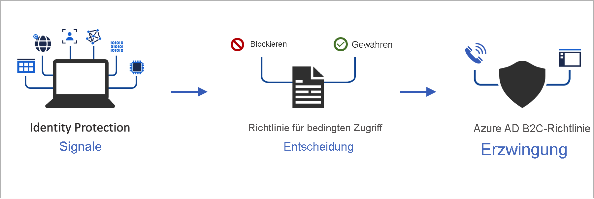

# <a name="add-conditional-access-to-user-flows-in-azure-active-directory-b2c"></a>Hinzufügen von bedingtem Zugriff zu Benutzerflows in Azure Active Directory B2C

[!INCLUDE [active-directory-b2c-choose-user-flow-or-custom-policy](../../includes/active-directory-b2c-choose-user-flow-or-custom-policy.md)]

Sie können Ihren Azure Active Directory B2C-Benutzerflows (Azure AD B2C) bedingten Zugriff oder benutzerdefinierte Richtlinien hinzufügen, um Risikoanmeldungen für Ihre Anwendungen zu verwalten. Über den bedingten Zugriff in Azure Active Directory (Azure AD) werden in Azure AD B2C Signale zusammengeführt, Entscheidungen getroffen und Organisationsrichtlinien erzwungen.



Die Automatisierung der Risikobewertung mit Richtlinienbedingungen bedeutet, dass Risikoanmeldungen sofort erkannt und dann behoben oder blockiert werden.

[!INCLUDE [b2c-public-preview-feature](../../includes/active-directory-b2c-public-preview.md)]

## <a name="service-overview"></a>Übersicht über die Dienste

In Azure AD B2C wird jedes Anmeldungsereignis ausgewertet und sichergestellt, dass alle Richtlinienanforderungen erfüllt sind, bevor dem Benutzer der Zugriff gewährt wird. Während dieser **Auswertungsphase** wertet der Dienst für bedingten Zugriff die Signale aus, die von den Identity Protection-Risikoerkennungen während Anmeldungsereignissen erfasst wurden. Das Ergebnis dieser Auswertung ist eine Sammlung von Ansprüchen, die angibt, ob die Anmeldung erteilt oder blockiert werden soll. Gemäß der Azure AD B2C-Richtlinie werden Aktionen innerhalb des Benutzerflows, z. B. das Blockieren des Zugriffs oder das Überprüfen des Benutzers mit einer bestimmten Abwehrmaßnahme wie mehrstufige Authentifizierung (Multi-Factor Authentication, MFA), auf Grundlage dieser Ansprüche ausgeführt. „Zugriff blockieren“ überschreibt alle anderen Einstellungen.

::: zone pivot="b2c-custom-policy"
Das folgende Beispiel zeigt ein technisches Profil für den bedingten Zugriff, das zur Auswertung der Anmeldebedrohung verwendet wird.

```XML
<TechnicalProfile Id="ConditionalAccessEvaluation">
  <DisplayName>Conditional Access Provider</DisplayName>
  <Protocol Name="Proprietary" Handler="Web.TPEngine.Providers.ConditionalAccessProtocolProvider, Web.TPEngine, Version=1.0.0.0, Culture=neutral, PublicKeyToken=null" />
  <Metadata>
    <Item Key="OperationType">Evaluation</Item>
  </Metadata>
  ...
</TechnicalProfile>
```

::: zone-end

In der folgenden **Abwehrphase** wird der Benutzer zu mehrstufiger Authentifizierung aufgefordert. Nach Abschluss der Authentifizierung wird Identity Protection von Azure AD B2C darüber informiert, dass und mit welcher Methode die identifizierte Anmeldungsbedrohung abgewehrt wurde. In diesem Beispiel signalisiert Azure AD B2C, dass der Benutzer die mehrstufige Authentifizierung erfolgreich abgeschlossen hat. 

::: zone pivot="b2c-custom-policy"

Das folgende Beispiel zeigt ein technisches Profil für den bedingten Zugriff, das zum Korrigieren der identifizierten Bedrohung verwendet wird:

```XML
<TechnicalProfile Id="ConditionalAccessRemediation">
  <DisplayName>Conditional Access Remediation</DisplayName>
  <Protocol Name="Proprietary" Handler="Web.TPEngine.Providers.ConditionalAccessProtocolProvider, Web.TPEngine, Version=1.0.0.0, Culture=neutral, PublicKeyToken=null"/>
  <Metadata>
    <Item Key="OperationType">Remediation</Item>
  </Metadata>
  ...
</TechnicalProfile>
```

::: zone-end

## <a name="components-of-the-solution"></a>Komponenten der Lösung

Bedingter Zugriff in Azure AD B2C umfasst folgende Komponenten:

- Ein **Benutzerflow** oder eine **benutzerdefinierte Richtlinie**, der bzw. die den Benutzer durch den Anmelde- und Registrierungsprozess führt.
- Eine **Richtlinie für bedingten Zugriff**, die Signale zusammenführt, um Entscheidungen zu treffen und Organisationsrichtlinien zu erzwingen. Wenn sich ein Benutzer über eine Azure AD B2C-Richtlinie bei Ihrer Anwendung anmeldet, verwendet die Richtlinie für bedingten Zugriff Azure AD Identity Protection-Signale, um Risikoanmeldungen zu identifizieren, und stellt die entsprechende Abwehrmaßnahme dar.
- Eine **registrierte Anwendung**, die Benutzer an den entsprechenden Azure AD B2C-Benutzerflow oder die entsprechende benutzerdefinierte Richtlinie weiterleitet.
- Ein [Tor-Browser](https://www.torproject.org/download/) zum Simulieren einer Risikoanmeldung.

## <a name="service-limitations-and-considerations"></a>Beschränkungen des Diensts und Überlegungen

Wenn Sie bedingten Zugriff in Azure AD verwenden, sollten Sie Folgendes beachten:

- Identity Protection ist sowohl für lokale Identitäten als auch für Identitäten in sozialen Netzwerken (z. B. Google oder Facebook) verfügbar. Für Identitäten in sozialen Netzwerken müssen Sie den bedingten Zugriff manuell aktivieren. Die Erkennung ist begrenzt, weil die Anmeldeinformationen des Social Media-Kontos vom externen Identitätsanbieter verwaltet werden.
- In Azure AD B2C-Mandanten ist nur eine Teilmenge der Richtlinien für den [bedingten Zugriff in Azure AD](../active-directory/conditional-access/overview.md) verfügbar.


## <a name="prerequisites"></a>Voraussetzungen

[!INCLUDE [active-directory-b2c-customization-prerequisites-custom-policy](../../includes/active-directory-b2c-customization-prerequisites-custom-policy.md)]

## <a name="pricing-tier"></a>Tarif

Für die Erstellung von Risikoanmeldungsrichtlinien ist Azure AD B2C **Premium 2** erforderlich. **Premium P1**-Mandanten können eine auf Standort, Anwendung, Benutzern oder Gruppen basierende Richtlinie erstellen. Weitere Informationen finden Sie unter [Ändern Ihres Azure AD B2C-Tarifs](billing.md#change-your-azure-ad-pricing-tier).

## <a name="prepare-your-azure-ad-b2c-tenant"></a>Vorbereiten Ihres Azure AD B2C-Mandanten

Deaktivieren Sie zum Hinzufügen einer Richtlinie für bedingten Zugriff die Sicherheitsstandards:

1. Melden Sie sich beim [Azure-Portal](https://portal.azure.com/) an.
2. Wählen Sie auf der Symbolleiste des Portals das Symbol **Verzeichnis und Abonnement** aus, und wählen Sie dann das Verzeichnis aus, das Ihren Azure AD B2C-Mandanten enthält.
3. Wählen Sie unter **Azure-Dienste** die Option **Azure AD B2C** aus. Oder verwenden Sie das Suchfeld, um nach **Azure AD B2C** zu suchen und diese Option auszuwählen.
4. Wählen Sie **Eigenschaften** und anschließend **Sicherheitsstandards verwalten** aus.

   

5. Wählen Sie unter **Sicherheitsstandards aktivieren** die Option **Nein** aus.

   

## <a name="add-a-conditional-access-policy"></a>Hinzufügen einer Richtlinie für bedingten Zugriff

Bei einer Richtlinie für bedingten Zugriff handelt es sich um eine If-Then-Anweisung von Zuweisungen und Zugriffssteuerungen. Eine Richtlinie für bedingten Zugriff führt Signale zusammen, um Entscheidungen zu treffen und Organisationsrichtlinien zu erzwingen. Der logische Operator zwischen den Zuweisungen lautet *And*. Der Operator in den einzelnen Zuweisungen lautet *Or*.


So fügen Sie eine Richtlinie für bedingten Zugriff hinzu:

1. Suchen Sie im Azure-Portal nach **Azure AD B2C**, und wählen Sie diese Option dann aus.
1. Wählen Sie unter **Sicherheit** die Option **Conditional Access (Preview)** (Bedingter Zugriff (Vorschau)) aus. Daraufhin wird die Seite **Richtlinien für bedingten Zugriff** angezeigt.
1. Wählen Sie **+ Neue Richtlinie** aus.
1. Geben Sie einen Namen für die Richtlinie ein, z. B. *Risikoanmeldungen blockieren*.
1. Wählen Sie unter **Zuweisungen** die Option **Benutzer und Gruppen** aus, und wählen Sie dann eine der folgenden unterstützten Konfigurationen aus:

    |Einschließen  |Lizenz | Notizen  |
    |---------|---------|---------|
    |**Alle Benutzer** | P1, P2 |Wenn Sie **Alle Benutzer** einschließen, wirkt sich diese Richtlinie auf alle Benutzer aus. Um sicherzustellen, dass Sie sich nicht selbst sperren, schließen Sie Ihr Administratorkonto aus, indem Sie **Ausschließen**, **Verzeichnisrollen** und dann in der Liste **Globaler Administrator** auswählen. Sie können auch **Benutzer und Gruppen** auswählen und dann in der Liste **Ausgeschlossene Benutzer auswählen** Ihr Konto auswählen.  | 
 
1. Wählen Sie **Cloud-Apps oder -Aktionen** und dann **Apps auswählen** aus. Suchen Sie nach der [Anwendung der vertrauenden Seite](tutorial-register-applications.md).

1. Wählen Sie **Bedingungen** aus, und wählen Sie dann eine der folgenden Bedingungen. Wählen Sie beispielsweise die Option **Anmelderisiko** und die Risikostufen **Hoch**, **Mittel** und **Niedrig** aus.
    
    |Bedingung  |Lizenz  |Notizen  |
    |---------|---------|---------|
    |**Benutzerrisiko**|P2|Ein Benutzerrisiko stellt die Wahrscheinlichkeit dar, dass eine bestimmte Identität oder ein bestimmtes Konto kompromittiert wurde.|
    |**Anmelderisiko**|P2|Ein Anmelderisiko ist die Möglichkeit, dass eine bestimmte Authentifizierungsanforderung vom Identitätsbesitzer nicht autorisiert wurde.|
    |**Geräteplattformen**|Nicht unterstützt| Werden durch das Betriebssystem gekennzeichnet, das auf dem Gerät ausgeführt wird. Weitere Informationen finden Sie unter [Geräteplattformen](../active-directory/conditional-access/concept-conditional-access-conditions.md#device-platforms).|
    |**Speicherorte**|P1, P2|Benannte Standorte können die öffentlichen IPv4-Netzwerkinformationen, das Land oder die Region oder unbekannte Bereiche umfassen, die nicht bestimmten Ländern oder Regionen zugeordnet sind. Weitere Informationen finden Sie unter [Speicherorte](../active-directory/conditional-access/concept-conditional-access-conditions.md#locations). |
 
1. Klicken Sie unter **Zugriffssteuerungen** auf **Gewähren**. Wählen Sie dann aus, ob der Zugriff blockiert oder gewährt werden soll:
    
    |Option  |Lizenz |Hinweis  |
    |---------|---------|---------|
    |**Zugriff blockieren**|P1, P2| Verhindert den Zugriff auf der Grundlage der in dieser Richtlinie für bedingten Zugriff angegebenen Bedingungen.|
    |**Zugriff gewähren** mit **Mehrstufige Authentifizierung anfordern**|P1, P2|Basierend auf den in der Richtlinie für bedingten Zugriff angegebenen Bedingungen muss der Benutzer die mehrstufige Azure AD B2C-Authentifizierung durchlaufen.|

1. Wählen Sie unter **Richtlinie aktivieren** eine der folgenden Optionen aus:
    
    |Option  |Lizenz |Hinweis  |
    |---------|---------|---------|
    |**Nur Bericht**|P1, P2| „Nur Bericht“ ermöglicht Administratoren das Auswerten der Auswirkungen von Richtlinien für bedingten Zugriff, bevor sie diese in ihrer Umgebung aktivieren. Es wird empfohlen, die Richtlinie mit diesem Status zu überprüfen und die Auswirkungen auf die Endbenutzer zu ermitteln, ohne mehrstufige Authentifizierung erforderlich zu machen oder Benutzer zu blockieren. Weitere Informationen finden Sie unter [Überprüfen der Ergebnisse des bedingten Zugriffs im Überwachungsbericht](#review-conditional-access-outcomes-in-the-audit-report).|
    | **Ein**| P1, P2| Die Zugriffsrichtlinie wird ausgewertet und nicht erzwungen. |
    | **Deaktiviert** | P1, P2| Die Zugriffsrichtlinie ist nicht aktiviert und hat keine Auswirkungen auf die Benutzer. |

1. Wählen Sie **Erstellen** aus, um Ihre Testrichtlinie für bedingten Zugriff zu aktivieren.

## <a name="add-conditional-access-to-a-user-flow"></a>Hinzufügen von bedingtem Zugriff zu Benutzerflows

Nachdem Sie die Azure AD Richtlinie für bedingten Zugriff hinzugefügt haben, aktivieren Sie den bedingten Zugriff im Benutzerflow oder in der benutzerdefinierten Richtlinie. Wenn Sie bedingten Zugriff aktivieren, müssen Sie keinen Richtliniennamen angeben.

Mehrere Richtlinien für bedingten Zugriff können jederzeit auf einen einzelnen Benutzer angewendet werden. In diesem Fall hat die strenge Zugriffssteuerungsrichtlinie Vorrang. Wenn z. B. eine Richtlinie die mehrstufige Authentifizierung (Multi-Factor Authentication, MFA) erfordert, während eine andere den Zugriff blockiert, wird der Benutzer blockiert.

## <a name="conditional-access-template-1-sign-in-risk-based-conditional-access"></a>Vorlage 1 für bedingten Zugriff: Risikobasierter bedingter Zugriff beim Anmelden

Die meisten Benutzer weisen ein normales Verhalten auf, das nachverfolgt werden kann. Wenn sie sich aber außerhalb dieser Norm bewegen, ist es ggf. riskant, ihnen das Anmelden ohne Weiteres zu erlauben. Es kann ratsam sein, den entsprechenden Benutzer zu blockieren oder ggf. einfach um die Durchführung einer mehrstufigen Authentifizierung zu bitten. So kann bewiesen werden, ob es sich auch wirklich um die Person handelt, die vorgegeben wird.

Ein Anmelderisiko stellt die Wahrscheinlichkeit dar, dass eine bestimmte Authentifizierungsanforderung vom Identitätsbesitzer nicht autorisiert wurde. Organisationen mit P2-Lizenzen können Richtlinien für bedingten Zugriff erstellen, die [Azure AD Identity Protection-Risikoerkennungen](../active-directory/identity-protection/concept-identity-protection-risks.md#sign-in-risk) enthalten. Beachten Sie die [Einschränkungen bei Identity Protection-Erkennungen für B2C](./identity-protection-investigate-risk.md?pivots=b2c-user-flow#service-limitations-and-considerations).

Wenn Risiken erkannt werden, können die Benutzer die mehrstufige Authentifizierung zur Eigenwartung durchführen und das riskante Anmeldeereignis schließen, um unnötigen Aufwand für Administratoren zu vermeiden.

Organisationen sollten eine der folgenden Optionen auswählen, um eine Richtlinie für den risikobasierten bedingten Zugriff beim Anmelden zu aktivieren, für die mehrstufige Authentifizierung (Multi-Factor Authentication, MFA) erforderlich ist, wenn das Anmelderisiko mittel ODER hoch ist.

### <a name="enable-with-conditional-access-policy"></a>Aktivieren mit einer Richtlinie für bedingten Zugriff

1. Melden Sie sich beim **Azure-Portal** an.
2. Navigieren Sie zu **Azure AD B2C** > **Sicherheit** > **Bedingter Zugriff**.
3. Wählen Sie **Neue Richtlinie**.
4. Benennen Sie Ihre Richtlinie. Es wird empfohlen, dass Unternehmen einen aussagekräftigen Standard für die Namen ihrer Richtlinien erstellen.
5. Klicken Sie unter **Zuweisungen** auf **Benutzer und Gruppen**.
   1. Wählen Sie unter **Einschließen** die Option **Alle Benutzer** aus.
   2. Wählen Sie unter **Ausschließen** die Option **Benutzer und Gruppen** und dann die Konten für den Notfallzugriff Ihres Unternehmens aus. 
   3. Wählen Sie **Fertig** aus.
6. Wählen Sie unter **Cloud-Apps oder -aktionen** > **Einschließen** die Option **Alle Cloud-Apps** aus.
7. Legen Sie unter **Bedingungen** > **Anmelderisiko** die Option **Konfigurieren** auf **Ja** fest. Wählen Sie unter **Anmelderisikostufe auswählen, auf die diese Richtlinie angewendet werden soll** 
   1. entweder **Hoch** oder **Mittel** aus.
   2. Wählen Sie **Fertig** aus.
8. Wählen Sie unter **Zugriffssteuerung** > **Erteilen** die Option **Zugriff erteilen**, dann **Mehrstufige Authentifizierung erforderlich** und anschließend **Auswählen** aus.
9. Bestätigen Sie die Einstellungen und legen Sie **Richtlinie aktivieren** auf **Ein** fest.
10. Wählen Sie **Erstellen** aus, um die Richtlinie zu erstellen und zu aktivieren.

### <a name="enable-with-conditional-access-apis"></a>Aktivieren mit APIs für bedingten Zugriff

Informationen zum Erstellen einer Richtlinie für den risikobasierten bedingten Zugriff beim Anmelden mit APIs für bedingten Zugriff finden Sie in der Dokumentation zu [APIs für bedingten Zugriff](../active-directory/conditional-access/howto-conditional-access-apis.md#graph-api).

Mit der folgenden Vorlage kann eine Richtlinie für bedingten Zugriff mit dem Anzeigenamen „CA002: Require MFA for medium+ sign-in risk“ im Modus „Nur melden“ erstellt werden.

```json
{
    "displayName": "Template 1: Require MFA for medium+ sign-in risk",
    "state": "enabledForReportingButNotEnforced",
    "conditions": {
        "signInRiskLevels": [ "high" ,
            "medium"
        ],
        "applications": {
            "includeApplications": [
                "All"
            ]
        },
        "users": {
            "includeUsers": [
                "All"
            ],
            "excludeUsers": [
                "f753047e-de31-4c74-a6fb-c38589047723"
            ]
        }
    },
    "grantControls": {
        "operator": "OR",
        "builtInControls": [
            "mfa"
        ]
    }
}
```

## <a name="enable-multi-factor-authentication-optional"></a>Aktivieren der mehrstufigen Authentifizierung (optional)

Wenn Sie einem Benutzerflow bedingten Zugriff hinzufügen, sollten Sie die Verwendung von **mehrstufiger Authentifizierung (Multi-Factor Authentication, MFA)** in Betracht ziehen. Benutzer können für die mehrstufige Authentifizierung einen Einmalcode per SMS oder Sprachanruf oder ein Einmalkennwort per E-Mail erhalten. MFA-Einstellungen sind unabhängig von Einstellungen für bedingten Zugriff. Sie können zwischen den folgenden MFA-Optionen wählen:

   - **Deaktiviert:** MFA wird während der Anmeldung nie erzwungen, und Benutzer werden während der Registrierung oder Anmeldung nicht aufgefordert, sich für MFA zu registrieren.
   - **Immer aktiv:** MFA ist unabhängig von der Konfiguration des bedingten Zugriffs immer erforderlich. Wenn Benutzer noch nicht für MFA registriert sind, werden sie während der Anmeldung aufgefordert, sich zu registrieren. Während der Registrierung werden Benutzer aufgefordert, sich für MFA zu registrieren.
   - **Bedingt (Vorschau):** MFA ist nur erforderlich, wenn dies durch eine aktive Richtlinie für bedingten Zugriff angefordert wird. Wenn das Ergebnis der Auswertung des bedingten Zugriffs eine MFA-Abfrage ohne Risiko ist, wird MFA während der Anmeldung erzwungen. Wenn das Ergebnis eine MFA-Abfrage aufgrund eines Risikos ist *und* der Benutzer nicht für MFA registriert ist, wird die Anmeldung blockiert. Während der Registrierung werden Benutzer nicht aufgefordert, sich für MFA zu registrieren.

> [!IMPORTANT]
> Wenn die Richtlinie für bedingten Zugriff den Zugriff mit MFA gewährt, der Benutzer aber keine Telefonnummer registriert hat, wird der Benutzer möglicherweise blockiert.

::: zone pivot="b2c-user-flow"

Um bedingten Zugriff für einen Benutzerflow zu aktivieren, stellen Sie sicher, dass die Version bedingten Zugriff unterstützt. Diese Benutzerflowversionen sind als **Empfohlen** gekennzeichnet.

1. Melden Sie sich beim [Azure-Portal](https://portal.azure.com) an.

1. Wählen Sie auf der Symbolleiste des Portals das Symbol **Verzeichnis und Abonnement** aus, und wählen Sie dann das Verzeichnis aus, das Ihren Azure AD B2C-Mandanten enthält.

1. Wählen Sie unter **Azure-Dienste** die Option **Azure AD B2C** aus. Oder verwenden Sie das Suchfeld, um nach **Azure AD B2C** zu suchen und diese Option auszuwählen.

1. Wählen Sie unter **Richtlinien** die Option **Benutzerflows** aus. Wählen Sie anschließend den Benutzerflow aus.

1. Wählen Sie **Eigenschaften** aus, und vergewissern Sie sich, dass der Benutzerflow bedingten Zugriff unterstützt, indem Sie nach der Einstellung **Bedingter Zugriff** suchen.
 
   

1. Wählen Sie im Abschnitt **Mehrstufige Authentifizierung** den gewünschten **Methodentyp** und anschließend unter **Erzwingung der MFA** die Option **Bedingt (Vorschau)** aus.
 
1. Aktivieren Sie im Abschnitt **Bedingter Zugriff (Vorschau)** das Kontrollkästchen **Richtlinien für bedingten Zugriff erzwingen**.

1. Wählen Sie **Speichern** aus.


::: zone-end

::: zone pivot="b2c-custom-policy"

## <a name="add-conditional-access-to-your-policy"></a>Hinzufügen des bedingten Zugriffs zu Ihrer Richtlinie

1. Rufen Sie das Beispiel für eine Richtlinie für bedingten Zugriff auf [GitHub](https://github.com/azure-ad-b2c/samples/tree/master/policies/conditional-access) ab.
1. Ersetzen Sie in jeder Datei die Zeichenfolge `yourtenant` durch den Namen Ihres Azure AD B2C-Mandanten. Wenn der Name des B2C-Mandanten z.B. *contosob2c* lautet, werden alle Instanzen von `yourtenant.onmicrosoft.com` zu `contosob2c.onmicrosoft.com`.
1. Laden Sie die Richtliniendateien hoch.

## <a name="test-your-custom-policy"></a>Testen der benutzerdefinierten Richtlinie

1. Wählen Sie die Richtlinie `B2C_1A_signup_signin_with_ca` oder `B2C_1A_signup_signin_with_ca_whatif` aus, um die entsprechende Übersichtsseite zu öffnen. Wählen Sie dann **Benutzerflow ausführen** aus. Wählen Sie unter **Anwendung** die Option *webapp1* aus. Als **Antwort-URL** sollte `https://jwt.ms` angezeigt werden.
1. Kopieren Sie die URL unter **Benutzerflow-Endpunkt ausführen**.

1. Öffnen Sie zum Simulieren einer Risikoanmeldung den [Tor-Browser](https://www.torproject.org/download/), und verwenden Sie die URL, die Sie im vorherigen Schritt kopiert haben, um sich bei der registrierten App anzumelden.

1. Geben Sie auf der Anmeldeseite die angeforderten Informationen ein, und versuchen Sie dann, sich anzumelden. Das Token wird an `https://jwt.ms` zurückgegeben und sollte Ihnen angezeigt werden. Im decodierten Token „jwt.ms“ sollte zu sehen sein, dass die Anmeldung blockiert wurde.

::: zone-end

::: zone pivot="b2c-user-flow"

## <a name="test-your-user-flow"></a>Testen des Benutzerflows

1. Wählen Sie den von Ihnen erstellten Benutzerflow aus, um die entsprechende Übersichtsseite zu öffnen, und wählen Sie anschließend **Benutzerflow ausführen** aus. Wählen Sie unter **Anwendung** die Option *webapp1* aus. Als **Antwort-URL** sollte `https://jwt.ms` angezeigt werden.

1. Kopieren Sie die URL unter **Benutzerflow-Endpunkt ausführen**.

1. Öffnen Sie zum Simulieren einer Risikoanmeldung den [Tor-Browser](https://www.torproject.org/download/), und verwenden Sie die URL, die Sie im vorherigen Schritt kopiert haben, um sich bei der registrierten App anzumelden.

1. Geben Sie auf der Anmeldeseite die angeforderten Informationen ein, und versuchen Sie dann, sich anzumelden. Das Token wird an `https://jwt.ms` zurückgegeben und sollte Ihnen angezeigt werden. Im decodierten Token „jwt.ms“ sollte zu sehen sein, dass die Anmeldung blockiert wurde.

::: zone-end

## <a name="review-conditional-access-outcomes-in-the-audit-report"></a>Überprüfen der Ergebnisse des bedingten Zugriffs im Überwachungsbericht

So überprüfen Sie das Ergebnis eines Ereignisses für bedingten Zugriff:

1. Melden Sie sich beim [Azure-Portal](https://portal.azure.com/) an.

2. Wählen Sie auf der Symbolleiste des Portals das Symbol **Verzeichnis und Abonnement** aus, und wählen Sie dann das Verzeichnis aus, das Ihren Azure AD B2C-Mandanten enthält.

3. Wählen Sie unter **Azure-Dienste** die Option **Azure AD B2C** aus. Oder verwenden Sie das Suchfeld, um nach **Azure AD B2C** zu suchen und diese Option auszuwählen.

4. Wählen Sie unter **Aktivitäten** die Option **Überwachungsprotokolle** aus.

5. Filtern Sie das Überwachungsprotokoll. Legen Sie hierzu **Kategorie** auf **B2C** und **Aktivitätsressourcentyp** auf **IdentityProtection** fest. Wählen Sie dann **Anwenden** aus.

6. Überprüfen Sie die Überwachungsaktivität für maximal die letzten sieben Tage. Folgende Aktivitätstypen sind enthalten:

   - **Evaluate conditional access policies** (Richtlinien für bedingten Zugriff auswerten): Dieser Überwachungsprotokolleintrag gibt an, dass während einer Authentifizierung eine Auswertung für bedingten Zugriff durchgeführt wurde.
   - **Remediate user** (Benutzer bereinigen): Dieser Eintrag gibt an, dass die Gewährung oder die Anforderungen einer Richtlinie für bedingten Zugriff durch den Endbenutzer erfüllt wurde bzw. wurden und dass diese Aktivität an das Risikomodul gemeldet wurde, um das Risiko des Benutzers zu verringern.

7. Wählen Sie in der Liste einen Eintrag vom Typ **Evaluate conditional access policy** (Richtlinien für bedingten Zugriff auswerten) aus, um die Seite **Aktivitätsdetails: Überwachungsprotokoll** zu öffnen. Dort werden neben den Überwachungsprotokollbezeichnern die folgenden Informationen im Abschnitt **Zusätzliche Informationen** angezeigt:

   - **ConditionalAccessResult**: Die für die Auswertung der bedingten Richtlinie erforderliche Gewährung.
   - **AppliedPolicies**: Eine Liste mit allen Richtlinien für bedingten Zugriff, bei denen die Bedingungen erfüllt wurden und die Richtlinien aktiviert sind.
   - **ReportingPolicies**: Eine Liste mit den Richtlinien für bedingten Zugriff, die auf den reinen Berichtsmodus festgelegt sind und deren Bedingungen erfüllt wurden.

## <a name="next-steps"></a>Nächste Schritte

[Anpassen der Benutzeroberfläche in Azure Active Directory B2C](customize-ui-with-html.md)