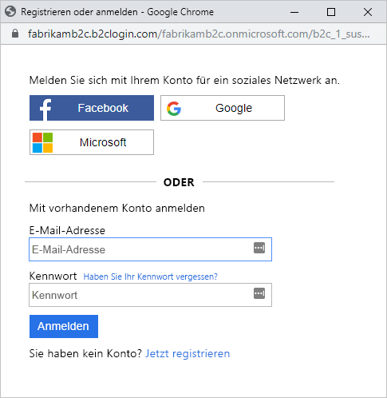
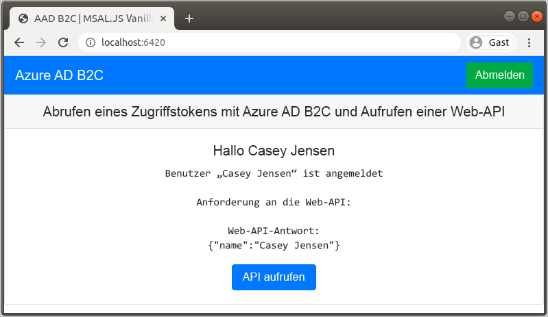

# <a name="quickstart-set-up-sign-in-for-a-single-page-app-using-azure-active-directory-b2c"></a>Schnellstart: Einrichten der Anmeldung für eine einseitige App mit Azure Active Directory B2C

Azure Active Directory B2C (Azure AD B2C) ermöglicht die Cloudidentitätsverwaltung zum Schützen Ihrer Anwendung, Ihres Unternehmens und Ihrer Kunden. Mit Azure AD B2C können sich Ihre Anwendungen über offene Standardprotokolle bei Konten für soziale Netzwerke und bei Unternehmenskonten authentifizieren. In dieser Schnellstartanleitung verwenden Sie eine Single-Page-Anwendung, um sich unter Verwendung eines sozialen Netzwerks als Identitätsanbieter anzumelden und eine per Azure AD B2C geschützte Web-API aufzurufen.

[!INCLUDE [quickstarts-free-trial-note](../../includes/quickstarts-free-trial-note.md)]

## <a name="prerequisites"></a>Voraussetzungen

- [Visual Studio 2019](https://www.visualstudio.com/downloads/) mit der Workload **ASP.NET und Webentwicklung**
- [Node.js](https://nodejs.org/en/download/)
- Ein Social Media-Konto von Facebook, Google oder Microsoft
- Codebeispiel von GitHub: [active-directory-b2c-javascript-msal-singlepageapp](https://github.com/Azure-Samples/active-directory-b2c-javascript-msal-singlepageapp)

    Sie können [das ZIP-Archiv herunterladen](https://github.com/Azure-Samples/active-directory-b2c-javascript-msal-singlepageapp/archive/master.zip) oder das Repository klonen:

    ```
    git clone https://github.com/Azure-Samples/active-directory-b2c-javascript-msal-singlepageapp.git
    ```

## <a name="run-the-application"></a>Ausführen der Anwendung

1. Starten Sie den Server, indem Sie die folgenden Befehle über die Node.js-Eingabeaufforderung ausführen:

    ```
    cd active-directory-b2c-javascript-msal-singlepageapp
    npm install && npm update
    node server.js
    ```

    „Server.js“ gibt die Portnummer aus, über die unter „localhost“ gelauscht wird.

    ```
    Listening on port 6420...
    ```

2. Navigieren Sie zur URL der Anwendung. Beispiel: `http://localhost:6420`.

## <a name="sign-in-using-your-account"></a>Anmelden mit Ihrem Konto

1. Klicken Sie auf **Anmelden**, um den Workflow zu starten.

    

    In der Beispielanwendung werden mehrere Registrierungsoptionen unterstützt, z.B. die Nutzung eines sozialen Netzwerks als Identitätsanbieter oder die Erstellung eines lokalen Kontos per E-Mail-Adresse. Verwenden Sie für diese Schnellstartanleitung ein Konto bei einem sozialen Netzwerk als Identitätsanbieter (etwa Facebook, Google oder Microsoft).

2. Azure AD B2C zeigt für die Beispielwebanwendung eine Anmeldeseite für ein fiktives Unternehmen namens „Fabrikam“ an. Um sich mit einem Social Media-Konto als Identitätsanbieter zu registrieren, klicken Sie auf die Schaltfläche des Identitätsanbieters, den Sie verwenden möchten.

    

    Sie authentifizieren sich mit den Anmeldeinformationen Ihres Social Media-Kontos und autorisieren die Anwendung dazu, Informationen aus Ihrem Social Media-Konto zu lesen. Wenn Sie der Anwendung Zugriff auf diese gewähren, kann die Anwendung Profilinformationen aus dem Social Media-Konto abrufen, z.B. Ihren Namen und Ihre Stadt.

3. Schließen Sie den Anmeldevorgang für den Identitätsanbieter ab.

## <a name="access-a-protected-api-resource"></a>Zugreifen auf eine geschützte API-Ressource

Klicken Sie auf **Call Web API** (Web-API aufrufen), um Ihren Anzeigenamen des Web-API-Aufrufs als JSON-Objekt zurückzugeben.



Die Single-Page-Beispielanwendung enthält ein Zugriffstoken in der Anforderung, die an die geschützte Web-API-Ressource gesendet wird.

## <a name="clean-up-resources"></a>Bereinigen von Ressourcen

Sie können Ihren Azure AD B2C-Mandanten für weitere Azure AD B2C-Schnellstarts oder -Tutorials verwenden. Wenn Sie ihn nicht mehr benötigt, können Sie [Ihren Azure AD B2C-Mandanten löschen](faq.md#how-do-i-delete-my-azure-ad-b2c-tenant).

## <a name="next-steps"></a>Nächste Schritte

In dieser Schnellstartanleitung haben Sie mithilfe eines Beispiels für eine Single-Page-Webanwendung folgende Aktionen durchgeführt:

* Anmelden mit einer benutzerdefinierten Anmeldeseite
* Anmelden mit einem sozialen Netzwerk als Identitätsanbieter
* Erstellen eines Azure AD B2C-Kontos
* Aufrufen einer durch Azure AD B2C geschützten Web-API

Machen Sie sich als Nächstes mit der Erstellung Ihres eigenen Azure AD B2C-Mandanten vertraut.

> [!div class="nextstepaction"]
> [Erstellen eines Azure Active Directory B2C-Mandanten im Azure-Portal](tutorial-create-tenant.md)
