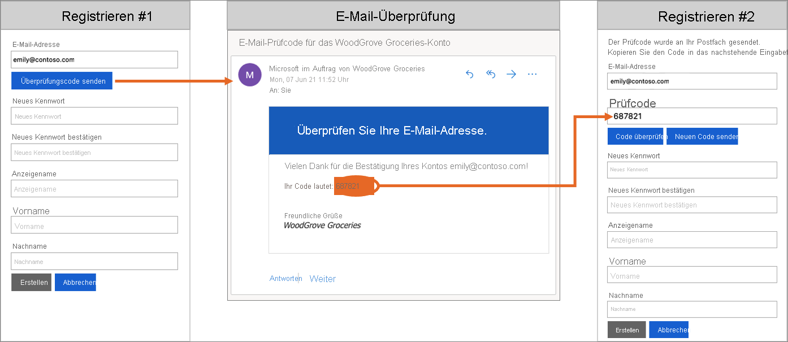
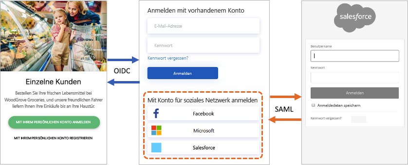
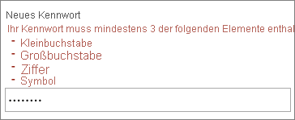
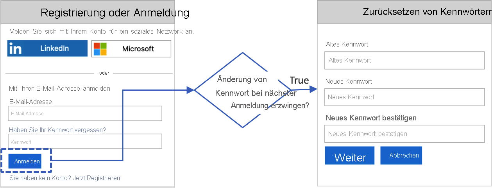

# Technische und Funktionsübersicht für Azure Active Directory B2C

Als Ergänzung zu [Was ist Azure Active Directory B2C?](overview.md) bietet Ihnen dieser Artikel eine ausführlichere Einführung in den Dienst. Hier werden die wichtigsten Ressourcen, mit denen Sie unter diesem Dienst arbeiten, sowie die zugehörigen Features beschrieben. Es wird beschrieben, wie Sie mit diesen Features in Ihren Anwendungen eine vollständig benutzerdefinierte Identitätsfunktion für Ihre Kunden bereitstellen können.

## Azure AD B2C-Mandant

Ein *Mandant* in Azure Active Directory B2C (Azure AD B2C) stellt Ihre Organisation dar und ist ein Verzeichnis von Benutzern. Jeder Azure AD B2C-Mandant unterscheidet sich von anderen Azure AD B2C-Mandanten und ist von diesen getrennt. Der Azure AD B2C-Mandant unterscheidet sich von einem Azure Active Directory-Mandanten, wie Sie ihn möglicherweise bereits verwenden.

Die wichtigsten Ressourcen, mit denen Sie in einem Azure AD B2C Mandanten arbeiten, sind die folgenden:

* **Verzeichnis**: Im *Verzeichnis* werden die Anmeldeinformationen und Profildaten Ihrer Benutzer sowie die Anwendungsregistrierungen von Azure AD B2C gespeichert.
* **Anwendungsregistrierungen:** Sie registrieren Ihre Web-, Mobil- und nativen Anwendungen bei Azure AD B2C, um die Identitätsverwaltung zu ermöglichen. Sie können auch beliebige APIs registrieren, die mit Azure Active Directory B2C geschützt werden sollen.
* **Benutzerflows** und **benutzerdefinierte Richtlinien**: Erstellen Sie Identitätsfunktionen für Ihre Anwendungen mit integrierten Benutzerflows und vollständig anpassbaren benutzerdefinierten Richtlinien.
  * **Benutzerflows** unterstützen Sie dabei, häufige identitätsbezogene Aufgaben wie Anmeldungen, Registrierungen und Profilbearbeitungen schnell zu erledigen.
  * Verwenden Sie **benutzerdefinierte Richtlinien** für komplexe Identitätsworkflows, die individuell auf Ihre Organisation, Kunden, Mitarbeiter, Partner und Bürger zugeschnitten sind.
* **Anmeldeoptionen:** Azure AD B2C bietet verschiedene [Registrierungs- und Anmeldeoptionen](sign-in-options.md) für Benutzer Ihrer Anwendungen:
  * **Anmeldung per Benutzername, E-Mail-Adresse und Telefon:** Konfigurieren Sie Ihre lokalen Azure AD B2C-Konten, um die Anmeldung und Registrierung mit einem Benutzernamen, einer E-Mail-Adresse und einer Telefonnummer oder einer Kombination dieser Methoden zu ermöglichen.
  * **Soziales Netzwerk als Identitätsanbieter:** Arbeiten Sie mit sozialen Netzwerken wie Facebook, LinkedIn oder Twitter als Identitätsanbieter zusammen.
  * **Externe Identitätsanbieter**, die Standardidentitätsprotokolle wie OAuth 2.0 oder OpenID Connect unterstützen
* **Schlüssel**: Hinzufügen und Verwalten von Verschlüsselungsschlüsseln zum Signieren und Überprüfen von Token, geheimen Clientschlüsseln, Zertifikaten und Kennwörtern.

Ein Azure AD B2C-Mandant ist die erste Ressource, die Sie erstellen müssen, um Azure AD B2C zu verwenden. In diesem Artikel werden folgende Themen erläutert:

* [Erstellen eines Azure Active Directory B2C-Mandanten](tutorial-create-tenant.md)
* [Verwalten Ihres Azure AD B2C-Mandanten](tenant-management.md)

## Konten in Azure AD B2C

Azure AD B2C definiert mehrere Typen von Benutzerkonten. In Azure Active Directory, Azure Active Directory B2B und Azure Active Directory B2C können dieselben Arten von Benutzerkonten verwendet werden.

* **Geschäftskonto**: Benutzer mit Geschäftskonten können Ressourcen in einem Mandanten verwalten und zudem Mandanten verwalten, wenn sie über eine Administratorrolle verfügen. Benutzer mit Geschäftskonten können neue Consumerkonten erstellen, Kennwörter zurücksetzen, Konten sperren/entsperren und Berechtigungen festlegen oder ein Konto einer Sicherheitsgruppe zuweisen.
* **Gastkonto**: Externe Benutzer, die Sie als Gäste zu Ihrem Mandanten einladen. Ein typisches Szenario für das Einladen von Gastbenutzern in Ihren Azure AD B2C-Mandanten ist das Teilen von Systemadministratoraufgaben.
* **Consumerkonto:** Konten, die von Azure AD B2C-Benutzerflows und benutzerdefinierten Richtlinien verwaltet werden

 *Abbildung: Benutzerverzeichnis in einem Azure AD B2C-Mandanten im Azure-Portal*

### Consumerkonten

Mit einem *Consumerkonto* können sich Benutzer bei den mit Azure AD B2C gesicherten Anwendungen anmelden. Benutzer mit Consumerkonten können jedoch nicht auf Azure-Ressourcen zugreifen, z. B. auf das Azure-Portal.

Einem Consumerkonto kann den folgenden Identitätstypen zugeordnet werden:

* **Lokale** Identität, wobei der Benutzername und das Kennwort lokal im Azure AD B2C-Verzeichnis gespeichert werden. Diese Identitäten werden häufig als „lokale Konten“ bezeichnet.
* Identitäten für **soziale Netzwerke** oder **Unternehmen**, bei denen die Identität des Benutzers von einem Verbundidentitätsanbieter verwaltet wird. Beispiele: Facebook, Microsoft, ADFS oder Salesforce

Ein Benutzer mit einem Consumerkonto kann sich mit mehreren Identitäten anmelden. Er kann z. B. den Benutzernamen, die E-Mail-Adresse, die Mitarbeiter-ID, eine Behördenkennung und andere Daten verwenden. Ein einzelnes Konto kann über mehrere Identitäten verfügen. Dabei kann es sich um lokale Identitäten und Identitäten für soziale Netzwerke handeln.

 *Abbildung: Ein einzelnes Consumerkonto mit mehreren Identitäten in Azure AD B2C*

Weitere Informationen finden Sie unter [Übersicht über Benutzerkonten in Azure Active Directory B2C](user-overview.md).

## Anmeldeoptionen für lokales Konto

Azure AD B2C bietet verschiedene Möglichkeiten, wie Benutzer einen Benutzer authentifizieren können. Benutzer können sich bei einem lokalen Konto anmelden, indem sie den Benutzernamen und das Kennwort oder die Telefonüberprüfung (auch als kennwortlose Authentifizierung bezeichnet) verwenden. In den Einstellungen des Identitätsanbieters „Lokales Konto“ ist standardmäßig die Registrierung mit E-Mail-Adresse aktiviert.

Mehr Informationen erhalten Sie in den Artikeln [Anmeldeoptionen in Azure AD B2C](sign-in-options.md) und [Einrichten des Identitätsanbieters „Lokales Konto“](identity-provider-local.md).

## Benutzerprofilattribute

Mit Azure AD B2C können Sie allgemeine Attribute von Consumerkontoprofilen verwalten, etwa Anzeigename, Nachname, Vorname, Stadt usw.

Sie können auch das Azure AD-Schema erweitern, um zusätzliche Informationen zu Ihren Benutzern zu speichern. Beispiele: Land/Region oder Wohnsitz, bevorzugte Sprache und Voreinstellungen, z. B. ob Sie einen Newsletter abonnieren oder die mehrstufige Authentifizierung aktivieren möchten. Weitere Informationen finden Sie unter

* [Benutzerprofilattribute](user-profile-attributes.md)
* [Hinzufügen von Benutzerattributen und Anpassen der Benutzereingabe](configure-user-input.md)

## Anmelden mit externen Identitätsanbietern

Sie können Azure AD B2C so konfigurieren, dass Benutzer sich bei Ihrer Anwendung mit Anmeldeinformationen von Identitätsanbietern für soziale Netzwerke und Unternehmen anmelden können. Für Azure AD B2C kann ein Verbund mit Identitätsanbietern erstellt werden, die die Protokolle OAuth 1.0, OAuth 2.0, OpenID Connect und SAML unterstützen. Beispiele hierfür sind Facebook, Microsoft-Konto, Google, Twitter und AD FS.

Mit dem Verbund für externe Identitätsanbieter können Sie Ihren Kunden die Möglichkeit bieten, sich mit ihren vorhandenen Konten für soziale Netzwerke oder Unternehmen anzumelden, ohne dass sie ein neues Konto nur für Ihre Anwendung erstellen müssen.

Azure AD B2C bietet auf der Registrierungs- oder Anmeldeseite eine Liste externer Identitätsanbieter an, die der Benutzer für die Anmeldung auswählen kann. Nachdem sie einen der externen Identitätsanbieter ausgewählt haben, werden sie auf die Website des ausgewählten Anbieters weitergeleitet, um den Anmeldevorgang abzuschließen. Nachdem sich der Benutzer erfolgreich angemeldet hat, kehrt er zurück zu Azure AD B2C, um das Konto in Ihrer Anwendung zu authentifizieren.

Weitere Informationen zum Hinzufügen von Identitätsanbietern in Azure AD B2C finden Sie unter [Hinzufügen von Identitätsanbietern zu Ihren Anwendungen in Azure Active Directory B2C](add-identity-provider.md).

## Identitätsverwaltung: Benutzerflows oder benutzerdefinierte Richtlinien

In Azure AD B2C können Sie die Geschäftslogik definieren, der Benutzer folgen müssen, um Zugriff auf Ihre Anwendung zu erhalten. Beispielsweise können Sie die Abfolge der Schritte bestimmen, die Benutzer ausführen müssen, wenn sie sich anmelden oder registrieren, ein Profil bearbeiten oder ein Kennwort zurücksetzen möchten. Am Ende der Abfolge erhält der Benutzer ein Token und damit Zugriff auf Ihre Anwendung.

In Azure AD B2C gibt es zwei Möglichkeiten, Benutzeridentitäten bereitzustellen:

* **Benutzerflows** sind vordefinierte, integrierte und konfigurierbare Richtlinien, die zur Verfügung gestellt werden, damit Sie in wenigen Minuten Umgebungen zur Registrierung, Anmeldung und Profilbearbeitung erstellen können.

* **Benutzerdefinierte Richtlinien** ermöglichen es Ihnen, eigene User Journeys für komplexe Identitätsszenarios zu erstellen.

Der folgende Screenshot zeigt die Benutzeroberfläche für Benutzerfloweinstellungen im Vergleich zu benutzerdefinierten Richtlinienkonfigurationsdateien.

Lesen Sie den Artikel [Übersicht über Benutzerflows und benutzerdefinierte Richtlinien](user-flow-overview.md). Er enthält eine Übersicht über Benutzerflows und benutzerdefinierte Richtlinien. Diese Informationen sollen Ihnen bei der Entscheidung, welche Methode für Ihre Geschäftsanforderungen am besten geeignet ist, als Hilfe dienen.

## Benutzeroberfläche

In Azure AD B2C können Sie die Identitätsfunktionen für Benutzer so gestalten, dass sich die angezeigten Seiten nahtlos in das Design Ihrer Marke einfügen. Sie hab die fast vollständige Kontrolle über HTML- und CSS-Inhalte, die Ihren Benutzern beim Durchlaufen der Identitäts-User Journeys in Ihrer Anwendung angezeigt werden. Dank dieser Flexibilität können Sie die Konsistenz von Marken und visuellen Elementen zwischen Ihrer Anwendung und Azure AD B2C sicherstellen.

Weitere Informationen zur Anpassung der Benutzeroberfläche:

* [Anpassen der Benutzeroberfläche](customize-ui.md)
* [Anpassen der Benutzeroberfläche mit HTML-Vorlagen](customize-ui-with-html.md)
* [Aktivieren von JavaScript und Auswählen einer Seitenlayoutversion](javascript-and-page-layout.md)

## Benutzerdefinierte Domäne

Sie können Ihre Azure AD B2C-Domäne in den Umleitungs-URLs für Azure AD B2C anpassen. Über die benutzerdefinierte Domäne können Sie eine nahtlose Benutzererfahrung erstellen, damit die angezeigten Seiten nahtlos an den Domänennamen Ihrer Anwendung angepasst sind.

Aus Sicht des Benutzers bleibt er während des Anmeldevorgangs in Ihrer Domäne und wird nicht an die Azure AD B2C-Standarddomäne „.b2clogin.com“ umgeleitet. Weitere Informationen finden Sie unter [Aktivieren von benutzerdefinierten Domänen für Azure Active Directory B2C](custom-domain.md).
 
## Lokalisierung

Die Sprachanpassung in Azure AD B2C ermöglicht es Ihnen, verschiedene Sprachen zu unterstützen, um auf die Anforderungen Ihrer Kunden einzugehen. Microsoft stellt Übersetzungen für 36 Sprachen bereit. Sie können aber auch eigene Übersetzungen für beliebige Sprachen bereitstellen. Auch wenn Ihre Benutzeroberfläche nur für eine einzelne Sprache bestimmt ist, können Sie beliebigen Text auf den Seiten anpassen.

Weitere Informationen zur Funktionsweise der Lokalisierung finden Sie unter [Sprachanpassung in Azure Active Directory B2C](language-customization.md).

## Überprüfung per E-Mail

Azure AD B2C stellt sicher, dass gültige E-Mail-Adressen verwendet werden, indem Kunden diese während der Registrierung und bei Kennwortzurücksetzungsflows verifizieren müssen. Außerdem wird verhindert, dass böswillige Akteure mit automatisierten Prozessen betrügerische Konten in Ihren Anwendungen generieren.

Sie können die E-Mail an Benutzer anpassen, die sich für die Verwendung Ihrer Anwendungen registrieren. Bei Verwendung des E-Mail-Drittanbieters können Sie Ihre eigenen E-Mail-Vorlagen sowie Absenderadressen und Betreffzeilentexte verwenden. Darüber hinaus werden die Lokalisierung und benutzerdefinierte Einstellungen für Einmalkennwörter (One-Time Password, OTP) unterstützt. Weitere Informationen finden Sie unter

* [Benutzerdefinierte E-Mail-Überprüfung mit Mailjet](custom-email-mailjet.md)
* [Benutzerdefinierte E-Mail-Überprüfung mit SendGrid](custom-email-sendgrid.md)

## Hinzufügen Ihrer eigenen Geschäftslogik

Wenn Sie benutzerdefinierte Richtlinien verwenden, können Sie eine RESTful-API in eine User Journey integrieren, um der Journey ihre eigene Geschäftslogik hinzuzufügen. Beispielsweise können mit Azure AD B2C Daten mit einem RESTful-Dienst ausgetauscht werden, um Folgendes zu erreichen:

* Anzeigen eigener benutzerfreundlicher Fehlermeldungen.
* Überprüfen von Benutzereingabedaten, um zu verhindern, dass falsch formatierte Daten im Benutzerverzeichnis gespeichert werden. Beispielsweise können Sie die Daten ändern, die vom Benutzer eingegeben wurden, z. B. die Groß-/Kleinschreibung des Vornamens, wenn er in Kleinbuchstaben eingegeben wurde.
* Erweitern der Benutzerdaten, indem Sie sie stärker in die Branchenanwendung des Unternehmens integrieren.
* Mit RESTful-Aufrufen können Sie Pushbenachrichtigungen senden, Unternehmensdatenbanken aktualisieren, einen Benutzermigrationsprozess ausführen, Berechtigungen verwalten, Datenbanken überwachen und andere Aktionen ausführen.

Treueprogramme sind ein weiteres Szenario, das durch die Azure AD B2C-Unterstützung für Aufrufe von Rest-APIs ermöglicht wird. Ihr RESTful-Dienst kann z. B. die E-Mail-Adresse des Benutzers empfangen, die Kundendatenbank abfragen und die Treuenummer des Benutzers an Azure AD B2C zurückgeben. 

Die Rückgabedaten können in Azure AD B2C im Verzeichniskonto des Benutzers gespeichert werden. Anschließend können die Daten in den nachfolgenden Schritten der Richtlinie weiter ausgewertet oder in das Zugriffstoken eingebunden werden.

Sie können einen Rest-API-Aufruf in jedem Schritt der User Journey hinzufügen, die durch eine benutzerdefinierte Richtlinie definiert ist. Beispielsweise können Sie in folgenden Schritten eine Rest-API aufrufen:

* Während der Anmeldung, kurz bevor Azure AD B2C die Anmeldeinformationen überprüft
* Unmittelbar nach der Anmeldung
* Bevor Azure AD B2C ein neues Konto im Verzeichnis erstellt
* Nachdem Azure AD B2C ein neues Konto im Verzeichnis erstellt hat
* Bevor Azure AD B2C ein Zugriffstoken ausgibt

Informationen zum Verwenden benutzerdefinierter Richtlinien für die RESTful-API-Integration in Azure AD B2C finden Sie unter [Integrieren von REST-API-Anspruchsaustauschvorgängen in Ihre benutzerdefinierte Azure AD B2C-Richtlinie](api-connectors-overview.md).

## Protokolle und Token

- Für Anwendungen unterstützt Azure AD B2C die Protokolle [OAuth 2.0](protocols-overview.md), [OpenID Connect](openid-connect.md) und [SAML](saml-service-provider.md) für User Journeys. Ihre Anwendung startet die User Journey, indem sie Authentifizierungsanforderungen an Azure AD B2C stellt. Das Ergebnis einer an Azure AD B2C gerichteten Anforderung ist ein Sicherheitstoken (z. B. ein [ID-Token, Zugriffstoken](tokens-overview.md) oder SAML-Token). Dieses Sicherheitstoken definiert die Identität des Benutzers in der Anwendung.

- Bei externen Identitäten unterstützt Azure AD B2C den Verbund mit allen OAuth 1.0-, OAuth 2.0-, OpenID Connect- und SAML-Identitätsanbietern.

Das folgende Diagramm zeigt, wie Azure AD B2C mithilfe verschiedener Protokolle innerhalb desselben Authentifizierungsablaufs kommunizieren kann:

1. Die anspruchsbasierte Anwendung initiiert eine Autorisierungsanforderung an Azure AD B2C mithilfe von OpenID Connect.
1. Wenn sich ein Benutzer der Anwendung mit einem externen Identitätsanbieter anmeldet, der das SAML-Protokoll verwendet, ruft Azure AD B2C das SAML-Protokoll für die Kommunikation mit dem Identitätsanbieter auf.
1. Nachdem der Benutzer den Anmeldevorgang mit dem externen Identitätsanbieter abgeschlossen hat, gibt Azure AD B2C das Token mithilfe von OpenID Connect an die anspruchsbasierte Anwendung zurück.

## Anwendungsintegration

Wenn sich ein Benutzer bei Ihrer Anwendung anmelden möchte, initiiert die Anwendung eine Autorisierungsanforderung an einen Benutzerflow-Endpunkt oder einen von der benutzerdefinierten Richtlinie bereitgestellten Endpunkt. Der Benutzerflow oder die benutzerdefinierte Richtlinie definiert und steuert die Funktionalität für die Benutzer. Wenn Sie einen Benutzerflow ausführen, z. B. den Flow für *Registrierung oder Anmeldung*, generiert Azure AD B2C ein Token und leitet den Benutzer dann wieder zurück zur Anwendung um.

Mehrere Anwendungen können den gleichen Benutzerflow oder die gleiche benutzerdefinierte Richtlinie verwenden. Jede Anwendung kann mehrere Benutzerflows oder benutzerdefinierte Richtlinien verwenden.

Beispielsweise kann die Anwendung den Benutzerflow *Registrieren oder anmelden* für die Anmeldung bei einer Anwendung verwenden. Wenn sich der Benutzer angemeldet hat und nun sein Profil bearbeiten möchte, initiiert die Anwendung eine weitere Autorisierungsanforderung, dieses Mal unter Verwendung des Benutzerflows *Profilbearbeitung*.

## Multi-Factor Authentication (MFA)

Azure AD B2C Multi-Factor Authentication (MFA) trägt zum Schutz des Zugriffs auf Daten und Anwendungen bei und ist dabei für Ihre Benutzer einfach zu verwenden. Aufgrund der obligatorischen zweiten Form der Authentifizierung sorgt das Verfahren für zusätzliche Sicherheit. Es wird eine zuverlässige Authentifizierung ermöglicht, indem mehrere benutzerfreundliche Authentifizierungsmethoden angeboten werden. 

Sie als Administrator können über die Konfiguration festlegen, ob Ihre Benutzer aufgefordert werden, die MFA zu verwenden.

Weitere Informationen zum Aktivieren der MFA in Benutzerflows finden Sie unter [Aktivieren der Multi-Factor Authentication in Azure Active Directory B2C](multi-factor-authentication.md).

## Bedingter Zugriff

Die Features von Azure AD Identity Protection zur Erkennung von Risiken, z. B. Risikobenutzer und Risikoanmeldungen, werden automatisch erkannt und in Ihrem Azure AD B2C-Mandanten angezeigt. Sie können Richtlinien für bedingten Zugriff erstellen, die diese Risikoerkennungen nutzen, um Aktionen zur Problembehebung zu bestimmen und Organisationsrichtlinien zu erzwingen. 

In Azure AD B2C wird jedes Anmeldungsereignis ausgewertet und sichergestellt, dass alle Richtlinienanforderungen erfüllt sind, bevor dem Benutzer der Zugriff gewährt wird. Risikobenutzer oder -anmeldungen können blockiert werden, oder es kann eine Aufforderung zur Durchführung einer bestimmten Sicherheitsmaßnahme angezeigt werden, z. B. der mehrstufigen Authentifizierung (Multi-Factor Authentication, MFA). Weitere Informationen finden Sie unter [Identity Protection und bedingter Zugriff](conditional-access-identity-protection-overview.md).

## Kennwortkomplexität

Bei der Registrierung oder dem Zurücksetzen des Kennworts müssen Ihre Benutzer ein Kennwort angeben, das die Regeln für die Komplexität erfüllt. Standardmäßig erzwingt Azure AD B2C eine Richtlinie für sichere Kennwörter. Azure AD B2C bietet auch Konfigurationsoptionen zum Angeben der Komplexitätsanforderungen an Kennwörter, die von ihren Kunden verwendet werden.

Weitere Informationen finden Sie unter [Konfigurieren der Komplexitätsanforderungen für Kennwörter in Azure Active Directory B2C](password-complexity.md).

## Kennwortzurücksetzung erzwingen

Als Administrator des Azure AD B2C-Mandanten können Sie [das Kennwort für einen Benutzer zurücksetzen](manage-users-portal.md#reset-a-users-password), wenn der Benutzer sein Kennwort vergessen hat. Es kann auch sein, dass Sie die regelmäßige Kennwortzurücksetzung erzwingen möchten. Weitere Informationen finden Sie unter [Einrichten eines Flows zum Erzwingen der Kennwortzurücksetzung in Azure Active Directory B2C](force-password-reset.md).

## Intelligente Kontosperrung

Um Brute-Force-Versuche zum Erraten von Kennwörtern zu verhindern, verwendet Azure AD B2C eine ausgereifte Strategie zum Sperren von Konten auf der Grundlage der IP-Adresse der Anforderung, der eingegebenen Kennwörter und verschiedener anderer Faktoren. Die Dauer der Sperre wird basierend auf dem Risiko und der Anzahl der Versuche automatisch ausgedehnt.

Weitere Informationen zur Verwaltung der Einstellungen für den Kennwortschutz finden Sie unter [Verwalten von Bedrohungen für Ressourcen in Azure Active Directory B2C](threat-management.md).

## Schützen von Ressourcen und Kundenidentitäten

In Azure AD B2C werden die im [Microsoft Azure Trust Center](https://www.microsoft.com/trustcenter/cloudservices/azure) beschriebenen Sicherheits-, Datenschutz- und sonstigen Anforderungen erfüllt.

Sitzungen werden als verschlüsselte Daten modelliert, wobei der Entschlüsselungsschlüssel nur dem Azure AD B2C-Sicherheitstokendienst bekannt ist. Es wird ein starker Verschlüsselungsalgorithmus (AES-192) verwendet. Alle Kommunikationspfade werden für Vertraulichkeit und Integrität durch TLS geschützt. Unser Sicherheitstokendienst verwendet ein Zertifikat für die erweiterte Validierung (Extended Validation, EV) für TLS. Im Allgemeinen verringert der Sicherheitstokendienst die Möglichkeit von XSS-Angriffen (Cross-Site-Scripting), indem nicht vertrauenswürdigen Eingaben nicht gerendert werden.

### Zugriff auf Benutzerdaten

Azure AD B2C-Mandanten weisen viele Merkmale auf, die auch Unternehmens-Azure Active Directory-Mandanten besitzen, die für Mitarbeiter und Partner verwendet werden. Zu den gemeinsamen Aspekten gehören Mechanismen zum Anzeigen von Administratorrollen, Zuweisen von Rollen und Überwachen von Aktivitäten.

Sie können Rollen zuweisen, um zu steuern, wer bestimmte administrative Aktionen in Azure AD B2C ausführen kann, einschließlich:

* Erstellen und Verwalten aller Aspekte von Benutzerflows
* Erstellen und Verwalten des Attributschemas für alle Benutzerflows
* Konfigurieren von Identitätsanbietern für die Verwendung in einem direkten Verbund
* Erstellen und Verwalten von Vertrauensframework-Richtlinien im Identity Experience Framework (benutzerdefinierte Richtlinien)
* Verwalten von Geheimnissen für Verbund und Verschlüsselung im Identity Experience Framework (benutzerdefinierte Richtlinien)

Weitere Informationen zu Azure AD-Rollen, einschließlich Unterstützung für Azure AD B2C-Administratorrollen finden Sie unter [Berechtigungen der Administratorrolle in Azure Active Directory](../active-directory/roles/permissions-reference.md).

## Überwachung und Protokollierung

Azure AD B2C gibt Überwachungsprotokolle aus, die Aktivitätsinformationen über Ressourcen, ausgestellte Token und Administratorzugriff enthalten. Sie können die Überwachungsprotokolle verwenden, um Plattformaktivitäten zu verfolgen und Probleme zu diagnostizieren. Überwachungsprotokolleinträge sind kurz nach Eintreten der Aktivität verfügbar, die das Ereignis generiert hat.

In einem Überwachungsprotokoll, das für Ihren Azure AD B2C-Mandanten oder für einen bestimmten Benutzer verfügbar ist, finden Sie Informationen wie die folgenden:

* Aktivitäten, die die Autorisierung eines Benutzers für den Zugriff auf B2C-Ressourcen betreffen (z.B. ein Administrator, der auf eine Liste von B2C-Richtlinien zugreift).
* Aktivitäten im Zusammenhang mit Verzeichnisattributen, die abgerufen werden, wenn sich ein Administrator über das Azure-Portal anmeldet.
* Erstellungs-, Lese-, Aktualisierungs- und Löschvorgänge (Create, Read, Update, Delete, CRUD) für B2C-Anwendungen
* CRUD-Vorgänge für in einem B2C-Schlüsselcontainer gespeicherte Schlüssel
* CRUD-Vorgänge für B2C-Ressourcen (z.B. Richtlinien und Identitätsanbieter)
* Überprüfung der Anmeldeinformationen des Benutzers und Tokenausstellung

Weitere Informationen zu Überwachungsprotokollen finden Sie unter [Zugriff auf Active Directory B2C-Überwachungsprotokolle](view-audit-logs.md).

## Nutzungsanalyse

Über Azure AD B2C können Sie ermitteln, wann Benutzer sich bei Ihrer App registrieren oder anmelden, wo sie sich befinden und welche Browser und Betriebssysteme sie verwenden. 

Durch die Integration von Azure Application Insights in benutzerdefinierte Azure AD B2C-Richtlinien erhalten Sie Informationen zur Registrierung, Anmeldung, Kennwortzurücksetzung und Profilbearbeitung von Benutzern. Mit diesem Wissen können Sie datengesteuerte Entscheidungen über die zukünftigen Entwicklungszyklen treffen.

Weitere Informationen finden Sie unter [Verfolgen des Benutzerverhaltens in Azure AD B2C mithilfe von Application Insights](analytics-with-application-insights.md).

## Nächste Schritte

Nachdem Sie sich nun ausführlicher mit den Features und technischen Aspekten von Azure Active Directory B2C befasst haben, legen Sie mit dem [Tutorial zum Erstellen eines Azure Active Directory B2C-Mandanten](tutorial-create-tenant.md) los.
