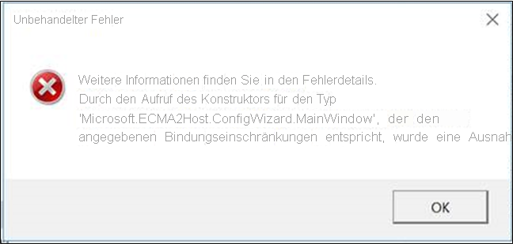
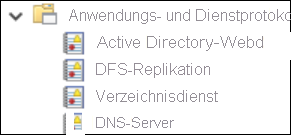
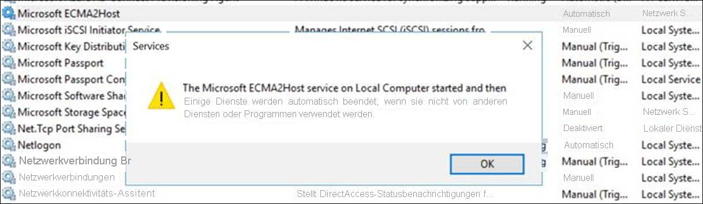
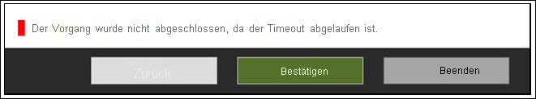

# <a name="troubleshooting-ecma-connector-host-issues"></a>Problembehandlung für den ECMA-Connectorhost

>[!IMPORTANT]
> Die lokale Bereitstellungsvorschau ist derzeit nur auf Einladung als Vorschauversion verfügbar. Sie können [hier](https://aka.ms/onpremprovisioningpublicpreviewaccess) Zugriff auf die Funktion beantragen. Wir öffnen die Vorschauversion im Rahmen der Vorbereitung auf die allgemeine Verfügbarkeit in den nächsten Monaten für weitere Kunden und Connectors.


## <a name="troubleshoot-test-connection-issues"></a>Beheben von Testverbindungsproblemen 
Nach dem Konfigurieren des ECMA-Hosts und des Bereitstellungs-Agents ist es an der Zeit, die Konnektivität zwischen dem Azure AD-Bereitstellungsdienst zu „Bereitstellungs-Agent“ > „ECMA-Host“ > „Anwendung“ zu testen. Dieser End-to-End-Test kann durch Klicken auf „Verbindung testen“ in der Anwendung im Azure-Portal durchgeführt werden. Wenn beim Testen der Verbindung ein Fehler auftritt, führen Sie die folgenden Schritte zur Problembehandlung aus:

 1. Vergewissern Sie sich, dass der Agent und der ECMA-Host ausgeführt werden:
     1. Öffnen Sie auf dem Server, auf dem der Agent installiert ist, die Seite **Dienste**, indem Sie zu **Start** > **Ausführen** > **Services.msc** navigieren.
     2. Vergewissern Sie sich, dass unter **Dienste** die Dienste **Microsoft Azure AD Connect Agent Updater**, **Microsoft Azure AD Connect-Bereitstellungs-Agent** und **Microsoft ECMA2Host** angezeigt werden und ihr Status *Wird ausgeführt* lautet. 


 2. Navigieren Sie zu dem Ordner, in dem der ECMA-Host installiert wurde > „Problembehandlung“ > „Skripts“ > „TestECMA2HostConnection“, und führen Sie das Skript aus.  Dieses Skript sendet eine SCIM GET- oder POST-Anforderung, um zu überprüfen, ob der ECMA-Connectorhost ausgeführt wird und auf Anforderungen reagiert.
    Es sollte auf dem gleichen Computer wie der eigentliche ECMA-Connectorhostdienst ausgeführt werden.
 3. Vergewissern Sie sich, dass der Agent aktiv ist, indem Sie zu Ihrer Anwendung im Azure-Portal navigieren, auf „Administratorkonnektivität“ klicken, auf die Dropdownliste der Agents klicken und überprüfen, ob Ihr Agent aktiv ist.
 4. Überprüfen Sie, ob es sich bei dem bereitgestellten geheimen Token um das lokale geheime Token handelt (dazu müssen Sie zur lokalen Umgebung wechseln, das geheime Token erneut angeben und es dann in das Azure-Portal kopieren).
 5. Vergewissern Sie sich, dass Sie der Anwendung im Azure-Portal mindestens einen Agent zugewiesen haben.
 6. Nach dem Zuweisen eines Agents müssen Sie 10 bis 20 Minuten warten, bis die Registrierung abgeschlossen ist.  Der Konnektivitätstest funktioniert erst, wenn die Registrierung abgeschlossen ist.
 7. Achten Sie darauf, ein gültiges Zertifikat zu verwenden. Durch Navigieren zur Registerkarte „Einstellungen“ des ECMA-Hosts können Sie ein neues Zertifikat generieren.
 8. Führen Sie einen Neustart des Bereitstellungs-Agents durch, indem Sie auf Ihrer VM zur Taskleiste navigieren und nach dem Microsoft Azure AD Connect-Bereitstellungs-Agent suchen. Klicken Sie mit der rechten Maustaste auf „Beenden“, und starten Sie den Agent dann erneut.
 9. Achten Sie bei Angeben der Mandanten-URL im Azure-Portal darauf, dass sie dem folgenden Muster entspricht. Sie können „localhost“ durch den Namen Ihres Hosts ersetzen, jedoch ist dies nicht erforderlich. Ersetzen Sie „connectorName“ durch den Namen des Connectors, den Sie im ECMA-Host angegeben haben.
    ```
    https://localhost:8585/ecma2host_connectorName/scim
    ```

## <a name="unable-to-configure-ecma-host-view-logs-in-event-viewer-or-start-ecma-host-service"></a>Der ECMA-Host kann nicht konfiguriert, Protokolle in der Ereignisanzeige können nicht angezeigt oder der ECMA-Hostdienst kann nicht gestartet werden

#### <a name="the-following-issues-can-be-resolved-by-running-the-ecma-host-as-an-admin"></a>Die folgenden Probleme können behoben werden, indem Sie den ECMA-Host als Administrator ausführen:

* Beim Öffnen des ECMA-Host-Assistenten wird ein Fehler angezeigt 

* Ich konnte den ECMA-Host-Assistenten konfigurieren, aber ich kann die ECMA-Hostprotokolle nicht anzeigen. In diesem Fall müssen Sie den Host als Administrator öffnen und einen End-to-End-Connector einrichten. Dies lässt sich durch Exportieren eines vorhandenen Connectors und dessen erneuten Import vereinfachen. 

   

* Ich konnte den ECMA-Host-Assistenten konfigurieren, aber ich kann den ECMA-Hostdienst nicht starten 


## <a name="turning-on-verbose-logging"></a>Einschalten der ausführlichen Protokollierung 

Standardmäßig ist „switchValue“ für den ECMA-Connectorhost auf „Fehler“ festgelegt.  Dies bedeutet, dass nur Fehlerereignisse protokolliert werden.  So aktivieren Sie die ausführliche Protokollierung für den ECMA-Hostdienst und/oder -Assistenten. Legen Sie „switchValue“ wie unten gezeigt an beiden Stellen auf „Ausführlich“ fest.

Dateispeicherort für die ausführliche Dienstprotokollierung: C:\Programme\Microsoft ECMA2Host\Service\Microsoft.ECMA2Host.Service.exe.config
  ```
  <?xml version="1.0" encoding="utf-8"?> 
  <configuration> 
      <startup>  
          <supportedRuntime version="v4.0" sku=".NETFramework,Version=v4.6" /> 
      </startup> 
      <appSettings> 
        <add key="Debug" value="true" /> 
      </appSettings> 
      <system.diagnostics> 
        <sources> 
      <source name="ConnectorsLog" switchValue="Verbose"> 
            <listeners> 
              <add initializeData="ConnectorsLog" type="System.Diagnostics.EventLogTraceListener, System, Version=2.0.0.0, Culture=neutral, PublicKeyToken=b77a5c561934e089" name="ConnectorsLog" traceOutputOptions="LogicalOperationStack, DateTime, Timestamp, Callstack"> 
                <filter type=""/> 
              </add> 
            </listeners> 
          </source> 
          <!-- Choose one of the following switchTrace:  Off, Error, Warning, Information, Verbose --> 
          <source name="ECMA2Host" switchValue="Verbose"> 
            <listeners>  
              <add initializeData="ECMA2Host" type="System.Diagnos
  ```

Dateispeicherort für die ausführliche Assistentenprotokollierung: C:\Programme\Microsoft ECMA2Host\Wizard\Microsoft.ECMA2Host.ConfigWizard.exe.config
  ```
        <source name="ConnectorsLog" switchValue="Verbose"> 
          <listeners> 
            <add initializeData="ConnectorsLog" type="System.Diagnostics.EventLogTraceListener, System, Version=2.0.0.0, Culture=neutral, PublicKeyToken=b77a5c561934e089" name="ConnectorsLog" traceOutputOptions="LogicalOperationStack, DateTime, Timestamp, Callstack"> 
              <filter type=""/> 
            </add> 
          </listeners> 
        </source> 
        <!-- Choose one of the following switchTrace:  Off, Error, Warning, Information, Verbose --> 
        <source name="ECMA2Host" switchValue="Verbose"> 
          <listeners> 
            <add initializeData="ECMA2Host" type="System.Diagnostics.EventLogTraceListener, System, Version=4.0.0.0, Culture=neutral, PublicKeyToken=b77a5c561934e089" name="ECMA2HostListener" traceOutputOptions="LogicalOperationStack, DateTime, Timestamp, Callstack" /> 
  ```

## <a name="target-attribute-missing"></a>Fehlendes Zielattribut 
Der Bereitstellungsdienst erkennt Attribute in Ihrer Zielanwendung automatisch. Wenn Sie feststellen, dass ein Zielattribut in der Liste der Zielattribute im Azure-Portal fehlt, führen Sie den folgenden Problembehandlungsschritt aus:

 1. Überprüfen Sie die Seite „Attribute auswählen“ Ihrer ECMA-Hostkonfiguration, um sicherzustellen, dass das Attribut dafür ausgewählt wurde, für das Azure-Portal verfügbar gemacht zu werden.
 2. Vergewissern Sie sich, dass der ECMA-Hostdienst aktiviert ist. 
 3. Überprüfen Sie die ECMA-Hostprotokolle, um zu bestätigen, dass eine /schemas-Anforderung erfolgt ist, und überprüfen Sie die Attribute in der Antwort. Diese Informationen sind für den Support bei der Problembehandlung nützlich. 

## <a name="collect-logs-from-event-viewer-as-a-zip-file"></a>Sammeln von Protokollen aus der Ereignisanzeige als ZIP-Datei
Navigieren Sie zu dem Ordner, in dem der ECMA-Host installiert wurde > „Problembehandlung“ > „Skripts“. Führen Sie das Skript `CollectTroubleshootingInfo` als Administrator aus. Es ermöglicht Ihnen das Erfassen und Exportieren der Protokolle in einer ZIP-Datei.  

## <a name="reviewing-events-in-the-event-viewer"></a>Überprüfen von Ereignissen in der Ereignisanzeige

Nachdem die Hostschemazuordnung des ECMA-Connectors konfiguriert wurde, starten Sie den Dienst, damit er auf eingehende Verbindungen lauscht.  Überwachen Sie dann eingehende Anforderungen. Führen Sie dazu folgende Schritte aus:

  1. Klicken Sie auf das Startmenü, geben Sie **Ereignisanzeige** ein, und klicken Sie auf „Ereignisanzeige“. 
  2. Erweitern Sie in der **Ereignisanzeige** **Anwendungen und Dienste** Protokolle, und wählen Sie **Microsoft ECMA2Host-Protokolle** aus.     
  3. Wenn Änderungen vom Connectorhost empfangen werden, werden Ereignisse in das Anwendungsprotokoll geschrieben. 


## <a name="understanding-incoming-scim-requests"></a>Verstehen eingehender SCIM-Anforderungen 

Anforderungen von Azure AD an den Bereitstellungs-Agent und den Connectorhost verwenden das SCIM-Protokoll. Anforderungen vom Host an Apps verwenden das von der App unterstützte Protokoll, und die Anforderungen vom Host an den Agent an Azure AD stützen sich auf SCIM. Weitere Informationen zu unserer SCIM-Implementierung finden Sie [hier](use-scim-to-provision-users-and-groups.md).  

Beachten Sie, dass zu Beginn jedes Bereitstellungszyklus, vor der bedarfsbasierten Bereitstellung in Rahmen der Testverbindung der Azure AD-Bereitstellungsdienst im Allgemeinen einen Benutzerabruf für einen [Dummybenutzer](use-scim-to-provision-users-and-groups.md#request-3) ausführt, um sicherzustellen, dass der Zielendpunkt verfügbar ist und SCIM-kompatible Antworten zurückgibt. 


## <a name="how-do-i-troubleshoot-the-provisioning-agent"></a>Gewusst wie: Problembehandlung für den Bereitstellungs-Agent
### <a name="agent-failed-to-start"></a>Fehler beim Starten des Agents

Möglicherweise wird eine Fehlermeldung angezeigt, die folgendermaßen lautet:

**Der Dienst „Microsoft Azure AD Connect Provisioning Agent“ wurde nicht gestartet. Überprüfen Sie, ob Sie ausreichende Berechtigungen zum Starten von Systemdiensten besitzen.** 

Dieses Problem wird in der Regel von einer Gruppenrichtlinie verursacht, die verhindert, dass Berechtigungen auf das vom Installationsprogramm erstellte Anmeldekonto für den lokalen NT-Dienst (NT SERVICE\AADConnectProvisioningAgent) angewendet werden. Diese Berechtigungen sind zum Starten des Diensts erforderlich.

Gehen Sie folgendermaßen vor, um dieses Problem zu beheben:

1. Melden Sie sich beim Server mit einem Administratorkonto an.
1. Öffnen Sie die Seite **Dienste**, indem Sie zu dieser Seite navigieren oder **Start** > **Ausführen** > **Services.msc** ausführen.
1. Doppelklicken Sie unter **Dienste** auf **Microsoft Azure AD Connect Provisioning Agent**.
1. Ändern Sie auf der Registerkarte **Anmelden** den Eintrag für **Dieses Konto** in das Konto eines Domänenadministrators. Starten Sie den Dienst dann neu. 

Mithilfe dieses Tests wird überprüft, ob Ihre Agents über Port 443 mit Azure kommunizieren können. Öffnen Sie einen Browser, und navigieren Sie von dem Server, auf dem der Agent installiert ist, zur obigen URL.

### <a name="agent-times-out-or-certificate-is-invalid"></a>Bei der Ausführung des Agents tritt ein Timeout auf, oder das Zertifikat ist ungültig.

Beim Versuch, den Agent zu registrieren, kann die folgende Fehlermeldung angezeigt werden:



Dieses Problem wird in der Regel dadurch verursacht, dass der Agent keine Verbindung mit dem Hybrididentitätsdienst herstellen kann und die Konfiguration eines HTTP-Proxys erforderlich ist. Konfigurieren Sie zur Problembehebung einen Proxy für den ausgehenden Datenverkehr. 

Der Bereitstellungs-Agent unterstützt die Verwendung von Proxys für ausgehenden Datenverkehr. Dies können Sie durch das Konfigurieren der Konfigurationsdatei des Agent *C:\Program Files\Microsoft Azure AD Connect Provisioning Agent\AADConnectProvisioningAgent.exe.config* konfigurieren. Fügen Sie in der Datei gegen Ende unmittelbar vor dem `</configuration>`-Tag die folgenden Zeilen ein.
Ersetzen Sie die Variablen `[proxy-server]` und `[proxy-port]` durch den Namen Ihres Proxyservers und die Portwerte.

```xml
    <system.net>
        <defaultProxy enabled="true" useDefaultCredentials="true">
            <proxy
                usesystemdefault="true"
                proxyaddress="http://[proxy-server]:[proxy-port]"
                bypassonlocal="true"
            />
        </defaultProxy>
    </system.net>
```
### <a name="agent-registration-fails-with-security-error"></a>Fehler bei der Agent-Registrierung mit Sicherheitsfehler

Möglicherweise erhalten Sie während der Installation des Cloudbereitstellungs-Agent eine Fehlermeldung.

Dieses Problem wird in der Regel dadurch verursacht, dass der Agent die PowerShell-Registrierungsskripts aufgrund von lokalen PowerShell-Ausführungsrichtlinien nicht ausführen kann.

Ändern Sie zur Lösung dieses Problems die PowerShell-Ausführungsrichtlinien auf dem Server. Sie müssen die Computer- und Benutzerrichtlinien auf *Undefined* oder *RemoteSigned* festlegen. Wenn sie auf *Unrestricted* festgelegt sind, wird diese Fehlermeldung angezeigt. Weitere Informationen finden Sie unter [PowerShell-Ausführungsrichtlinien](/powershell/module/microsoft.powershell.core/about/about_execution_policies?view=powershell-6). 

### <a name="log-files"></a>Protokolldateien

Standardmäßig gibt der Agent minimalistische Fehlermeldungen und Überwachungsinformationen aus. Diese Überwachungsprotokolle finden Sie im Ordner **C:\ProgramData\Microsoft\Azure AD Connect Provisioning Agent\Trace**.

Führen Sie die folgenden Schritte aus, um weitere Details zur Behandlung von Problemen mit dem Agent zu sammeln.

1.  Installieren Sie das PowerShell-Modul „AADCloudSyncTools“ wie [hier](../../active-directory/cloud-sync/reference-powershell.md#install-the-aadcloudsynctools-powershell-module) beschrieben.
2. Verwenden Sie das PowerShell-Cmdlet `Export-AADCloudSyncToolsLogs`, um die Informationen zu erfassen.  Mit den folgenden Switches können Sie Ihre Datensammlung optimieren.
      - Verwenden Sie „SkipVerboseTrace“, um nur aktuelle Protokolle zu exportieren, ohne ausführliche Protokolle zu erfassen (Standard: false).
      - Verwenden Sie „TracingDurationMins“, um eine andere Erfassungsdauer anzugeben (Standard: 3 Minuten).
      - Verwenden Sie „OutputPath“, um einen anderen Ausgabepfad anzugeben (Standard: Ordner „Dokumente“ des Benutzers)

---------------------

Mit Azure AD können Sie den Bereitstellungsdienst in der Cloud überwachen und Protokolle lokal sammeln. Der Bereitstellungsdienst gibt Protokolle für jeden Benutzer aus, der im Rahmen des Synchronisierungsprozesses ausgewertet wurde. Diese Protokolle können über die [Azure-Portal-Benutzeroberfläche, APIs und Log Analytics](../reports-monitoring/concept-provisioning-logs.md) genutzt werden. Darüber hinaus generiert der ECMA-Host lokale Protokolle, die jede empfangene Bereitstellungsanforderung und die an Azure AD gesendete Antwort anzeigen.

### <a name="agent-installation-fails"></a>Fehler bei der Agent-Installation
* Der Fehler `System.ComponentModel.Win32Exception: The specified service already exists` gibt an, dass der vorherige ECMA-Host nicht erfolgreich deinstalliert wurde. Deinstallieren Sie die Hostanwendung. Navigieren Sie zu „Programme“, und entfernen Sie den ECMA-Hostordner. Es kann sinnvoll sein, die Konfigurationsdatei zu sichern. 
* Der folgende Fehler weist darauf hin, dass eine Voraussetzung nicht erfüllt wurde. Vergewissern Sie sich, dass .NET 4.7.1 installiert ist.

  ```
    Method Name : <>c__DisplayClass0_1 : 
    RegisterNotLoadedAssemblies Error during load assembly: System.Management.Automation.resources.dll
    --------- Outer Exception Data ---------
    Message: Could not load file or assembly 'file:///C:\Program Files\Microsoft ECMA2Host\Service\ECMA\System.Management.Automation.resources.dll' or one of its dependencies. The system cannot find the file specified.

  ```


## <a name="next-steps"></a>Nächste Schritte

- [Azure AD-ECMA-Connectorhost: Installation](on-premises-ecma-install.md)
- [Azure AD-ECMA-Connectorhost: Konfiguration](on-premises-ecma-configure.md)
- [Generischer SQL-Connector](on-premises-sql-connector-configure.md)
- [Tutorial: Generischer SQL-Connector mit ECMA-Connectorhost](tutorial-ecma-sql-connector.md)