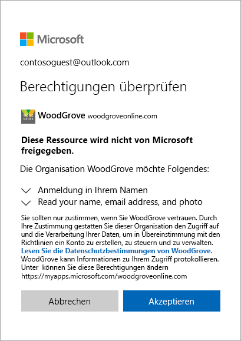
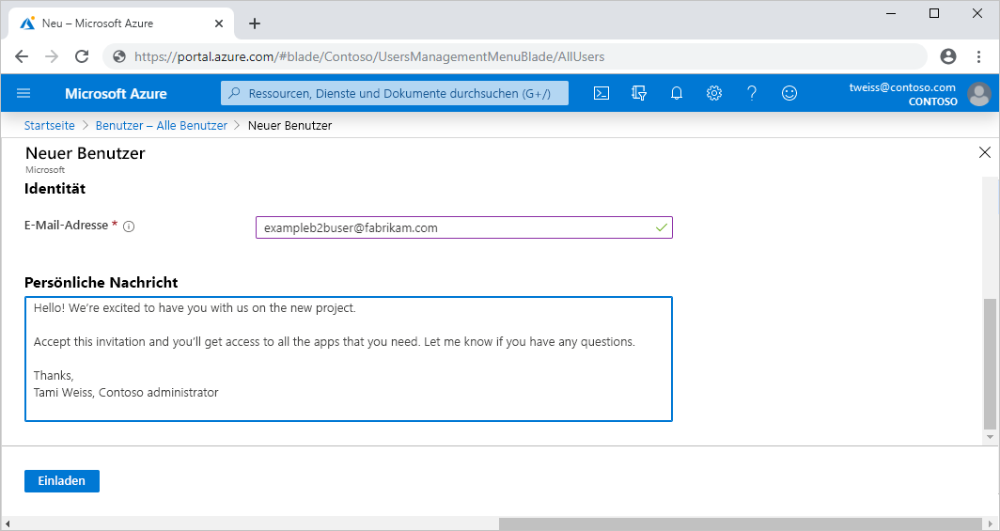
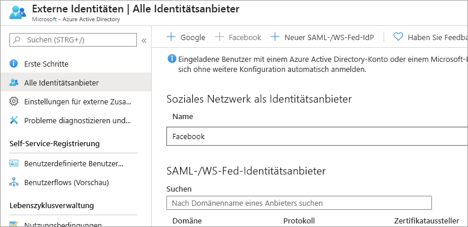
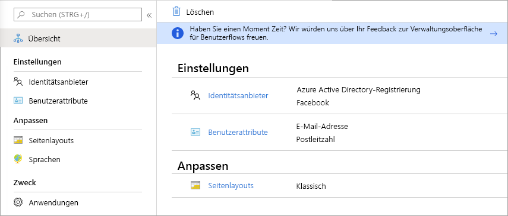

# Was ist der Gastzugriff in Azure Active Directory-B2B?

Mit der Azure Active Directory-B2B-Zusammenarbeit (Business-to-Business) können Sie die Anwendungen und Dienste Ihres Unternehmens für Gastbenutzer von beliebigen Organisationen sicher freigeben und dabei die Kontrolle über Ihre eigenen Unternehmensdaten behalten. Arbeiten Sie sicher und geschützt mit externen Partnern zusammen, ob groß oder klein, auch wenn sie keine Azure AD oder eine IT-Abteilung haben. Ein einfacher Prozess zum Senden und Einlösen von Einladungen ermöglicht es Partnern, ihre eigenen Zugangsdaten für den Zugriff auf die Ressourcen Ihres Unternehmens zu verwenden. Entwickler können Azure AD Business-to-Business-APIs verwenden, um den Einladungsprozess anzupassen oder Anwendungen wie Self-Service-Anmeldeportale zu schreiben.

Sehen Sie sich das Video an und erfahren Sie, wie Sie sicher mit Gastbenutzern zusammenarbeiten können, indem Sie sie einladen, sich mit ihren eigenen Identitäten bei den Anwendungen und Diensten Ihres Unternehmens anzumelden.

Im folgenden Video wird eine nützliche Übersicht gezeigt.

>[!VIDEO https://www.youtube.com/embed/AhwrweCBdsc]

   > [!IMPORTANT]
   > **Ab dem 31. März 2021** wird das Einlösen von Einladungen durch die Erstellung von nicht verwalteten Azure AD-Konten und -Mandanten für B2B Collaboration-Szenarien von Microsoft nicht mehr unterstützt. Zur Vorbereitung hierauf raten wir Kunden, sich für die [Authentifizierung mit Einmalkennung per E-Mail](one-time-passcode.md) zu entscheiden. Wir freuen uns über Ihr Feedback zu diesem Feature, das sich derzeit in der öffentlichen Vorschauphase befindet, und möchten noch mehr Möglichkeiten zur Zusammenarbeit schaffen.

## Zusammenarbeit mit jedem Partner über seine Identitäten

Mit Azure AD-B2B verwendet der Partner seine eigene Identitätsverwaltungslösung, sodass es keinen externen Verwaltungsaufwand für Ihr Unternehmen gibt.

- Der Partner verwendet seine eigenen Identitäten und Anmeldeinformationen; Azure AD ist nicht erforderlich.
- Sie müssen keine externen Konten oder Kennwörter verwalten.
- Sie müssen keine Konten synchronisieren oder Kontolebenszyklen verwalten.  

## Einladen von Gastbenutzern mit einem einfachen Prozess zum Senden und Einlösen von Einladungen

Gastbenutzer können sich mit ihrem Geschäfts-, Schul- oder Unikonto bzw. mit ihrer Identität bei Ihren Anwendungen und Diensten anmelden. Falls der Gastbenutzer über kein Microsoft- oder Azure AD-Konto verfügt, wird zum Zeitpunkt der Einlösung ein Konto für ihn erstellt. 

- Laden Sie Gastbenutzer mit der E-Mail-Adresse ihrer Wahl ein.
- Senden Sie einen direkten Link zu einer Anwendung oder eine Einladung an den eigenen Zugriffsbereich des Gastbenutzers.
- Gastbenutzer können die Einladung in wenigen Schritten einlösen, um sich anzumelden.

## Verwenden von Richtlinien zum sicheren Freigeben von Anwendungen und Diensten

Sie können Autorisierungsrichtlinien verwenden, um Ihre Unternehmensinhalte zu schützen. Richtlinien für bedingten Zugriff (beispielsweise Multi-Factor Authentication) können erzwungen werden:

- Auf Mandantenebene
- Auf Anwendungsebene
- Für bestimmte Gastbenutzer, um Anwendungen und Daten des Unternehmens zu schützen

## Einfaches Hinzufügen von Gastbenutzern im Azure AD-Portal

Als Administrator können Sie im Azure-Portal problemlos Gastbenutzer zu Ihrer Organisation hinzufügen.

- Erstellen Sie einen neuen Gastbenutzer in Azure AD auf ähnliche Weise, wie Sie einen neuen Benutzer hinzufügen würden.
- Der Gastbenutzer erhält sofort eine anpassbare Einladung, mit der er sich in seinem Zugangsbereich anmelden kann.
- Gastbenutzer im Verzeichnis können Anwendungen oder Gruppen zugeordnet werden.  

## Anwendungs- und Gruppenbesitzer können ihre eigenen Gastbenutzer verwalten

Sie können die Gastbenutzerverwaltung an Anwendungsbesitzer delegieren, sodass sie Gastbenutzer direkt zu jeder Anwendung hinzufügen können, die sie freigeben möchten, unabhängig davon, ob es sich um eine Microsoft-Anwendung handelt oder nicht.

- Administratoren richten die Self-Service-Anwendungs- und Gruppenverwaltung ein.
- Benutzer, die keine Administratoren sind, verwenden ihren [Zugriffsbereich](https://myapps.microsoft.com), um Gastbenutzer zu Anwendungen oder Gruppen hinzuzufügen.

## Anpassen des Onboardings für B2B-Gastbenutzer

Integrieren Sie Ihre externen Partner entsprechend den Anforderungen Ihrer Organisation.

- Konfigurieren Sie mit der [Azure AD-Berechtigungsverwaltung](https://docs.microsoft.com/azure/active-directory/governance/entitlement-management-overview) Richtlinien, mit denen der [Zugriff für externer Benutzer verwaltet wird](https://docs.microsoft.com/azure/active-directory/governance/entitlement-management-external-users#how-access-works-for-external-users).
- Verwenden Sie die [Einladungs-API für die B2B-Zusammenarbeit](https://developer.microsoft.com/graph/docs/api-reference/v1.0/resources/invitation), um das Onboarding anzupassen.

## Integrieren mit Identitätsanbietern

Azure AD unterstützt externe Identitätsanbieter wie Facebook, Microsoft-Konten, Google oder Unternehmensidentitätsanbieter. Sie können einen Verbund mit Identitätsanbietern einrichten, damit Ihre externen Benutzer sich mit Ihren vorhandenen Konten für soziale Netzwerke oder Unternehmen anmelden können, anstatt ein neues Konto nur für Ihre Anwendung zu erstellen. Informieren Sie sich ausführlicher über Identitätsanbieter für externe Identitäten.

## Erstellen eines Benutzerflows für die Self-Service-Registrierung (Vorschau)

Mit einem Benutzerflow für die Self-Service-Registrierung können Sie eine Registrierungsbenutzeroberfläche für externe Benutzer erstellen, die auf Ihre Apps zugreifen möchten. Im Rahmen des Registrierungsflows können Sie Optionen für verschiedene Identitätsanbieter für soziale Netzwerke oder Unternehmen bereitstellen und Informationen über den Benutzer sammeln. Informieren Sie sich ausführlicher über die Self-Service-Registrierung und ihre Einrichtung.

## Nächste Schritte

- [Lizenzierungsanleitung für Azure AD-B2B-Zusammenarbeit](licensing-guidance.md)
- [Hinzufügen von Gastbenutzern für B2B-Zusammenarbeit im Portal](add-users-administrator.md)
- [Verstehen, wie Einladungen eingelöst werden](redemption-experience.md)
- Und wie immer empfehlen wir, sich über unsere [Microsoft Tech Community](https://techcommunity.microsoft.com/t5/Azure-Active-Directory-B2B/bd-p/AzureAD_B2b) mit dem Produktteam in Verbindung zu setzen, um Feedback zu geben, Fragen zu erörtern und Vorschläge zu unterbreiten.
