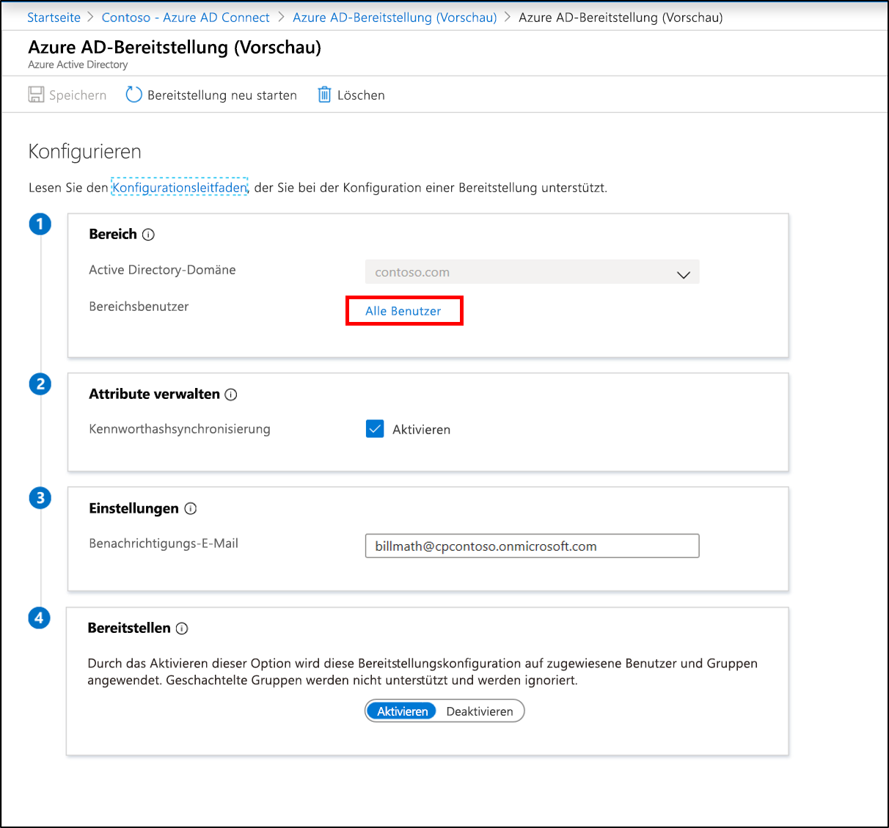

# Neue Konfiguration für die Azure AD Connect-Cloudbereitstellung

Nachdem Sie den Agent installiert haben, müssen Sie sich beim Azure-Portal anmelden und die Bereitstellung konfigurieren.  Führen Sie die folgenden Schritte aus, um den Agent zu aktivieren:

## Konfigurieren der Bereitstellung
Führen Sie die folgenden Schritte aus, um die Bereitstellung zu konfigurieren:

1.  Klicken Sie im Azure AD-Portal auf **Azure Active Directory**.
2.  Klicken Sie auf **Azure AD Connect**.
3.  Wählen Sie **Bereitstellung verwalten (Vorschau)** 
 aus.

4.  Klicken Sie auf **Neue Konfiguration**.
5.  Auf dem Konfigurationsbildschirm ist die lokale Domäne bereits eingetragen.
6. Geben Sie eine **E-Mail-Adresse für Benachrichtigungen** ein. An diese E-Mail-Adresse wird eine Benachrichtigung gesendet, wenn die Bereitstellung nicht fehlerfrei ist.  
8. Verschieben Sie den Auswahlregler auf **Aktivieren**, und klicken Sie auf **Speichern**.

## Beschränken der Bereitstellung auf bestimmte Benutzer und Gruppen
Wenn der Agent nur bestimmte Benutzer und Gruppen synchronisieren soll, können Sie eine Bereichsbeschränkung festlegen. Für den Bereich können Sie lokale AD-Gruppen oder Organisationseinheiten verwenden. Gruppen und Organisationseinheiten können im Rahmen einer Konfiguration nicht konfiguriert werden. 

1.  Klicken Sie im Azure AD-Portal auf **Azure Active Directory**.
2.  Klicken Sie auf **Azure AD Connect**.
3.  Wählen Sie **Bereitstellung verwalten (Vorschau)** aus.
4.  Klicken Sie unter **Konfiguration** auf Ihre Konfiguration.  

5.  Wählen Sie unter **Konfigurieren** die Option **Alle Benutzer** aus, um den Bereich der Konfigurationsregel zu ändern.

6. Auf der rechten Seite können Sie den Bereich so ändern, dass er nur die Sicherheitsgruppen enthält, indem Sie den DN (Distinguished Name) der Gruppe eingeben und auf **Hinzufügen** klicken.

7. Sie können den Bereich aber auch so ändern, dass er nur bestimmte Organisationseinheiten enthält. Klicken Sie auf **Fertig** und dann auf **Speichern**.

## Erneutes Starten der Bereitstellung 
Wenn Sie nicht auf die nächste geplante Ausführung warten möchten, können Sie mithilfe der Schaltfläche „Bereitstellung neu starten“ die Ausführung der Bereitstellung auslösen. 
1.  Klicken Sie im Azure AD-Portal auf **Azure Active Directory**.
2.  Klicken Sie auf **Azure AD Connect**.
3.  Wählen Sie **Bereitstellung verwalten (Vorschau)** aus.
4.  Klicken Sie unter **Konfiguration** auf Ihre Konfiguration.  

5.  Klicken Sie am oberen Rand auf **Bereitstellung neu starten**.

## Entfernen einer Konfiguration
Wenn Sie eine Konfiguration löschen möchten, können Sie dazu die folgenden Schritte ausführen.

1.  Klicken Sie im Azure AD-Portal auf **Azure Active Directory**.
2.  Klicken Sie auf **Azure AD Connect**.
3.  Wählen Sie **Bereitstellung verwalten (Vorschau)** aus.
4.  Klicken Sie unter **Konfiguration** auf Ihre Konfiguration.  

5.  Klicken Sie am oberen Rand auf **Löschen**.

>[!IMPORTANT]
>Vor dem Löschen einer Konfiguration wird keine Bestätigung angezeigt. Vergewissern Sie sich daher, dass Sie diese Aktion tatsächlich ausführen möchten, bevor Sie auf **Löschen** klicken.

## Nächste Schritte 

- [Was ist eine Bereitstellung?](what-is-provisioning.md)
- [Was ist die Azure AD Connect-Cloudbereitstellung?](what-is-cloud-provisioning.md)
