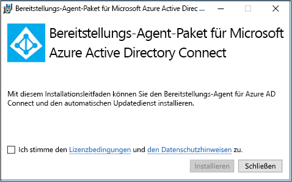
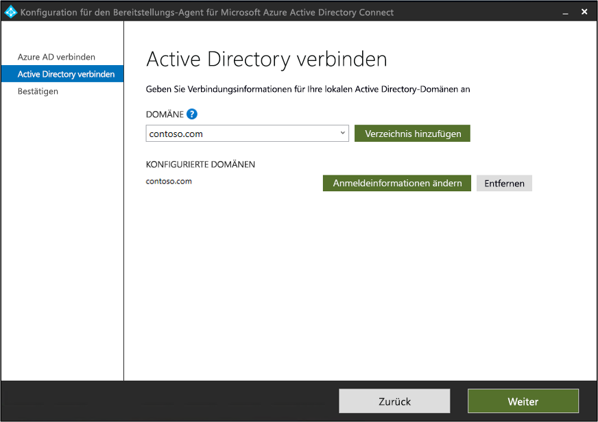
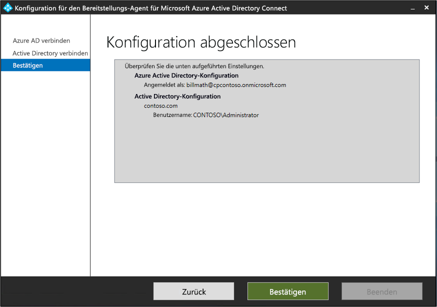
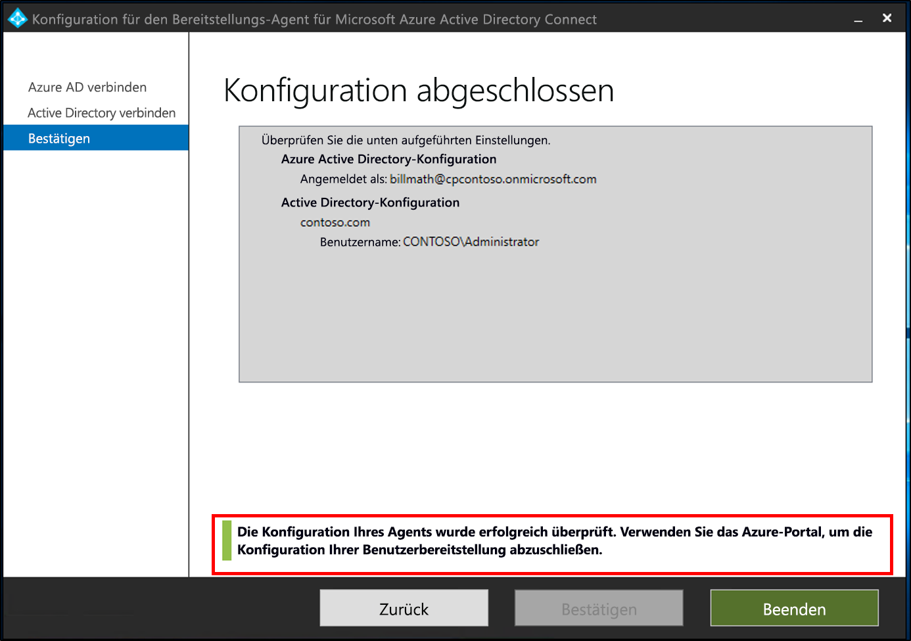
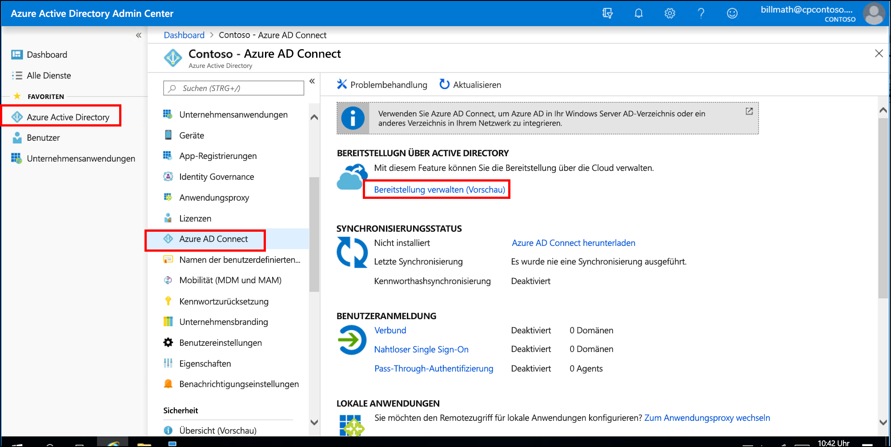
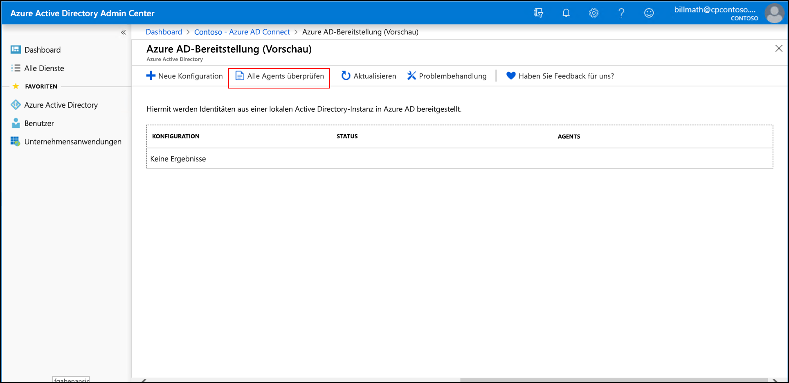
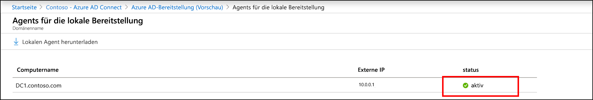
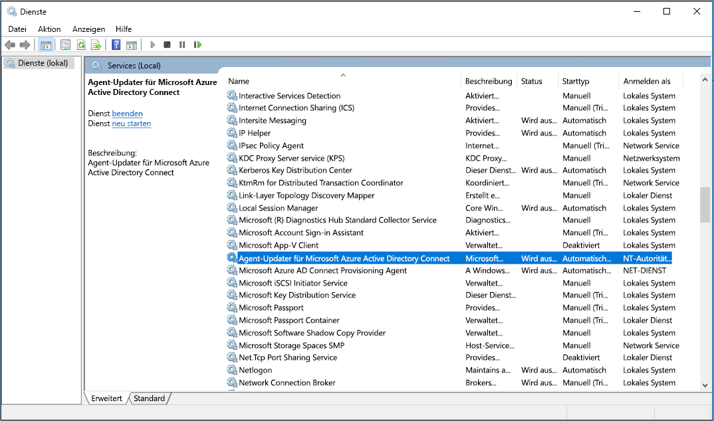

# Installieren des Agents für die Azure AD Connect-Cloudbereitstellung
In diesem Dokument erhalten Sie Informationen zum Installationsvorgang für den Azure AD Connect-Bereitstellungs-Agent (Azure Active Directory) und dessen Erstkonfiguration im Azure-Portal.

>[!IMPORTANT]
>In den folgenden Installationsanweisungen wird davon ausgegangen, dass alle [Voraussetzungen](how-to-prerequisites.md) erfüllt sind.

Unter den folgenden Links erhalten Sie Informationen zur Installation und Konfiguration des Azure AD Connect-Bereitstellungs-Agents:
    
- [Installieren des Agents](#install-the-agent)
- [Überprüfen der Agent-Installation](#verify-agent-installation)

## Installieren des Agents
Führen Sie die folgenden Schritte aus, um den Agent zu installieren.

1. Melden Sie sich mit Berechtigungen eines Unternehmensadministrators bei dem Server an, den Sie verwenden werden.
1. Öffnen Sie das Azure-Portal. Wählen Sie im linken Bereich **Azure Active Directory** aus.
1. Wählen Sie **Bereitstellung verwalten (Vorschau)**  > **Alle Agents überprüfen** aus.
1. Laden Sie den Azure AD Connect-Bereitstellungs-Agent über das Azure-Portal herunter.

    
1. Führen Sie das Installationsprogramm für den Azure AD Connect-Bereitstellungs-Agent aus („AADConnectProvisioningAgent.Installer“).
1. Akzeptieren Sie auf dem Bildschirm **Microsoft Azure AD Connect-Bereitstellungs-Agent-Paket** die Lizenzbedingungen, und wählen Sie **Installieren** aus.

    

1. Nach Abschluss dieses Vorgangs wird der Konfigurations-Assistent gestartet. Melden Sie sich mit dem Konto Ihres globalen Azure AD-Administrators an.
1. Wählen Sie auf dem Bildschirm **Active Directory verbinden** die Option **Verzeichnis hinzufügen** aus. Melden Sie sich dann mit Ihrem Active Directory-Administratorkonto an. Dadurch wird Ihr lokales Verzeichnis hinzugefügt. Wählen Sie **Weiter** aus.

    

1. Wählen Sie auf dem Bildschirm **Konfiguration abgeschlossen** die Option **Bestätigen** aus. Damit wird der Agent registriert und neu gestartet.

    

1. Nach Abschluss dieses Vorgangs sollte der Hinweis **Ihre Agent-Konfiguration wurde erfolgreich überprüft** angezeigt werden. Wählen Sie **Beenden** aus.

    
1. Wenn weiterhin der erste Bildschirm **Microsoft Azure AD Connect-Bereitstellungs-Agent-Paket** angezeigt wird, wählen Sie **Schließen** aus.

## Überprüfen der Agent-Installation
Die Agent-Überprüfung erfolgt im Azure-Portal und auf dem lokalen Server, auf dem der Agent ausgeführt wird.

### Agent-Überprüfung im Azure-Portal
Führen Sie die folgenden Schritte aus, um zu überprüfen, ob der Agent von Azure erkannt wird.

1. Melden Sie sich beim Azure-Portal an.
1. Wählen Sie auf der linken Seite **Azure Active Directory** > **Azure AD Connect** aus. Wählen Sie in der Mitte **Bereitstellung verwalten (Vorschau)** aus.

    

1.  Wählen Sie auf dem Bildschirm **Azure AD-Bereitstellung (Vorschau)** die Option **Alle Agents überprüfen** aus.

     
 
1. Auf dem Bildschirm **Lokale Bereitstellungs-Agents** werden die von Ihnen installierten Agents angezeigt. Vergewissern Sie sich, dass der betreffende Agent aufgeführt wird und als *Aktiviert* markiert ist.

    

### Überprüfen des Ports
Anhand der folgenden Schritte können Sie überprüfen, ob Azure an Port 443 lauscht und ob der Agent mit diesem kommunizieren kann.

https://aadap-portcheck.connectorporttest.msappproxy.net/ 

Mithilfe dieses Tests wird überprüft, ob Ihre Agents über Port 443 mit Azure kommunizieren können. Öffnen Sie einen Browser, und navigieren Sie von dem Server, auf dem der Agent installiert ist, zur obigen URL.

### Auf dem lokalen Server
Führen Sie die folgenden Schritte aus, um zu überprüfen, ob der Agent ausgeführt wird.

1.  Melden Sie sich auf dem Server mit einem Administratorkonto an.
1.  Öffnen Sie die Seite **Dienste**, indem Sie zu dieser Seite navigieren oder **Start** > **Run** > **Services.msc** ausführen.
1.  Vergewissern Sie sich, dass unter **Dienste** die Dienste **Microsoft Azure AD Connect Agent Updater** und **Microsoft Azure AD Connect Provisioning Agent** mit dem Status *Wird ausgeführt* angezeigt werden.

    

>[!IMPORTANT]
>Nachdem Sie den Agent installiert haben, muss er konfiguriert und aktiviert werden, bevor er mit der Synchronisierung von Benutzern beginnen kann. Informationen zum Konfigurieren eines neuen Agents finden Sie unter [Erstellen einer neuen Konfiguration für die cloudbasierte Azure AD Connect-Bereitstellung](how-to-configure.md).

## Nächste Schritte 

- [Was ist die Identitätsbereitstellung?](what-is-provisioning.md)
- [Was ist die Azure AD Connect-Cloudbereitstellung?](what-is-cloud-provisioning.md)
 
