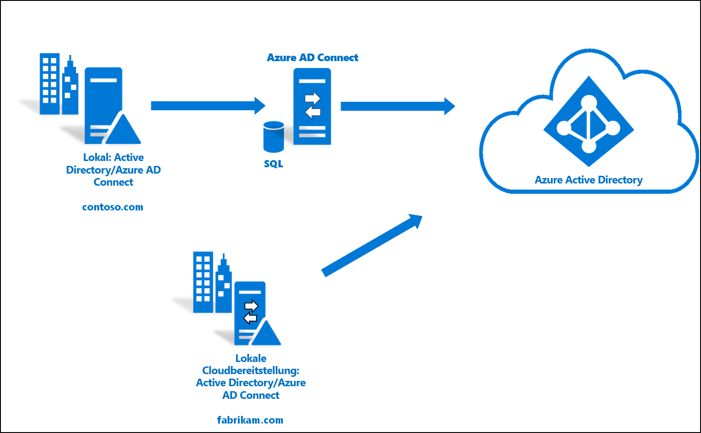
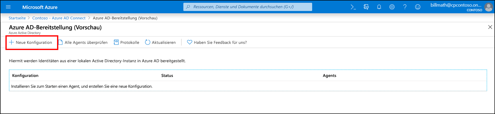
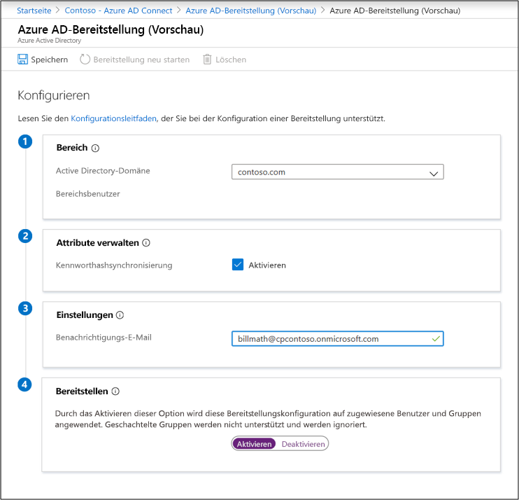
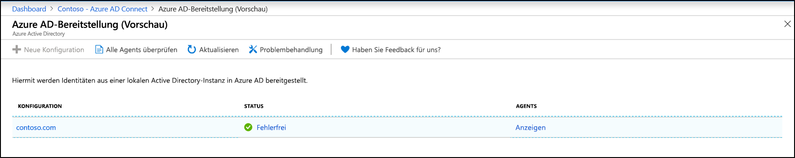
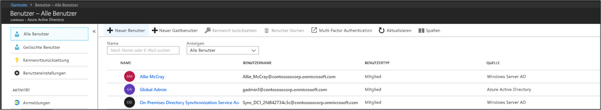
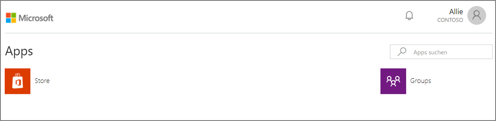

# Integrieren einer vorhandenen Gesamtstruktur in eine neue Gesamtstruktur mit einem einzelnen Azure AD-Mandanten

In diesem Tutorial erfahren Sie Schritt für Schritt, wie Sie die Cloudbereitstellung einer bereits vorhandenen Hybrididentitätsumgebung hinzufügen. 

Die Umgebung, die Sie in diesem Tutorial erstellen, können Sie zu Testzwecken verwenden oder um sich mit der Funktionsweise einer Hybrididentität vertraut zu machen. 

In diesem Szenario wird eine vorhandene Gesamtstruktur mithilfe der Azure AD Connect-Synchronisierung mit einem Azure AD-Mandanten synchronisiert. Außerdem verfügen Sie über eine neue Gesamtstruktur, die mit dem gleichen Azure AD-Mandanten synchronisiert werden soll. Für diese neue Gesamtstruktur richten Sie die Cloudbereitstellung ein. 

## Voraussetzungen
### Im Azure Active Directory Admin Center

1. Erstellen Sie in Ihrem Azure AD-Mandanten ein auf die Cloud beschränktes globales Administratorkonto. Auf diese Weise können Sie die Konfiguration Ihres Mandanten verwalten, falls Ihre lokalen Dienste ausfallen oder nicht verfügbar sind. Erfahren Sie, wie Sie ein [rein cloudbasiertes Konto für den globalen Administrator hinzufügen](../active-directory-users-create-azure-portal.md). Die Ausführung dieses Schritts ist sehr wichtig, damit sichergestellt ist, dass Sie für Ihren Mandanten nicht gesperrt werden.
2. Fügen Sie Ihrem Azure AD-Mandanten mindestens einen [benutzerdefinierten Domänennamen](../active-directory-domains-add-azure-portal.md) hinzu. Ihre Benutzer können sich mit einem dieser Domänennamen anmelden.

### In Ihrer lokalen Umgebung

1. Geben Sie einen in die Domäne eingebundenen Hostserver unter Windows Server 2012 R2 oder höher mit mindestens 4 GB RAM und .NET-Runtime (ab 4.7.1) an. 

2. Wenn zwischen Ihren Servern und Azure AD eine Firewall eingerichtet wurde, konfigurieren Sie die folgenden Elemente:
   - Stellen Sie sicher, dass Agents über die folgenden Ports *ausgehende* Anforderungen an Azure AD senden können:

     | Portnummer | Wie diese verwendet wird |
     | --- | --- |
     | **80** | Herunterladen der Zertifikatssperrlisten (CRL) bei der Überprüfung des SSL-Zertifikats |
     | **443** | Verarbeitung der gesamten ausgehende Kommunikation mit dem Dienst |
     | **8080** (optional) | Agents melden ihren Status alle zehn Minuten über den Port 8080, wenn der Port 443 nicht verfügbar ist. Dieser Status wird im Azure AD-Portal angezeigt. Port 8080 wird _nicht_ für Benutzeranmeldungen verwendet. |
     
     Wenn Ihre Firewall Regeln gemäß Ursprungsbenutzern erzwingt, öffnen Sie diese Ports für den Datenverkehr aus Windows-Diensten, die als Netzwerkdienst ausgeführt werden.
   - Wenn Ihre Firewall oder Ihr Proxy das Angeben sicherer Suffixe zulässt, fügen Sie Verbindungen zu **\*.msappproxy.net** und **\*.servicebus.windows.net** hinzu. Aktivieren Sie andernfalls den Zugriff auf die [IP-Adressbereiche für das Azure-Rechenzentrum](https://www.microsoft.com/download/details.aspx?id=41653), die wöchentlich aktualisiert werden.
   - Ihre Agents benötigen für die Erstregistrierung Zugriff auf **login.windows.net** und **login.microsoftonline.com**. Öffnen Sie Ihre Firewall auch für diese URLs.
   - Geben Sie für die Überprüfung des Zertifikats folgende URLs frei: **mscrl.microsoft.com:80**, **crl.microsoft.com:80**, **ocsp.msocsp.com:80** und **www\.microsoft.com:80**. Da diese URLs für die Überprüfung des Zertifikats in Verbindung mit anderen Microsoft-Produkten verwendet werden, haben Sie diese möglicherweise bereits freigegeben.

## Installieren des Azure AD Connect-Bereitstellungs-Agents
1. Melden Sie sich bei dem in die Domäne eingebundenen Server an.  Wenn Sie das Tutorial [Grundlegende AD- und Azure-Umgebung](tutorial-basic-ad-azure.md) verwenden, ist dies der Server „DC1“.
2. Melden Sie sich mit den Anmeldeinformationen eines rein cloudbasierten globalen Administratorkontos beim Azure-Portal an.
3. Wählen Sie auf der linken Seite **Azure Active Directory** aus, klicken Sie auf **Azure AD Connect**, und wählen Sie im mittleren Bereich **Bereitstellung verwalten (Vorschau)** aus. 
 
4. Klicken Sie auf „Agent herunterladen“.
5. Führen Sie den Azure AD Connect-Bereitstellungs-Agent aus.
6. **Akzeptieren** Sie auf dem Begrüßungsbildschirm die Lizenzbedingungen, und klicken Sie auf **Installieren**. 
 

7. Nach Abschluss dieses Vorgangs wird der Konfigurations-Assistent gestartet.  Melden Sie sich mit dem Konto Ihres globalen Azure AD-Administrators an.  Beachten Sie, dass die Anmeldung blockiert wird, wenn Sie die verstärkte Sicherheitskonfiguration für IE aktiviert haben.  Schließen Sie in diesem Fall die Installation, deaktivieren Sie die verstärkte Sicherheitskonfiguration für IE in Server-Manager, und klicken Sie auf den **Assistenten für den AAD Connect-Bereitstellungs-Agent**, um die Installation neu zu starten.
8. Klicken Sie auf dem Bildschirm **Active Directory verbinden** auf **Verzeichnis hinzufügen**, und melden Sie sich dann mit Ihrem Active Directory-Domänenadministratorkonto an.  HINWEIS:  Für das Domänenadministratorkonto sollten keine Anforderungen zum Ändern des Kennworts gelten. Wenn das Kennwort abläuft oder geändert wird, müssen Sie den Agent mit den neuen Anmeldeinformationen neu konfigurieren. Dadurch wird Ihr lokales Verzeichnis hinzugefügt.  Klicken Sie auf **Weiter**. 
 

9. Klicken Sie auf dem Bildschirm **Konfiguration abgeschlossen** auf **Bestätigen**.  Dadurch wird der Agent registriert und neu gestartet. 
 

10. Sobald dieser Vorgang abgeschlossen ist, sollte der folgende Hinweis angezeigt werden: **Ihre Agent-Konfiguration wurde erfolgreich überprüft.**  Sie können auf **Beenden** klicken. 
 
11. Falls der erste Begrüßungsbildschirm weiterhin angezeigt wird, klicken Sie auf **Schließen**.

## Überprüfen der Agent-Installation
Die Agent-Überprüfung erfolgt im Azure-Portal und auf dem lokalen Server, auf dem der Agent ausgeführt wird.

### Agent-Überprüfung im Azure-Portal
Führen Sie die folgenden Schritte aus, um zu überprüfen, ob der Agent von Azure erkannt wird:

1. Melden Sie sich beim Azure-Portal an.
2. Wählen Sie auf der linken Seite **Azure Active Directory** aus, klicken Sie auf **Azure AD Connect**, und wählen Sie im mittleren Bereich **Bereitstellung verwalten (Vorschau)** aus. 
 

3.  Klicken Sie im Bildschirm **Azure AD-Bereitstellung (Vorschau)** auf **Alle Agents überprüfen**.
 
 
4. Im Bildschirm **Lokale Bereitstellungs-Agents** werden Ihre installierten Agents angezeigt.  Vergewissern Sie sich, dass der betreffende Agent aufgeführt und als **Aktiviert** markiert ist.
 

### Auf dem lokalen Server
Führen Sie die folgenden Schritte aus, um sicherzustellen, dass der Agent ausgeführt wird:

1.  Melden Sie sich beim Server mit einem Administratorkonto an.
2.  Öffnen Sie **Dienste**, indem Sie dorthin navigieren oder „Start/Run/Services.msc“ öffnen.
3.  Vergewissern Sie sich, dass unter **Dienste** die Dienste **Microsoft Azure AD Connect Agent Updater** und **Microsoft Azure AD Connect-Bereitstellungs-Agent** angezeigt werden und ihr Status **Wird ausgeführt** lautet.

## Konfigurieren der Azure AD Connect-Cloudbereitstellung
 Führen Sie die folgenden Schritte aus, um die Bereitstellung zu konfigurieren:

1.  Melden Sie sich beim Azure AD-Portal an.
2.  Klicken Sie auf **Azure Active Directory**.
3.  Klicken Sie auf **Azure AD Connect**.
4.  Wählen Sie **Bereitstellung verwalten (Vorschau)** 
 aus.
5.  Klicken Sie auf **Neue Konfiguration**
.
7.  Geben Sie im Konfigurationsbildschirm eine **E-Mail-Adresse für Benachrichtigungen** ein, verschieben Sie den Selektor auf **Aktivieren**, und klicken Sie auf **Speichern**.

1.  Der Konfigurationsstatus sollte jetzt **Fehlerfrei** lauten.

## Überprüfen, ob Benutzer erstellt wurden und die Synchronisierung erfolgt
Überprüfen Sie als Nächstes, ob die Benutzer, die in unserem lokalen Verzeichnis enthalten waren, synchronisiert wurden und jetzt in unserem Azure AD-Mandanten vorhanden sind.  Seien Sie sich im Klaren darüber, dass dies einige Stunden dauern kann.  Gehen Sie wie folgt vor, um zu überprüfen, ob Benutzer synchronisiert werden:

1. Wechseln Sie zum [Azure-Portal](https://portal.azure.com), und melden Sie sich mit einem Konto an, das über ein Azure-Abonnement verfügt.
2. Wählen Sie im linken Bereich **Azure Active Directory** aus.
3. Wählen Sie unter **Verwalten** die Option **Benutzer** aus.
4. Überprüfen Sie, ob die neuen Benutzer in unserem Mandanten angezeigt werden. 
 

## Testanmeldung mit einem unserer Benutzer

1. Rufen Sie [https://myapps.microsoft.com](https://myapps.microsoft.com) auf.
2. Melden Sie sich mit einem Benutzerkonto an, das in unserem neuen Mandanten erstellt wurde.  Sie müssen sich mit folgendem Format anmelden: (user@domain.onmicrosoft.com). Verwenden Sie dasselbe Kennwort, mit dem sich der Benutzer lokal anmeldet. 
    

Sie haben nun erfolgreich eine Hybrididentitätsumgebung eingerichtet, die Sie verwenden können, um Tests durchzuführen und sich mit den Möglichkeiten von Azure vertraut zu machen.

## Nächste Schritte 

- [Was ist die Identitätsbereitstellung?](what-is-provisioning.md)
- [Was ist die Azure AD Connect-Cloudbereitstellung?](what-is-cloud-provisioning.md)
