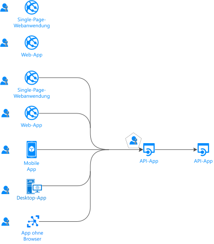
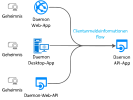
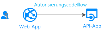
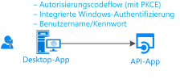
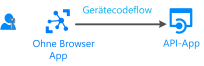
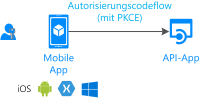
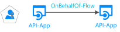

# Authentifizierungsflows und Anwendungsszenarien

Microsoft Identity Platform unterstützt die Authentifizierung für verschiedene Arten moderner Anwendungsarchitekturen. Diese Architekturen basieren jeweils auf den branchenüblichen Protokollen [OAuth 2.0 und OpenID Connect](active-directory-v2-protocols.md). Durch die Verwendung der [Authentifizierungsbibliotheken für die Microsoft Identity Platform](reference-v2-libraries.md) authentifizieren Anwendungen die Identitäten und rufen Token für den Zugriff auf geschützte APIs ab.

In diesem Artikel werden Authentifizierungsflows und Anwendungsszenarien beschrieben, in denen sie verwendet werden.

## Anwendungskategorien

Token können von verschiedenen Arten von Anwendungen abgerufen werden. Hierzu zählen:

- Web-Apps
- Mobile Apps
- Desktop-Apps
- Web-APIs

Token können auch von Apps auf Geräten abgerufen werden, die keinen Browser aufweisen oder als IoT-Geräte (Internet of Things, Internet der Dinge) verwendet werden.

In den folgenden Abschnitten werden die Anwendungskategorien beschrieben.

### Geschützte Ressourcen oder Clientanwendungen

Die Authentifizierungsszenarien beinhalten zwei Aktivitäten:

- **Abrufen von Sicherheitstoken für eine geschützte Web-API:** Es wird empfohlen, [von Microsoft unterstützte Clientbibliotheken](reference-v2-libraries.md#microsoft-supported-client-libraries) zu verwenden, um Token abzurufen. Insbesondere wird die Microsoft Authentication Library (MSAL)-Familie empfohlen.
- **Schützen einer Web-API oder einer Web-App:** Eine der Herausforderungen beim Schutz dieser Ressourcen besteht in der Überprüfung des Sicherheitstokens. Für einige Plattformen bietet Microsoft [Middlewarebibliotheken](reference-v2-libraries.md#microsoft-supported-server-middleware-libraries) an.

### Mit Benutzern oder ohne Benutzer

In den meisten Authentifizierungsszenarien werden Token im Namen angemeldeter Benutzer abgerufen.

Es sind jedoch auch Daemon-Apps vorhanden. In diesen Szenarien rufen Anwendungen Token für sich selbst (also ohne Benutzer) ab.

### Single-Page-Webanwendungen, öffentliche Clientanwendungen und vertrauliche Clientanwendungen

Sicherheitstoken können von verschiedenen Arten von Anwendungen abgerufen werden. Diese Anwendungen werden in der Regel in die folgenden drei Kategorien unterteilt. Jede wird mit unterschiedlichen Bibliotheken und Objekten verwendet.

- **Single-Page-Webanwendungen:** Bei diesen auch als SPAs bezeichneten Web-Apps werden Token über eine im Browser ausgeführte JavaScript- oder TypeScript-App abgerufen. Viele moderne Apps verfügen über eine Single-Page-Webanwendung am Front-End, die hauptsächlich in JavaScript geschrieben ist. Die Anwendung nutzt häufig ein Framework wie Angular, React oder Vue. „MSAL.js“ ist die einzige Microsoft-Authentifizierungsbibliothek, die Single-Page-Webanwendungen unterstützt.

- **Öffentliche Clientanwendungen:** Mit Apps in dieser Kategorie, beispielsweise den folgenden Arten, werden Benutzer immer angemeldet:
  - Desktop-Apps, die Web-APIs im Namen angemeldeter Benutzer aufrufen
  - Mobile Apps
  - Apps, die auf Geräten ohne Browser ausgeführt werden (etwa IoT-Geräte)
  
- **Vertrauliche Clientanwendungen:** Apps in dieser Kategorie umfassen:
  - Web-Apps, die eine Web-API aufrufen
  - Web-APIs, die eine Web-API aufrufen
  - Daemon-Apps (auch bei Implementierung als Konsolendienst – etwa im Falle eines Linux-Daemons oder eines Windows-Diensts)

### Zielgruppe für die Anmeldung

Die verfügbaren Authentifizierungsflows hängen von der Zielgruppe für die Anmeldung ab. Einige Flows stehen nur für Geschäfts-, Schul- oder Unikonten zur Verfügung. Andere sind sowohl für Geschäfts-, Schul- oder Unikonten als auch für persönliche Microsoft-Konten verfügbar.

Weitere Informationen finden Sie unter [Unterstützte Kontotypen](v2-supported-account-types.md#account-type-support-in-authentication-flows).

## Anwendungsszenarien

Microsoft Identity Platform unterstützt die Authentifizierung für folgende App-Architekturen:

- Single-Page-Apps
- Web-Apps
- Web-APIs
- Mobile Apps
- Native Apps
- Daemon-Apps
- Serverseitige Apps

Anwendungen verwenden die verschiedenen Authentifizierungsflows, um Benutzer anzumelden und Token für den Aufruf geschützter APIs zu beziehen.

### Einseitige Anwendung

Viele moderne Web-Apps werden als clientseitige Single-Page-Anwendungen (SPAs) erstellt. Diese Anwendungen verwenden JavaScript oder ein Framework wie Angular, Vue und React. Diese Anwendungen werden in einem Webbrowser ausgeführt.

Single-Page-Webanwendungen unterscheiden sich im Hinblick auf die Authentifizierungsmerkmale von herkömmlichen serverseitigen Web-Apps. Durch die Nutzung von Microsoft Identity Platform können Single-Page-Webanwendungen Benutzer anmelden und Token für den Zugriff auf Back-End-Dienste oder Web-APIs beziehen. Microsoft Identity Platform bietet zwei Gewährungstypen für JavaScript-Anwendungen: 

| MSAL.js (2.x) | MSAL.js (1.x) |
|---|---|
|  |  |

### Eine Web-App, die einen Benutzer anmeldet

So schützen Sie eine Web-App, die einen Benutzer anmeldet:

- .NET-Entwickler verwenden ASP.NET oder ASP.NET Core mit OpenID Connect-Middleware für ASP.NET. Der Schutz einer Ressource beinhaltet die Überprüfung des Sicherheitstokens. Diese erfolgt nicht durch MSAL-Bibliotheken, sondern durch die [IdentityModel-Erweiterungen für .NET](https://github.com/AzureAD/azure-activedirectory-identitymodel-extensions-for-dotnet/wiki).

- Node.js-Entwickler verwenden [Passport.js](https://github.com/AzureAD/passport-azure-ad).

Weitere Informationen finden Sie unter [Szenario: Web-App, die Benutzer anmeldet](scenario-web-app-sign-user-overview.md).

### Web-App, die einen Benutzer anmeldet und eine Web-API im Namen des Benutzers aufruft

Um eine Web-API über eine Web-App im Namen eines Benutzers aufzurufen, verwenden Sie den Autorisierungscodeflow und speichern die abgerufenen Token im Tokencache. Bei Bedarf werden Token von MSAL aktualisiert, und der Controller ruft automatisch Token aus dem Cache ab.

Weitere Informationen finden Sie unter [Web-App, die Web-APIs aufruft](scenario-web-app-call-api-overview.md).

### Desktop-App, die eine Web-API im Namen eines angemeldeten Benutzers aufruft

Wenn eine Desktop-App eine Web-API für die Benutzeranmeldung aufrufen soll, verwenden Sie die interaktiven Tokenabrufmethoden von MSAL. Mit diesen interaktiven Methoden können Sie die Benutzeroberfläche für die Anmeldeumgebung steuern. MSAL verwendet für diese Interaktion einen Webbrowser.

Für von Windows gehostete Anwendungen auf Computern, die entweder einer Windows-Domäne angehören oder über Azure Active Directory (AAD) miteinander verknüpft sind, gibt es noch eine weitere Möglichkeit. Diese Anwendungen können unter Verwendung der [integrierten Windows-Authentifizierung](https://aka.ms/msal-net-iwa) automatisch ein Token abrufen.

Anwendungen, die auf einem Gerät ohne Browser ausgeführt werden, können weiterhin eine API im Namen eines Benutzers aufrufen. Zur Authentifizierung muss sich der Benutzer auf einem anderen Gerät mit Webbrowser anmelden. In diesem Szenario muss der [Gerätecodeflow](https://aka.ms/msal-net-device-code-flow) verwendet werden.

Für öffentliche Clientanwendungen steht zwar auch der [Benutzername/Kennwort-Flow](scenario-desktop-acquire-token.md#username-and-password) zur Verfügung, allerdings wird von der Verwendung abgeraten. Er wird beispielsweise in DevOps-Szenarien benötigt.

Wenn Sie den Benutzername/Kennwort-Flow verwenden, werden Ihre Anwendungen eingeschränkt. Anwendungen können beispielsweise keine Benutzer anmelden, die eine mehrstufige Authentifizierung oder das Tool für bedingten Zugriff in Azure AD verwenden müssen. Auch einmaliges Anmelden steht für Ihre Anwendungen nicht zur Verfügung. Die Authentifizierung mit dem Benutzername/Kennwort-Flow widerspricht den Prinzipien der modernen Authentifizierung und wird lediglich aus Legacygründen bereitgestellt.

Wenn Sie in Desktop-Apps den Tokencache dauerhaft beibehalten möchten, können Sie die [Serialisierung des Tokencaches](scenario-desktop-acquire-token.md#file-based-token-cache) anpassen. Die Implementierung einer [dualen Tokencacheserialisierung](scenario-desktop-acquire-token.md#dual-token-cache-serialization-msal-unified-cache--adal-v3) ermöglicht die Verwendung abwärts- und aufwärtskompatibler Tokencaches. Diese Token unterstützen frühere Generationen von Authentifizierungsbibliotheken. Zu den spezifischen Bibliotheken zählen die Versionen 3 und 4 der Azure AD-Authentifizierungsbibliothek für .NET (ADAL.NET).

Weitere Informationen finden Sie unter [Szenario: Desktop-App, die Web-APIs aufruft](scenario-desktop-overview.md).

### Mobile App, die eine Web-API im Namen eines interaktiven Benutzers aufruft

Eine mobile App ruft ähnlich wie eine Desktop-App die interaktiven Tokenabrufmethoden von MSAL auf, um ein Token für den Aufruf einer Web-API abzurufen.

MSAL iOS und MSAL Android verwenden standardmäßig den Webbrowser des Systems. Sie können jedoch auch festlegen, dass stattdessen die eingebettete Webansicht verwendet werden soll. Es gibt bestimmte Besonderheiten für die jeweilige mobile Plattform: universelle Windows-Plattform (UWP), iOS oder Android.

In einigen Szenarien (beispielsweise bei bedingtem Zugriff im Zusammenhang mit einer Geräte-ID oder Geräteregistrierung) muss ein Broker auf dem Gerät installiert sein. Beispiele für Broker sind das Microsoft-Unternehmensportal (Android) und Microsoft Authenticator (Android und iOS). MSAL kann jetzt mit Brokern interagieren. Weitere Informationen zu Brokern finden Sie unter [Nutzen von Brokern unter Android und iOS](https://github.com/AzureAD/azure-activedirectory-library-for-dotnet/wiki/leveraging-brokers-on-Android-and-iOS).

Weitere Informationen finden Sie unter [Szenario: Mobile App, die Web-APIs aufruft](scenario-mobile-overview.md).

> [!NOTE]
> Auf eine mobile App, die MSAL.iOS, MSAL.Android oder MSAL.NET unter Xamarin verwendet, können App-Schutzrichtlinien angewendet werden. Mit diesen Richtlinien kann beispielsweise verhindert werden, dass ein Benutzer geschützten Text kopiert. Die mobile App wird von Intune verwaltet und als verwaltete App erkannt. Weitere Informationen finden Sie in der [Übersicht zum Microsoft Intune App SDK](/intune/app-sdk).
>
> Das [Intune App SDK](/intune/app-sdk-get-started) ist von den MSAL-Bibliotheken getrennt und interagiert eigenständig mit Azure AD.

### Geschützte Web-API

Mit Microsoft Identity Platform können Sie Webdienste wie etwa die RESTful-Web-API Ihrer App schützen. Eine geschützte Web-API wird über ein Zugriffstoken aufgerufen. Das Token schützt die Daten der API und authentifiziert eingehende Anforderungen. Der Aufrufer einer Web-API fügt an den Autorisierungsheader einer HTTP-Anforderung ein Zugriffstoken an.

Wenn Sie Ihre ASP.NET- oder ASP.NET Core-Web-API schützen möchten, müssen Sie das Zugriffstoken validieren. Für diese Validierung wird die JWT-Middleware für ASP.NET verwendet. Die Validierung wird nicht von MSAL.NET, sondern von der Bibliothek [IdentityModel-Erweiterungen für .NET](https://github.com/AzureAD/azure-activedirectory-identitymodel-extensions-for-dotnet/wiki) durchgeführt.

Weitere Informationen finden Sie unter [Szenario: Geschützte Web-API](scenario-protected-web-api-overview.md).

### Web-API, die eine andere Web-API im Namen eines Benutzers aufruft

Damit Ihre geschützte Web-API eine andere Web-API im Namen eines Benutzers aufrufen kann, muss Ihre App ein Token für die Downstream-Web-API abrufen. Solche Aufrufe werden manchmal auch als *Dienst-zu-Dienst*-Aufrufe bezeichnet. Web-APIs, die andere Web-APIs aufrufen, müssen auch eine benutzerdefinierte Cacheserialisierung bereitstellen.

Weitere Informationen finden Sie unter [Szenario: Web-API, die Web-APIs aufruft](scenario-web-api-call-api-overview.md).

### Daemon-App, die eine Web-API im Namen des Daemons aufruft

Apps, die Prozesse mit langer Ausführungszeit enthalten oder ohne Benutzerinteraktion ausgeführt werden, benötigen ebenfalls eine Möglichkeit, um auf sichere Web-APIs zuzugreifen. Eine solche App kann sich mithilfe der App-Identität authentifizieren und Token abrufen. Die App weist ihre Identität mit einem geheimen Clientschlüssel oder einem Zertifikat nach.

Wenn Sie solche Daemon-Apps schreiben möchten, die ein Token für die aufrufende App abrufen, verwenden Sie die Abrufmethoden für [Clientanmeldeinformationen](scenario-daemon-acquire-token.md#acquiretokenforclient-api) in MSAL. Diese Methoden erfordern einen geheimen Clientschlüssel, den Sie der App-Registrierung in Azure AD hinzufügen. Die App gibt das Geheimnis dann an den aufgerufenen Daemon weiter. Beispiele für solche Geheimnisse wären etwa Anwendungskennwörter, Zertifikatassertionen und Clientassertionen.

Weitere Informationen finden Sie unter [Szenario: Daemon-App zum Aufrufen von Web-APIs](scenario-daemon-overview.md).

## Szenarien und unterstützte Authentifizierungsflows

Sie verwenden Authentifizierungsflows zur Implementierung der Anwendungsszenarien mit Tokenanforderung. Anwendungsszenarien und Authentifizierungsflows lassen sich nicht eins zu eins zuordnen.

Szenarien mit Tokenabruf werden auch OAuth 2.0-Authentifizierungsflows zugeordnet. Weitere Informationen finden Sie unter [OAuth 2.0 und OpenID Connect-Protokolle auf der Microsoft Identity Platform](active-directory-v2-protocols.md).

<table>
 <thead>
  <tr><th>Szenario</th> <th>Detaillierte Vorgehensweise für das Szenario</th> <th>OAuth 2.0-Flow und -Zuweisung</th> <th>Zielgruppe</th></tr>
 </thead>
 <tbody>
  <tr>
   <td></td>
   <td><a href="scenario-spa-overview.md">Einseitige App</a></td>
   <td><a href="v2-oauth2-auth-code-flow.md">Autorisierungscode</a> mit PKCE</td>
   <td>Geschäfts-, Schul- oder Unikonten, persönliche Konten und Azure Active Directory B2C (Azure AD B2C)</td>
 </tr>

  <tr>
   <td></td>
   <td><a href="scenario-spa-overview.md">Einseitige App</a></td>
   <td><a href="v2-oauth2-implicit-grant-flow.md">Implizit</a></td>
   <td>Geschäfts-, Schul- oder Unikonten, persönliche Konten und Azure Active Directory B2C (Azure AD B2C)</td>
 </tr>

  <tr>
   <td></td>
   <td><a href="scenario-web-app-sign-user-overview.md">Web-App, die Benutzer anmeldet</a></td>
   <td><a href="v2-oauth2-auth-code-flow.md">Autorisierungscode</a></td>
   <td>Geschäfts-, Schul- oder Unikonten, persönliche Konten und Azure AD B2C</td>
 </tr>

  <tr>
   <td></td>
   <td><a href="scenario-web-app-call-api-overview.md">Web-App, die Web-APIs aufruft</a></td>
   <td><a href="v2-oauth2-auth-code-flow.md">Autorisierungscode</a></td>
   <td>Geschäfts-, Schul- oder Unikonten, persönliche Konten und Azure AD B2C</td>
 </tr>

  <tr>
   <td rowspan="3"></td>
   <td rowspan="4"><a href="scenario-desktop-overview.md">Desktop-App, die Web-APIs aufruft</a></td>
   <td>Interaktiv unter Verwendung eines <a href="v2-oauth2-auth-code-flow.md">Autorisierungscodes</a> mit PKCE</td>
   <td>Geschäfts-, Schul- oder Unikonten, persönliche Konten und Azure AD B2C</td>
 </tr>

  <tr>
   <td>Integrierte Windows-Authentifizierung</td>
   <td>Geschäfts-, Schul- oder Unikonten</td>
 </tr>

  <tr>
   <td><a href="v2-oauth-ropc.md">Kennwort des Ressourcenbesitzers</a></td>
   <td>Geschäfts-, Schul- oder Unikonten und Azure AD B2C</td>
 </tr>

  <tr>
   <td></td>
   <td><a href="v2-oauth2-device-code.md">Gerätecode</a></td>
   <td>Geschäfts-, Schul- oder Unikonten, persönliche Konten und Azure AD B2C</td>
 </tr>

 <tr>
   <td rowspan="2"></td>
   <td rowspan="2"><a href="scenario-mobile-overview.md">Mobile App, die Web-APIs aufruft</a></td>
   <td>Interaktiv unter Verwendung eines <a href="v2-oauth2-auth-code-flow.md">Autorisierungscodes</a> mit PKCE</td>
   <td>Geschäfts-, Schul- oder Unikonten, persönliche Konten und Azure AD B2C</td>
 </tr>

  <tr>
   <td><a href="v2-oauth-ropc.md">Kennwort des Ressourcenbesitzers</a></td>
   <td>Geschäfts-, Schul- oder Unikonten und Azure AD B2C</td>
 </tr>

  <tr>
   <td></td>
   <td><a href="scenario-daemon-overview.md">Daemon-App, die Web-APIs aufruft</a></td>
   <td><a href="v2-oauth2-client-creds-grant-flow.md">Clientanmeldeinformationen</a></td>
   <td>Reine App-Berechtigungen ohne Benutzer, die ausschließliche in Azure AD-Organisationen verwendet werden</td>
 </tr>

  <tr>
   <td></td>
   <td><a href="scenario-web-api-call-api-overview.md">Web-API, die Web-APIs aufruft</a></td>
   <td><a href="v2-oauth2-on-behalf-of-flow.md">OBO (On-Behalf-Of)</a></td>
   <td>Geschäfts-, Schul- oder Unikonten und persönliche Konten</td>
 </tr>

 </tbody>
</table>

## Szenarien und unterstützte Plattformen und Sprachen

Microsoft-Authentifizierungsbibliotheken unterstützen verschiedene Plattformen:

- JavaScript
- .NET Framework
- .NET Core
- Windows 10/UWP
- Xamarin.iOS
- Xamarin.Android
- Natives iOS
- macOS
- Natives Android
- Java
- Python

Sie können zum Erstellen Ihrer Anwendungen auch verschiedene Sprachen verwenden.

> [!NOTE]
> Einige Anwendungsarten stehen nicht auf jeder Plattform zur Verfügung.

Wenn in der Windows-Spalte der folgenden Tabelle .NET Core angegeben ist, ist immer auch .NET Framework möglich. Letzteres wurde zur besseren Übersichtlichkeit der Tabelle weggelassen.

|Szenario  | Windows | Linux | Mac | iOS | Android
|--|--|--|--|--|--|--|
| [Einseitige App](scenario-spa-overview.md)   |  MSAL.js |  MSAL.js |  MSAL.js |  MSAL.js |  MSAL.js
| [Einseitige App](scenario-spa-overview.md)   |  MSAL.js |  MSAL.js |  MSAL.js |  MSAL.js |  MSAL.js
| [Web-App, die Benutzer anmeldet](scenario-web-app-sign-user-overview.md)   |  ASP.NET Core |  ASP.NET Core |  ASP.NET Core
| [Web-App, die Web-APIs aufruft](scenario-web-app-call-api-overview.md)     |  ASP.NET Core + MSAL.NET   MSAL Java  Flask + MSAL Python|  ASP.NET Core + MSAL.NET  MSAL Java  Flask + MSAL Python|  ASP.NET Core + MSAL.NET  MSAL Java   Flask + MSAL Python
| [Desktop-App, die Web-APIs aufruft](scenario-desktop-overview.md)      | MSAL.NET  MSAL Java   MSAL Python| MSAL.NET  MSAL Java  MSAL Python| MSAL.NET  MSAL Java  MSAL Python    MSAL.objc |
| [Mobile App, die Web-APIs aufruft](scenario-mobile-overview.md)    |  MSAL.NET  MSAL.NET | | |  MSAL.objc |  MSAL.Android
| [Daemon-App](scenario-daemon-overview.md)    | MSAL.NET  MSAL Java  MSAL Python|  MSAL.NET  MSAL Java  MSAL Python| MSAL.NET  MSAL Java  MSAL Python
| [Web-API, die Web-APIs aufruft](scenario-web-api-call-api-overview.md)     |  ASP.NET Core + MSAL.NET  MSAL Java  MSAL Python|  ASP.NET Core + MSAL.NET  MSAL Java  MSAL Python|  ASP.NET Core + MSAL.NET  MSAL Java  MSAL Python

Weitere Informationen finden Sie unter [Von Microsoft unterstützte Bibliotheken nach Betriebssystem/Sprache](reference-v2-libraries.md#microsoft-supported-libraries-by-os--language).

## Nächste Schritte

* Erfahren Sie mehr über [Authentifizierungsgrundlagen](./authentication-vs-authorization.md) und [Zugriffstoken in der Microsoft Identity Platform](access-tokens.md).
* Erfahren Sie mehr über das [Sichern des Zugriffs auf IoT-Apps](/azure/architecture/example-scenario/iot-aad/iot-aad).
