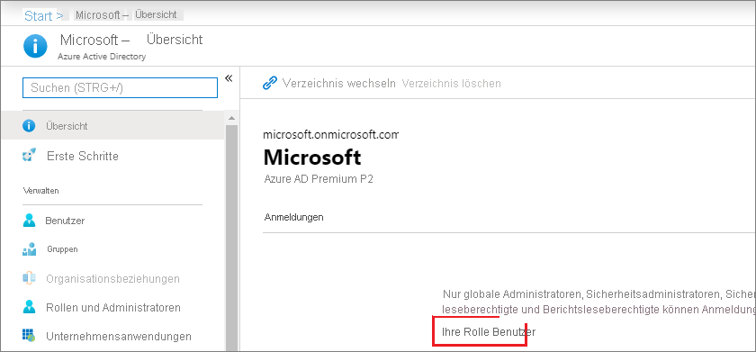
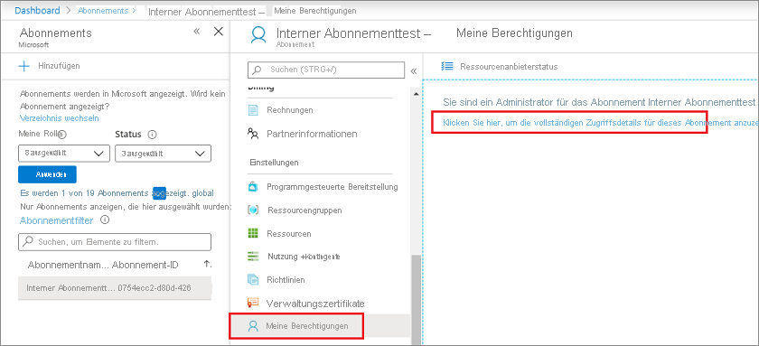
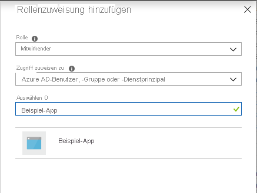
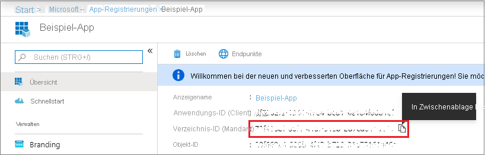
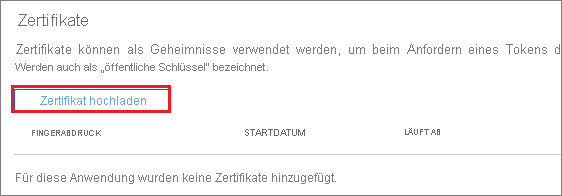

# <a name="how-to-use-the-portal-to-create-an-azure-ad-application-and-service-principal-that-can-access-resources"></a>Gewusst wie: Erstellen einer Azure AD-Anwendung und eines Dienstprinzipals mit Ressourcenzugriff über das Portal

In diesem Artikel wird beschrieben, wie Sie eine neue Azure Active Directory-Anwendung (Azure AD) und einen Dienstprinzipal erstellen, der mit der rollenbasierten Zugriffssteuerung verwendet werden kann. Wenn Sie über Anwendungen, gehostete Dienste oder automatische Tools verfügen, für die der Zugriff auf oder die Änderung von Ressourcen erforderlich ist, können Sie eine Identität für die App erstellen. Diese Identität wird als Dienstprinzipal bezeichnet. Der Zugriff auf Ressourcen wird durch die dem Dienstprinzipal zugewiesenen Rollen eingeschränkt. Dadurch können Sie steuern, auf welcher Ebene auf welche Ressourcen zugegriffen werden kann. Aus Sicherheitsgründen wird stets empfohlen, Dienstprinzipale mit automatisierten Tools zu verwenden, statt ihnen die Anmeldung mit einer Benutzeridentität zu erlauben.

In diesem Artikel wird veranschaulicht, wie Sie das Portal zum Erstellen des Dienstprinzipals im Azure-Portal verwenden. Er konzentriert sich auf eine Anwendung mit nur einem Mandanten, die nur zur Ausführung in einer einzigen Organisation vorgesehen ist. Anwendungen mit nur einem Mandanten werden in der Regel für innerhalb Ihrer Organisation ausgeführte Branchenanwendungen verwendet.  Sie können auch [Azure PowerShell zum Erstellen eines Dienstprinzipals mit einem Zertifikat verwenden](howto-authenticate-service-principal-powershell.md).

> [!IMPORTANT]
> Anstatt einen Dienstprinzipal zu erstellen, sollten Sie die Verwendung verwalteter Identitäten für Azure-Ressourcen für Ihre Anwendungsidentität erwägen. Wenn Ihr Code unter einem Dienst ausgeführt wird, der verwaltete Identitäten unterstützt und auf Ressourcen zugreift, die die Azure AD-Authentifizierung unterstützen, sind verwaltete Identitäten für Sie die besser geeignete Option. Weitere Informationen zu verwalteten Identitäten für Azure-Ressourcen (z.B. auch zu den Diensten, die diese zurzeit unterstützen) finden Sie unter [Was sind verwaltete Identitäten für Azure-Ressourcen](../managed-identities-azure-resources/overview.md)?

## <a name="app-registration-app-objects-and-service-principals"></a>App-Registrierung, App-Objekte und Dienstprinzipale
Es gibt keine Möglichkeit, einen Dienstprinzipal direkt im Azure-Portal zu erstellen.  Wenn Sie eine Anwendung über das Azure-Portal registrieren, werden automatisch ein Anwendungsobjekt und ein Dienstprinzipal für Ihr Basisverzeichnis bzw. Ihren Mandanten erstellt.  Weitere Informationen zu den Beziehungen zwischen App-Registrierung, Anwendungsobjekten und Dienstprinzipalen finden Sie unter [Anwendungs- und Dienstprinzipalobjekte in Azure Active Directory](app-objects-and-service-principals.md).

## <a name="permissions-required-for-registering-an-app"></a>Erforderliche Berechtigungen zum Registrieren einer App

Sie müssen über ausreichende Berechtigungen verfügen, um eine Anwendung bei Ihrem Azure AD-Mandanten registrieren und der Anwendung eine Rolle in Ihrem Azure-Abonnement zuweisen zu können.

### <a name="check-azure-ad-permissions"></a>Überprüfen der Azure AD-Berechtigungen

1. Wählen Sie **Azure Active Directory** aus.
1. Achten Sie auf Ihre Rolle. Wenn Sie über die Rolle **Benutzer** verfügen, müssen Sie sicherstellen, dass keine Administratorrechte benötigt werden, um Anwendungen zu registrieren.

   

1. Wählen Sie im linken Bereich **Benutzereinstellungen** aus.
1. Überprüfen Sie die Einstellung **App-Registrierungen**. Dieser Wert kann nur von einem Administrator festgelegt werden. Die Einstellung **Ja** bedeutet, dass jeder Benutzer im Azure AD-Mandanten eine App registrieren kann.

Wenn die App-Registrierungseinstellung auf **Nein** festgelegt ist, können nur Benutzer mit Administratorrolle diese Arten von Anwendungen registrieren. Informationen zu verfügbaren Administratorrollen und den spezifischen Berechtigungen in Azure AD für die einzelnen Rollen finden Sie unter [verfügbare Rollen](../roles/permissions-reference.md#available-roles) und [Rollenberechtigungen](../roles/permissions-reference.md#role-permissions). Wenn Ihrem Konto die Rolle „Benutzer“ zugewiesen wurde, die App-Registrierungseinstellung jedoch auf Administratorbenutzer begrenzt ist, bitten Sie Ihren Administrator, entweder Ihnen eine Administratorrolle zuzuweisen, die alle Aspekte von App-Registrierungen erstellen und verwalten kann, oder Benutzern das Registrieren von Apps zu ermöglichen.

### <a name="check-azure-subscription-permissions"></a>Überprüfen der Berechtigungen des Azure-Abonnements

In Ihrem Azure-Abonnement muss Ihr Konto über `Microsoft.Authorization/*/Write`-Zugriff verfügen, damit einer AD-App eine Rolle zugewiesen werden kann. Diese Aktion wird über die Rolle [Besitzer](../../role-based-access-control/built-in-roles.md#owner) oder [Benutzerzugriffsadministrator](../../role-based-access-control/built-in-roles.md#user-access-administrator) gewährt. Wenn Ihrem Konto die Rolle **Mitwirkender** zugewiesen ist, verfügen Sie nicht über die erforderliche Berechtigung. Sie erhalten eine Fehlermeldung, wenn Sie versuchen, dem Dienstprinzipal eine Rolle zuzuweisen.

So überprüfen Sie die Berechtigungen Ihres Abonnements:

1. Suchen Sie nach **Abonnements**, und wählen diese Option aus, oder wählen Sie auf der Seite **Start** die Option **Abonnements** aus.

   

1. Wählen Sie das Abonnement aus, in dem der Dienstprinzipal erstellt werden soll.

   

   Falls Sie das gesuchte Abonnement nicht finden können, können Sie den **globalen Abonnementfilter** verwenden. Stellen Sie sicher, dass das gewünschte Abonnement für das Portal ausgewählt ist.

1. Wählen Sie **My permissions** (Meine Berechtigungen). Wählen Sie anschließend **Klicken Sie hier, um die vollständigen Zugangsdaten für dieses Abonnement anzuzeigen** aus.

   

1. Wählen Sie unter **Rollenzuweisungen** die Option **Ansicht** aus, um die Ihnen zugewiesenen Rollen anzuzeigen. Ermitteln Sie, ob Sie über die erforderlichen Berechtigungen verfügen, um einer AD-App eine Rolle zuzuweisen. Wenn dies nicht der Fall ist, bitten Sie Ihren Abonnementadministrator, Sie zur Rolle „Benutzerzugriffsadministrator“ hinzuzufügen. In der folgenden Abbildung ist dem Benutzer die Rolle „Besitzer“ zugewiesen. Dies bedeutet, dass der Benutzer über die erforderlichen Berechtigungen verfügt.

   

## <a name="register-an-application-with-azure-ad-and-create-a-service-principal"></a>Registrieren einer Anwendung mit Azure AD und Erstellen eines Dienstprinzipals

Wir beginnen gleich mit der Erstellung der Identität. Falls ein Problem auftritt, sollten Sie die [erforderlichen Berechtigungen](#permissions-required-for-registering-an-app) überprüfen, um sicherzustellen, dass die Identität mit Ihrem Konto erstellt werden kann.

1. Melden Sie sich über das <a href="https://portal.azure.com/" target="_blank">Azure-Portal</a> bei Ihrem Azure-Konto an.
1. Wählen Sie **Azure Active Directory** aus.
1. Wählen Sie **App-Registrierungen** aus.
1. Wählen Sie **Neue Registrierung** aus.
1. Weisen Sie der Anwendung einen Namen zu. Wählen Sie einen unterstützten Kontotyp aus, der bestimmt, von wem die Anwendung verwendet werden kann. Wählen Sie unter **Umleitungs-URI** als Typ der Anwendung, die Sie erstellen möchten, **Web** aus. Geben Sie den URI ein, an den das Zugriffstoken gesendet wird. Sie können keine Anmeldeinformationen für eine [native Anwendung](../manage-apps/application-proxy-configure-native-client-application.md) erstellen. Sie können diesen Typ nicht für eine automatisierte Anwendung verwenden. Wählen Sie nach dem Festlegen der Werte **Registrieren** aus.

   

Sie haben Ihre Azure AD-Anwendung und den Dienstprinzipal erstellt.

## <a name="assign-a-role-to-the-application"></a>Zuweisen einer Rolle zur Anwendung

Sie müssen der Anwendung eine Rolle zuweisen, um auf Ressourcen in Ihrem Abonnement zugreifen zu können. Entscheiden Sie, welche Rolle über die geeigneten Berechtigungen für die Anwendung verfügt. Informationen zu den verfügbaren Rollen finden Sie unter [In Azure integrierte Rollen](../../role-based-access-control/built-in-roles.md).

Sie können den Umfang auf Abonnement-, Ressourcengruppen- oder Ressourcenebene festlegen. Niedrigere Ebenen mit geringerem Umfang erben Berechtigungen. Wenn also beispielsweise der Rolle *Leser* für eine Ressourcengruppe eine Anwendung hinzugefügt wird, kann diese Rolle die Ressourcengruppe und alle darin enthaltenen Ressourcen lesen.

1. Wählen Sie im Azure-Portal die Bereichsebene aus, der Sie die Anwendung zuweisen möchten. Um beispielsweise eine Rolle im Abonnementbereich zuzuweisen, suchen Sie nach **Abonnements** und wählen diese Option aus, oder wählen Sie **Abonnements** auf der **Homepage** aus.

   

1. Wählen Sie das Abonnement aus, dem die Anwendung zugewiesen werden soll.

   

   Falls Sie das gesuchte Abonnement nicht finden können, können Sie den **globalen Abonnementfilter** verwenden. Stellen Sie sicher, dass das gewünschte Abonnement für das Portal ausgewählt ist.

1. Wählen Sie die Option **Zugriffssteuerung (IAM)** aus.
1. Wählen Sie **Rollenzuweisung hinzufügen** aus.
1. Wählen Sie die Rolle aus, die Sie der Anwendung zuweisen möchten. Wählen Sie beispielsweise die Rolle **Mitwirkender** aus, um für die Anwendung das Ausführen von Aktionen wie das **Neustarten**, **Starten** und **Beenden** von Instanzen durchzuführen.  Erfahren Sie mehr über die [verfügbaren Rollen](../../role-based-access-control/built-in-roles.md). Azure AD-Anwendungen werden standardmäßig nicht in den verfügbaren Optionen angezeigt. Suchen Sie nach dem Namen Ihrer Anwendung, und wählen Sie ihn aus.

   

1. Wählen Sie **Speichern** aus, um das Zuweisen der Rolle abzuschließen. Ihre Anwendung wird in der Liste der Benutzer mit einer Rolle für diesen Bereich angezeigt.

Ihr Dienstprinzipal wird eingerichtet. Sie können mit der Nutzung beginnen, um Ihre Skripts oder Apps auszuführen. Wechseln Sie zu **Unternehmensanwendungen**, um Ihren Dienstprinzipal zu verwalten (Berechtigungen, vom Benutzer genehmigte Berechtigungen, Anzeigen der genehmigenden Benutzer, Überprüfen von Berechtigungen, Anzeigen von Anmeldeinformationen usw.).

Im nächsten Abschnitt wird veranschaulicht, wie Sie Werte abrufen, die beim programmgesteuerten Anmelden benötigt werden.

## <a name="get-tenant-and-app-id-values-for-signing-in"></a>Abrufen der Werte für Mandanten-ID und App-ID für die Anmeldung

Beim programmgesteuerten Anmelden übergeben Sie mit Ihrer Authentifizierungsanforderung und der Anwendungs-ID auch die Mandanten-ID.  Außerdem benötigen Sie ein Zertifikat oder einen Authentifizierungsschlüssel (im folgenden Abschnitt beschrieben). Führen Sie die folgenden Schritte aus, um diese Werte abzurufen:

1. Wählen Sie **Azure Active Directory** aus.
1. Wählen Sie in Azure AD unter **App-Registrierungen** Ihre Anwendung aus.
1. Kopieren Sie die Verzeichnis-ID (Mandant), und speichern Sie sie in Ihrem Anwendungscode.

    

    Die Verzeichnis-ID (Mandanten-ID) finden Sie auch auf der Übersichtsseite des Standardverzeichnisses.

1. Kopieren Sie die **Anwendungs-ID**, und speichern Sie sie in Ihrem Anwendungscode.

   

## <a name="authentication-two-options"></a>Authentifizierung: Zwei Optionen

Für Dienstprinzipale sind zwei Arten von Authentifizierung verfügbar: kennwortbasierte Authentifizierung (Anwendungsgeheimnis) und zertifikatbasierte Authentifizierung. *Wir empfehlen die Verwendung eines Zertifikats*, Sie können aber auch ein Anwendungsgeheimnis erstellen.

### <a name="option-1-upload-a-certificate"></a>Option 1: Hochladen eines Zertifikats

Sie können ein vorhandenes Zertifikat verwenden, wenn Sie eins besitzen.  Optional können Sie *ausschließlich für Testzwecke* ein selbstsigniertes Zertifikat erstellen. Zum Erstellen eines selbstsignierten Zertifikats öffnen Sie PowerShell, und führen Sie [New-SelfSignedCertificate](/powershell/module/pkiclient/new-selfsignedcertificate) mit den folgenden Parametern aus, um das Zertifikat im Benutzerzertifikatspeicher auf Ihrem Computer zu erstellen:

```powershell
$cert=New-SelfSignedCertificate -Subject "CN=DaemonConsoleCert" -CertStoreLocation "Cert:\CurrentUser\My"  -KeyExportPolicy Exportable -KeySpec Signature
```

Exportieren Sie dieses Zertifikat mit dem MMC-Snap-In [Benutzerzertifikat verwalten](/dotnet/framework/wcf/feature-details/how-to-view-certificates-with-the-mmc-snap-in), auf das Sie in der Windows-Systemsteuerung zugreifen können, in eine Datei.

1. Wählen Sie im Menü **Start** den Befehl **Ausführen** aus, und geben Sie **certmgr.msc** ein.

   Das Tool „Zertifikat-Manager“ für den aktuellen Benutzer wird angezeigt.

1. Um Ihre Zertifikate anzuzeigen, erweitern Sie im linken Bereich unter **Zertifikate - Aktueller Benutzer** das Verzeichnis **Privat**.
1. Klicken Sie mit der rechten Maustaste auf das Zertifikat, das Sie erstellt haben, und wählen Sie **Alle Aufgaben->Exportieren** aus.
1. Folgen Sie dem Zertifikatexport-Assistenten.  Exportieren Sie nicht den privaten Schlüssel, und exportieren Sie in eine CER-Datei.

So laden Sie das Zertifikat hoch:

1. Wählen Sie **Azure Active Directory** aus.
1. Wählen Sie in Azure AD unter **App-Registrierungen** Ihre Anwendung aus.
1. Wählen Sie **Zertifikate & Geheimnisse** aus.
1. Wählen Sie **Zertifikat hochladen** aus, und wählen Sie dann das Zertifikat (ein vorhandenes Zertifikat oder das von Ihnen exportierte selbstsignierte Zertifikat) aus.

    

1. Wählen Sie **Hinzufügen**.

Nach dem Registrieren des Zertifikats bei Ihrer Anwendung im Portal der Anwendungsregistrierung ermöglichen Sie dem Code der Clientanwendung die Verwendung des Zertifikats.

### <a name="option-2-create-a-new-application-secret"></a>Option 2: Erstellen eines neuen Anwendungsgeheimnisses

Wenn Sie sich entscheiden, kein Zertifikat zu verwenden, können Sie ein neues Anwendungsgeheimnis erstellen.

1. Wählen Sie **Azure Active Directory** aus.
1. Wählen Sie in Azure AD unter **App-Registrierungen** Ihre Anwendung aus.
1. Wählen Sie **Zertifikate & Geheimnisse** aus.
1. Wählen Sie **Geheime Clientschlüssel -> Neuer geheimer Clientschlüssel** aus.
1. Geben Sie eine Beschreibung des Geheimnisses und eine Dauer ein. Wählen Sie anschließend **Hinzufügen** aus.

   Nachdem der geheime Clientschlüssel gespeichert wurde, wird dessen Wert angezeigt. Kopieren Sie diesen Wert jetzt, weil Sie den Schlüssel später nicht mehr abrufen können. Sie geben den Schlüsselwert zusammen mit der Anwendungs-ID an, um die Anmeldung als Anwendung durchzuführen. Speichern Sie den Schlüsselwert an einem Ort, von dem Ihre Anwendung ihn abrufen kann.

   

## <a name="configure-access-policies-on-resources"></a>Konfigurieren von Zugriffsrichtlinien für Ressourcen
Beachten Sie, dass Sie möglicherweise zusätzliche Berechtigungen für Ressourcen konfigurieren müssen, auf die Ihre Anwendung zugreifen muss. Sie müssen beispielsweise auch die [Zugriffsrichtlinien eines Schlüsseltresors aktualisieren](../../key-vault/general/secure-your-key-vault.md#data-plane-and-access-policies), um der Anwendung Zugriff auf Schlüssel, Geheimnisse oder Zertifikate zu gewähren.

1. Navigieren Sie im <a href="https://portal.azure.com/" target="_blank">Azure-Portal</a> zu Ihrem Schlüsseltresor, und wählen Sie **Zugriffsrichtlinien** aus.
1. Wählen Sie **Zugriffsrichtlinie hinzufügen** und anschließend die Schlüssel-, Geheimnis- und Zertifikatberechtigungen aus, die Sie Ihrer Anwendung gewähren möchten.  Wählen Sie den zuvor erstellten Dienstprinzipal aus.
1. Wählen Sie **Hinzufügen** aus, um die Zugriffsrichtlinie hinzuzufügen, und wählen Sie dann **Speichern** aus, um Ihre Änderungen zu übernehmen.
    

## <a name="next-steps"></a>Nächste Schritte
* Erfahren Sie, wie Sie [Azure PowerShell zum Erstellen eines Dienstprinzipals mit einem Zertifikat verwenden](howto-authenticate-service-principal-powershell.md).
* Informationen zum Festlegen von Sicherheitsrichtlinien finden Sie unter [Hinzufügen oder Entfernen von Azure-Rollenzuweisungen über das Azure-Portal](../../role-based-access-control/role-assignments-portal.md).
* Eine Liste der verfügbaren Aktionen, die Benutzern erteilt oder verweigert werden können, finden Sie unter [Vorgänge für Azure Resource Manager-Ressourcenanbieter](../../role-based-access-control/resource-provider-operations.md).
* Informationen zum Arbeiten mit App-Registrierungen mithilfe von **Microsoft Graph** finden Sie in der [Anwendungs-API-Referenz](/graph/api/resources/application).
