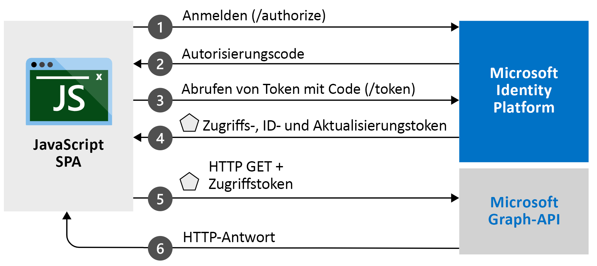

# <a name="quickstart-sign-in-and-get-an-access-token-in-an-angular-spa-using-the-auth-code-flow"></a>Schnellstart: Anmelden und Abrufen eines Zugriffstokens in einer Angular-SPA mithilfe des Autorisierungscodeflows

In dieser Schnellstartanleitung laden Sie ein Codebeispiel herunter und führen es aus, das zeigt, wie eine JavaScript Angular-Single-Page-Webanwendung mithilfe des Autorisierungscodeflows Benutzer anmelden und Microsoft Graph aufrufen kann. Das Codebeispiel veranschaulicht das Abrufen eines Zugriffstokens zum Aufrufen der Microsoft Graph-API oder einer beliebigen Web-API. 

Eine Abbildung finden Sie unter [Funktionsweise des Beispiels](#how-the-sample-works).

In dieser Schnellstartanleitung wird MSAL Angular v2 mit dem Autorisierungscodeflow verwendet. Eine ähnliche Schnellstartanleitung, bei der MSAL Angular 1.x mit dem impliziten Flow verwendet wird, finden Sie unter [Schnellstart: Anmelden von Benutzern in JavaScript-Single-Page-Webanwendungen](./quickstart-v2-angular.md).

> [!IMPORTANT]
> MSAL Angular v2 [!INCLUDE [PREVIEW BOILERPLATE](../../../includes/active-directory-develop-preview.md)]

## <a name="prerequisites"></a>Voraussetzungen

* Azure-Abonnement ([kostenloses Azure-Abonnement erstellen](https://azure.microsoft.com/free/?WT.mc_id=A261C142F))
* [Node.js](https://nodejs.org/en/download/)
* [Visual Studio Code](https://code.visualstudio.com/download) oder ein anderer Code-Editor

> [!div renderon="docs"]
> ## <a name="register-and-download-your-quickstart-application"></a>Registrieren und Herunterladen Ihrer Schnellstartanwendung
> Verwenden Sie eine der folgenden Optionen, um die Schnellstartanwendung zu starten.
>
> ### <a name="option-1-express-register-and-auto-configure-your-app-and-then-download-your-code-sample"></a>Option 1 (Express): Registrieren und automatisches Konfigurieren Ihrer App und anschließendes Herunterladen des Codebeispiels
>
> 1. Navigieren Sie zur Umgebung des Schnellstarts <a href="https://portal.azure.com/#blade/Microsoft_AAD_RegisteredApps/ApplicationsListBlade/quickStartType/JavascriptSpaQuickstartPage/sourceType/docs" target="_blank">Azure-Portal – App-Registrierungen</a>.
> 1. Geben Sie einen Namen für Ihre Anwendung ein.
> 1. Wählen Sie unter **Unterstützte Kontotypen** **Konten in allen Organisationsverzeichnissen und persönliche Microsoft-Konten** aus.
> 1. Wählen Sie **Registrieren**.
> 1. Navigieren Sie zum Schnellstartbereich, und befolgen Sie die Anweisungen, um Ihre neue Anwendung herunterzuladen und automatisch zu konfigurieren.
>
> ### <a name="option-2-manual-register-and-manually-configure-your-application-and-code-sample"></a>Option 2 (manuell): Registrieren und manuelles Konfigurieren Ihrer Anwendung und des Codebeispiels
>
> #### <a name="step-1-register-your-application"></a>Schritt 1: Anwendung registrieren
>
> 1. Melden Sie sich beim <a href="https://portal.azure.com/" target="_blank">Azure-Portal</a> an.
> 1. Wenn Sie Zugriff auf mehrere Mandanten haben, verwenden Sie im Menü am oberen Rand den Filter **Verzeichnis + Abonnement** :::image type="icon" source="./media/common/portal-directory-subscription-filter.png" border="false":::, um den Mandanten auszuwählen, für den Sie eine Anwendung registrieren möchten.
> 1. Suchen Sie nach **Azure Active Directory**, und wählen Sie diese Option aus.
> 1. Wählen Sie unter **Verwalten** Folgendes aus: **App-Registrierungen** > **Neue Registrierung**.
> 1. Geben Sie einen **Namen** für Ihre Anwendung ein. Benutzern Ihrer App wird wahrscheinlich dieser Namen angezeigt. Sie können ihn später ändern.
> 1. Wählen Sie unter **Unterstützte Kontotypen** **Konten in allen Organisationsverzeichnissen und persönliche Microsoft-Konten** aus.
> 1. Wählen Sie **Registrieren**. Notieren Sie sich für die spätere Verwendung auf der Seite **Übersicht** den Wert von **Anwendungs-ID (Client)** .
> 1. Wählen Sie unter **Verwalten** die Option **Authentifizierung** aus.
> 1. Wählen Sie unter **Plattformkonfigurationen** die Option **Plattform hinzufügen** aus. Wählen Sie im Bereich, der geöffnet wird, **Single-Page-Webanwendung** aus.
> 1. Legen Sie den Wert für **Umleitungs-URIs** auf `http://localhost:4200/` fest. Dies ist der Standardport, an dem NodeJS auf Ihrem lokalen Computer lauscht. Die Authentifizierungsantwort wird nach erfolgreicher Authentifizierung des Benutzers an diesen URI zurückgegeben. 
> 1. Wählen Sie **Konfigurieren** aus, um die Änderungen zu übernehmen.
> 1. Erweitern Sie unter **Plattformkonfigurationen** den Eintrag **Single-Page-Webanwendung**.
> 1. Vergewissern Sie sich, dass Ihr Umleitungs-URI unter **Gewährungstypen**  für den Autorisierungscodeflow mit PKCE berechtigt ist.

> [!div class="sxs-lookup" renderon="portal"]
> #### <a name="step-1-configure-your-application-in-the-azure-portal"></a>Schritt 1: Konfigurieren Ihrer Anwendung im Azure-Portal
> Damit das Codebeispiel in dieser Schnellstartanleitung funktioniert, müssen Sie den **Umleitungs-URI** `http://localhost:4200/` hinzufügen.
> > [!div renderon="portal" id="makechanges" class="nextstepaction"]
> > [Make these changes for me]() (Diese Änderungen für mich vornehmen)
>
> > [!div id="appconfigured" class="alert alert-info"]
> > : Ihre Anwendung ist mit diesen Attributen konfiguriert.

 #### <a name="step-2-download-the-project"></a>Schritt 2: Herunterladen des Projekts

> [!div renderon="docs"]
> Um das Projekt mit einem Webserver unter Verwendung von Node.js auszuführen, [laden Sie die Kernprojektdateien herunter](https://github.com/Azure-Samples/ms-identity-javascript-angular-spa/archive/main.zip).

> [!div renderon="portal" class="sxs-lookup"]
> Ausführen des Projekts mit einem Webserver unter Verwendung von Node.js

> [!div renderon="portal" class="sxs-lookup" id="autoupdate" class="nextstepaction"]
> [Laden Sie das Codebeispiel herunter](https://github.com/Azure-Samples/ms-identity-javascript-angular-spa/archive/main.zip).

> [!div renderon="docs"]
> #### <a name="step-3-configure-your-javascript-app"></a>Schritt 3: Konfigurieren Ihrer JavaScript-App
>
> Öffnen Sie im Ordner *src* den Ordner *app* und dann die Datei *app.module.ts*, und aktualisieren Sie die Werte `clientID`, `authority` und `redirectUri` im `auth`-Objekt.
>
> ```javascript
> // MSAL instance to be passed to msal-angular
> export function MSALInstanceFactory(): IPublicClientApplication {
>   return new PublicClientApplication({
>     auth: {
>       clientId: 'Enter_the_Application_Id_Here',
>       authority: 'Enter_the_Cloud_Instance_Id_HereEnter_the_Tenant_Info_Here',
>       redirectUri: 'Enter_the_Redirect_Uri_Here'
>     },
>     cache: {
>       cacheLocation: BrowserCacheLocation.LocalStorage,
>       storeAuthStateInCookie: isIE, // set to true for IE 11
>     },
>   });
> }
> ```

> [!div renderon="portal" class="sxs-lookup"]
> > [!NOTE]
> > `Enter_the_Supported_Account_Info_Here`

> [!div renderon="docs"]
>
> Ändern Sie die Werte im Abschnitt `auth`, wie hier beschrieben:
>
> - `Enter_the_Application_Id_Here` ist die **Anwendungs-ID (Client)** für die von Ihnen registrierte Anwendung.
> - `Enter_the_Cloud_Instance_Id_Here` ist die Instanz der Azure-Cloud. Geben Sie für die Azure-Hauptcloud oder für die globale Azure-Cloud `https://login.microsoftonline.com/` ein. Informationen zu **nationalen** Clouds (etwa für China) finden Sie unter [Nationale Clouds](authentication-national-cloud.md).
> - `Enter_the_Tenant_info_here` wird auf eine der folgenden Optionen festgelegt:
>   - Wenn Ihre Anwendung *Nur Konten in diesem Organisationsverzeichnis* unterstützt, ersetzen Sie diesen Wert durch die **Mandanten-ID** oder den **Mandantennamen**. Beispiel: `contoso.microsoft.com`.
>   - Falls Ihre Anwendung *Konten in einem beliebigen Organisationsverzeichnis* unterstützt, ersetzen Sie diesen Wert durch `organizations`.
>   - Unterstützt Ihre Anwendung *Konten in allen Organisationsverzeichnissen und persönliche Microsoft-Konten*, ersetzen Sie diesen Wert durch `common`. Verwenden Sie **für diesen Schnellstart** `common`.
>   - Wenn Sie die Unterstützung *ausschließlich auf persönliche Microsoft-Konten* beschränken möchten, ersetzen Sie diesen Wert durch `consumers`.
> - `Enter_the_Redirect_Uri_Here` ist `http://localhost:4200/`
>
> Der `authority`-Wert in der Datei *app.module.ts* sollte ungefähr wie folgt aussehen, wenn Sie die Azure-Hauptcloud (global) verwenden:
>
> ```javascript
> authority: "https://login.microsoftonline.com/common",
> ```
>
> > [!TIP]
> > Die Werte für **Anwendungs-ID (Client)** , **Verzeichnis-ID (Mandant)** und **Unterstützte Kontotypen** finden Sie im Azure-Portal auf der Seite **Übersicht** der App-Registrierung.

> [!div class="sxs-lookup" renderon="portal"]
> #### <a name="step-3-your-app-is-configured-and-ready-to-run"></a>Schritt 3: Ihre App ist konfiguriert und betriebsbereit
> Wir haben das Projekt mit Werten der Eigenschaften ihrer App konfiguriert.

> [!div renderon="docs"]
>
> Scrollen Sie in derselben Datei nach unten, und aktualisieren Sie `graphMeEndpoint`. 
> - Ersetzen Sie die Zeichenfolge `Enter_the_Graph_Endpoint_Herev1.0/me` durch `https://graph.microsoft.com/v1.0/me`.
> - `Enter_the_Graph_Endpoint_Herev1.0/me` ist der Endpunkt, für den API-Aufrufe ausgeführt werden. Geben Sie für den Microsoft Graph-API-Hauptdienst (global) `https://graph.microsoft.com/` (einschließlich des nachstehenden Schrägstrichs) ein. Weitere Informationen finden Sie in der [Dokumentation](/graph/deployments).
>
>
> ```javascript
> export function MSALInterceptorConfigFactory(): MsalInterceptorConfiguration {
>   const protectedResourceMap = new Map<string, Array<string>>();
>   protectedResourceMap.set('Enter_the_Graph_Endpoint_Herev1.0/me', ['user.read']);
>
>   return {
>     interactionType: InteractionType.Redirect,
>     protectedResourceMap
>   };
> }
> ```
>
>
 #### <a name="step-4-run-the-project"></a>Schritt 4: Ausführen des Projekts

Führen Sie das Projekt mit einem Webserver unter Verwendung von „Node.js“ aus:

1. Führen Sie im Projektverzeichnis die folgenden Befehle aus, um den Server zu starten:
    ```console
    npm install
    npm start
    ```
1. Navigieren Sie zu `http://localhost:4200/`.

1. Wählen Sie **Anmelden** aus, um den Anmeldevorgang zu starten, und rufen Sie anschließend die Microsoft Graph-API auf.

    Bei der ersten Anmeldung werden Sie aufgefordert, einzuwilligen, dass die Anwendung auf Ihr Profil zugreifen und Sie anmelden darf. Klicken Sie nach erfolgreicher Anmeldung auf die Schaltfläche **Profil**, um Ihre Benutzerprofilinformationen auf der Seite anzuzeigen.

## <a name="more-information"></a>Weitere Informationen

### <a name="how-the-sample-works"></a>Funktionsweise des Beispiels



### <a name="msaljs"></a>msal.js

Über die MSAL.js-Bibliothek werden Benutzer angemeldet und die Token angefordert, die für den Zugriff auf eine durch Microsoft Identity Platform geschützte API verwendet werden. 

Wenn Sie „Node.js“ installiert haben, können Sie die aktuelle Version auch mithilfe von Node.js-Paket-Manager (npm) herunterladen:

```console
npm install @azure/msal-browser @azure/msal-angular@2
```

## <a name="next-steps"></a>Nächste Schritte

Eine ausführliche Anleitung zum Erstellen der Autorisierungscodeflow-Anwendung mithilfe von Vanilla JavaScript finden Sie im folgenden Tutorial:

> [!div class="nextstepaction"]
> [Aufrufen der Microsoft Graph-API aus einer JavaScript-SPA](./tutorial-v2-javascript-auth-code.md)