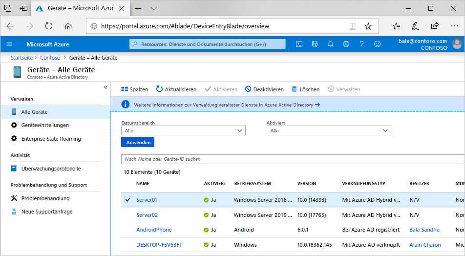

# Was ist eine Geräteidentität?

Eine [Geräteidentität](/graph/api/resources/device?view=graph-rest-1.0) ist ein Objekt in Azure Active Directory (Azure AD). Dieses Geräteobjekt ähnelt Benutzern, Gruppen oder Anwendungen. Eine Geräteidentität liefert Administratoren Informationen, die sie als Grundlage für Zugriffs- oder Konfigurationsentscheidungen verwenden können.

Es gibt drei Möglichkeiten, eine Geräteidentität abzurufen:

- Azure AD-Registrierung
- Azure AD-Einbindung
- Azure AD-Hybrideinbindung

Geräteidentitäten sind eine Voraussetzung für Szenarien wie [gerätebasierte Richtlinien für bedingten Zugriff](../conditional-access/require-managed-devices.md) und die [Verwaltung mobiler Geräte (MDM) mit Microsoft Endpoint Manager](/mem/endpoint-manager-overview).

## Szenario mit modernen Geräten

Das Szenario mit modernen Geräten stützt sich auf zwei der folgenden Methoden: 

- [Azure AD-Registrierung](concept-azure-ad-register.md) 
   - Bring Your Own Device (BYOD)
   - Mobiles Gerät (Mobiltelefon und Tablet)
- [Azure AD-Einbindung](concept-azure-ad-register.md)
   - Windows 10-Geräte, die sich im Besitz Ihrer Organisation befinden
   - [Windows Server 2019 und neuere Server in Ihrer Organisation, die als VMs in Azure ausgeführt werden](howto-vm-sign-in-azure-ad-windows.md)

[Azure AD Hybrid Join](concept-azure-ad-join-hybrid.md) wird als Zwischenschritt auf dem Weg zur Azure AD-Einbindung betrachtet. Azure AD Hybrid Join bietet Organisationen Unterstützung für kompatible Windows-Versionen bis Windows 7 und Server 2008. Alle drei Szenarien können gleichzeitig in einer einzelnen Organisation auftreten.

## Zugriff auf Ressourcen

Das Registrieren und Hinzufügen von Geräten zu Azure AD ermöglicht Benutzern eine nahtlose Anmeldung (Seamless Sign-On, SSO) bei cloudbasierten Ressourcen.

Geräte, die in Azure AD eingebunden sind, profitieren vom [einmaligen Anmelden (SSO) bei lokalen Ressourcen Ihrer Organisation](azuread-join-sso.md).

## Bereitstellung

Die Bereitstellung von Geräten in Azure AD kann im Self-Service-Modus oder über einen von Administratoren gesteuerten Prozess erfolgen.

## Lizenzanforderungen

[!INCLUDE [Active Directory P1 license](../../../includes/active-directory-p1-license.md)]

## Nächste Schritte

- Informieren Sie sich über [bei Azure AD registrierte Geräte](concept-azure-ad-register.md).
- Informieren Sie sich über [in Azure AD eingebundene Geräte](concept-azure-ad-join.md).
- Weitere Informationen zu [in Hybrid Azure AD eingebundene Geräte](concept-azure-ad-join-hybrid.md)
- Einen Überblick über die Verwaltung von Geräteidentitäten im Azure-Portal finden Sie unter [Managing device identities using the Azure portal](device-management-azure-portal.md) (Verwalten von Geräteidentitäten mit dem Azure-Portal, in englischer Sprache).
- Weitere Informationen zum gerätebasierten bedingten Zugriff finden Sie unter [Anleitung: Vorschreiben der Verwendung verwalteter Geräte für den Zugriff auf Cloud-Apps mithilfe des bedingten Zugriffs](../conditional-access/require-managed-devices.md).
