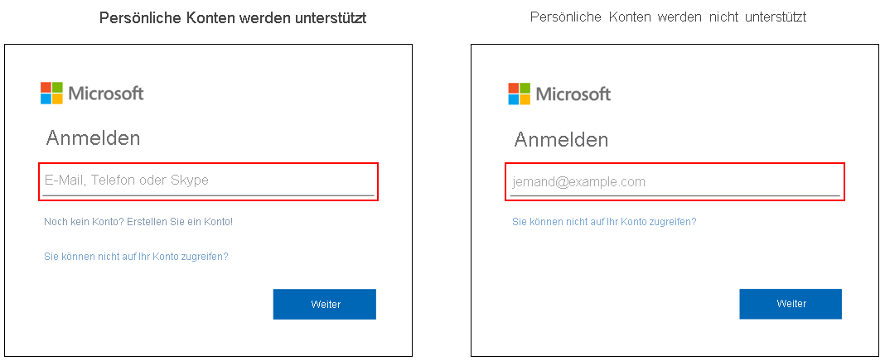

# Anmeldeoptionen für Microsoft-Konten in Azure Active Directory

Die Anmeldeseite von Microsoft 365 für Azure Active Directory (Azure AD) unterstützt Geschäfts-, Schul- oder Unikonten und Microsoft-Konten. Je nach Situation des Benutzers werden allerdings möglicherweise nur eine oder auch beide Kontoarten unterstützt. Die Azure AD-Anmeldeseite unterstützt beispielsweise folgende Kontoarten:

* Apps, bei denen die Anmeldung über beide Kontotypen möglich ist
* Organisationen, die Gäste akzeptieren

## Identifikation
Sie können feststellen, ob die Anmeldeseite Ihrer Organisation Microsoft-Konten unterstützt, indem Sie sich den Hinweistext im Feld für den Benutzernamen ansehen. Wenn im Hinweistext „E-Mail, Telefon oder Skype“ angezeigt wird, unterstützt die Anmeldeseite Microsoft-Konten.

[Zusätzliche Anmeldeoptionen können nur für persönliche Microsoft-Konten](https://azure.microsoft.com/updates/microsoft-account-signin-options/ ), jedoch nicht für die Anmeldung bei Geschäfts-, Schul- oder Unikonten verwendet werden.

## Nächste Schritte

[Anpassen des Brandings Ihrer Anmeldung](../fundamentals/add-custom-domain.md)