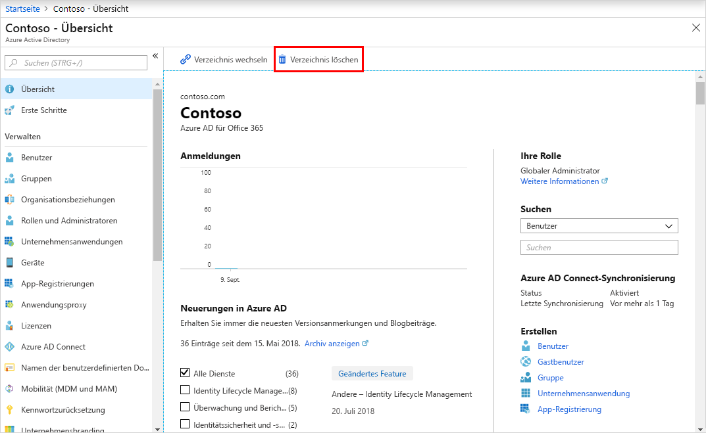

# Schnellstart: Erstellen eines neuen Mandanten in Azure Active Directory

Sie können alle Verwaltungsaufgaben über das Azure Active Directory-Portal (Azure AD-Portal) ausführen. Dazu gehört auch das Erstellen eines neuen Mandanten für Ihre Organisation. 

In diesem Schnellstart erfahren Sie, wie Sie das Azure-Portal und Azure Active Directory aufrufen, und wie Sie einen Basismandanten für Ihre Organisation erstellen.

Wenn Sie kein Azure-Abonnement besitzen, können Sie ein [kostenloses Konto](https://azure.microsoft.com/free/) erstellen, bevor Sie beginnen.

## Erstellen eines neuen Mandanten für Ihre Organisation

Nach der Anmeldung im Azure-Portal können Sie einen neuen Mandanten für Ihre Organisation erstellen. Ihr neuer Mandant stellt Ihre Organisation dar und unterstützt Sie dabei, eine bestimmte Microsoft Cloud Services-Instanz für Ihre internen und externen Benutzer zu verwalten.

### Erstellen eines neuen Mandanten

1. Melden Sie sich beim [Azure-Portal](https://portal.azure.com/) Ihrer Organisation an.

1. Wählen Sie im Azure-Portalmenü **Azure Active Directory** aus.  

    <kbd></kbd>  

1. Wählen Sie **Mandant erstellen** aus.

1. Wählen Sie auf der Registerkarte „Grundlagen“ den Mandantentyp aus, den Sie erstellen möchten: **Azure Active Directory** oder **Azure Active Directory (B2C)** .

1. Klicken Sie auf **Weiter: Konfiguration**, um zur Registerkarte „Konfiguration“ zu gelangen.

    <kbd></kbd>

1.  Geben Sie auf der Registerkarte „Konfiguration“ die folgenden Informationen ein:
    
    - Geben Sie in das Feld **Organisationsname** den Namen _Contoso-Organisation_ ein.

    - Geben Sie in das Feld **Name der Anfangsdomäne** den Namen _Contosoorg_ ein.

    - Übernehmen Sie im Feld **Land oder Region** die Option _USA_.

1. Klicken Sie auf **Weiter: Überprüfen + erstellen**. Überprüfen Sie die von Ihnen eingegebenen Informationen, und wählen Sie **Erstellen** aus, wenn die Informationen korrekt sind.

    <kbd></kbd>

Ihr neuer Mandant wird mit der Domäne „contoso.onmicrosoft.com“ erstellt.

## Ihr Benutzerkonto im neuen Mandanten

Wenn Sie einen neuen Azure AD-Mandanten erstellen, werden Sie der erste Benutzer dieses Mandanten. Als erster Benutzer wird Ihnen automatisch die Rolle [Globaler Administrator](../roles/permissions-reference.md#global-administrator) zugewiesen. Sehen Sie sich Ihr Benutzerkonto an, indem Sie zur Seite [**Benutzer**](https://portal.azure.com/#blade/Microsoft_AAD_IAM/UsersManagementMenuBlade/MsGraphUsers) navigieren.

Standardmäßig werden Sie auch als [technischer Kontakt](/microsoft-365/admin/manage/change-address-contact-and-more?view=o365-worldwide#what-do-these-fields-mean) für den Mandanten aufgeführt. Die Informationen zum technischen Kontakt können unter [**Eigenschaften**](https://portal.azure.com/#blade/Microsoft_AAD_IAM/ActiveDirectoryMenuBlade/Properties) geändert werden.

> [!WARNING]
> Stellen Sie sicher, dass Ihrem Verzeichnis mindestens zwei Konten mit Berechtigungen vom Typ „Globaler Administrator“ zugewiesen sind. Das ist hilfreich, wenn ein globaler Administrator gesperrt ist. Ausführlichere Informationen finden Sie im Artikel [Verwalten von Konten für den Notfallzugriff in Azure AD](../roles/security-emergency-access.md).

## Bereinigen von Ressourcen

Wenn Sie diese Anwendung nicht mehr verwenden möchten, können Sie den Mandanten folgendermaßen löschen:

- Vergewissern Sie sich anhand des Filters **Verzeichnis + Abonnement** im Azure-Portal, dass Sie bei dem Verzeichnis angemeldet sind, das Sie löschen möchten. Wechseln Sie ggf. zum Zielverzeichnis.
- Wählen Sie **Azure Active Directory**, die Seite **Contoso – Übersicht** und dann **Verzeichnis löschen** aus.

    Der Mandant und die dazugehörigen Informationen werden gelöscht.

    <kbd></kbd>

## Nächste Schritte

- Wie Sie zusätzliche Domänennamen ändern oder hinzufügen, erfahren Sie unter [Hinzufügen eines benutzerdefinierten Domänennamens zu Azure Active Directory](add-custom-domain.md).

- Weitere Informationen zum Hinzufügen von Benutzern finden Sie unter [Hinzufügen oder Löschen eines neuen Benutzers](add-users-azure-active-directory.md).

- Der Artikel [Erstellen einer Basisgruppe und Hinzufügen von Mitgliedern](active-directory-groups-create-azure-portal.md) erläutert, wie Sie Gruppen und Mitglieder hinzufügen.

- Erfahren Sie mehr über [rollenbasierten Zugriff mit Privileged Identity Management](../../role-based-access-control/best-practices.md) und [bedingten Zugriff](../../role-based-access-control/conditional-access-azure-management.md), um den Zugriff auf die Anwendungen und Ressourcen Ihrer Organisation zu verwalten.

- Weitere Informationen zu Azure AD finden Sie unter [Was ist Azure Active Directory?](active-directory-whatis.md). Dieser Artikel enthält allgemeine Lizenzierungsinformationen sowie Details zu Terminologie und zugehörigen Features.