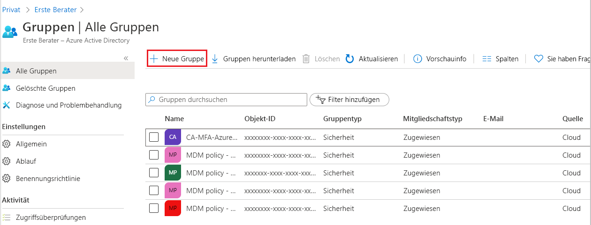
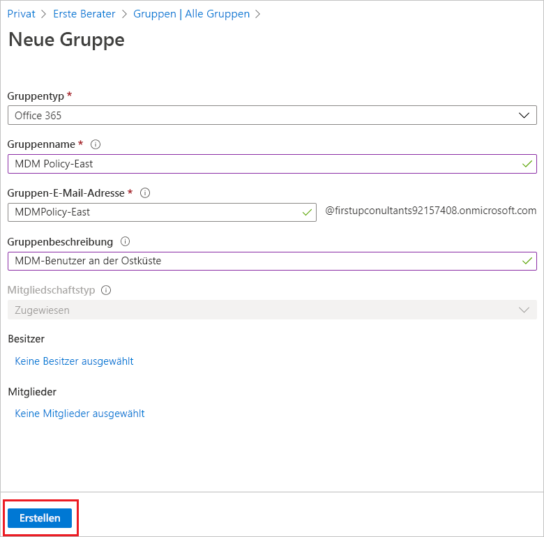
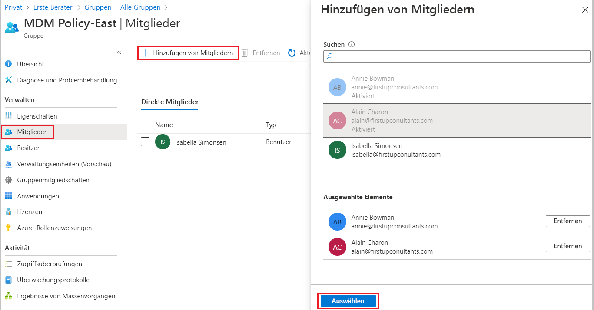
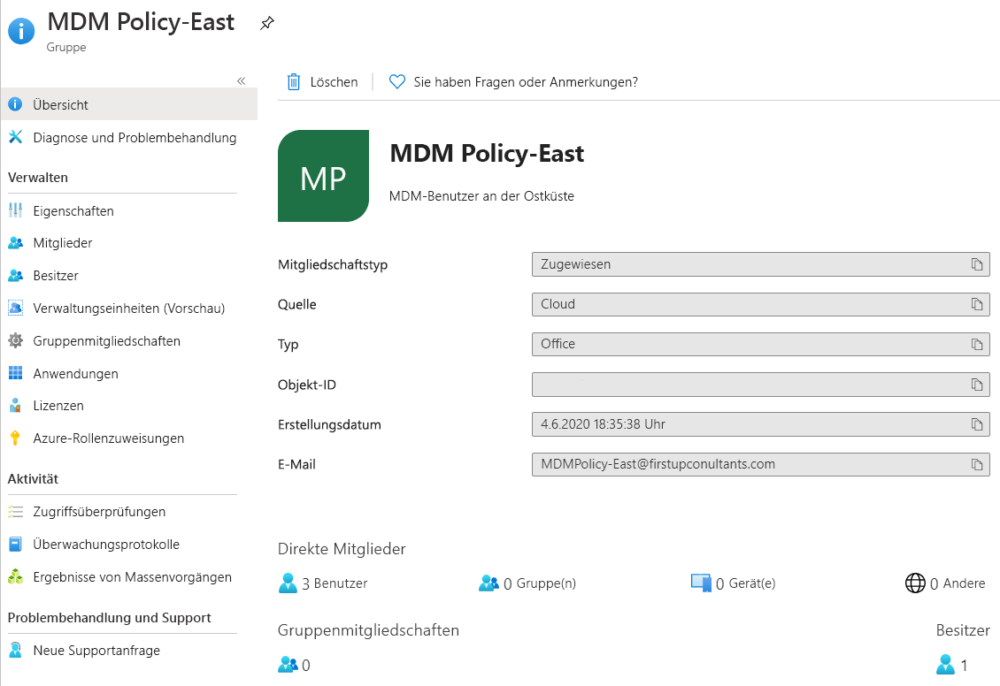

# Erstellen einer Basisgruppe und Hinzufügen von Mitgliedern mit Azure Active Directory
Sie können über das Azure Active Directory-Portal (Azure AD) eine Basisgruppe erstellen. Für die Zwecke dieses Artikels wird einer einzelnen Ressource eine Basisgruppe durch den Ressourcenbesitzer (Administrator) hinzugefügt und bestimmte Mitglieder (Mitarbeiter) eingeschlossen, die auf diese Ressource zugreifen müssen. Informationen zu komplexeren Szenarien wie dynamische Mitgliedschaften und die Erstellung von Regeln finden Sie in der [Dokumentation für die Verwaltung von Azure Active Directory-Benutzern](../users-groups-roles/index.yml).

## Gruppen- und Mitgliedschaftstypen
Es gibt mehrere Gruppen- und Mitgliedschaftstypen. In den folgenden Informationen werden die einzelnen Gruppen- und Mitgliedschaftstypen und die Gründe ihrer Verwendung erläutert, damit Sie entscheiden können, welche Optionen beim Erstellen einer Gruppe verwendet werden sollen.

### Gruppentypen:
- **Sicherheit**. Dieser Gruppentyp dient zur Verwaltung von Mitgliedern und des Computerzugriffs auf freigegebene Ressourcen für eine Gruppe von Benutzern. Beispielsweise können Sie eine Sicherheitsgruppe für eine bestimmte Sicherheitsrichtlinie erstellen. Auf diese Weise können Sie allen Mitgliedern gleichzeitig eine Gruppe von Berechtigungen gewähren, statt jedem einzelnen Mitglied separat Berechtigungen hinzuzufügen. Eine Sicherheitsgruppe kann über Benutzer, Geräte, Gruppen und Dienstprinzipale als Mitglieder und Benutzer und Dienstprinzipale als Besitzer verfügen. Weitere Informationen zum Verwalten des Zugriffs auf Ressourcen finden Sie unter [Informationen zur Verwaltung des Zugriffs mit Azure Active Directory-Gruppen](active-directory-manage-groups.md).
- **Microsoft 365**: Dieser Gruppentyp bietet Möglichkeiten zur Zusammenarbeit, indem Mitgliedern Zugriff auf freigegebene Postfächer, Kalender, Dateien, SharePoint-Websites und vieles mehr gewährt wird. Über diese Option können Sie auch Personen außerhalb Ihrer Organisation Zugriff auf die Gruppe gewähren. Eine Microsoft 365-Gruppe kann nur Benutzer als Mitglieder enthalten. Benutzer und Dienstprinzipale können Besitzer einer Microsoft 365-Gruppe sein. Weitere Informationen zu Microsoft 365-Gruppen finden Sie unter [Informationen zu Microsoft 365-Gruppen](https://support.office.com/article/learn-about-office-365-groups-b565caa1-5c40-40ef-9915-60fdb2d97fa2).

### Mitgliedschaftstypen:
- **Zugewiesen**: Mit dieser Option können Sie bestimmte Benutzer als Mitglieder dieser Gruppe mit einzigartigen Berechtigungen hinzufügen. Für die Zwecke dieses Artikels verwenden wir diese Option.
- **Dynamischer Benutzer**: Wir verwenden dynamische Mitgliedschaftsregeln, um Mitglieder automatisch hinzuzufügen und zu entfernen. Wenn sich die Attribute eines Mitglieds ändern, prüft das System Ihre dynamischen Gruppenregeln für das Verzeichnis, um festzustellen, ob das Mitglied den Regelanforderungen (sofern hinzugefügt) entspricht oder nicht mehr entspricht (falls entfernt).
- **Dynamisches Gerät**: Über diese Option können Sie mithilfe dynamischer Gruppenregeln automatisch Geräte hinzufügen und entfernen lassen. Wenn sich die Attribute eines Geräts ändern, prüft das System Ihre dynamischen Gruppenregeln für das Verzeichnis, um festzustellen, ob das Gerät den Regelanforderungen (sofern hinzugefügt) entspricht oder nicht mehr entspricht (falls entfernt).

    > [!IMPORTANT]
    > Sie können eine dynamische Gruppe entweder für Geräte oder für Benutzer erstellen, jedoch nicht für beides. Zudem können Sie keine Gerätegruppe basierend auf den Attributen der Gerätebesitzer erstellen. Regeln für die Gerätemitgliedschaft können nur Geräteattribute referenzieren. Weitere Informationen zum Erstellen einer dynamischen Gruppe von Benutzern und Geräten finden Sie unter [Erstellen einer dynamischen Gruppe und Überprüfen des Status](../users-groups-roles/groups-create-rule.md).

## Erstellen einer Basisgruppe und Hinzufügen von Mitgliedern
Sie können eine Basisgruppe erstellen und gleichzeitig Ihre Mitglieder hinzufügen. So erstellen Sie eine Basisgruppe und fügen ihr Mitglieder hinzu:

1. Melden Sie sich mit dem Konto eines globalen Administrators für das Verzeichnis beim [Azure-Portal](https://portal.azure.com) an.

1. Suchen Sie nach **Azure Active Directory**, und wählen Sie diese Option aus.

1. Wählen Sie auf der Seite **Azure Active Directory** die Option **Gruppen** und anschließend **Neue Gruppe** aus.

    

1. Der Bereich **Neue Gruppe** wird angezeigt, und Sie müssen die erforderlichen Informationen eintragen.

    

1. Wählen Sie einen vordefinierten **Gruppentyp** aus. Weitere Informationen zu Gruppentypen finden Sie unter [Gruppen- und Mitgliedschaftstypen](#group-types).

1. Erstellen Sie einen **Gruppennamen**, und fügen Sie ihn hinzu. Wählen Sie einen Namen, den Sie sich gut merken können und der für die Gruppe sinnvoll ist. Es wird geprüft, ob der Name bereits für eine andere Gruppe verwendet wird. Wenn der Name bereits verwendet wird, werden Sie aufgefordert, den Namen Ihrer Gruppe zu ändern, um doppelte Namen zu vermeiden.

1. Fügen Sie eine **Gruppen-E-Mail-Adresse** hinzu, oder übernehmen Sie die automatisch eingefügte E-Mail-Adresse.

1. **Gruppenbeschreibung**: Fügen Sie ggf. eine Beschreibung zu Ihrer Gruppe hinzu.

1. Wählen Sie einen vordefinierten **Mitgliedschaftstyp (erforderlich)** aus. Weitere Informationen zu Mitgliedschaftstypen finden Sie unter [Gruppen- und Mitgliedschaftstypen](#membership-types).

1. Klicken Sie auf **Erstellen**. Wenn die Gruppe erstellt ist, können ihr Mitglieder hinzugefügt werden.

1. Wählen Sie auf der Seite **Gruppe** den Bereich **Mitglieder** aus, und suchen Sie dann auf der Seite **Mitglied auswählen** die Mitglieder, die Ihrer Gruppe hinzugefügt werden sollen.

    

1. Wenn Sie fertig sind, wählen Sie **Auswählen** aus.

    Die Seite **Gruppenübersicht** wird aktualisiert und zeigt danach die Anzahl der Mitglieder an, die nun der Gruppe hinzugefügt sind.

    

## Aktivieren oder Deaktivieren der Gruppenbegrüßungs-E-Mail

Wenn eine neue Microsoft 365-Gruppe erstellt wird, wird eine Begrüßungsnachricht an alle Benutzer gesendet, die der Gruppe hinzugefügt wurden – unabhängig davon, ob die Mitglieder dynamisch oder statisch hinzugefügt werden. Wenn sich Attribute eines Benutzers oder Geräts ändern, werden alle dynamischen Gruppenregeln in der Organisation verarbeitet, um mögliche Änderungen an der Mitgliedschaft zu ermitteln. Hinzugefügte Benutzer erhalten dann ebenfalls eine Begrüßungsnachricht. Sie können dieses Verhalten in [Exchange PowerShell](/powershell/module/exchange/users-and-groups/Set-UnifiedGroup?view=exchange-ps) deaktivieren. 

## Nächste Schritte

- [Verwalten des Zugriffs auf SaaS-Apps mittels Gruppen](../users-groups-roles/groups-saasapps.md)
- [Verwalten von Gruppen mithilfe von PowerShell-Befehlen](../users-groups-roles/groups-settings-v2-cmdlets.md)