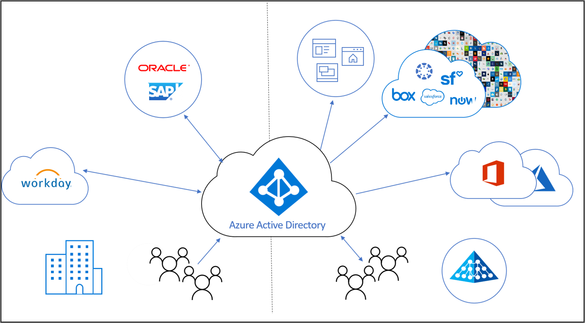

# Was ist Identity Lifecycle Management?

Identity Governance hilft Organisationen, ein Gleichgewicht herzustellen zwischen der Produktivität – wie schnell eine Person auf die benötigten Ressourcen zugreifen kann (beispielsweise, wenn sie der Organisation beitritt) – und der Sicherheit – wie sich der Zugriff im Laufe der Zeit ändern sollte (beispielsweise aufgrund von Änderungen des Beschäftigungsstatus einer Person).

**Identity Lifecycle Management** ist die Grundlage für Identity Governance. Eine effektive Governance im großen Stil erfordert eine Modernisierung der Identity Lifecycle Management-Infrastruktur für Anwendungen. Das Ziel bei Identity Lifecycle Management besteht darin, den gesamten Lebenszyklusprozess der digitalen Identität zu automatisieren und zu verwalten. 

## Was ist eine digitale Identität?

Bei einer digitalen Identität handelt es sich um Informationen zu einer Entität, die von einer oder mehreren Computingressourcen, z. B. Betriebssystemen oder Anwendungen, genutzt wird. Diese Entitäten können Personen, Organisationen, Anwendungen oder Geräte sein.  Die Identität wird normalerweise durch die ihr zugeordneten Attribute beschrieben, z. B. Namen, Bezeichner und Eigenschaften (etwa Rollen für die Zugriffsverwaltung).  Anhand dieser Attribute kann in Systemen beispielsweise festgelegt werden, wer worauf Zugriff hat und wer ein bestimmtes System nutzen kann.  

## Verwalten des Lebenszyklus von digitalen Identitäten

Die Verwaltung von digitalen Identitäten ist eine komplexe Aufgabe. Dies ist vor allem der Fall, weil hierbei reale Objekte, z. B. eine Person und ihre Beziehung zu einer Organisation (Mitarbeiter), mit einer digitalen Darstellung korreliert werden.    In kleineren Organisationen kann das Pflegen der digitalen Darstellung von Personen, die eine Identität benötigen, ein manueller Prozess sein. Wenn eine Person eingestellt wird oder ein Auftragnehmer eintrifft, kann ein IT-Spezialist ein Konto in einem Verzeichnis erstellen und die benötigten Zugriffsberechtigungen für die Person zuweisen.  In mittleren und großen Unternehmen kann die Automatisierung eine Organisation aber in die Lage versetzen, die Skalierung effektiver durchzuführen und die Identitäten präzise zu pflegen.

Bei einem typischen Prozess zum Einrichten von Identity Lifecycle Management in einer Organisation werden die folgenden Schritte ausgeführt:

1. Ermitteln, ob bereits „Systems of Record“ vorhanden sind: Dies ist die Bezeichnung für Datenquellen, die von der Organisation als autoritativ angesehen werden.  Beispielsweise kann die Organisation über Workday als System für die Personalverwaltung verfügen. Dieses System wird in Bezug auf die Bereitstellung der aktuellen Mitarbeiterliste als Autorität angesehen, einschließlich einiger zugehöriger Eigenschaften wie der Name oder die Abteilung eines Mitarbeiters.  Ein anderes Beispiel ist ein E-Mail-System, z. B. Exchange Online, das als autoritativ in Bezug auf die E-Mail-Adresse eines Mitarbeiters angesehen wird.

2. Verbinden Sie diese Systems of Record mit Verzeichnissen und Datenbanken, die von Anwendungen genutzt werden, und beseitigen Sie die Inkonsistenzen zwischen den Verzeichnissen und den Systems of Record. Beispielsweise kann ein Verzeichnis veraltete Daten enthalten, z. B. ein Konto für einen ausgeschiedenen Mitarbeiter, das nicht mehr benötigt wird. 

3. Ermitteln, welche Prozesse verwendet werden können, um bei einem fehlenden System of Record autoritative Informationen bereitzustellen.  Wenn beispielsweise digitale Identitäten für Besucher verwendet werden und die Organisation keine Datenbank für Besucher hat, muss ggf. auf andere Weise ermittelt werden, wann eine digitale Identität für einen Besucher nicht mehr benötigt wird.

4. Konfigurieren eines Vorgangs, bei dem Änderungen aus dem System of Record oder anderen Prozessen in den einzelnen Verzeichnissen oder Datenbanken repliziert werden, für die ein Update erforderlich ist.

## Identity Lifecycle Management zur Darstellung von Mitarbeitern und anderen Personen mit einer Beziehung zur Organisation

Beim Planen von Identity Lifecycle Management für Mitarbeiter oder andere Personen mit einer Beziehung zur Organisation, z. B. Auftragnehmer oder Studenten, nutzen viele Organisationen einen Prozess nach dem Muster „Eintritt, Übergang und Austritt“.  Dies sind:
    
   - Eintritt: Wenn eine Person Zugriff benötigt, muss für die entsprechenden Anwendungen eine Identität vorhanden sein. Falls nicht bereits eine digitale Identität vorhanden ist, muss diese neu erstellt werden.
   - Übergang: Hierbei beginnt eine Person mit der Arbeit in einem neuen Bereich, für den ihrer digitalen Identität zusätzliche Zugriffsberechtigungen hinzugefügt (oder auch daraus entfernt) werden müssen.
   - Austritt: Wenn eine Person keinen Zugriff mehr benötigt, müssen die entsprechenden Berechtigungen ggf. entfernt werden. Unter Umständen ist die Identität für die Anwendungen dann nicht mehr erforderlich – abgesehen von der Überprüfung oder Forensik.

Wenn beispielsweise ein neuer Mitarbeiter in Ihre Organisation eintritt, der bisher noch keinerlei Beziehung zur Organisation hatte, benötigt er eine neue digitale Identität (ein Benutzerkonto in Azure AD).  Die Erstellung dieses Kontos ist ein Vorgang vom Typ „Eintritt“, der automatisiert werden kann, wenn ein System of Record vorhanden ist (z. B. Workday). Mit diesem System kann angegeben werden, wann der neue Mitarbeiter mit der Arbeit beginnt.  Wenn ein Mitarbeiter in Ihrer Organisation dann beispielsweise aus der Vertriebs- in die Marketingabteilung wechselt, ist dies ein Vorgang vom Typ „Übergang“.  Die nicht mehr benötigten Zugriffsrechte für die Vertriebsabteilung müssen entfernt und die nun erforderlichen Rechte für die Marketingabteilung gewährt werden.

## Identity Lifecycle Management für Gäste

Für Gäste und andere Benutzer werden ähnliche Prozesse benötigt.  Bei der Azure AD-Berechtigungsverwaltung wird Azure AD B2B (Business-to-Business) zum Bereitstellen der Lebenszyklus-Steuerelemente für die Zusammenarbeit mit Personen außerhalb Ihrer Organisation verwendet, die Zugriff auf die Ressourcen Ihrer Organisation benötigen. Externe Benutzer verwenden Azure AD B2B für die Authentifizierung gegenüber ihrem Basisverzeichnis, aber sie werden in Ihrem Verzeichnis dargestellt. Die Darstellung in Ihrem Verzeichnis ermöglicht dem Benutzer den Zugriff auf Ihre Ressourcen.  Bei der Berechtigungsverwaltung können Personen außerhalb Ihrer Organisation Zugriff anfordern, und bei Bedarf wird für sie dann eine digitale Identität erstellt. Diese digitalen Identitäten werden automatisch entfernt, wenn der Benutzer keinen Zugriff mehr hat.  

## Wie wird Identity Lifecycle Management von Azure AD automatisiert?

Azure AD verfügt derzeit über die folgenden Features:

* Benutzer, bei denen es sich um Mitarbeiter handelt, können in Azure AD und Active Directory automatisch erstellt und aktualisiert werden, indem die [personalbasierte Bereitstellung](what-is-hr-driven-provisioning.md) verwendet wird.
* Benutzer, die in Active Directory bereits vorhanden sind, können in Azure AD per [Bereitstellung zwischen Verzeichnissen](what-is-inter-directory-provisioning.md) automatisch erstellt und verwaltet werden.
* Benutzer können basierend auf ihren Eigenschaften automatisch Gruppen zugewiesen werden, indem [dynamische Gruppen](../external-identities/use-dynamic-groups.md#what-are-dynamic-groups) verwendet werden. Bei Bedarf können sie per [Berechtigungsverwaltung](entitlement-management-scenarios.md) und [Privileged Identity Management](../privileged-identity-management/pim-configure.md) Gruppen, Teams, Azure AD-Rollen, Azure-Ressourcenrollen und SharePoint Online-Websites zugewiesen werden.
* Updates für Benutzer können per [App-Bereitstellung](what-is-app-provisioning.md) automatisch an weitere Anwendungen gesendet werden.

## Nächste Schritte 

- [Was ist die Identitätsbereitstellung?](what-is-provisioning.md)
- [Steuern des Zugriffs für externe Benutzer in der Azure AD-Berechtigungsverwaltung](./entitlement-management-external-users.md)
- [Worum handelt es sich bei der personalbasierten Bereitstellung?](what-is-hr-driven-provisioning.md)
- [Worum handelt es sich bei der App-Bereitstellung?](what-is-app-provisioning.md)
- [Worum handelt es sich bei der Bereitstellung zwischen Verzeichnissen?](what-is-inter-directory-provisioning.md)