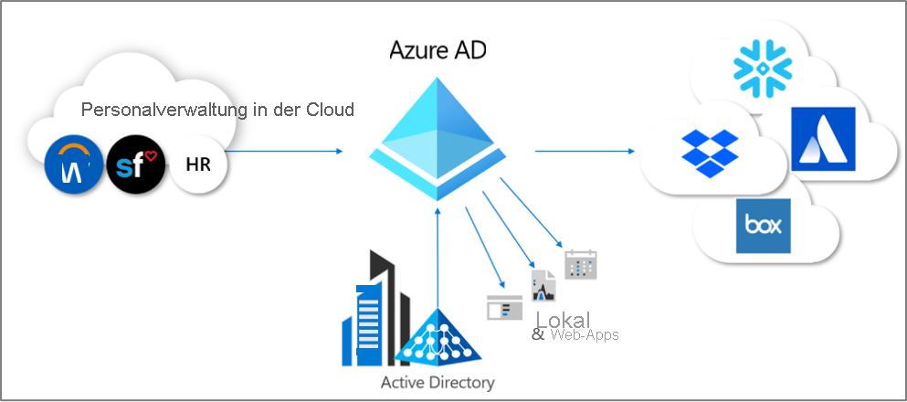
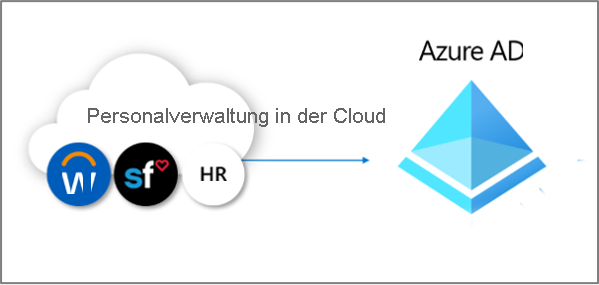
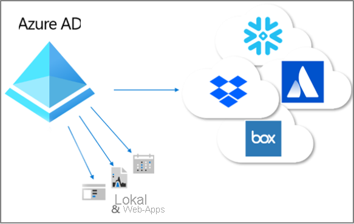

# Was bedeutet bereitstellen?

Die Bereitstellung und die Aufhebung der Bereitstellung sind die Prozesse, mit denen die Einheitlichkeit (Konsistenz) digitaler Identitäten für mehrere Systeme sichergestellt wird.  Diese Prozesse werden häufig im Rahmen des [Identity Lifecycle Management](what-is-identity-lifecycle-management.md) genutzt.

Bei der **Bereitstellung** geht es um die Erstellung einer Identität in einem Zielsystem basierend auf bestimmten Bedingungen.  Bei der **Aufhebung der Bereitstellung** wird die Identität aus dem Zielsystem entfernt, wenn die Bedingungen nicht mehr erfüllt sind. Die **Synchronisierung** ist der Prozess, mit dem das bereitgestellte Objekt auf dem aktuellen Stand gehalten wird, damit das Quell- und das Zielobjekt gleich sind.

Wenn beispielsweise ein neuer Benutzer in Ihre Organisation eintritt, wird er in das Personalsystem aufgenommen.  An diesem Punkt kann beim Bereitstellungsvorgang mit der Personalabteilung als **Quelle** und Azure Active Directory (Azure AD) als **Ziel** ein entsprechendes Benutzerkonto in Azure AD erstellt werden. Anwendungen, die Azure AD abfragen, können das Konto für den neuen Mitarbeiter „sehen“.  Falls Anwendungen ohne Nutzung von Azure AD vorhanden sind, wird durch die Bereitstellung mit Azure AD als **Quelle** und den Datenbanken dieser Anwendungen als **Ziel** sichergestellt, dass der Benutzer auf alle benötigten Anwendungen zugreifen kann.  Aufgrund dieses Prozesses kann der Benutzer umgehend mit der Arbeit beginnen und auf die benötigten Anwendungen und Systeme zugreifen.  Auf ähnliche Weise wird die Einheitlichkeit sichergestellt, wenn sich die zugehörigen Eigenschaften, z. B. die Abteilung oder der Mitarbeiterstatus, im Personalsystem ändern. In diesem Fall wird für diese Updates eine Synchronisierung aus dem Personalsystem mit Azure AD und dann mit anderen Anwendungen und Zieldatenbanken durchgeführt.

Azure AD verfügt derzeit über drei Bereiche für die automatisierte Bereitstellung.  Sie lauten wie folgt:  

- Bereitstellung aus einem externen „System of Record“, das keine Verzeichnisautorität besitzt, per **[personalbasierter Bereitstellung](#hr-driven-provisioning)**  
- Bereitstellung aus Azure AD für Anwendungen per **[App-Bereitstellung](#app-provisioning)**  
- Bereitstellung zwischen Azure AD und Active Directory Domain Services per **[Bereitstellung zwischen Verzeichnissen](#inter-directory-provisioning)** 

## Personalbasierte Bereitstellung

Die Bereitstellung aus dem Personalsystem für Azure AD umfasst die Erstellung von Objekten, bei denen es sich normalerweise um die Benutzeridentitäten der einzelnen Mitarbeiter handelt. In einigen Fällen kann es sich aber auch um andere Objekte handeln, z. B. Abteilungen oder anderweitige Strukturen, die auf den Informationen in Ihrem Personalsystem basieren.  

Gängigstes Szenario: Ein neuer Mitarbeiter wird eingestellt und in das Personalsystem aufgenommen.  Anschließend wird der Mitarbeiter automatisch als neuer Benutzer in Azure AD bereitgestellt. Es ist bei Neueinstellungen also kein Eingriff durch das Verwaltungspersonal erforderlich.  Die Bereitstellung aus dem Personalsystem kann im Allgemeinen die unten angegebenen Szenarien umfassen.

- **Einstellung neuer Mitarbeiter**: Wenn einem Personalsystem ein neuer Mitarbeiter hinzugefügt wird, wird in Active Directory, Azure AD und optional in den Verzeichnissen für andere Anwendungen, die von Azure AD unterstützt werden, automatisch ein Benutzerkonto erstellt. Die E-Mail-Adresse wird hierbei in das Personalsystem zurückgeschrieben.
- **Aktualisierung von Mitarbeiterattributen und -profilen**: Wenn in dem Personalsystem ein Mitarbeiterdatensatz aktualisiert wird (z. B. der Name, Titel oder Vorgesetzte), wird das entsprechende Benutzerkonto in Azure Active Directory, Azure AD und optional in anderen von Azure AD unterstützten Anwendungen automatisch aktualisiert.
- **Kündigung von Mitarbeitern**: Wenn von der Personalabteilung für einen Mitarbeiter der Vorgang zur Kündigung durchgeführt wird, wird sein Benutzerkonto automatisch für die Anmeldung blockiert bzw. in Active Directory, Azure AD und anderen Anwendungen entfernt.
- **Erneute Einstellung von Mitarbeitern**: Wenn für einen Mitarbeiter in der Cloudumgebung der Personalabteilung der Vorgang für die erneute Einstellung durchgeführt wird, kann sein altes Konto automatisch reaktiviert oder erneut bereitgestellt werden (je nach bevorzugter Vorgehensweise).

Es gibt drei Bereitstellungsoptionen für die personalbasierte Bereitstellung mit Azure AD:

1. Für Organisationen mit nur einem Abonnement von Workday oder SuccessFactors und ohne Nutzung von Active Directory
1. Für Organisationen mit nur einem Abonnement von Workday oder SuccessFactors und Nutzung von Active Directory und Azure AD
1. Für Organisationen mit mehreren Personalsystemen oder einem lokalen Personalsystem, z. B. SAP, Oracle eBusiness oder PeopleSoft

Weitere Informationen finden Sie unter [Worum handelt es sich bei der personalbasierten Bereitstellung?](what-is-hr-driven-provisioning.md).

## App-Bereitstellung

In Azure AD steht der Begriff **[App-Bereitstellung](../app-provisioning/user-provisioning.md)** für die automatische Erstellung von Kopien der Benutzeridentitäten in den Anwendungen, auf die Benutzer Zugriff benötigen. Dies gilt für Anwendungen mit eigenem Datenspeicher, bei denen es sich nicht um Azure AD oder Active Directory handelt. Zusätzlich zur Erstellung von Benutzeridentitäten umfasst die App-Bereitstellung auch die Wartung und Entfernung von Benutzeridentitäten für diese Apps, wenn sich der Status oder die Rollen des Benutzers ändern. Ein häufiges Szenario ist die Bereitstellung eines Azure AD-Benutzers in Anwendungen wie [Dropbox](../saas-apps/dropboxforbusiness-provisioning-tutorial.md), [Salesforce](../saas-apps/salesforce-provisioning-tutorial.md) oder [ServiceNow](../saas-apps/servicenow-provisioning-tutorial.md), da diese Anwendungen jeweils über ein eigenes Benutzerrepository verfügen, das sich von Azure AD unterscheidet.

Weitere Informationen finden Sie unter [Worum handelt es sich bei der App-Bereitstellung?](what-is-app-provisioning.md).

## Bereitstellung zwischen Verzeichnissen

Viele Organisationen nutzen sowohl Active Directory als auch Azure AD, und ggf. sind die Anwendungen mit Active Directory verbunden, z. B. lokale Dateiserver.

Da viele Organisationen in der Vergangenheit die personalbasierte Bereitstellung lokal genutzt haben, verfügen sie unter Umständen bereits über Benutzeridentitäten für alle Mitarbeiter in Active Directory.   Das häufigste Szenario für die Bereitstellung zwischen Verzeichnissen ist, dass ein Benutzer, der in Active Directory bereits vorhanden ist, in Azure AD bereitgestellt wird.  Hierfür wird normalerweise die Synchronisierung oder die Cloudbereitstellung von Azure AD Connect verwendet. 

Es kann sein, dass Organisationen auch die Bereitstellung in lokalen Systemen aus Azure AD durchführen möchten.  Angenommen, eine Organisation hat Gäste in das Azure AD-Verzeichnis eingefügt, für die über den App-Proxy der Zugriff auf lokale Webanwendungen, die auf der integrierten Windows-Authentifizierung basieren, erforderlich ist.  Hierfür muss die Bereitstellung von lokalen AD-Konten für diese Benutzer in Azure AD durchgeführt werden.

Weitere Informationen finden Sie unter [Worum handelt es sich bei der Bereitstellung zwischen Verzeichnissen?](what-is-inter-directory-provisioning.md).

 
## Nächste Schritte 
- [Was ist Identity Lifecycle Management?](what-is-identity-lifecycle-management.md)
- [Worum handelt es sich bei der personalbasierten Bereitstellung?](what-is-hr-driven-provisioning.md)
- [Worum handelt es sich bei der App-Bereitstellung?](what-is-app-provisioning.md)
- [Worum handelt es sich bei der Bereitstellung zwischen Verzeichnissen?](what-is-inter-directory-provisioning.md)