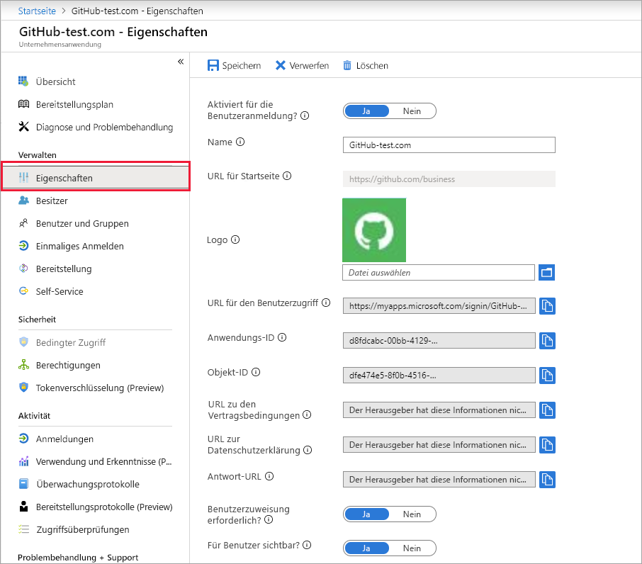
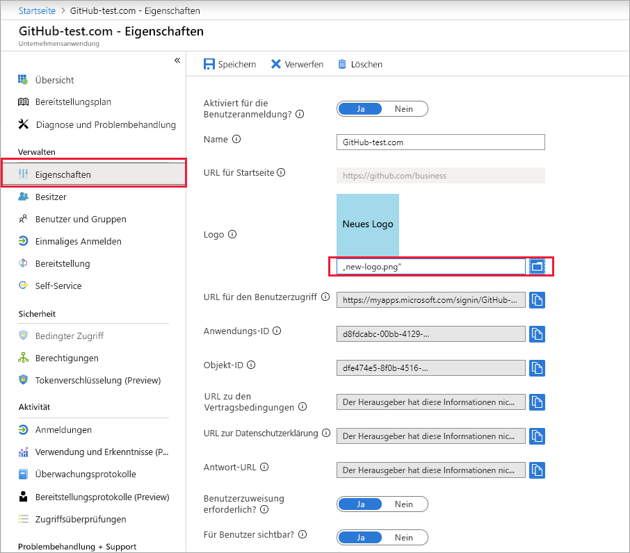

# Schnellstart: Konfigurieren von Eigenschaften für eine Anwendung auf Ihrem Azure AD-Mandanten (Azure Active Directory)

In der vorherigen Schnellstartanleitung haben Sie Ihrem Azure Active Directory-Mandanten (Azure AD-Mandanten) eine Anwendung hinzugefügt. Beim Hinzufügen einer Anwendung teilen Sie Ihrem Azure AD-Mandanten mit, dass er als Identitätsanbieter für die App fungiert. Nun konfigurieren Sie einige Eigenschaften für die App.
 
## Voraussetzungen

Sie benötigen Folgendes, um die Eigenschaften einer Anwendung auf Ihrem Azure AD-Mandanten zu konfigurieren:

- Ein Azure-Konto mit einem aktiven Abonnement. Sie können [kostenlos ein Konto erstellen](https://azure.microsoft.com/free/?WT.mc_id=A261C142F).
- Eine der folgenden Rollen: Globaler Administrator, Cloudanwendungsadministrator, Anwendungsadministrator oder Besitzer des Dienstprinzipals.
- Optional: Gehen Sie den Schnellstart [Anzeigen Ihrer Apps](view-applications-portal.md) durch.
- Optional: Gehen Sie den Schnellstart [Hinzufügen einer App](add-application-portal.md) durch.

>[!IMPORTANT]
>Verwenden Sie zum Testen der in dieser Schnellstartanleitung aufgeführten Schritte keine Produktionsumgebung.

## Konfigurieren von App-Eigenschaften

Nachdem Sie Ihrem Azure AD-Mandanten eine Anwendung hinzugefügt haben, wird die Übersichtsseite angezeigt. Wenn Sie eine Anwendung konfigurieren, die bereits hinzugefügt wurde, lesen Sie die erste Schnellstartanleitung. Darin wird beschrieben, wie Sie die Ihrem Mandanten hinzugefügten Anwendungen anzeigen können. 

So bearbeiten Sie die Anwendungseigenschaften:

1. Wählen Sie im Azure AD-Portal die Option **Unternehmensanwendungen** aus. Suchen Sie dann nach der zu konfigurierenden Anwendung, und wählen Sie diese aus.
1. Wählen Sie im Abschnitt **Verwalten** die Option **Eigenschaften** aus, um den Bereich **Eigenschaften** zur Bearbeitung zu öffnen.

    

1. Nehmen Sie sich einen Moment Zeit, um sich mit den zur Verfügung stehenden konfigurierbaren Optionen vertraut zu machen:
    - Mit **Aktiviert für die Benutzeranmeldung?** wird festgelegt, ob sich Benutzer, die der Anwendung zugewiesen sind, anmelden können.
    - Mit **Benutzerzuweisung erforderlich?** wird festgelegt, ob sich Benutzer, die der Anwendung nicht zugewiesen sind, anmelden können.
    - Mit **Für Benutzer sichtbar?** wird festgelegt, ob den einer App zugewiesenen Benutzern die Anwendung im [Zugriffsbereich](https://myapps.microsoft.com) und im Office 365-App-Startfeld angezeigt wird. (Siehe das Waffelmenü in der oberen linken Ecke einer Office 365- oder Microsoft 365-Website.)
1. Anhand der folgenden Tabellen können Sie die Optionen auswählen, die am besten für Ihre Anforderungen geeignet sind:

   - Verhalten für *zugewiesene* Benutzer:

       | Anwendungseigenschaft | Anwendungseigenschaft | Anwendungseigenschaft | Zugewiesene Benutzer | Zugewiesene Benutzer |
       |---|---|---|---|---|
       | Aktiviert für die Benutzeranmeldung? | Benutzerzuweisung erforderlich? | Für Benutzer sichtbar? | Können sich zugewiesene Benutzer anmelden? | Können zugewiesene Benutzer die Anwendung sehen?* |
       | Ja | Ja | Ja | Ja | Ja  |
       | Ja | Ja | Nein  | Ja | Nein   |
       | Ja | Nein  | Ja | Ja | Ja  |
       | Ja | Nein  | Nein  | Ja | Nein   |
       | Nein  | Ja | Ja | Nein  | Nein   |
       | Nein  | Ja | Nein  | Nein  | Nein   |
       | Nein  | Nein  | Ja | Nein  | Nein   |
       | Nein  | Nein  | Nein  | Nein  | Nein   |

   - Verhalten für *nicht zugewiesene* Benutzer:

       | Anwendungseigenschaft | Anwendungseigenschaft | Anwendungseigenschaft | Nicht zugewiesene Benutzer | Nicht zugewiesene Benutzer |
       |---|---|---|---|---|
       | Aktiviert für die Benutzeranmeldung? | Benutzerzuweisung erforderlich? | Für Benutzer sichtbar? | Können sich nicht zugewiesene Benutzer anmelden? | Können nicht zugewiesene Benutzer die Anwendung sehen?* |
       | Ja | Ja | Ja | Nein  | Nein   |
       | Ja | Ja | Nein  | Nein  | Nein   |
       | Ja | Nein  | Ja | Ja | Nein   |
       | Ja | Nein  | Nein  | Ja | Nein   |
       | Nein  | Ja | Ja | Nein  | Nein   |
       | Nein  | Ja | Nein  | Nein  | Nein   |
       | Nein  | Nein  | Ja | Nein  | Nein   |
       | Nein  | Nein  | Nein  | Nein  | Nein   |

     *Kann der Benutzer die Anwendung im Zugriffsbereich und im Office 365-App-Startfeld sehen?

## Verwenden eines benutzerdefinierten Logos

So verwenden Sie ein benutzerdefiniertes Logo:

1. Erstellen Sie ein Logo mit 215 x 215 Pixeln, und speichern Sie es im PNG-Format.
1. Wählen Sie im Azure AD-Portal die Option **Unternehmensanwendungen** aus. Suchen Sie dann nach der zu konfigurierenden Anwendung, und wählen Sie diese aus.
1. Wählen Sie im Abschnitt **Verwalten** die Option **Eigenschaften** aus, um den Bereich **Eigenschaften** zur Bearbeitung zu öffnen. 
1. Wählen Sie das Symbol zum Hochladen des Logos aus.
1. Wählen Sie abschließend **Speichern** aus.

    

   > [!NOTE]
   > Die in diesem Bereich **Eigenschaften** angezeigte Miniaturansicht wird nicht sofort aktualisiert. Sie können den Bereich **Eigenschaften** schließen und erneut öffnen, um das aktualisierte Symbol anzuzeigen.

## Nächste Schritte

Nachdem Sie die Eigenschaften einer Anwendung konfiguriert haben, können Sie mit dem Einrichten des einmaligen Anmeldens fortfahren.

- [Einrichten des einmaligen Anmeldens](add-application-portal-setup-sso.md)
- [Löschen einer App](delete-application-portal.md)