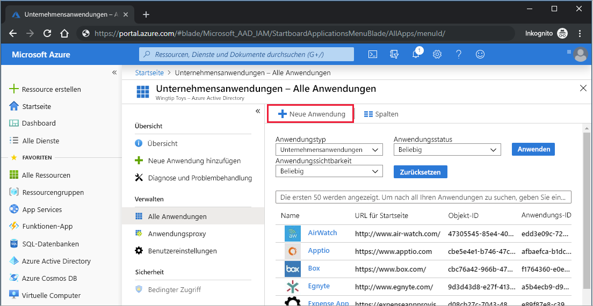
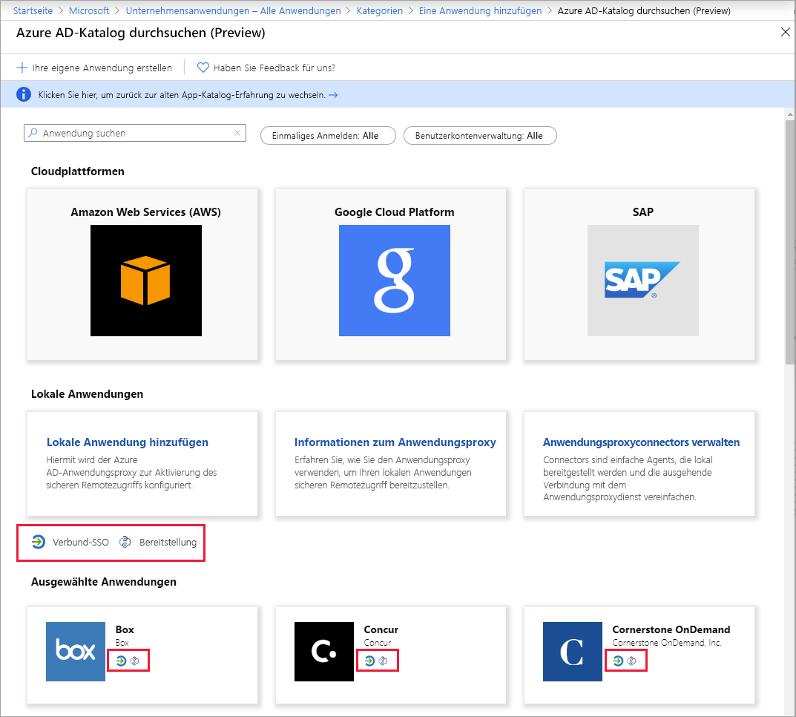

# Schnellstart: Hinzufügen einer Anwendung zu Ihrem Azure AD-Mandanten (Azure Active Directory)

Azure Active Directory (Azure AD) enthält einen Katalog mit Tausenden von vorab integrierten Anwendungen. Viele der von Ihrer Organisation verwendeten Anwendungen sind wahrscheinlich bereits im Katalog enthalten.

Nach dem Hinzufügen einer Anwendung zum Azure AD-Mandanten haben Sie folgende Möglichkeiten:

- Konfigurieren der Eigenschaften für die App
- Verwalten des Benutzerzugriffs auf die App mit einer Richtlinie für bedingten Zugriff
- Konfigurieren des einmaligen Anmeldens, damit Benutzer sich mit ihren Azure AD-Anmeldeinformationen bei der App anmelden können

## Voraussetzungen

Sie benötigen Folgendes, um Ihrem Azure AD-Mandanten eine Anwendung hinzuzufügen:

- Ein Azure-Konto mit einem aktiven Abonnement. Sie können [kostenlos ein Konto erstellen](https://azure.microsoft.com/free/?WT.mc_id=A261C142F).
- Eine der folgenden Rollen: Globaler Administrator, Cloudanwendungsadministrator, Anwendungsadministrator oder Besitzer des Dienstprinzipals.
- (Optional: Durcharbeitung von [Anzeigen Ihrer Apps](view-applications-portal.md).)

>[!IMPORTANT]
>Wir empfehlen Ihnen, zum Testen der Schritte in dieser Schnellstartanleitung keine Produktionsumgebung zu verwenden.

## Hinzufügen einer App zu Ihrem Azure AD-Mandanten

Gehen Sie wie folgt vor, um Ihrem Azure AD-Mandanten eine Anwendung hinzuzufügen:

1. Wählen Sie im [Azure-Portal](https://portal.azure.com) im linken Navigationsbereich **Azure Active Directory** aus.
2. Wählen Sie im Bereich **Azure Active Directory** die Option **Unternehmensanwendungen** aus. Der Bereich **Alle Anwendungen** wird geöffnet und zeigt eine nach dem Zufallsprinzip ausgewählte Gruppe von Anwendungen in Ihrem Azure AD-Mandanten an.
3. Wählen Sie im Bereich **Unternehmensanwendungen** die Option **Neue Anwendung** aus. 
    
4. Wechseln Sie zur neuen Vorschaubenutzeroberfläche des Katalogs: Wählen Sie auf dem Banner oben auf der Seite **Eine Anwendung hinzufügen** den Link **Klicken Sie hier, um den neuen und verbesserten App-Katalog auszuprobieren.** aus.
5. Der Bereich **Azure AD-Katalog durchsuchen (Vorschau)** wird mit Kacheln für Cloudplattformen, lokale Anwendungen und ausgewählten Anwendungen geöffnet. Für die im Abschnitt **Ausgewählte Anwendungen** aufgeführten Anwendungen wird mithilfe von Symbolen angegeben, ob sie die einmalige Verbundanmeldung und -bereitstellung unterstützen. 
    
6. Sie können den Katalog nach der hinzuzufügenden App durchsuchen oder nach der Anwendung suchen, indem Sie ihren Namen in das Suchfeld eingeben. Wählen Sie dann die Anwendung in den Ergebnissen aus. 
7. Der nächste Schritt hängt davon ab, wie der Entwickler der Anwendung einmaliges Anmelden (Single Sign-On, SSO) implementiert hat. App-Entwickler haben vier verschiedene Möglichkeiten, um einmaliges Anmelden zu implementieren. Dies sind „SAML“, „OpenID Connect“, „Kennwort“ und „Verknüpft“. Beim Hinzufügen einer App können Sie den Filter nutzen, um nur die Apps anzuzeigen, für die eine bestimmte SSO-Implementierung verwendet wird (wie im Screenshot dargestellt). Ein beliebter Standard zum Implementieren von SSO ist beispielsweise SAML (Security Assertion Markup Language). Ein weiterer gängiger Standard ist OpenID Connect (OIDC). Die SSO-Konfiguration mit diesen Standards weicht von der üblichen Vorgehensweise ab. Sie sollten daher den SSO-Typ beachten, der von der hinzuzufügenden App implementiert wird.

    :::image type="content" source="media/add-application-portal/sso-types.png" alt-text="Screenshot: Auswahloptionen für SSO-Typ" lightbox="media/add-application-portal/sso-types.png":::

    - Wählen Sie **Registrieren** aus, wenn der Entwickler der App den **OIDC-Standard** für SSO verwendet hat. Eine Setupseite wird angezeigt. Lesen Sie sich als Nächstes die Schnellstartanleitung zum Einrichten des OIDC-basierten einmaligen Anmeldens durch.
    :::image type="content" source="media/add-application-portal/sign-up-oidc-sso.png" alt-text="Screenshot: Auswahloptionen für SSO-Typ":::

    - Wählen Sie **Erstellen** aus, wenn der Entwickler der App den **SAML-Standard** für SSO verwendet hat. Eine Seite mit ersten Schritten und den Optionen zum Konfigurieren der Anwendung für Ihre Organisation wird angezeigt. In dem Formular können Sie den Namen der Anwendung entsprechend den Anforderungen Ihres Unternehmens bearbeiten. Lesen Sie sich als Nächstes die Schnellstartanleitung zum Einrichten des SAML-basierten einmaligen Anmeldens durch.
    :::image type="content" source="media/add-application-portal/create-application.png" alt-text="Screenshot: Auswahloptionen für SSO-Typ":::

> [!IMPORTANT]
> Es gibt einige wichtige Unterschiede zwischen SAML- und OIDC-basierten SSO-Implementierungen. Bei SAML-basierten Apps können Sie mehrere Instanzen derselben App hinzufügen. Beispielsweise GitHub1, GitHub2 usw. Bei OIDC-basierten Apps können Sie nur eine Instanz einer App hinzufügen. Falls Sie bereits eine OIDC-basierte App hinzugefügt haben und dann versuchen, dieselbe App erneut hinzuzufügen und die Einwilligung zweimal zu erteilen, wird sie auf dem Mandanten nicht noch einmal hinzugefügt.

Wenn sich die gesuchte Anwendung nicht im Katalog befindet, können Sie den Link **Eigene Anwendung erstellen** auswählen. Wählen Sie dann unter **Was haben Sie mit Ihrer Anwendung vor?** die Option **Beliebige andere, nicht im Katalog zu findende Anwendung integrieren** aus. Microsoft hat bereits mit vielen Anwendungsentwicklern zusammengearbeitet, um Anwendungen für das Arbeiten mit Azure AD vorzukonfigurieren. Die vorkonfigurierten Apps werden im Katalog angezeigt. Wenn die App, die Sie hinzufügen möchten, jedoch nicht aufgeführt ist, können Sie eine neue, generische App erstellen und diese dann selbst oder mithilfe des Entwicklers konfigurieren, der die App erstellt hat.

Sie haben das Hinzufügen einer Anwendung abgeschlossen. In der nächsten Schnellstartanleitung wird veranschaulicht, wie Sie das Logo ändern und weitere Eigenschaften für Ihre Anwendung bearbeiten.

> [!TIP]
> Sie können die App-Verwaltung mithilfe der Graph-API automatisieren. Informationen hierzu finden Sie unter [Automatisieren einer SAML-basierten SSO-App-Konfiguration mit Microsoft Graph-API](https://docs.microsoft.com/graph/application-saml-sso-configure-api).

## Bereinigen von Ressourcen

Wenn Sie die Schnellstartreihe nicht fortsetzen möchten, sollten Sie die App löschen, um den Testmandanten zu bereinigen. Das Löschen der App wird in der letzten Schnellstartanleitung dieser Reihe behandelt. Informationen finden Sie unter [Schnellstart: Löschen einer Anwendung von Ihrem Azure AD-Mandanten (Azure Active Directory)](delete-application-portal.md).

## Nächste Schritte

Im nächsten Artikel erfahren Sie, wie Sie eine App konfigurieren:
> [!div class="nextstepaction"]
> [Konfigurieren einer App](add-application-portal-configure.md)
