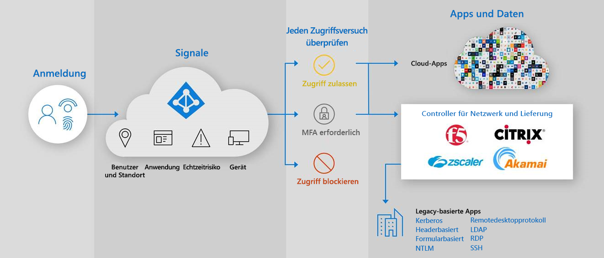

# Sicherer Hybridzugriff: Schützen von Legacy-Apps mit App-Bereitstellungscontrollern und -netzwerken

Sie können jetzt Ihre lokalen und cloudbasierten Legacy-Authentifizierungsanwendungen schützen, indem Sie sie über vorhandene Anwendungsbereitstellungscontroller oder Netzwerke mit Azure AD verbinden. Auf diese Weise können Sie die Lücke überbrücken und Ihren Sicherheitsstatus über alle Anwendungen hinweg erhöhen, indem Sie Azure AD-Funktionen wie „Bedingter Zugriff auf Azure AD“ und Azure Active Directory Identity Protection verwenden.

Mithilfe Ihres vorhandenen Netzwerks und Bereitstellungscontrollers können Sie auf einfache Weise Legacy-Anwendungen schützen, die für Ihre Geschäftsprozesse weiterhin wichtig sind, mit Azure AD aber bislang nicht geschützt werden konnten. Wahrscheinlich erfüllen Sie bereits alle Voraussetzungen, um diese Anwendungen ab sofort zu schützen.

Die folgenden Hersteller bieten vorgefertigte Lösungen und eine ausführliche Anleitung für die Integration mit Azure AD.

* [Akamai Enterprise Application Access (EAA)](../saas-apps/akamai-tutorial.md)
* [Citrix Application Delivery Controller (ADC)](../saas-apps/citrix-netscaler-tutorial.md)
* [F5 Big-IP APM](https://aka.ms/f5-hybridaccessguide)
* [Zscaler Private Access (ZPA)](https://aka.ms/zscaler-hybridaccessguide)
