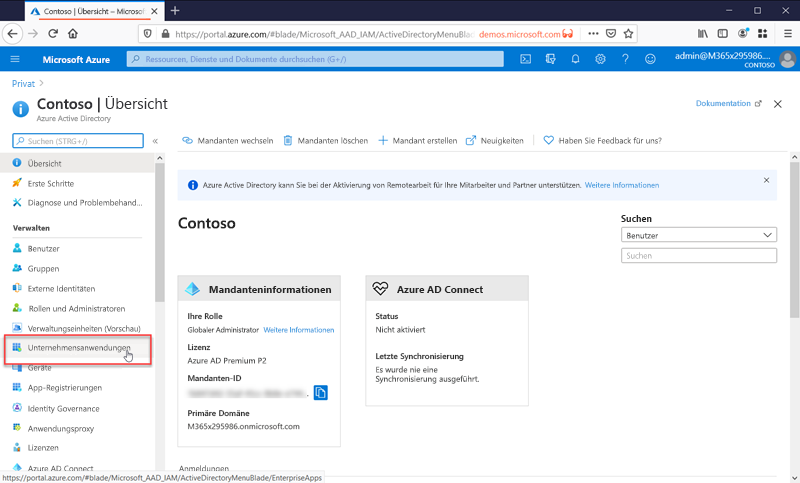

# Worum handelt es sich bei der Anwendungsverwaltung?

Azure AD ist ein Identitäts- und Zugriffsverwaltungsystem (Identity and Access Management, IAM). Es stellt einen zentralen Ort zum Speichern von Informationen zu digitalen Identitäten bereit. Sie können Ihre Softwareanwendungen so konfigurieren, dass sie Azure AD als Speicherort für die Benutzerinformationen verwenden. 

Azure AD muss für die Integration mit einer Anwendung konfiguriert werden. Anders ausgedrückt: Azure AD muss wissen, von welchen Anwendungen es als Identitätssystem verwendet wird. Der Prozess, der als Anwendungsverwaltung bezeichnet wird, bedeutet, dass Azure AD stets über diese Anwendungen informiert ist und weiß, wie sie zu behandeln sind.

Sie verwalten die Anwendungen im Azure Active Directory-Portal unter „Verwalten“ auf dem Blatt **Unternehmensanwendungen**.

## Was ist ein Identitäts- und Zugriffsverwaltungsystem (IAM-System)?
Bei einer Anwendung handelt es sich um eine Software, die für bestimmte Zwecke verwendet wird. Bei den meisten Anwendungen müssen sich die Benutzer anmelden, damit die Anwendung für den jeweiligen Benutzer eine angepasste Umgebung bereitstellen kann. Anders ausgedrückt: Die Anwendung muss die Identität des Benutzers kennen, der die Anwendung verwendet. Dadurch weiß sie, welche Funktionen für den Benutzer bereitgestellt oder entfernt werden sollen.

Wenn jede Anwendung Benutzer separat nachverfolgte, ergäbe sich daraus ein Silo mit verschiedenen Benutzernamen und Anmeldungen für jede Anwendung. Eine Anwendung wüsste nichts über die Benutzer in anderen Anwendungen.

Ein zentrales Identitätssystem löst dieses Problem, indem es einen zentralen Ort zum Speichern von Benutzerinformationen bereitstellt, die dann von allen Anwendungen verwendet werden können. Diese Systeme werden als IAM-Systeme (Identitäts- und Zugriffsverwaltungssysteme) bezeichnet. Azure AD ist das IAM-System für die Microsoft-Cloud.

>[!TIP]
>Ein IAM-System stellt einen zentralen Ort zum Nachverfolgen der Benutzeridentitäten bereit. Azure AD ist das IAM-System für die Microsoft-Cloud.

## Gründe für die Verwaltung von Anwendungen mit einer Cloudlösung

Organisationen besitzen häufig Hunderte von Anwendungen, die für die Arbeit ihrer Benutzer unerlässlich sind. Der Benutzerzugriff auf diese Anwendungen erfolgt über eine Vielzahl von Geräten und Standorten. Tagtäglich werden neue Anwendungen hinzugefügt und entwickelt. Angesichts dieser Vielzahl an Anwendungen und Zugriffspunkte gewinnt die Verwaltung des Benutzerzugriffs auf alle Anwendungen über eine cloudbasierte Lösung zunehmend an Bedeutung.

>[!TIP]
>Der App-Katalog von Azure AD enthält viele beliebte Anwendungen, die bereits für die Verwendung mit Azure AD als Identitätsanbieter vorkonfiguriert sind.

## Wie funktioniert Azure AD mit Anwendungen?

Azure AD vereinfacht die Verwaltung von Anwendungen, indem es ein einziges Identitätssystem für Ihre cloudbasierten und lokalen Apps bereitstellt. Sie können Azure AD Ihre SaaS-Anwendungen (Software-as-a-Service), lokalen Anwendungen und branchenspezifischen Apps hinzufügen. Die Benutzer melden sich einmal an, um sicher und nahtlos auf diese Anwendungen sowie auf Office 365 und andere Geschäftsanwendungen von Microsoft zuzugreifen. Durch die [Automatisierung der Benutzerbereitstellung](../app-provisioning/user-provisioning.md) können Sie die Verwaltungskosten senken. Sie können die mehrstufige Authentifizierung und Richtlinien für bedingten Zugriff verwenden, um sicheren Zugriff auf Anwendungen zu ermöglichen.

## Welche Typen von Anwendungen kann ich in Azure AD integrieren?

Es gibt vier Haupttypen von Anwendungen, die Sie Ihren **Unternehmensanwendungen** hinzufügen und mit Azure AD verwalten können:

- **Azure AD-Kataloganwendungen**: Azure AD bietet einen Katalog mit Tausenden von Anwendungen, die für einmaliges Anmelden mit Azure AD vorab integriert wurden. Einige der von Ihrer Organisation verwendeten Anwendungen sind wahrscheinlich im Katalog enthalten. [Erfahren Sie mehr über das Planen der App-Integration](plan-an-application-integration.md), oder informieren Sie sich in den [Tutorials für SaaS-Anwendungen](https://docs.microsoft.com/azure/active-directory/saas-apps/) über die detaillierten Schritte für einzelne Apps.

- **Lokale Anwendungen mit dem Anwendungsproxy**: Mit dem Azure AD-Anwendungsproxy können Sie lokale Web-Apps in Azure AD integrieren, um einmaliges Anmelden zu unterstützen. Endbenutzer können dann auf die gleiche Weise auf die lokalen Web-Apps zugreifen, wie sie auch auf Office 365 und andere SaaS-Apps zugreifen. Lesen Sie hierzu auch [Bereitstellen des Remotezugriffs auf lokale Anwendungen über den Azure AD-Anwendungsproxy](application-proxy.md).

- **Benutzerdefinierte Anwendungen**: Wenn Sie eigene branchenspezifische Anwendungen erstellen, können Sie sie in Azure AD integrieren, um einmaliges Anmelden zu unterstützen. Durch das Integrieren der Anwendung in Azure AD haben Sie die Kontrolle über die für die Anwendung festgelegte Authentifizierungsrichtlinie. Weitere Informationen finden Sie in der [Anleitung für Entwickler](developer-guidance-for-integrating-applications.md).

- **Nicht im Katalog vorhandene Anwendungen**: Nutzen Sie Ihre eigenen Anwendungen (BYOD, Bring Your Own Applications). Unterstützen Sie einmaliges Anmelden für andere Apps, indem Sie sie Azure AD hinzufügen. Es gibt mehrere Möglichkeiten, eine Anwendung zu integrieren. Einige sind nachstehend aufgeführt. Weitere Informationen finden Sie unter [Konfigurieren des einmaligen Anmeldens mit SAML](configure-saml-single-sign-on.md).

>[!TIP]
>Sie können Azure AD auch dann in eine Anwendung integrieren, wenn sie nicht bereits vorkonfiguriert ist und sich nicht im App-Katalog befindet. Sie können **Azure AD mit folgenden Anwendungen integrieren**
> - Beliebiger Weblink (oder Anwendung), der ein **Feld mit Benutzername und Kennwort** rendert
> - Beliebige Anwendung, die **SAML- oder OpenID Connect-Protokolle** unterstützt
> - Beliebige Anwendung, die den **SCIM-Standard (System for Cross-domain Identity Management)** unterstützt

## Risikomanagement durch Richtlinien für bedingten Zugriff

In Kombination mit einmaligem Anmelden (Single Sign-On, SSO) mit Azure AD bietet [bedingter Zugriff](../conditional-access/concept-conditional-access-cloud-apps.md) ein hohes Maß an Sicherheit für den Zugriff auf Anwendungen. Zu den Sicherheitsfunktionen zählen der cloudgestützte Identitätsschutz, die risikobasierte Zugriffssteuerung, die native mehrstufige Authentifizierung und Richtlinien für bedingten Zugriff. Durch diese Funktionen können präzise Steuerungsrichtlinien basierend auf Anwendungen oder Gruppen geschaffen werden, die ein höheres Maß an Sicherheit erfordern.

## Produktivitätssteigerung durch einmaliges Anmelden

Die Aktivierung des einmaligen Anmeldens (Single Sign-On, SSO) für verschiedenste Anwendungen und in Office 365 bietet eine optimierte Anmeldung für bestehende Benutzer, da hierdurch die Anzahl von Anmeldeeingabeaufforderungen reduziert wird oder diese gänzlich beseitigt werden. Ohne die Vielzahl an Eingabeaufforderungen oder die Verwaltung mehrerer Kennwörter wirkt die Umgebung des Benutzers ganzheitlicher und weniger verwirrend. Die Unternehmensgruppe kann Zugriffe über Self-Service-Funktionen und dynamische Mitgliedschaften verwalten und genehmigen. Indem Sie den richtigen Personen im Unternehmen die Verwaltung des Zugriffs auf eine Anwendung ermöglichen, erhöhen Sie die Sicherheit des Identitätssystems.

SSO erhöht die Sicherheit. *Ohne einmaliges Anmelden* müssen Administratoren Benutzerkonten für jede einzelne Anwendung erstellen und aktualisieren, was viel Zeit in Anspruch nimmt. Darüber hinaus müssen Benutzer mehrere Sätze von Anmeldeinformationen für den Zugriff auf ihre Anwendungen nachverfolgen. Die Folge: Benutzer neigen dazu, ihre Kennwörter aufzuschreiben oder andere Lösungen zur Kennwortverwaltung zu verwenden, was zu Risiken für die Datensicherheit führt. [Weitere Informationen zu einmaligem Anmelden](what-is-single-sign-on.md).

## Beheben von Governance- und Complianceproblemen

Mit Azure AD können Sie Anmeldungen bei Anwendungen durch Berichte überwachen, die SIEM-Tools (Security Information & Event Monitoring) nutzen. Sie können über das Portal oder über APIs auf die Berichte zugreifen. Lassen Sie programmgesteuert überwachen, wer auf Ihre Anwendungen zugreifen darf, und entfernen Sie den Zugriff für inaktive Benutzer durch Zugriffsüberprüfungen.

## Verwalten von Kosten

Durch eine Migration zu Azure AD können Sie Ihre Kosten senken und sich den Aufwand der Verwaltung Ihrer lokalen Infrastruktur ersparen. Azure AD bietet außerdem Self-Service-Zugriff auf Anwendungen, was sowohl Administratoren als auch Benutzern Zeit erspart. Einmaliges Anmelden macht anwendungsspezifische Kennwörter überflüssig. Diese Option für die einmalige Anmeldung spart Kosten für das Zurücksetzen von Kennwörtern für Anwendungen und vermeidet Produktivitätsverluste durch das Abrufen von Kennwörtern.

Bei Anwendungen mit Schwerpunkt Personalwesen oder anderen Anwendungen mit einer großen Zahl von Benutzern können Sie die App-Bereitstellung nutzen, um den Prozess zum Bereitstellen (und Aufheben der Bereitstellung) von Benutzern zu automatisieren. Lesen Sie hierzu auch [Was ist die Anwendungsbereitstellung?](../app-provisioning/user-provisioning.md).

## Nächste Schritte

- [Schnellstartserie zur App-Verwaltung in Azure AD](view-applications-portal.md)
- [Erste Schritte mit der Anwendungsintegration](plan-an-application-integration.md)
- [Automatisieren der Benutzerbereitstellung](../app-provisioning/user-provisioning.md)
