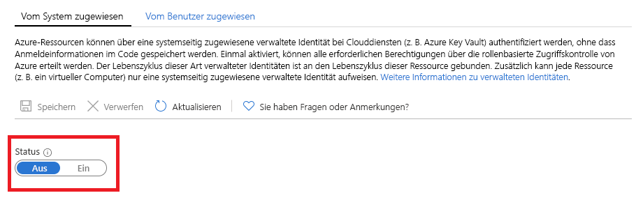

# Was sind verwaltete Identitäten für Azure-Ressourcen?

[!INCLUDE [preview-notice](../../../includes/active-directory-msi-preview-notice.md)]

Als Cloudentwickler suchen Sie wahrscheinlich die einfachste und sicherste Methode für den Zugriff auf Azure-Ressourcen in Ihrem Code. 

Die verwalteten Identitäten für Azure-Ressourcen können Ihnen bei dieser Anforderung helfen, weil verwaltete Identitäten folgende Aufgaben erledigen:

- Dafür sorgen, dass Anmeldeinformationen in Ihrem Code **nicht erforderlich** sind.
- Automatisches **Rotieren** von Anmeldeinformationen.
- **Reduzieren** Ihrer Beteiligung an der Identitätsverwaltung auf ein Minimum.

## Funktionsweise 

Alle Azure-Ressourcen, die verwaltete Identitäten unterstützen, können Token zum Datenaustausch abrufen, ohne dass der Code Anmeldeinformationen enthält. Der Vorgang besteht aus folgenden Schritten:

 
1.  **Aktivieren** – Erstellen Sie die verwaltete Identität für die Ressource.
2.  **Gewähren des Zugriffs** – Erlauben Sie den Zugriff auf Ressourcen mit Azure RBAC (Runbookautomatisierung).
3.  **Zugriff** – Führen Sie die zulässigen Aktionen aus.
4.  **Deaktivieren** – Löschen Sie die verwaltete Identität. 

## Arten von verwalteten Identitäten

Es gibt zwei Arten von verwalteten Identitäten:

- Systemseitig zugewiesene verwaltete Identität

- Benutzerseitig zugewiesene verwaltete Identität

Bei eigenständigen Azure-Ressourcen können Sie **vom System zugewiesene** verwaltete Identitäten aktivieren. Vom System zugewiesene verwaltete Identitäten bieten die bequemste Unterstützung aus Sicht der Identitätsverwaltung. Mit nur einem Mausklick können Sie die automatisierte Lebenszyklusverwaltung einer Identität für Ihre Ressource aktivieren.   

   

Obwohl vom System zugewiesene verwaltete Identitäten die bequemste Lösung für eigenständige Ressourcen bieten, sehen die Dinge anders aus, wenn Sie für dieselbe Aufgabe eine Gruppe von Azure-Ressourcen verwalten müssen. In diesem Szenario ist es besser, eine Identität manuell zu erstellen und diese Masteridentität allen Azure-Ressourcen zuzuweisen, die Sie gruppieren müssen. Diese Zuweisung wird als „**vom Benutzer zugewiesene**“ verwaltete Identität bezeichnet. 
  

## Unterstützte Dienste

Sie können verwaltete Identitäten für Azure-Ressourcen zur Authentifizierung bei Diensten verwenden, die die Azure AD-Authentifizierung unterstützen. Eine Liste der Azure-Dienste, die die Funktion für verwaltete Identitäten für Azure-Ressourcen unterstützen, finden Sie unter [Services that support managed identities for Azure resources](services-support-msi.md) (Dienste, die verwaltete Identitäten für Azure-Ressourcen unterstützen).

## Nächste Schritte

Informationen zu den ersten Schritten mit der Funktion für verwaltete Identitäten für Azure-Ressourcen finden Sie in den folgenden Schnellstartanleitungen:

* [Use a Windows VM system-assigned managed identity to access Resource Manager](tutorial-windows-vm-access-arm.md) (Verwenden der systemseitig zugewiesenen verwalteten Identität einer Windows-VM für den Zugriff auf Resource Manager)
* [Use a Linux VM system-assigned managed identity to access Resource Manager](tutorial-linux-vm-access-arm.md) (Verwenden der systemseitig zugewiesenen verwalteten Identität einer Linux-VM für den Zugriff auf Resource Manager)
