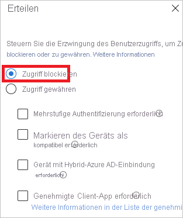
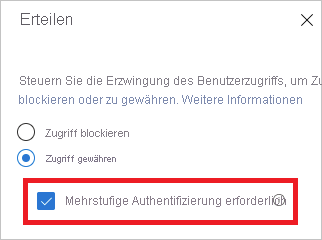

# Was ist die Anmeldediagnose für Azure AD?

Azure AD (Azure Active Directory) stellt ein flexibles Sicherheitsmodell bereit, mit dem Sie den Zugang der Benutzer zu verwalteten Ressourcen und den Berechtigungsumfang steuern können. Für den Zugriff auf diese Ressourcen wird nicht nur überprüft, um *wen* es sich handelt, sondern auch, *wie* der Zugriff erfolgt. Normalerweise weist ein flexibles Modell gleichzeitig eine gewisse Komplexität auf, weil die Anzahl von verfügbaren Konfigurationsoptionen relativ hoch ist. Und Komplexität bringt ihrerseits ein höheres Fehlerrisiko mit sich.

Als IT-Administrator benötigen Sie eine Lösung, mit der Sie Einblicke in die Aktivitäten Ihres Systems erhalten können. Dank dieser Einblicke können Sie Probleme, die ggf. auftreten, diagnostizieren und beheben. Die Anmeldediagnose für Azure AD ist ein Beispiel für eine Lösung dieser Art. Mit der Diagnose können Sie analysieren, was bei einem Anmeldeversuch passiert ist, und Empfehlungen zur Behebung von Problemen erhalten, ohne den Microsoft-Support einzubeziehen.

In diesem Artikel erhalten Sie einen Überblick über die Funktionsweise der Lösung und deren Verwendung.

## Anforderungen

Die Anmeldediagnose ist in allen Editionen von Azure AD verfügbar.

Um sie verwenden zu können, müssen Sie ein globaler Administrator Ihres Azure AD-Mandanten sein.

## Funktionsweise

In Azure AD hängt die Reaktion auf einen Anmeldeversuch davon ab, *wer* sich anmeldet und *wie* der Zugriff auf den Mandanten erfolgt. Ein Administrator kann normalerweise alle Aspekte des Mandanten konfigurieren, wenn er sich über das Unternehmensnetzwerk anmeldet. Derselbe Benutzer wird unter Umständen aber blockiert, wenn er sich mit demselben Konto über ein nicht vertrauenswürdiges Netzwerk anmeldet.

Aufgrund der größeren Flexibilität des Systems, auf einen Anmeldeversuch zu reagieren, kann es zu Szenarien kommen, in denen Sie eine Problembehandlung für Anmeldungen durchführen müssen. Die Anmeldediagnose hat folgende Funktionen:

- Analysieren der Daten von Anmeldeereignissen

- Anzeigen der erfolgten Vorgänge

- Bereitstellen von Empfehlungen zum Beheben von Problemen

Die Anmeldediagnose für Azure AD wurde für die Selbstdiagnose von Anmeldefehlern entwickelt. Zum Ausführen des Diagnosevorgangs müssen Sie folgende Schritte ausführen:

1. Definieren des Bereichs der in Frage kommenden Anmeldeereignisse

2. Auswählen der zu überprüfenden Anmeldung

3. Überprüfen der Diagnoseergebnisse

4. Ergreifen von Maßnahmen

### Definieren des Bereichs

Ziel dieses Schritts ist es, den Bereich mit den Anmeldeereignissen zu definieren, die Sie untersuchen möchten. Der Bereich basiert entweder auf einem Benutzer oder einem Bezeichner (correlationId, requestId) und einem Zeitbereich. Wenn Sie den Bereich weiter eingrenzen möchten, können Sie einen App-Namen angeben. Azure AD verwendet die Bereichsinformationen, um die richtigen Ereignisse für Sie zu finden.  

### Auswählen der Anmeldung  

Anhand Ihrer Suchkriterien ruft Azure AD alle übereinstimmenden Anmeldeereignisse ab und zeigt sie in Listenform in einer Authentifizierungsübersicht an.

Sie können die in dieser Ansicht angezeigten Spalten anpassen.

### Überprüfen der Diagnose

Für das ausgewählte Anmeldeereignis stellt Azure AD Diagnoseergebnisse bereit.

Diese Ergebnisse beginnen mit einer Bewertung, in der mit wenigen Sätzen beschrieben wird, was passiert ist. Die Erläuterung hilft Ihnen, das Verhalten des Systems zu verstehen.

Als Nächstes erhalten Sie eine Übersicht über die entsprechenden Richtlinien für bedingten Zugriff, die auf das ausgewählte Anmeldeereignis angewendet wurden. Die Diagnoseergebnisse enthalten auch die empfohlenen Schritte, mit denen Sie Ihr Problem beheben können. Da es nicht immer möglich ist, Probleme ohne weitere Hilfe zu beheben, empfiehlt es sich, in einem weiteren Schritt ein Supportticket zu öffnen.

### Ausführen einer Aktion

An diesem Punkt sollten Sie über die Informationen verfügen, die Sie zum Beheben Ihres Problems benötigen.

## Szenarien

Die Anmeldediagnose deckt die folgenden Szenarien ab:

- Blockiert durch bedingten Zugriff

- Fehlerhafte Anmeldung durch bedingten Zugriff

- Mehrstufige Authentifizierung (Multi-Factor Authentication, MFA) bei bedingtem Zugriff

- Mehrstufige Authentifizierung (MFA) aufgrund sonstiger Anforderungen erforderlich

- MFA-Nachweis erforderlich

- MFA-Nachweis erforderlich (als Risikoanmeldung eingestufter Standort)

- Erfolgreiche Anmeldung

### Blockiert durch bedingten Zugriff

In diesem Szenario wurde ein Anmeldeversuch durch eine Richtlinie für bedingten Zugriff blockiert.

Der Diagnoseabschnitt für dieses Szenario enthält Einzelheiten zum Benutzeranmeldeereignis und zu den angewendeten Richtlinien.

### Fehler beim bedingten Zugriff

Dieses Szenario ist in der Regel auf einen Anmeldeversuch zurückzuführen, bei dem ein Fehler aufgetreten ist, da die Anforderungen einer Richtlinie für bedingten Zugriff nicht erfüllt wurden. Typische Beispiele:

- Gerät mit Hybrid-Azure AD-Einbindung erforderlich

- Genehmigte Client-App erforderlich

- App-Schutzrichtlinie erforderlich

Der Diagnoseabschnitt für dieses Szenario enthält Einzelheiten zum Anmeldeversuch des Benutzers und zu den angewendeten Richtlinien.

### Mehrstufige Authentifizierung (MFA) für bedingten Zugriff erforderlich

In diesem Szenario verfügt eine Richtlinie für bedingten Zugriff über die Anforderung zum Anmelden per mehrstufiger Authentifizierung.

Der Diagnoseabschnitt für dieses Szenario enthält Einzelheiten zum Anmeldeversuch des Benutzers und zu den angewendeten Richtlinien.

### Mehrstufige Authentifizierung (MFA) aufgrund sonstiger Anforderungen erforderlich

In diesem Szenario wurde keine Anforderung zur Verwendung der mehrstufigen Authentifizierung von einer Richtlinie für bedingten Zugriff erzwungen. Ein Beispiel hierfür ist die mehrstufige Authentifizierung pro Benutzer.

Dieses Diagnoseszenario soll weitere Einzelheiten zu folgenden Informationen bereitstellen:

- Quelle der MFA-Unterbrechung
- Ergebnis der Clientinteraktion

Sie können auch alle Details des Anmeldeversuchs eines Benutzers anzeigen.

### MFA-Nachweis erforderlich

In diesem Szenario wurden Anmeldeversuche durch Anforderungen zum Einrichten der mehrstufigen Authentifizierung unterbrochen. Diese Einrichtung wird auch als „Nachweis“ (Englisch: Proof Up) bezeichnet.

„MFA-Nachweis erforderlich“ tritt auf, wenn ein Benutzer die mehrstufige Authentifizierung verwenden muss, sie aber noch nicht konfiguriert hat, oder wenn ein Administrator das Konfigurieren der mehrstufigen Authentifizierung für den Benutzer obligatorisch gemacht hat.

Bei diesem Diagnoseszenario soll gezeigt werden, dass der Grund für die Unterbrechung der mehrstufigen Authentifizierung die fehlende Benutzerkonfiguration war. Als Lösung wird empfohlen, dass der Benutzer den Nachweisvorgang durchführen soll.

### MFA-Nachweis erforderlich (als Risikoanmeldung eingestufter Standort)

In diesem Szenario wurden Anmeldeversuche durch eine Anforderung zum Einrichten der mehrstufigen Authentifizierung an einem riskanten Anmeldestandort unterbrochen.

Bei diesem Diagnoseszenario soll gezeigt werden, dass der Grund für die Unterbrechung der mehrstufigen Authentifizierung die fehlende Benutzerkonfiguration war. Als Lösung wird empfohlen, dass der Benutzer den Nachweisvorgang durchführen soll, und zwar von einem Netzwerkstandort aus, der nicht als riskant eingestuft wird.

Wenn beispielsweise ein Unternehmensnetzwerk als benannter Standort definiert ist, sollte der Benutzer versuchen, den Nachweisvorgang stattdessen aus dem Unternehmensnetzwerk durchzuführen.

### Erfolgreiche Anmeldung

In diesem Szenario wurden Anmeldeereignisse nicht durch den bedingten Zugriff oder die mehrstufige Authentifizierung unterbrochen.

In diesem Diagnoseszenario werden Details zu Benutzeranmeldeereignissen bereitgestellt, für die erwartet wird, dass sie aufgrund von Richtlinien für bedingten Zugriff oder die mehrstufige Authentifizierung unterbrochen werden.

## Nächste Schritte

- [Was sind Azure Active Directory-Berichte?](overview-reports.md)
- [Was ist die Azure Active Directory-Überwachung?](overview-monitoring.md)
