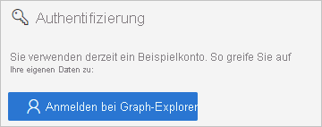
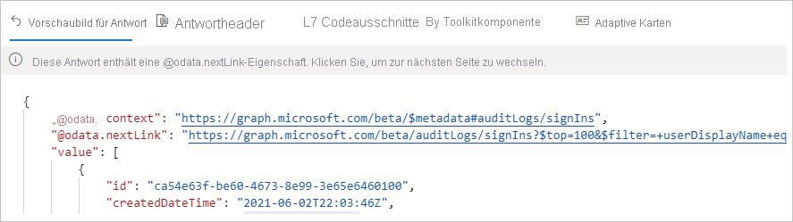

# Schnellstart: Zugreifen auf Azure AD-Protokolle mit der Microsoft Graph-API 

Mit den Informationen im Azure AD-Anmeldeprotokoll können Sie ermitteln, warum bei einer Anmeldung eines Benutzers ein Fehler aufgetreten ist. In dieser Schnellstartanleitung wird beschrieben, wie Sie mithilfe der Graph-API auf das Anmeldeprotokoll zugreifen können.

## Voraussetzungen

Für die Durchführung des Szenarios im Rahmen dieses Schnellstarts benötigen Sie Folgendes:

- **Zugriff auf einen Azure AD-Mandanten**: Wenn Sie keinen Zugriff auf einen Azure AD-Mandanten besitzen, können Sie hier ein [kostenloses Azure-Konto erstellen](https://azure.microsoft.com/free/?WT.mc_id=A261C142F). 
- **Ein Testkonto unter dem Namen Isabella Simonsen**: Wenn Sie nicht wissen, wie Sie ein Testkonto erstellen, lesen Sie [Hinzufügen von cloudbasierten Benutzern](../fundamentals/add-users-azure-active-directory.md#add-a-new-user).

## Ausführen einer fehlerhaften Anmeldung

Das Ziel dieses Schritts besteht darin, im Azure AD-Anmeldeprotokoll einen Eintrag über eine fehlgeschlagene Anmeldung zu erstellen.

**Führen Sie hierzu folgende Schritte aus:**

1. Melden Sie sich im [Azure-Portal](https://portal.azure.com/) als Isabella Simonsen mit einem falschen Kennwort an.

2. Warten Sie fünf Minuten, um sicherzustellen, dass der Eintrag über die Anmeldung im Anmeldeprotokoll angezeigt wird. Weitere Informationen finden Sie unter [Aktivitätsberichte](reference-reports-latencies.md#activity-reports).

## Suchen der fehlgeschlagenen Anmeldung

Dieser Abschnitt enthält die Schritte zum Abrufen von Informationen zu Ihrer Anmeldung mithilfe der Graph-API.

    

**Führen Sie folgende Schritte aus, um die fehlgeschlagene Anmeldung zu überprüfen:**

1. Navigieren Sie zum [Microsoft Graph-Tester](https://developer.microsoft.com/en-us/graph/graph-explorer).

2. Melden Sie sich bei Ihrem Mandanten als globaler Administrator an.

       

3. Wählen Sie in der **Dropdownliste „HTTP-Verb“** die Option **GET** aus.

4. Wählen Sie in der **Dropdownliste „API-Version“** die Option **beta** aus.

5. Geben Sie in der **Adressleiste der Anforderungsabfrage** Folgendes ein: `https://graph.microsoft.com/beta/auditLogs/signIns?$top=100&$filter=userDisplayName eq 'Isabella Simonsen'`.
 
6. Klicken Sie auf **Abfrage ausführen**.

Überprüfen Sie das Ergebnis Ihrer Abfrage.

    

## Bereinigen von Ressourcen

Wenn Sie den Testbenutzer nicht mehr benötigen, löschen Sie ihn. Wenn Sie nicht wissen, wie ein Azure AD-Benutzer gelöscht wird, lesen Sie [Löschen von Benutzern aus Azure AD](../fundamentals/add-users-azure-active-directory.md#delete-a-user).

## Nächste Schritte

> [!div class="nextstepaction"]
> [Was sind Azure Active Directory-Berichte?](overview-reports.md)
