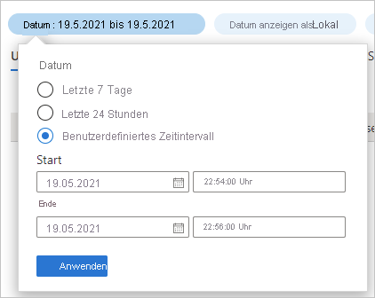
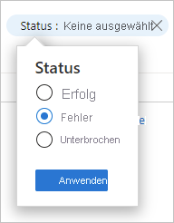

# Schnellstart: Analysieren von Anmeldungen mit dem Azure AD-Anmeldeprotokoll 

Mit den Informationen im Azure AD-Anmeldeprotokoll können Sie herausfinden, was passiert ist, wenn bei einer Anmeldung eines Benutzers ein Fehler aufgetreten ist. In diesem Schnellstart erfahren Sie, wie Sie fehlerhafte Anmeldungen mithilfe des Anmeldeprotokolls ermitteln können.

## Voraussetzungen

Für die Durchführung des Szenarios im Rahmen dieses Schnellstarts benötigen Sie Folgendes:

- **Zugriff auf einen Azure AD-Mandanten**: Wenn Sie keinen Zugriff auf einen Azure AD-Mandanten besitzen, lesen Sie [Erstellen Sie noch heute Ihr kostenloses Azure-Konto](https://azure.microsoft.com/free/?WT.mc_id=A261C142F). 
- **Ein Testkonto unter dem Namen Isabella Simonsen**: Wenn Sie nicht wissen, wie Sie ein Testkonto erstellen, lesen Sie [Hinzufügen von cloudbasierten Benutzern](../fundamentals/add-users-azure-active-directory.md#add-a-new-user).

## Ausführen einer fehlerhaften Anmeldung

Das Ziel dieses Schritts besteht im Erstellen eines Datensatzes für eine fehlgeschlagene Anmeldung im Azure AD-Anmeldeprotokoll.

**So führen Sie diesen Schritt aus:**

1. Melden Sie sich am [Azure-Portal](https://portal.azure.com/) als Isabella Simonsen mit einem falschen Kennwort an.

2. Warten Sie 5 Minuten, um sicherzustellen, dass Sie einen Datensatz für die Anmeldung im Anmeldeprotokoll finden können. Weitere Informationen finden Sie unter [Aktivitätsberichte](reference-reports-latencies.md#activity-reports).

## Suchen nach der fehlgeschlagenen Anmeldung

In diesem Abschnitt werden die Schritte zum Analysieren einer fehlgeschlagenen Anmeldung beschrieben:

- **Filtern von Anmeldungen**: Entfernen Sie alle Datensätze, die für Ihre Analyse nicht relevant sind. Legen Sie beispielsweise einen Filter fest, um nur die Datensätze eines bestimmten Benutzers anzuzeigen.
- **Suchen nach zusätzlichen Fehlerinformationen**: Zusätzlich zu den Informationen, die Sie im Anmeldeprotokoll finden, können Sie den Fehler auch mit dem [Tool für die Suche nach Anmeldefehlern](https://login.microsoftonline.com/error) suchen. Dieses Tool enthält möglicherweise zusätzliche Informationen zu einem Anmeldefehler. 

**So überprüfen Sie die fehlgeschlagene Anmeldung:**

1. Navigieren Sie zum [Anmeldeprotokoll](https://portal.azure.com/#blade/Microsoft_AAD_IAM/ActiveDirectoryMenuBlade/SignIns).

2. So listen Sie nur Datensätze für Isabella Simonsen auf:

    a. Klicken Sie auf der Symbolleiste auf **Filter hinzufügen**.
    
       

    b. Wählen Sie in der Liste **Feld auswählen** die Option **Benutzer** aus, und klicken Sie dann auf **Übernehmen**.

    c. Geben Sie im Textfeld **Benutzername** den Namen **Isabella Simonsen** ein,und klicken Sie dann auf **Übernehmen**.

    d. Klicken Sie auf der Symbolleiste auf **Aktualisieren**.

3. Klicken Sie zum Analysieren des Problems auf **Problembehandlung und Support**.

       

4. Kopieren Sie **den Anmeldefehlercode**.

       

5. Fügen Sie den Fehlercode in das Textfeld des [Anmeldetools für die Fehlersuche](https://login.microsoftonline.com/error) ein, und klicken Sie dann auf **Übermitteln**.

Überprüfen Sie das Ergebnis des Tools, und ermitteln Sie, ob es zusätzliche Informationen bereitstellt.

## Zusätzliche Tests

Da Sie nun wissen, wie Sie einen Eintrag im Anmeldeprotokoll anhand des Namens finden, sollten Sie auch versuchen, den Datensatz mithilfe der folgenden Filter zu finden:

- **Datum**: Versuchen Sie, mithilfe eines **Start**- und eines **Endwerts** nach Isabella zu suchen.

    

- **Status**: Versuchen Sie, nach Isabella zu suchen, indem Sie **Status: Fehler** verwenden.

    

## Bereinigen von Ressourcen

Wenn Sie den Testbenutzer nicht mehr benötigen, löschen Sie ihn. Wenn Sie nicht wissen, wie ein Azure AD-Benutzer gelöscht wird, lesen Sie [Löschen von Benutzern aus Azure AD](../fundamentals/add-users-azure-active-directory.md#delete-a-user).

## Nächste Schritte

> [!div class="nextstepaction"]
> [Was sind Azure Active Directory-Berichte?](overview-reports.md)
