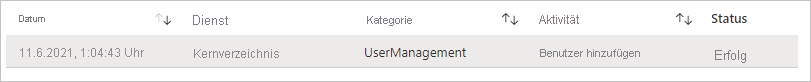
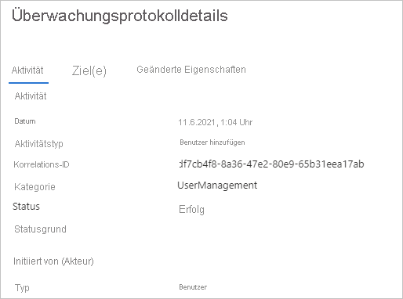

# Schnellstart: Filtern des Azure AD-Überwachungsprotokolls 

Durch die Informationen im Azure AD-Überwachungsprotokoll erhalten Sie Zugriff auf Datensätze mit Systemaktivitäten zu Compliancezwecken. In diesem Schnellstart erfahren Sie, wie Sie ein neu erstelltes Benutzerkonto in Ihrem Überwachungsprotokoll ermitteln können.

## Voraussetzungen

Für die Durchführung des Szenarios im Rahmen dieses Schnellstarts benötigen Sie Folgendes:

- **Zugriff auf einen Azure AD-Mandanten**: Wenn Sie keinen Zugriff auf einen Azure AD-Mandanten besitzen, lesen Sie [Erstellen Sie noch heute Ihr kostenloses Azure-Konto](https://azure.microsoft.com/free/?WT.mc_id=A261C142F). 
- **Ein Testkonto unter dem Namen Isabella Simonsen**: Wenn Sie nicht wissen, wie Sie ein Testkonto erstellen, lesen Sie [Hinzufügen von cloudbasierten Benutzern](../fundamentals/add-users-azure-active-directory.md#add-a-new-user).

## Ermitteln des neuen Benutzerkontos

Dieser Abschnitt enthält die Schritte, die Sie zum Filtern Ihres Überwachungsprotokolls ausführen müssen.

**So suchen Sie nach dem neuen Benutzer:**

1. Navigieren Sie zum [Überwachungsprotokoll](https://portal.azure.com/#blade/Microsoft_AAD_IAM/ActiveDirectoryMenuBlade/Audit).

2. So listen Sie nur Datensätze für Isabella Simonsen auf:

    a. Klicken Sie auf der Symbolleiste auf **Filter hinzufügen**.
    
       

    b. Wählen Sie in der Liste **Feld auswählen** die Option **Ziel** aus, und klicken Sie dann auf **Übernehmen**.

    c. Geben Sie im Textfeld **Ziel** den **Benutzerprinzipalnamen** **Isabella Simonsen** ein, und klicken Sie dann auf **Übernehmen**.

3. Klicken Sie auf das gefilterte Element.

      

4.  Überprüfen Sie die **Details des Überwachungsprotokolls**.
 
      
 
  

## Bereinigen von Ressourcen

Wenn Sie den Testbenutzer nicht mehr benötigen, löschen Sie ihn. Wenn Sie nicht wissen, wie ein Azure AD-Benutzer gelöscht wird, lesen Sie [Löschen von Benutzern aus Azure AD](../fundamentals/add-users-azure-active-directory.md#delete-a-user).

## Nächste Schritte

> [!div class="nextstepaction"]
> [Was sind Azure Active Directory-Berichte?](overview-reports.md)
