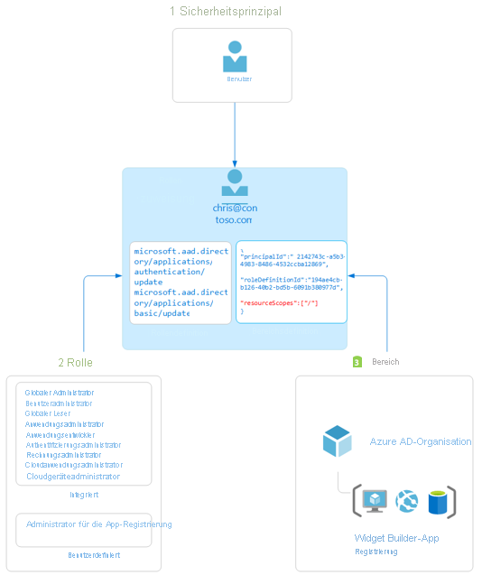

# Übersicht über die rollenbasierte Zugriffssteuerung in Azure Active Directory

In diesem Artikel werden die Grundlagen der rollenbasierten Zugriffssteuerung in Azure Active Directory (Azure AD) beschrieben. Mithilfe von Azure AD-Rollen können Sie Ihren Administratoren differenzierte Berechtigungen erteilen und so das Prinzip der geringsten Rechte implementieren. Den integrierten und benutzerdefinierten Rollen in Azure AD liegen ähnliche Konzepte zugrunde wie dem [rollenbasierten Zugriffssteuerungssystem für Azure-Ressourcen](../../role-based-access-control/overview.md) (Azure-Rollen). [Die beiden rollenbasierten Zugriffssteuerungssysteme unterscheiden sich](../../role-based-access-control/rbac-and-directory-admin-roles.md) wie folgt:

- Azure AD-Rollen dienen zum Steuern des Zugriffs auf Azure AD-Ressourcen wie Benutzer, Gruppen und Anwendungen unter Verwendung der Graph-API.
- Azure-Rollen dienen zum Steuern des Zugriffs auf Azure-Ressourcen wie virtuelle Computer oder Speicher unter Verwendung der Azure-Ressourcenverwaltung.

Beide Systeme enthalten ähnlich verwendete Rollendefinitionen und Rollenzuweisungen. Azure AD-Rollenberechtigungen können allerdings nicht in benutzerdefinierten Azure-Rollen verwendet werden (und umgekehrt).

## Grundlegendes zur rollenbasierten Zugriffssteuerung von Azure AD
Azure AD unterstützt zwei Arten von Rollendefinitionen: 
* [Integrierte Rollen](./permissions-reference.md)
* [Benutzerdefinierte Rollen](./custom-create.md)

Integrierte Rollen sind vordefinierte Rollen mit einem festen Berechtigungssatz. Diese Rollendefinitionen können nicht geändert werden. Es gibt viele [integrierte Rollen](./permissions-reference.md), die von Azure AD unterstützt werden, und die Liste wird immer länger. Zur Vervollständigung und zum Erfüllen Ihrer speziellen Anforderungen unterstützt Azure AD aber auch [benutzerdefinierte Rollen](./custom-create.md). Das Erteilen von Berechtigungen mithilfe benutzerdefinierter Azure AD-Rollen ist ein zweistufiger Prozess, bei dem eine benutzerdefinierte Rollendefinition erstellt und dann mithilfe einer Rollenzuweisung zugewiesen wird. Eine benutzerdefinierte Rollendefinition ist eine Sammlung von Berechtigungen, die Sie aus einer vordefinierten Liste hinzufügen. Bei diesen Berechtigungen handelt es sich um die gleichen Berechtigungen, die in den integrierten Rollen verwendet werden.  

Nachdem Sie Ihre benutzerdefinierte Rollendefinition erstellt (oder eine integrierte Rolle verwendet) haben, können Sie diese durch Erstellen einer Rollenzuweisung einem Benutzer zuweisen. Eine Rollenzuweisung erteilt einem Benutzer die Berechtigungen in einer Rollendefinition für einen bestimmten Bereich. Durch diesen zweistufigen Prozess können Sie eine einzelne Rollendefinition erstellen und dann für verschiedene Bereiche mehrmals zuweisen. Ein Bereich definiert die Gruppe von Azure AD-Ressourcen, auf die das Rollenmitglied Zugriff hat. Der gängigste Bereich ist der organisationsweite Bereich. Eine benutzerdefinierte Rolle kann für den organisationsweiten Bereich zugewiesen werden. Dies bedeutet, dass das Rollenmitglied über die Rollenberechtigungen für alle Ressourcen in der Organisation verfügt. Eine benutzerdefinierte Rolle kann auch für einen Objektbereich zugewiesen werden. Ein Beispiel für einen Objektbereich ist eine einzelne Anwendung. Die gleiche Rolle kann einem Benutzer für alle Anwendungen in der Organisation und dann einem anderen Benutzer nur für die App der Contoso-Spesenabrechnungen zugewiesen werden.  

Die integrierten und benutzerdefinierten Rollen in Azure AD funktionieren auf ähnliche Weise wie die [rollenbasierte Zugriffssteuerung in Azure (Azure RBAC)](../develop/access-tokens.md#payload-claims). Der [Unterschied zwischen diesen beiden rollenbasierten Zugriffssteuerungssystemen](../../role-based-access-control/rbac-and-directory-admin-roles.md) besteht darin, dass die Azure-RBAC den Zugriff auf Azure-Ressourcen wie virtuelle Computer oder Speicher mithilfe der Azure-Ressourcenverwaltung steuert und benutzerdefinierte Azure AD-Rollen den Zugriff auf Azure AD-Ressourcen mithilfe der Graph-API steuern. Beide Systeme nutzen das Konzept von Rollendefinitionen und Rollenzuweisungen. Azure AD-RBAC-Berechtigungen können nicht in Azure-Rollen eingefügt werden (und umgekehrt).

### So ermittelt Azure AD, ob ein Benutzer Zugriff auf eine Ressource hat

Im Folgenden finden Sie die allgemeinen Schritte, anhand derer Azure AD ermittelt, ob Sie Zugriff auf eine Verwaltungsressource haben. Verwenden Sie diese Informationen, um Zugriffsprobleme zu beheben.

1. Ein Benutzer (oder Dienstprinzipal) ruft ein Token für den Microsoft Graph- oder Azure AD Graph-Endpunkt ab.
1. Der Benutzer sendet mithilfe des ausgestellten Tokens über Microsoft Graph oder Azure AD Graph einen API-Aufruf an Azure Active Directory (Azure AD).
1. Abhängig von der jeweiligen Situation führt Azure AD eine der folgenden Aktionen aus:
   - Wertet die Rollenmitgliedschaften des Benutzers basierend auf dem [wids-Anspruch](../../active-directory-b2c/access-tokens.md) im Zugriffstoken des Benutzers aus.
   - Ruft alle für den Benutzer entweder direkt oder über eine Gruppenmitgliedschaft geltenden Rollenzuweisungen für die Ressource ab, für die die Aktion ausgeführt wird.
1. Azure AD ermittelt, ob die Aktion im API-Aufruf in den Rollen enthalten ist, die dem Benutzer für diese Ressource zugewiesen sind.
1. Wenn der Benutzer keine Rolle mit der Aktion als angefordertem Bereich besitzt, wird kein Zugriff gewährt. Andernfalls wird der Zugriff gewährt.

## Rollenzuweisung

Eine Rollenzuweisung ist eine Azure AD-Ressource, die einem *Benutzer* eine *Rollendefinition* in einem bestimmten *Bereich* zuordnet, um Zugriff auf Azure AD-Ressourcen zu gewähren. Der Zugriff wird durch Erstellen einer Rollenzuweisung erteilt und durch Entfernen einer Rollenzuweisung widerrufen. Eine Rollenzuweisung besteht im Kern aus drei Elementen:

- Ein Azure AD-Benutzer
- Rollendefinition
- Ressourcenumfang

Zum [Erstellen von Rollenzuweisungen](custom-create.md) können Sie das Azure-Portal, Azure AD PowerShell oder die Graph-API verwenden. Sie können auch [die Zuweisungen für eine benutzerdefinierte Rolle anzeigen](custom-view-assignments.md#view-the-assignments-of-a-role).

Das folgende Diagramm zeigt ein Beispiel für eine Rollenzuweisung. In diesem Beispiel wurde Chris Green die benutzerdefinierte Rolle „App-Registrierungsadministrator“ für den Bereich der Contoso Widget Builder-App-Registrierung zugewiesen. Diese Zuweisung erteilt Chris nur für diese spezifische App-Registrierung die Berechtigungen der Rolle „App-Registrierungsadministrator“.

### Sicherheitsprinzipal

Ein Sicherheitsprinzipal stellt den Benutzer dar, dem Zugriff auf Azure AD-Ressourcen zugewiesen werden soll. Ein Benutzer ist eine Person, die über ein Benutzerprofil in Azure Active Directory verfügt.

### Role

Eine Rollendefinition oder Rolle ist eine Sammlung von Berechtigungen. Eine Rollendefinition listet die Vorgänge auf, die für Azure AD-Ressourcen ausgeführt werden können, z. B. Lesen, Schreiben, Aktualisieren und Löschen. Azure AD umfasst zwei Arten von Rollen:

- Von Microsoft erstellte integrierte Rollen, die nicht geändert werden können.
- Von Ihrer Organisation erstellte und verwaltete benutzerdefinierte Rollen

### `Scope`

Ein Bereich ist die Beschränkung zulässiger Aktionen auf eine bestimmte Azure AD-Ressource im Rahmen einer Rollenzuweisung. Beim Zuweisen einer Rolle können Sie einen Bereich angeben, der den Zugriff des Administrators auf eine bestimmte Ressource beschränkt. Wenn Sie z. B. einem Entwickler eine benutzerdefinierte Rolle – jedoch nur zum Verwalten einer bestimmten Anwendungsregistrierung – zuweisen möchten, können Sie die entsprechende Anwendungsregistrierung als Bereich in die Rollenzuweisung einschließen.

## Erforderlicher Lizenzplan

Die Nutzung integrierter Rollen in Azure AD ist kostenlos, während für benutzerdefinierte Rollen eine Azure AD Premium P1-Lizenz erforderlich ist. Um die richtige Lizenz für Ihre Anforderungen zu ermitteln, lesen Sie [Vergleich: Allgemein verfügbare Features der Editionen Free, Basic und Premium](https://azure.microsoft.com/pricing/details/active-directory).

## Nächste Schritte

- [Grundlegendes zu Rollen in Azure Active Directory](concept-understand-roles.md)
- Erstellen von benutzerdefinierten Rollenzuweisungen über das [Azure-Portal, Azure AD PowerShell und die Graph-API](custom-create.md)
- [Anzeigen der Zuweisungen für eine benutzerdefinierte Rolle](custom-view-assignments.md)