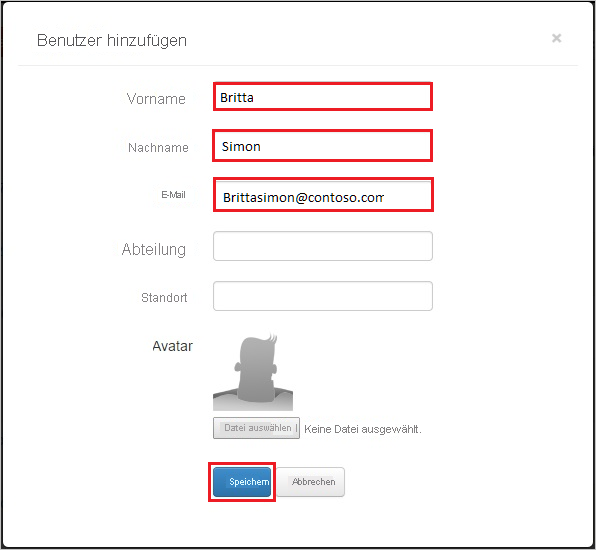

# Tutorial: Azure Active Directory-Integration mit Bonusly

In diesem Tutorial erfahren Sie, wie Sie Bonusly in Azure Active Directory (Azure AD) integrieren. Die Integration von Bonusly in Azure AD ermöglicht Folgendes:

* Steuern Sie in Azure AD, wer Zugriff auf Bonusly hat.
* Ermöglichen Sie es Ihren Benutzern, sich mit ihren Azure AD-Konten automatisch bei Bonusly anzumelden.
* Verwalten Sie Ihre Konten zentral im Azure-Portal.

## Voraussetzungen

Um die Azure AD-Integration mit Bonusly konfigurieren zu können, benötigen Sie Folgendes:

* Ein Azure AD-Abonnement Sollten Sie nicht über eine Azure AD-Umgebung verfügen, können Sie ein [kostenloses Konto](https://azure.microsoft.com/free/) verwenden.
* Bonusly-Abonnement, für das einmaliges Anmelden aktiviert ist.

## Beschreibung des Szenarios

In diesem Tutorial konfigurieren und testen Sie das einmalige Anmelden von Azure AD in einer Testumgebung.

* Bonusly unterstützt **IDP**-initiiertes einmaliges Anmelden.

> [!NOTE]
> Der Bezeichner dieser Anwendung ist ein fester Zeichenfolgenwert, daher kann in einem Mandanten nur eine Instanz konfiguriert werden.

## Hinzufügen von Bonusly aus dem Katalog

Zum Konfigurieren der Integration von Bonusly in Azure AD müssen Sie Bonusly aus dem Katalog der Liste mit den verwalteten SaaS-Apps hinzufügen.

1. Melden Sie sich mit einem Geschäfts-, Schul- oder Unikonto oder mit einem persönlichen Microsoft-Konto beim Azure-Portal an.
1. Wählen Sie im linken Navigationsbereich den Dienst **Azure Active Directory** aus.
1. Navigieren Sie zu **Unternehmensanwendungen**, und wählen Sie dann **Alle Anwendungen** aus.
1. Wählen Sie zum Hinzufügen einer neuen Anwendung **Neue Anwendung** aus.
1. Geben Sie im Abschnitt **Aus Katalog hinzufügen** den Suchbegriff **Bonusly** in das Suchfeld ein.
1. Wählen Sie im Ergebnisbereich **Bonusly** aus, und fügen Sie dann die App hinzu. Warten Sie einige Sekunden, während die App Ihrem Mandanten hinzugefügt wird.

## Konfigurieren und Testen des einmaligen Anmeldens von Azure AD für Bonusly

Konfigurieren und testen Sie das einmalige Anmelden von Azure AD mit Bonusly mithilfe eines Testbenutzers mit dem Namen **B. Simon**. Damit einmaliges Anmelden funktioniert, muss eine Linkbeziehung zwischen einem Azure AD-Benutzer und dem entsprechenden Benutzer in Bonusly eingerichtet werden.

Führen Sie zum Konfigurieren und Testen des einmaligen Anmeldens von Azure AD mit Bonusly die folgenden Schritte aus:

1. **[Konfigurieren des einmaligen Anmeldens von Azure AD](#configure-azure-ad-sso)** , um Ihren Benutzern die Verwendung dieses Features zu ermöglichen.
    1. **[Erstellen eines Azure AD-Testbenutzers](#create-an-azure-ad-test-user)** , um das einmalige Anmelden von Azure AD mit dem Testbenutzer B. Simon zu testen.
    1. **[Zuweisen des Azure AD-Testbenutzers](#assign-the-azure-ad-test-user)** , um B. Simon die Verwendung des einmaligen Anmeldens von Azure AD zu ermöglichen.
1. **[Konfigurieren des einmaligen Anmeldens für Bonusly](#configure-bonusly-sso)** , um die Einstellungen für einmaliges Anmelden auf der Anwendungsseite zu konfigurieren.
    1. **[Erstellen eines Bonusly-Testbenutzers](#create-bonusly-test-user)** , um eine Entsprechung von B.Simon in Bonusly zu erhalten, die mit ihrer Darstellung in Azure AD verknüpft ist.
1. **[Testen des einmaligen Anmeldens](#test-sso)** , um zu überprüfen, ob die Konfiguration funktioniert

## Konfigurieren des einmaligen Anmeldens (Single Sign-On, SSO) von Azure AD

Gehen Sie wie folgt vor, um das einmalige Anmelden von Azure AD im Azure-Portal zu aktivieren.

1. Navigieren Sie im Azure-Portal auf der Anwendungsintegrationsseite für **Bonusly** zum Abschnitt **Verwalten**, und wählen Sie **Einmaliges Anmelden** aus.
1. Wählen Sie auf der Seite **SSO-Methode auswählen** die Methode **SAML** aus.
1. Klicken Sie auf der Seite **Einmaliges Anmelden (SSO) mit SAML einrichten** auf das Stiftsymbol für **Grundlegende SAML-Konfiguration**, um die Einstellungen zu bearbeiten.

   

4. Führen Sie im Abschnitt **Grundlegende SAML-Konfiguration** den folgenden Schritt aus:

    Geben Sie im Textfeld **Antwort-URL** eine URL im folgenden Format ein: `https://Bonus.ly/saml/<TENANT_NAME>`.

    > [!NOTE]
    > Dieser Wert entspricht nicht dem tatsächlichen Wert. Aktualisieren Sie den Wert mit der richtigen Antwort-URL. Wenden Sie sich an das [Clientsupportteam von Bonusly](https://bonus.ly/contact), um diese Werte zu erhalten. Sie können sich auch die Muster im Abschnitt **Grundlegende SAML-Konfiguration** im Azure-Portal ansehen.

5. Klicken Sie im Abschnitt **SAML-Signaturzertifikat** auf die Schaltfläche **Bearbeiten**, um das Dialogfeld **SAML-Signaturzertifikat** zu öffnen.

    

6. Kopieren Sie im Abschnitt **SAML-Signaturzertifikat** den **FINGERABDRUCK**, und speichern Sie ihn auf Ihrem Computer.

    

7. Kopieren Sie im Abschnitt **Bonusly einrichten** die entsprechenden URLs gemäß Ihren Anforderungen.

    

### Erstellen eines Azure AD-Testbenutzers

In diesem Abschnitt erstellen Sie im Azure-Portal einen Testbenutzer mit dem Namen B. Simon.

1. Wählen Sie im linken Bereich des Microsoft Azure-Portals **Azure Active Directory** > **Benutzer** > **Alle Benutzer** aus.
1. Wählen Sie oben im Bildschirm die Option **Neuer Benutzer** aus.
1. Führen Sie unter den Eigenschaften für **Benutzer** die folgenden Schritte aus:
   1. Geben Sie im Feld **Name** die Zeichenfolge `B.Simon` ein.  
   1. Geben Sie im Feld **Benutzername** die Zeichenfolge username@companydomain.extension ein. Beispiel: `B.Simon@contoso.com`.
   1. Aktivieren Sie das Kontrollkästchen **Kennwort anzeigen**, und notieren Sie sich den Wert aus dem Feld **Kennwort**.
   1. Klicken Sie auf **Erstellen**.

### Zuweisen des Azure AD-Testbenutzers

In diesem Abschnitt ermöglichen Sie B. Simon die Verwendung des einmaligen Anmeldens von Azure, indem Sie Zugriff auf Bonusly gewähren.

1. Wählen Sie im Azure-Portal **Unternehmensanwendungen** > **Alle Anwendungen** aus.
1. Wählen Sie in der Anwendungsliste den Eintrag **Bonusly** aus.
1. Navigieren Sie auf der Übersichtsseite der App zum Abschnitt **Verwalten**, und wählen Sie **Benutzer und Gruppen** aus.
1. Wählen Sie **Benutzer hinzufügen** und anschließend im Dialogfeld **Zuweisung hinzufügen** die Option **Benutzer und Gruppen** aus.
1. Wählen Sie im Dialogfeld **Benutzer und Gruppen** in der Liste „Benutzer“ den Eintrag **B. Simon** aus, und klicken Sie dann unten auf dem Bildschirm auf die Schaltfläche **Auswählen**.
1. Wenn den Benutzern eine Rolle zugewiesen werden soll, können Sie sie im Dropdownmenü **Rolle auswählen** auswählen. Wurde für diese App keine Rolle eingerichtet, ist die Rolle „Standardzugriff“ ausgewählt.
1. Klicken Sie im Dialogfeld **Zuweisung hinzufügen** auf die Schaltfläche **Zuweisen**.

## Konfigurieren des einmaligen Anmeldens für Bonusly

1. Melden Sie sich in einem anderen Browserfenster bei Ihrem **Bonusly**-Mandanten an.

1. Klicken Sie in der Symbolleiste oben auf **Einstellungen**, und wählen Sie dann **Integrationen und Apps** aus.

    
1. Wählen Sie unter **Einmaliges Anmelden** **SAML** aus.

1. Führen Sie auf der Dialogseite **SAML** die folgenden Schritte aus:

    

    a. Fügen Sie in das Textfeld **IdP SSO Target URL** (IdP-SSO-Ziel-URL) den Wert der **Anmelde-URL** ein, den Sie aus dem Azure-Portal kopiert haben.

    b. Fügen Sie in das Textfeld **IdP Login URL** (IdP-Anmelde-URL) den Wert der **Anmelde-URL** ein, den Sie aus dem Azure-Portal kopiert haben.

    c. Fügen Sie im Textfeld **Idp Issuer** (IdP-Aussteller) den Wert für **Azure AD-Bezeichner** ein, den Sie aus dem Azure-Portal kopiert haben.
    
    d. Fügen Sie in das Textfeld **Cert Fingerprint** (Fingerabdruck des Zertifikats) den Wert für **Fingerabdruck** aus dem Azure-Portal ein.
    
    e. Klicken Sie auf **Speichern**.

### Erstellen eines Bonusly-Testbenutzers

Damit sich Azure AD-Benutzer bei Bonusly anmelden können, müssen sie in Bonusly bereitgestellt werden. Im Fall von Bonusly ist die Bereitstellung eine manuelle Aufgabe.

> [!NOTE]
> Sie können Azure AD-Benutzerkonten auch mit anderen Tools zum Erstellen von Bonusly-Benutzerkonten oder mit APIs von Bonusly bereitstellen. 

**Um die Benutzerbereitstellung zu konfigurieren, führen Sie die folgenden Schritte durch:**

1. Melden Sie sich in einem Browserfenster bei Ihrem Bonusly-Mandanten an.

1. Klicken Sie auf **Einstellungen**.

    

1. Klicken Sie auf die Registerkarte **Users and bonuses** .

    

1. Klicken Sie auf **Manage Users**.

    

1. Klicken Sie auf **Benutzer hinzufügen**.

    

1. Führen Sie im Dialogfeld **Add User** die folgenden Schritte aus:

      

    a. Geben Sie im Textfeld **Vorname** den Vornamen des Benutzers ein (z.B. **Britta**).

    b. Geben Sie im Textfeld **Nachname** den Nachnamen des Benutzers ein (z.B. **Simon**).

    c. Geben Sie im Textfeld **Email** (E-Mail-Adresse) die E-Mail-Adresse des Benutzers ein, z.B. `brittasimon@contoso.com`.

    d. Klicken Sie auf **Speichern**.

    > [!NOTE]
    > Der Besitzer des Azure AD-Kontos erhält eine E-Mail mit einem Link zur Bestätigung des Kontos, bevor es aktiv wird.  

## Testen des einmaligen Anmeldens

In diesem Abschnitt testen Sie die Azure AD-Konfiguration für einmaliges Anmelden mit den folgenden Optionen:

* Klicken Sie im Azure-Portal auf Diese Anwendung testen. Dadurch sollten Sie automatisch bei der Bonusly-Instanz angemeldet werden, für die Sie einmaliges Anmelden eingerichtet haben.

* Sie können „Meine Apps“ von Microsoft verwenden. Wenn Sie unter „Meine Apps“ auf die Kachel „Bonusly“ klicken, sollten Sie automatisch bei der Bonusly-Instanz angemeldet werden, für die Sie einmaliges Anmelden eingerichtet haben. Weitere Informationen zu „Meine Apps“ finden Sie in [dieser Einführung](../user-help/my-apps-portal-end-user-access.md).

## Nächste Schritte

Nach dem Konfigurieren von Bonusly können Sie die Sitzungssteuerung erzwingen, die in Echtzeit vor der Exfiltration und Infiltration vertraulicher Unternehmensdaten schützt. Die Sitzungssteuerung basiert auf bedingtem Zugriff. [Hier](/cloud-app-security/proxy-deployment-aad) erfahren Sie, wie Sie die Sitzungssteuerung mit Microsoft Cloud App Security erzwingen.
