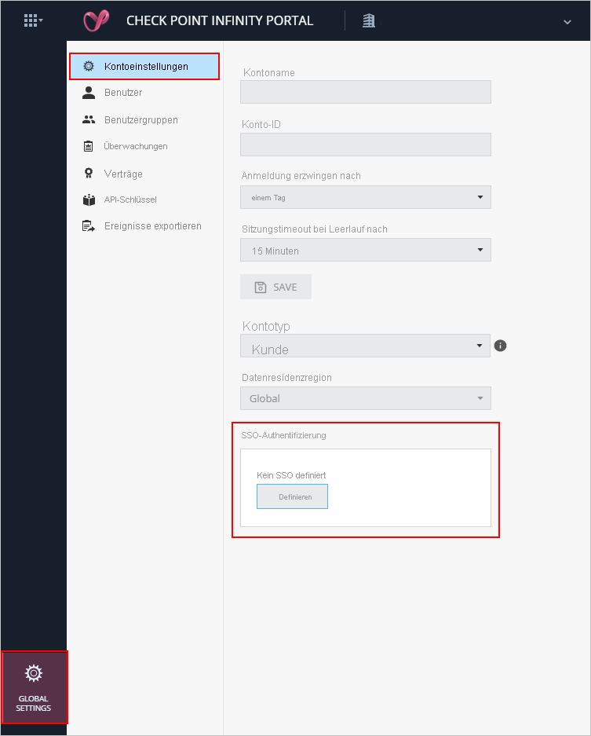
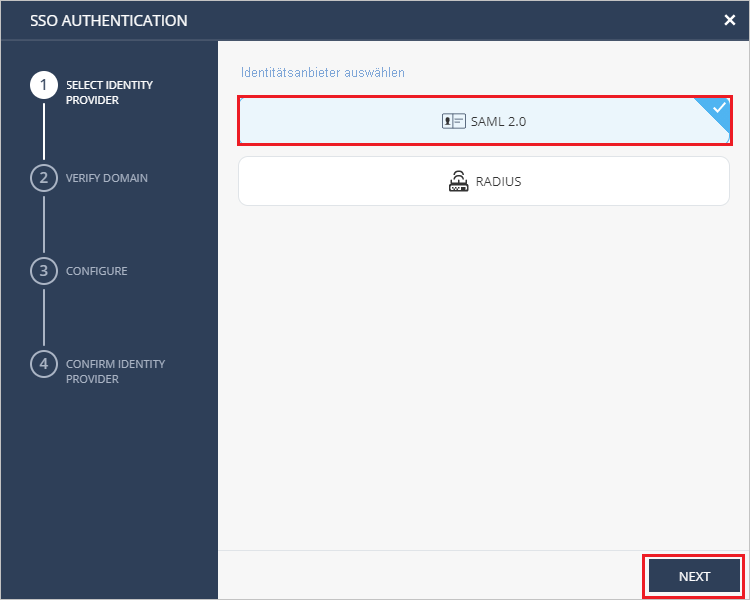
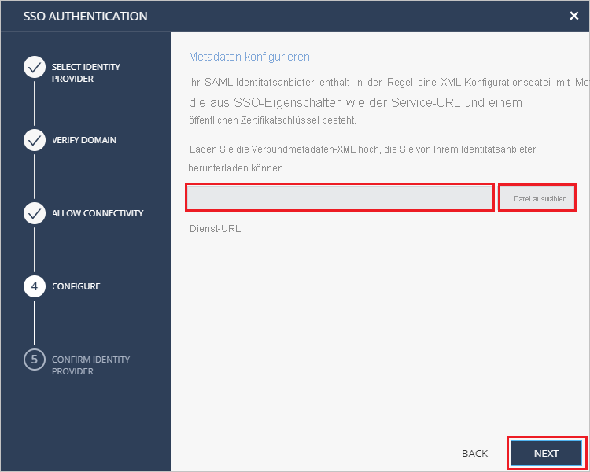
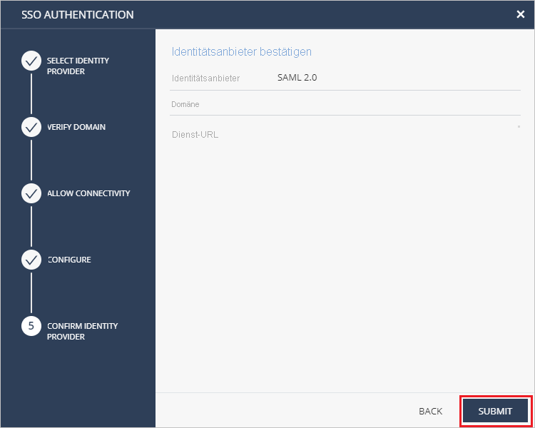

# Tutorial: Integration des einmaligen Anmeldens (Single Sign-On, SSO) von Azure Active Directory mit Check Point Infinity Portal

In diesem Tutorial erfahren Sie, wie Sie Check Point Infinity Portal in Azure Active Directory (Azure AD) integrieren. Die Integration von Check Point Infinity Portal in Azure AD ermöglicht Folgendes:

* Steuern Sie in Azure AD, wer Zugriff auf Check Point Infinity Portal hat.
* Ermöglichen Sie es Ihren Benutzern, sich mit ihren Azure AD-Konten automatisch bei Check Point Infinity Portal anzumelden.
* Verwalten Sie Ihre Konten zentral im Azure-Portal.

## Voraussetzungen

Für die ersten Schritte benötigen Sie Folgendes:

* Ein Azure AD-Abonnement Falls Sie über kein Abonnement verfügen, können Sie ein [kostenloses Azure-Konto](https://azure.microsoft.com/free/) verwenden.
* Ein Check Point Infinity Portal-Abonnement, für das einmaliges Anmelden (Single Sign-On, SSO) aktiviert ist

## Beschreibung des Szenarios

In diesem Tutorial konfigurieren und testen Sie das einmalige Anmelden von Azure AD in einer Testumgebung.

* Check Point Infinity Portal unterstützt **SP**-initiiertes einmaliges Anmelden.

* Check Point Infinity Portal unterstützt die **Just-In-Time**-Benutzerbereitstellung.

> [!NOTE]
> Der Bezeichner dieser Anwendung ist ein fester Zeichenfolgenwert, daher kann in einem Mandanten nur eine Instanz konfiguriert werden.

## Hinzufügen von Check Point Infinity Portal aus dem Katalog

Zum Konfigurieren der Integration von Check Point Infinity Portal in Azure AD müssen Sie Check Point Infinity Portal aus dem Katalog der Liste der verwalteten SaaS-Apps hinzufügen.

1. Melden Sie sich mit einem Geschäfts-, Schul- oder Unikonto oder mit einem persönlichen Microsoft-Konto beim Azure-Portal an.
1. Wählen Sie im linken Navigationsbereich den Dienst **Azure Active Directory** aus.
1. Navigieren Sie zu **Unternehmensanwendungen**, und wählen Sie dann **Alle Anwendungen** aus.
1. Wählen Sie zum Hinzufügen einer neuen Anwendung **Neue Anwendung** aus.
1. Geben Sie im Abschnitt **Aus Katalog hinzufügen** den Suchbegriff **Check Point Infinity Portal** in das Suchfeld ein.
1. Wählen Sie im Ergebnisbereich **Check Point Infinity Portal** aus, und fügen Sie dann die App hinzu. Warten Sie einige Sekunden, während die App Ihrem Mandanten hinzugefügt wird.

## Konfigurieren und Testen des einmaligen Anmeldens von Azure AD für Check Point Infinity Portal

Konfigurieren und testen Sie das einmalige Anmelden von Azure AD mit Check Point Infinity Portal mithilfe eines Testbenutzers mit dem Namen **B. Simon**. Damit einmaliges Anmelden funktioniert, muss eine Linkbeziehung zwischen einem Azure AD-Benutzer und dem entsprechenden Benutzer in Check Point Infinity Portal eingerichtet werden.

Führen Sie zum Konfigurieren und Testen des einmaligen Anmeldens von Azure AD mit Check Point Infinity Portal die folgenden Schritte aus:

1. **[Konfigurieren des einmaligen Anmeldens von Azure AD](#configure-azure-ad-sso)** , um Ihren Benutzern die Verwendung dieses Features zu ermöglichen.
    1. **[Erstellen eines Azure AD-Testbenutzers](#create-an-azure-ad-test-user)** , um das einmalige Anmelden von Azure AD mit dem Testbenutzer B. Simon zu testen.
    1. **[Zuweisen des Azure AD-Testbenutzers](#assign-the-azure-ad-test-user)** , um B. Simon die Verwendung des einmaligen Anmeldens von Azure AD zu ermöglichen.
1. **[Konfigurieren des einmaligen Anmeldens für Check Point Infinity Portal](#configure-check-point-infinity-portal-sso)** , um die Einstellungen für einmaliges Anmelden auf der Anwendungsseite zu konfigurieren
    1. **[Erstellen eines Check Point Infinity Portal-Testbenutzers](#create-check-point-infinity-portal-test-user)** , um eine Entsprechung von B. Simon in Check Point Infinity Portal zu erhalten, die mit ihrer Darstellung in Azure AD verknüpft ist
1. **[Testen des einmaligen Anmeldens](#test-sso)** , um zu überprüfen, ob die Konfiguration funktioniert

## Konfigurieren des einmaligen Anmeldens (Single Sign-On, SSO) von Azure AD

Gehen Sie wie folgt vor, um das einmalige Anmelden von Azure AD im Azure-Portal zu aktivieren.

1. Navigieren Sie im Azure-Portal auf der Anwendungsintegrationsseite für **Check Point Infinity Portal** zum Abschnitt **Verwalten**, und wählen Sie **Einmaliges Anmelden** aus.
1. Wählen Sie auf der Seite **SSO-Methode auswählen** die Methode **SAML** aus.
1. Klicken Sie auf der Seite **Einmaliges Anmelden (SSO) mit SAML einrichten** auf das Stiftsymbol für **Grundlegende SAML-Konfiguration**, um die Einstellungen zu bearbeiten.

   

1. Führen Sie im Abschnitt **Grundlegende SAML-Konfiguration** die folgenden Schritte aus:

    a. Geben Sie im Textfeld **Bezeichner** einen der folgenden Werte ein:

    | Environment | Bezeichner |
    |-------------| -------------|
    | EU/USA | `cloudinfra.checkpoint.com` |
    | AP | `ap.portal.checkpoint.com` |
    |

    b. Geben Sie im Textfeld **Antwort-URL** eine der folgenden URLs ein:

    | Environment | Antwort-URL |
    |-------------| -------------|
    | EU/USA | `https://portal.checkpoint.com/` |
    | AP | `https://ap.portal.checkpoint.com/` |
    |

    c. Geben Sie im Textfeld **Anmelde-URL** eine der folgenden URLs ein:

    | Environment | Anmelde-URL |
    |-------------| -------------|
    | EU/USA | `https://portal.checkpoint.com/` |
    | AP | `https://ap.portal.checkpoint.com/` |
    |

1. Navigieren Sie auf der Seite **Einmaliges Anmelden (SSO) mit SAML einrichten** im Abschnitt **SAML-Signaturzertifikat** zu **Verbundmetadaten-XML**, und wählen Sie **Herunterladen** aus, um das Zertifikat herunterzuladen und auf Ihrem Computer zu speichern.

    

1. Kopieren Sie im Abschnitt **Check Point Infinity Portal einrichten** die entsprechenden URLs gemäß Ihren Anforderungen.

    

### Erstellen eines Azure AD-Testbenutzers

In diesem Abschnitt erstellen Sie im Azure-Portal einen Testbenutzer mit dem Namen B. Simon.

1. Wählen Sie im linken Bereich des Microsoft Azure-Portals **Azure Active Directory** > **Benutzer** > **Alle Benutzer** aus.
1. Wählen Sie oben im Bildschirm die Option **Neuer Benutzer** aus.
1. Führen Sie unter den Eigenschaften für **Benutzer** die folgenden Schritte aus:
   1. Geben Sie im Feld **Name** die Zeichenfolge `B.Simon` ein.  
   1. Geben Sie im Feld **Benutzername** die Zeichenfolge username@companydomain.extension ein. Beispiel: `B.Simon@contoso.com`.
   1. Aktivieren Sie das Kontrollkästchen **Kennwort anzeigen**, und notieren Sie sich den Wert aus dem Feld **Kennwort**.
   1. Klicken Sie auf **Erstellen**.

### Zuweisen des Azure AD-Testbenutzers

In diesem Abschnitt ermöglichen Sie B. Simon die Verwendung des einmaligen Anmeldens von Azure, indem Sie ihr Zugriff auf Check Point Infinity Portal gewähren.

1. Wählen Sie im Azure-Portal **Unternehmensanwendungen** > **Alle Anwendungen** aus.
1. Wählen Sie in der Anwendungsliste den Eintrag **Check Point Infinity Portal** aus.
1. Navigieren Sie auf der Übersichtsseite der App zum Abschnitt **Verwalten**, und wählen Sie **Benutzer und Gruppen** aus.
1. Wählen Sie **Benutzer hinzufügen** und anschließend im Dialogfeld **Zuweisung hinzufügen** die Option **Benutzer und Gruppen** aus.
1. Wählen Sie im Dialogfeld **Benutzer und Gruppen** in der Liste „Benutzer“ den Eintrag **B. Simon** aus, und klicken Sie dann unten auf dem Bildschirm auf die Schaltfläche **Auswählen**.
1. Wenn den Benutzern eine Rolle zugewiesen werden soll, können Sie sie im Dropdownmenü **Rolle auswählen** auswählen. Wurde für diese App keine Rolle eingerichtet, ist die Rolle „Standardzugriff“ ausgewählt.
1. Klicken Sie im Dialogfeld **Zuweisung hinzufügen** auf die Schaltfläche **Zuweisen**.

## Konfigurieren des einmaligen Anmeldens für Check Point Infinity Portal

1. Melden Sie sich bei der Check Point Infinity Portal-Unternehmenswebsite als Administrator an.

2. Navigieren Sie zu **Global Settings** > **Account Settings** (Globale Einstellungen > Kontoeinstellungen), und klicken Sie unter „SSO Authentication“ (SSO-Authentifizierung) auf **Define** (Definieren).
   
    

3. Wählen Sie auf der Seite **SSO Authentication** (SSO-Authentifizierung) unter **IDENTITY PROVIDER** (IDENTITÄTSANBIETER) die Option **SAML 2.0** aus, und klicken Sie auf **NEXT** (WEITER).
     
   

4. Führen Sie im Abschnitt **VERIFY DOMAIN** (DOMÄNE ÜBERPRÜFEN) die folgenden Schritte aus:

   
 
   a. Kopieren Sie die DNS-Eintragswerte, und fügen Sie sie den DNS-Werten auf dem DNS-Server Ihres Unternehmens hinzu. 

   b. Geben Sie im Feld **Domäne** den Domänennamen Ihres Unternehmens ein, und klicken Sie auf die Schaltfläche **Verify** (Überprüfen). 

   c. Warten Sie, bis Check Point die Aktualisierung des DNS-Eintrags genehmigt hat. Dies kann bis zu 30 Minuten dauern. 

   d. Klicken Sie auf **NEXT** (WEITER), sobald der Domänenname überprüft wurde. 

5. Führen Sie im Abschnitt **ALLOW CONNECTIVITY** (KONNEKTIVITÄT ZULASSEN) die folgenden Schritte aus:
    
   ") 

   a. Kopieren Sie den Wert für **Entitäts-ID**, und fügen Sie diesen Wert im Azure-Portal im Abschnitt Grundlegende SAML-Konfiguration im Textfeld **Azure AD-Bezeichner** ein.

   b. Kopieren Sie den Wert für **Reply URL** (Antwort-URL), und fügen Sie diesen Wert im Azure-Portal im Abschnitt Grundlegende SAML-Konfiguration in das Textfeld **Antwort-URL** ein.

   c. Kopieren Sie den Wert im Feld **Sign-on URL** (Anmelde-URL), und fügen Sie ihn im Azure-Portal im Abschnitt „Grundlegende SAML-Konfiguration“ in das Textfeld **Anmelde-URL** ein.
      
   d. Klicken Sie auf **NEXT** (Weiter).

6. Klicken Sie im Abschnitt **CONFIGURE** (KONFIGURIEREN) auf **Select File** (Datei auswählen), um die **Verbundmetadaten-XML-Datei** hochzuladen, die Sie aus dem Azure-Portal heruntergeladen haben. Klicken Sie anschließend auf **NEXT** (WEITER). 

    

7. Überprüfen Sie im Abschnitt **CONFIRM IDENTITY PROVIDER** (IDENTITÄTSANBIETER BESTÄTIGEN) die Konfigurationen, und klicken Sie dann auf **SUBMIT** (SENDEN).
     
    

### Erstellen eines Check Point Infinity Portal-Testbenutzers

In diesem Abschnitt wird in Check Point Infinity Portal ein Benutzer namens Britta Simon erstellt. Check Point Infinity Portal unterstützt die Just-In-Time-Benutzerbereitstellung (standardmäßig aktiviert). Für Sie steht in diesem Abschnitt kein Aktionselement zur Verfügung. Ist ein Benutzer noch nicht in Check Point Infinity Portal vorhanden, wird nach der Authentifizierung ein neuer Benutzer erstellt.

## Testen des einmaligen Anmeldens 

In diesem Abschnitt testen Sie die Azure AD-Konfiguration für einmaliges Anmelden mit den folgenden Optionen: 

* Klicken Sie im Azure-Portal auf **Diese Anwendung testen**. Dadurch werden Sie zur Anmelde-URL für Check Point Infinity Portal weitergeleitet, wo Sie den Anmeldeflow initiieren können. 

* Navigieren Sie direkt zur Anmelde-URL für Check Point Infinity Portal, und initiieren Sie dort den Anmeldeflow.

* Sie können „Meine Apps“ von Microsoft verwenden. Wenn Sie unter „Meine Apps“ auf die Kachel „Check Point Infinity Portal“ klicken, werden Sie zur Anmelde-URL für Check Point Infinity Portal weitergeleitet. Weitere Informationen zu „Meine Apps“ finden Sie in [dieser Einführung](../user-help/my-apps-portal-end-user-access.md).

## Nächste Schritte

Nach dem Konfigurieren von Check Point Infinity Portal können Sie die Sitzungssteuerung erzwingen, die in Echtzeit vor der Exfiltration und Infiltration vertraulicher Unternehmensdaten schützt. Die Sitzungssteuerung basiert auf bedingtem Zugriff. [Hier](/cloud-app-security/proxy-deployment-any-app) erfahren Sie, wie Sie die Sitzungssteuerung mit Microsoft Cloud App Security erzwingen.
