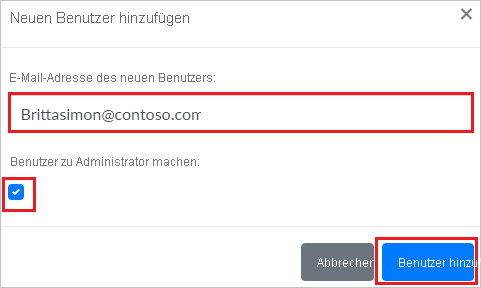

# Tutorial: Integrieren von dmarcian in Azure Active Directory

In diesem Tutorial erfahren Sie, wie Sie dmarcian in Azure Active Directory (Azure AD) integrieren. Die Integration von dmarcian in Azure AD ermöglicht Folgendes:

* Steuern Sie in Azure AD, wer Zugriff auf dmarcian hat.
* Ermöglichen Sie es Ihren Benutzern, sich mit ihren Azure AD-Konten automatisch bei dmarcian anzumelden.
* Verwalten Sie Ihre Konten zentral im Azure-Portal.

## Voraussetzungen

Für die ersten Schritte benötigen Sie Folgendes:

* Ein Azure AD-Abonnement Falls Sie über kein Abonnement verfügen, können Sie ein [kostenloses Azure-Konto](https://azure.microsoft.com/free/) verwenden.
* Ein dmarcian-Abonnement, für das einmaliges Anmelden (Single Sign-On, SSO) aktiviert ist

## Beschreibung des Szenarios

In diesem Tutorial konfigurieren und testen Sie das einmalige Anmelden von Azure AD in einer Testumgebung.

* dmarcian unterstützt **SP- und IDP-initiiertes** einmaliges Anmelden.

## Hinzufügen von dmarcian aus dem Katalog

Zum Konfigurieren der Integration von dmarcian in Azure AD müssen Sie dmarcian über den Katalog zur Liste mit den verwalteten SaaS-Apps hinzufügen.

1. Melden Sie sich mit einem Geschäfts-, Schul- oder Unikonto oder mit einem persönlichen Microsoft-Konto beim Azure-Portal an.
1. Wählen Sie im linken Navigationsbereich den Dienst **Azure Active Directory** aus.
1. Navigieren Sie zu **Unternehmensanwendungen**, und wählen Sie dann **Alle Anwendungen** aus.
1. Wählen Sie zum Hinzufügen einer neuen Anwendung **Neue Anwendung** aus.
1. Geben Sie im Abschnitt **Aus Katalog hinzufügen** den Suchbegriff **dmarcian** in das Suchfeld ein.
1. Wählen Sie im Ergebnisbereich **dmarcian** aus, und fügen Sie dann die App hinzu. Warten Sie einige Sekunden, während die App Ihrem Mandanten hinzugefügt wird.

## Konfigurieren und Testen des einmaligen Anmeldens von Azure AD für dmarcian

Konfigurieren und testen Sie das einmalige Anmelden von Azure AD mit dmarcian mithilfe eines Testbenutzers mit dem Namen **B. Simon**. Damit einmaliges Anmelden funktioniert, muss eine Linkbeziehung zwischen einem Azure AD-Benutzer und dem entsprechenden Benutzer in dmarcian eingerichtet werden.

Führen Sie zum Konfigurieren und Testen des einmaligen Anmeldens von Azure AD mit dmarcian die folgenden Schritte aus:

1. **[Konfigurieren des einmaligen Anmeldens von Azure AD](#configure-azure-ad-sso)** , um Ihren Benutzern die Verwendung dieses Features zu ermöglichen.
    1. **[Erstellen eines Azure AD-Testbenutzers](#create-an-azure-ad-test-user)** , um das einmalige Anmelden von Azure AD mit dem Testbenutzer B. Simon zu testen.
    1. **[Zuweisen des Azure AD-Testbenutzers](#assign-the-azure-ad-test-user)** , um B. Simon die Verwendung des einmaligen Anmeldens von Azure AD zu ermöglichen.
1. **[Konfigurieren des einmaligen Anmeldens für dmarcian](#configure-dmarcian-sso)** , um die Einstellungen für einmaliges Anmelden auf der Anwendungsseite zu konfigurieren.
    1. **[Erstellen eines dmarcian-Testbenutzers](#create-dmarcian-test-user)**, um ein Pendant von B. Simon in dmarcian zu erhalten, das mit ihrer Darstellung in Azure AD verknüpft ist
1. **[Testen des einmaligen Anmeldens](#test-sso)** , um zu überprüfen, ob die Konfiguration funktioniert

## Konfigurieren des einmaligen Anmeldens (Single Sign-On, SSO) von Azure AD

Gehen Sie wie folgt vor, um das einmalige Anmelden von Azure AD im Azure-Portal zu aktivieren.

1. Ermitteln Sie im Azure-Portal auf der Anwendungsintegrationsseite für **dmarcian** den Abschnitt **Verwalten** und wählen Sie **Einmaliges Anmelden** aus.
1. Wählen Sie auf der Seite **SSO-Methode auswählen** die Methode **SAML** aus.
1. Klicken Sie auf der Seite **Einmaliges Anmelden (SSO) mit SAML einrichten** auf das Stiftsymbol für **Grundlegende SAML-Konfiguration**, um die Einstellungen zu bearbeiten.

   

4. Führen Sie im Abschnitt **Grundlegende SAML-Konfiguration** die folgenden Schritte aus, wenn Sie die Anwendung im **IDP**-initiierten Modus konfigurieren möchten:

    a. Geben Sie im Textfeld **Bezeichner** eine URL im folgenden Format ein:

    | **Identifier** |
    |-----|
    | `https://us.dmarcian.com/sso/saml/<ACCOUNT_ID>/sp.xml` |
    | `https://dmarcian-eu.com/sso/saml/<ACCOUNT_ID>/sp.xml` |
    | `https://dmarcian-ap.com/sso/saml/<ACCOUNT_ID>/sp.xml` |
    

    b. Geben Sie im Textfeld **Antwort-URL** eine URL im folgenden Format ein:

    | **Antwort-URL** |
    |----|
    | `https://us.dmarcian.com/login/<ACCOUNT_ID>/handle/` |
    | `https://dmarcian-eu.com/login/<ACCOUNT_ID>/handle/` |
    | `https://dmarcian-ap.com/login/<ACCOUNT_ID>/handle/` |
   

5. Klicken Sie auf **Zusätzliche URLs festlegen**, und führen Sie den folgenden Schritt aus, wenn Sie die Anwendung im **SP-initiierten Modus** konfigurieren möchten:

    Geben Sie im Textfeld **Anmelde-URL** eine URL im folgenden Format ein:
    
    | **Anmelde-URL** |
    |-----|
    | `https://us.dmarcian.com/login/<ACCOUNT_ID>` |
    | `https://dmarcian-eu.com/login/<ACCOUNT_ID>` |
    | `https://dmarciam-ap.com/login/<ACCOUNT_ID>` |
     
    > [!NOTE] 
    > Hierbei handelt es sich um Beispielwerte. Sie müssen diese Werte durch die tatsächlichen Werte für Bezeichner, Antwort-URL und Anmelde-URL ersetzen. Darauf wird später im Tutorial eingegangen.

4. Klicken Sie auf der Seite **Einmaliges Anmelden (SSO) mit SAML einrichten** im Abschnitt **SAML-Signaturzertifikat** auf die Schaltfläche „Kopieren“, um die **App-Verbundmetadaten-URL** zu kopieren, und speichern Sie sie auf Ihrem Computer.

    

### Erstellen eines Azure AD-Testbenutzers

In diesem Abschnitt erstellen Sie im Azure-Portal einen Testbenutzer mit dem Namen B. Simon.

1. Wählen Sie im linken Bereich des Microsoft Azure-Portals **Azure Active Directory** > **Benutzer** > **Alle Benutzer** aus.
1. Wählen Sie oben im Bildschirm die Option **Neuer Benutzer** aus.
1. Führen Sie unter den Eigenschaften für **Benutzer** die folgenden Schritte aus:
   1. Geben Sie im Feld **Name** die Zeichenfolge `B.Simon` ein.  
   1. Geben Sie im Feld **Benutzername** die Zeichenfolge username@companydomain.extension ein. Beispiel: `B.Simon@contoso.com`.
   1. Aktivieren Sie das Kontrollkästchen **Kennwort anzeigen**, und notieren Sie sich den Wert aus dem Feld **Kennwort**.
   1. Klicken Sie auf **Erstellen**.

### Zuweisen des Azure AD-Testbenutzers

In diesem Abschnitt ermöglichen Sie B. Simon die Verwendung des einmaligen Anmeldens von Azure, indem Sie ihr Zugriff auf dmarcian gewähren.

1. Wählen Sie im Azure-Portal **Unternehmensanwendungen** > **Alle Anwendungen** aus.
1. Wählen Sie in der Anwendungsliste **dmarcian** aus.
1. Navigieren Sie auf der Übersichtsseite der App zum Abschnitt **Verwalten**, und wählen Sie **Benutzer und Gruppen** aus.
1. Wählen Sie **Benutzer hinzufügen** und anschließend im Dialogfeld **Zuweisung hinzufügen** die Option **Benutzer und Gruppen** aus.
1. Wählen Sie im Dialogfeld **Benutzer und Gruppen** in der Liste „Benutzer“ den Eintrag **B. Simon** aus, und klicken Sie dann unten auf dem Bildschirm auf die Schaltfläche **Auswählen**.
1. Wenn Sie einen beliebigen Rollenwert in der SAML-Assertion erwarten, wählen Sie im Dialogfeld **Rolle auswählen** die entsprechende Rolle für den Benutzer in der Liste aus, und klicken Sie dann im unteren Bildschirmbereich auf die Schaltfläche **Auswählen**.
1. Klicken Sie im Dialogfeld **Zuweisung hinzufügen** auf die Schaltfläche **Zuweisen**.

## Konfigurieren des einmaligen Anmeldens für dmarcian

1. Wenn Sie die Konfiguration in dmarcian automatisieren möchten, müssen Sie die **Browsererweiterung „Meine Apps“ für die sichere Anmeldung** installieren, indem Sie auf **Erweiterung installieren** klicken.

    

2. Klicken Sie nach dem Hinzufügen der Erweiterung zum Browser auf **dmarcian einrichten**, um zur Anwendung dmarcian weitergeleitet zu werden. Geben Sie dort die Administratoranmeldeinformationen ein, um sich bei dmarcian anzumelden. Die Browsererweiterung konfiguriert die Anwendung automatisch für Sie und automatisiert die Schritte 3 bis 6.

    

3. Wenn Sie dmarcian manuell einrichten möchten, öffnen Sie ein neues Webbrowserfenster, melden Sie sich bei der dmarcian-Unternehmenswebsite als Administrator an, und führen Sie die folgenden Schritte aus:

4. Klicken Sie oben rechts auf **Profile** (Profil), und navigieren Sie zu **Preferences** (Einstellungen).

    

5. Scrollen Sie nach unten, und klicken Sie auf den Abschnitt **Single Sign-On** (Einmaliges Anmelden) und dann auf **Configure** (Konfigurieren).

    

6. Legen Sie auf der Seite **SAML Single Sign-On** (Einmaliges Anmelden für SAML) den Wert für **Status** auf **Enabled** (Aktiviert) fest, und führen Sie die folgenden Schritte aus:

    

    a. Klicken Sie im Abschnitt **Add dmarcian to your Identity Provider** (dmarcian zum Identitätsanbieter hinzufügen) auf **Copy** (Kopieren), um die **Assertionsverbraucherdienst-URL** für Ihre Instanz zu kopieren, und fügen Sie sie im Azure-Portal im Abschnitt **Grundlegende SAML-Konfiguration** ins Textfeld **Antwort-URL** ein.

    b. Klicken Sie im Abschnitt **Add dmarcian to your Identity Provider** (dmarcian zum Identitätsanbieter hinzufügen) auf **Copy** (Kopieren), um den Wert für **Entity ID** (Entitäts-ID) für Ihre Instanz zu kopieren, und fügen Sie sie im Azure-Portal im Abschnitt **Grundlegende SAML-Konfiguration** ins Textfeld **Bezeichner** ein.

    c. Fügen Sie im Abschnitt **Set up Authentication** (Authentifizierung einrichten) im Textfeld **Identity Provider Metadata** (Metadaten des Identitätsanbieters) die **App-Verbundmetadaten-URL** ein, die Sie aus dem Azure-Portal kopiert haben.

    d. Fügen Sie unter **Set up Authentication** (Authentifizierung einrichten) die URL `http://schemas.xmlsoap.org/ws/2005/05/identity/claims/emailaddress` ins Textfeld **Attribute Statements** (Attributanweisungen) ein.

    e. Kopieren Sie im Abschnitt **Set up Login URL** (Anmelde-URL einrichten) die **Anmelde-URL** für Ihre Instanz, und fügen Sie sie im Azure-Portal im Abschnitt **Grundlegende SAML-Konfiguration** ins Textfeld **Anmelde-URL** ein.

    > [!Note]
    > Sie können die **Anmelde-URL** gemäß Ihrer Organisation anpassen.

    f. Klicken Sie auf **Speichern**.

### Erstellen eines dmarcian-Testbenutzers

Damit sich Azure AD-Benutzer bei dmarcian anmelden können, müssen sie in dmarcian bereitgestellt werden. Im Fall von dmarcian muss die Bereitstellung manuell ausgeführt werden.

**Führen Sie zum Bereitstellen eines Benutzerkontos die folgenden Schritte aus:**

1. Melden Sie sich bei dmarcian als Sicherheitsadministrator an.

2. Klicken Sie oben rechts auf **Profile** (Profil), und navigieren Sie zu **Manage Users** (Benutzer verwalten).

    

3. Klicken Sie rechts im Abschnitt **SSO Users** (SSO-Benutzer) auf **Add New User** (Neuen Benutzer hinzufügen).

    

4. Führen Sie im Popup **Add New User** (Neuen Benutzer hinzufügen) die folgenden Schritte aus:

    

    a. Geben Sie im Textfeld **New User Email** (E-Mail-Adresse des neuen Benutzers) die E-Mail-Adresse des Benutzers ein, z. B. **brittasimon\@contoso.com**.

    b. Wenn Sie dem Benutzer Administratorrechte gewähren möchten, aktivieren Sie **Make User an Admin** (Benutzer als Administrator festlegen).

    c. Klicken Sie auf **Benutzer hinzufügen**.

## Testen des einmaligen Anmeldens 

In diesem Abschnitt testen Sie die Azure AD-Konfiguration für einmaliges Anmelden mit den folgenden Optionen: 

#### SP-initiiert:

* Klicken Sie im Azure-Portal auf **Diese Anwendung testen**. Sie werden zur Anmelde-URL für dmarcian weitergeleitet, damit Sie den Anmeldeabfluss initiieren können.  

* Rufen Sie direkt die dmarcian-Anmelde-URL auf, und initiieren Sie den Anmeldeabfluss.

#### IDP-initiiert:

* Klicken Sie im Azure-Portal auf **Diese Anwendung testen**. Dadurch sollten Sie automatisch bei der dmarcian-Instanz angemeldet werden, für die Sie das einmalige Anmelden eingerichtet haben. 

Sie können auch den Microsoft-Bereich „Meine Apps“ verwenden, um die Anwendung in einem beliebigen Modus zu testen. Beim Klicken auf die Kachel „dmarcian“ in „Meine Apps“ geschieht Folgendes: Wenn Sie die Anwendung im SP-Modus konfiguriert haben, werden Sie zum Initiieren des Anmeldeabflusses zur Anmeldeseite der Anwendung weitergeleitet. Wenn Sie die Anwendung im IDP-Modus konfiguriert haben, sollten Sie automatisch bei der dmarcian-Instanz angemeldet werden, für die Sie das einmalige Anmelden eingerichtet haben. Weitere Informationen zu „Meine Apps“ finden Sie in [dieser Einführung](../user-help/my-apps-portal-end-user-access.md).

## Nächste Schritte

Nachdem Sie dmarcian konfiguriert haben, können Sie die Sitzungssteuerung erzwingen, die Ihre vertraulichen Unternehmensdaten in Echtzeit vor der Exfiltration und Infiltration schützt. Die Sitzungssteuerung basiert auf bedingtem Zugriff. [Hier](/cloud-app-security/proxy-deployment-aad) erfahren Sie, wie Sie die Sitzungssteuerung mit Microsoft Cloud App Security erzwingen.
