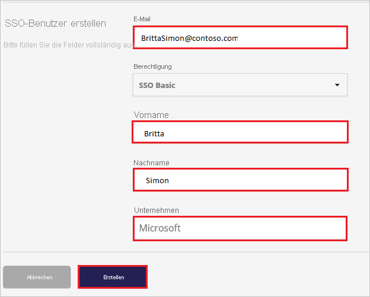

# Tutorial: Azure Active Directory-Integration mit Image Relay

In diesem Tutorial erfahren Sie, wie Sie Image Relay in Azure Active Directory (Azure AD) integrieren. Bei der Integration von Image Relay in Azure AD haben Sie folgende Möglichkeiten:

* Sie können in Azure AD steuern, wer Zugriff auf Image Relay hat.
* Es wird Ihren Benutzern ermöglicht, sich mit ihren Azure AD-Konten automatisch bei Image Relay anzumelden.
* Verwalten Sie Ihre Konten zentral im Azure-Portal.

## Voraussetzungen

Für die ersten Schritte benötigen Sie Folgendes:

* Ein Azure AD-Abonnement Falls Sie über kein Abonnement verfügen, können Sie ein [kostenloses Azure-Konto](https://azure.microsoft.com/free/) verwenden.
* Ein Image Relay-Abonnement, für das einmaliges Anmelden aktiviert ist.

## Beschreibung des Szenarios

In diesem Tutorial konfigurieren und testen Sie das einmalige Anmelden von Azure AD in einer Testumgebung.

* Image Relay unterstützt **SP-initiiertes** einmaliges Anmelden.

## Hinzufügen von Image Relay aus dem Katalog

Zum Konfigurieren der Integration von Image Relay in Azure AD müssen Sie Image Relay aus dem Katalog der Liste mit den verwalteten SaaS-Apps hinzufügen.

1. Melden Sie sich mit einem Geschäfts-, Schul- oder Unikonto oder mit einem persönlichen Microsoft-Konto beim Azure-Portal an.
1. Wählen Sie im linken Navigationsbereich den Dienst **Azure Active Directory** aus.
1. Navigieren Sie zu **Unternehmensanwendungen**, und wählen Sie dann **Alle Anwendungen** aus.
1. Wählen Sie zum Hinzufügen einer neuen Anwendung **Neue Anwendung** aus.
1. Geben Sie im Abschnitt **Aus dem Katalog hinzufügen** den Suchbegriff **Image Relay** in das Suchfeld ein.
1. Wählen Sie im Ergebnisbereich **Image Relay** aus, und fügen Sie dann die App hinzu. Warten Sie einige Sekunden, während die App Ihrem Mandanten hinzugefügt wird.

## Konfigurieren und Testen des einmaligen Anmeldens von Azure AD für Image Relay

Konfigurieren und testen Sie das einmalige Anmelden von Azure AD mit Image Relay unter Verwendung eines Testbenutzers namens **B. Simon**. Damit einmaliges Anmelden funktioniert, muss eine Linkbeziehung zwischen einem Azure AD-Benutzer und dem entsprechenden Benutzer in Image Relay eingerichtet werden.

Führen Sie zum Konfigurieren und Testen des einmaligen Anmeldens von Azure AD bei Image Relay die folgenden Schritte aus:

1. **[Konfigurieren des einmaligen Anmeldens von Azure AD](#configure-azure-ad-sso)** , um Ihren Benutzern die Verwendung dieses Features zu ermöglichen.
    1. **[Erstellen eines Azure AD-Testbenutzers](#create-an-azure-ad-test-user)** , um das einmalige Anmelden von Azure AD mit dem Testbenutzer B. Simon zu testen.
    1. **[Zuweisen des Azure AD-Testbenutzers](#assign-the-azure-ad-test-user)** , um B. Simon die Verwendung des einmaligen Anmeldens von Azure AD zu ermöglichen.
1. **[Konfigurieren des einmaligen Anmeldens für Image Relay](#configure-image-relay-sso)** , um die Einstellungen für das einmalige Anmelden auf der Anwendungsseite zu konfigurieren.
    1. **[Erstellen eines Image Relay-Testbenutzers](#create-image-relay-test-user)** , um eine Entsprechung von B. Simon in Image Relay zu erhalten, das mit Darstellung des Benutzers in Azure AD verknüpft ist.
1. **[Testen des einmaligen Anmeldens](#test-sso)** , um zu überprüfen, ob die Konfiguration funktioniert

## Konfigurieren des einmaligen Anmeldens (Single Sign-On, SSO) von Azure AD

Gehen Sie wie folgt vor, um das einmalige Anmelden von Azure AD im Azure-Portal zu aktivieren.

1. Navigieren Sie im Azure-Portal auf der Anwendungsintegrationsseite für **Image Relay** zum Abschnitt **Verwalten** und wählen Sie **einmaliges Anmelden** aus.
1. Wählen Sie auf der Seite **SSO-Methode auswählen** die Methode **SAML** aus.
1. Klicken Sie auf der Seite **Einmaliges Anmelden (SSO) mit SAML einrichten** auf das Stiftsymbol für **Grundlegende SAML-Konfiguration**, um die Einstellungen zu bearbeiten.

   

4. Führen Sie im Abschnitt **Grundlegende SAML-Konfiguration** die folgenden Schritte aus:

    a. Geben Sie im Textfeld **Bezeichner (Entitäts-ID)** eine URL im folgenden Format ein: `https://<COMPANYNAME>.imagerelay.com/sso/metadata`.

    b. Geben Sie im Textfeld **Anmelde-URL** eine URL im folgenden Format ein: `https://<COMPANYNAME>.imagerelay.com/`.

    > [!NOTE]
    > Hierbei handelt es sich um Beispielwerte. Ersetzen Sie diese Werte durch den tatsächlichen Bezeichner und die tatsächliche Anmelde-URL. Wenden Sie sich an das [Clientsupportteam von Image Relay](http://support.imagerelay.com/), um diese Werte zu erhalten. Sie können sich auch die Muster im Abschnitt **Grundlegende SAML-Konfiguration** im Azure-Portal ansehen.

4. Klicken Sie auf der Seite **Einmaliges Anmelden (SSO) mit SAML einrichten** im Abschnitt **SAML-Signaturzertifikat** auf **Herunterladen**, um das Ihrer Anforderung entsprechende **Zertifikat (Base64)** aus den angegebenen Optionen herunterzuladen und auf Ihrem Computer zu speichern.

    

6. Kopieren Sie im Abschnitt **Image Relay einrichten** die entsprechenden URLs gemäß Ihren Anforderungen.

    

### Erstellen eines Azure AD-Testbenutzers

In diesem Abschnitt erstellen Sie im Azure-Portal einen Testbenutzer mit dem Namen B. Simon.

1. Wählen Sie im linken Bereich des Microsoft Azure-Portals **Azure Active Directory** > **Benutzer** > **Alle Benutzer** aus.
1. Wählen Sie oben im Bildschirm die Option **Neuer Benutzer** aus.
1. Führen Sie unter den Eigenschaften für **Benutzer** die folgenden Schritte aus:
   1. Geben Sie im Feld **Name** die Zeichenfolge `B.Simon` ein.  
   1. Geben Sie im Feld **Benutzername** die Zeichenfolge username@companydomain.extension ein. Beispiel: `B.Simon@contoso.com`.
   1. Aktivieren Sie das Kontrollkästchen **Kennwort anzeigen**, und notieren Sie sich den Wert aus dem Feld **Kennwort**.
   1. Klicken Sie auf **Erstellen**.

### Zuweisen des Azure AD-Testbenutzers

In diesem Abschnitt ermöglichen Sie B. Simon die Verwendung des einmaligen Anmeldens von Azure, indem Sie den Zugriff auf Image Relay gewähren.

1. Wählen Sie im Azure-Portal **Unternehmensanwendungen** > **Alle Anwendungen** aus.
1. Wählen Sie in der Anwendungsliste **Image Relay** aus.
1. Navigieren Sie auf der Übersichtsseite der App zum Abschnitt **Verwalten**, und wählen Sie **Benutzer und Gruppen** aus.
1. Wählen Sie **Benutzer hinzufügen** und anschließend im Dialogfeld **Zuweisung hinzufügen** die Option **Benutzer und Gruppen** aus.
1. Wählen Sie im Dialogfeld **Benutzer und Gruppen** in der Liste „Benutzer“ den Eintrag **B. Simon** aus, und klicken Sie dann unten auf dem Bildschirm auf die Schaltfläche **Auswählen**.
1. Wenn den Benutzern eine Rolle zugewiesen werden soll, können Sie sie im Dropdownmenü **Rolle auswählen** auswählen. Wurde für diese App keine Rolle eingerichtet, ist die Rolle „Standardzugriff“ ausgewählt.
1. Klicken Sie im Dialogfeld **Zuweisung hinzufügen** auf die Schaltfläche **Zuweisen**.

## Konfigurieren des SSO von Image Relay

1. Melden Sie sich in einem anderen Webbrowserfenster bei Ihrer Image Relay-Unternehmenswebsite als Administrator an.

2. Klicken Sie auf der Symbolleiste oben auf die Workload **Users & Permissions** (Benutzer und Berechtigungen).

     

3. Klicken Sie auf **Create New Permission**(Neue Berechtigung erstellen).

    

4. Aktivieren Sie in der Workload **Single Sign On Settings** (Einstellungen für einmaliges Anmelden) das Kontrollkästchen **This Group can only sign-in via Single Sign On** (Diese Gruppe kann sich nur per einmaligem Anmelden anmelden), und klicken Sie dann auf **Speichern**.

     

5. Wechseln Sie zu **Kontoeinstellungen**.

     

6. Klicken Sie auf die Workload **Single Sign On Settings** (Einstellungen für einmaliges Anmelden).

    

7. Führen Sie im Dialogfeld **SAML Settings** (SAML-Einstellungen) die folgenden Schritte aus:

    

    a. Fügen Sie in das Textfeld **Login URL** (Anmelde-URL) den Wert der **Anmelde-URL** ein, den Sie aus dem Azure-Portal kopiert haben.

    b. Fügen Sie in das Textfeld **Logout URL** (Abmelde-URL) den Wert der **Abmelde-URL** ein, den Sie aus dem Azure-Portal kopiert haben.

    c. Wählen Sie unter **Name Id Format** (Format der Namens-ID) die Option **urn:oasis:names:tc:SAML:1.1:nameid-format:emailAddress** aus.

    d. Wählen Sie unter **Binding Options for Requests from the Service Provider (Image Relay)** (Bindungsoptionen für Anforderungen vom Dienstanbieter (Image Relay)) die Option **POST Binding** (POST-Bindung) aus.

    e. Klicken Sie unter **x.509-Zertifikat** auf **Zertifikat aktualisieren**.

    

    f. Öffnen Sie das heruntergeladene Zertifikat im Editor, kopieren Sie den Inhalt, und fügen Sie ihn anschließend in das Textfeld **x.509 Certificate** (x.509-Zertifikat) ein.

    

    g. Aktivieren Sie im Abschnitt **Just-In-Time User Provisioning** (Just-In-Time-Benutzerbereitstellung) das Kontrollkästchen **Enable Just-In-Time User Provisioning** (Just-In-Time-Benutzerbereitstellung aktivieren).

    

    h. Wählen Sie die Berechtigungsgruppe aus (z.B. **SSO Basic** (SSO allgemein)), bei der die Anmeldung nur per einmaligem Anmelden erfolgen soll.

    

    i. Klicken Sie auf **Speichern**.

### Erstellen eines Image Relay-Testbenutzers

Das Ziel dieses Abschnitts ist das Erstellen einer Benutzerin namens Britta Simon in Image Relay.

**Um eine Benutzerin namens Britta Simon in Image Relay zu erstellen, führen Sie die folgenden Schritte aus:**

1. Melden Sie sich bei Ihrer Image Relay-Unternehmenswebsite als Administrator an.

2. Wechseln Sie zu **Benutzer & Berechtigungen** und klicken Sie auf **SSO-Benutzer erstellen** .

     

3. Geben Sie die **E-Mail-Adresse**, den **Vornamen**, den **Nachnamen** und das **Unternehmen** des bereitzustellenden Benutzers an. Wählen Sie außerdem die Berechtigungsgruppe aus (z.B. „SSO Basic“). Dies ist die Gruppe, die sich nur per einmaligem Anmelden anmelden kann.

    

4. Klicken Sie auf **Erstellen**.

## Testen des einmaligen Anmeldens

In diesem Abschnitt testen Sie die Azure AD-Konfiguration für einmaliges Anmelden mit den folgenden Optionen: 

* Klicken Sie im Azure-Portal auf **Diese Anwendung testen**. Dadurch werden Sie zur Anmelde-URL für Image Relay weitergeleitet, wo Sie den Anmeldeablauf initiieren können. 

* Rufen Sie direkt die Image Relay-Anmelde-URL auf, und initiieren Sie den Anmeldeablauf.

* Sie können „Meine Apps“ von Microsoft verwenden. Wenn Sie in „Meine Apps“ auf die Kachel „Image Relay“ klicken, werden Sie zur Anmelde-URL für Image Relay weitergeleitet. Weitere Informationen zu „Meine Apps“ finden Sie in [dieser Einführung](../user-help/my-apps-portal-end-user-access.md).

## Nächste Schritte

Nach dem Konfigurieren von Image Relay können Sie die Sitzungssteuerung erzwingen, die Ihre vertraulichen Unternehmensdaten in Echtzeit vor der Exfiltration und Infiltration schützt. Die Sitzungssteuerung basiert auf bedingtem Zugriff. [Hier](/cloud-app-security/proxy-deployment-aad) erfahren Sie, wie Sie die Sitzungssteuerung mit Microsoft Cloud App Security erzwingen.
