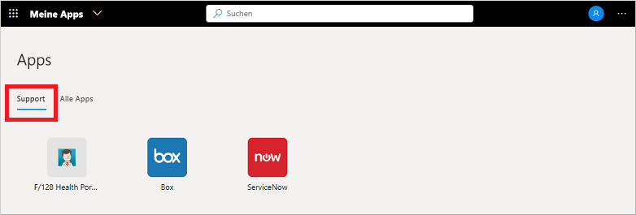

# Verwenden von Sammlungen im Portal „Meine Apps“

Sammlungen sind unterschiedliche App-Ansichten, die im Portal **Meine Apps** angezeigt werden. Apps können beispielsweise nach Abteilungsfunktion oder Benutzerrolle in Sammlungen gruppiert werden. Wenn keine verfügbaren Sammlungen oder Kategorien angezeigt werden, hat Ihr Administrator keine eingerichtet oder diese nicht für Sie freigegeben. Wenden Sie sich an den Helpdesk Ihrer Organisation, um weitere Unterstützung oder die Berechtigungen zum Anzeigen der freigegebenen Sammlungen zu erhalten.

[!INCLUDE [preview-notice](../../../includes/active-directory-end-user-my-apps-and-workspaces.md)]

>[!Important]
>Dieser Inhalt richtet sich an Benutzer von **Meine Apps**. Administratoren können sich in der [Dokumentation zur Anwendungsverwaltung](../manage-apps/access-panel-collections.md) über die Einrichtung und Verwaltung cloudbasierter Apps informieren.

## Zugreifen auf Apps mithilfe von Sammlungen

In der Liste der Sammlungen im Portal **Meine Apps** wird standardmäßig ein Eintrag mit dem Namen **Alle Apps** angezeigt, der sämtliche Apps enthält, auf die Sie Zugriff haben:

Alle anderen Sammlungen, die in dieser Liste angezeigt werden, wurden von Ihrem Administrator erstellt und für Sie freigegeben. Sie können eine dieser Sammlungen auswählen, um einen eingegrenzten Satz von Apps anzuzeigen, wie z. B. *Support* im folgenden Beispiel:

Wenn Sie eine Sammlung auswählen und anzeigen, werden nur die Standardanwendungen angezeigt, auf die Sie Zugriff haben.

## Nächste Schritte

Nach dem Organisieren Ihrer Apps in den verschiedenen Kategorien im Portal **Meine Apps** haben Sie folgende Möglichkeiten:

- Überprüfen, Aktualisieren oder Widerrufen von Berechtigungen für Anwendungen. Weitere Informationen finden Sie unter [Bearbeiten oder Widerrufen von Anwendungsberechtigungen im Portal „Meine Apps“](my-applications-portal-permissions-saved-accounts.md).

## Verwandte Artikel

- [Aktualisieren Ihrer Profil- und Kontoinformationen](my-account-portal-overview.md). In diesem Artikel finden Sie Anweisungen zum Aktualisieren Ihrer personenbezogenen Daten, die im Portal **Meine Apps** angezeigt werden.

- [Verwalten Ihrer Organisationen](my-account-portal-organizations-page.md). Anweisungen zum Anzeigen und Verwalten gruppenbezogener Informationen auf der Seite **Organisationen** im Portal **Meine Apps**

- [Verwalten Ihrer verbundenen Geräte](my-account-portal-devices-page.md). Anweisungen zum Verwalten der Geräte, mit denen Sie über Ihr Geschäfts-, Schul- oder Unikonto verbunden sind, auf der Seite **Geräte** im Portal **Mein Profil**