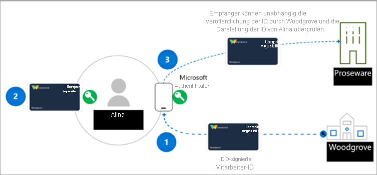

# <a name="introduction-to-azure-active-directory-verifiable-credentials-preview"></a>Einführung in Nachweise für Azure Active Directory (Vorschauphase)

> [!IMPORTANT]
> Nachweise für Azure Active Directory befinden sich derzeit in der öffentlichen Vorschauphase.
> Diese Vorschauversion wird ohne Vereinbarung zum Servicelevel bereitgestellt und ist nicht für Produktionsworkloads vorgesehen. Manche Features werden möglicherweise nicht unterstützt oder sind nur eingeschränkt verwendbar. Weitere Informationen finden Sie unter [Zusätzliche Nutzungsbestimmungen für Microsoft Azure-Vorschauen](https://azure.microsoft.com/support/legal/preview-supplemental-terms/).

Unser digitales und körperliches Leben wird immer häufiger mit Apps, Diensten und Geräten verknüpft, über die wir auf einen umfangreichen Erfahrungsschatz zugreifen können. Diese digitale Transformation ermöglicht es uns, mit Hunderten von Unternehmen und Tausenden anderer Benutzer auf eine Weise zu interagieren, die bisher nicht vorstellbar war.

Jedoch wurden bei Sicherheitsverletzungen zu oft Identitätsdaten offengelegt. Diese Sicherheitsverletzungen wirken sich auf das Leben von Menschen aus und haben Einfluss auf unser die sozialen, beruflichen und finanziellen Aspekte unseres Lebens. Microsoft ist der Überzeugung, dass es eine bessere Möglichkeit gibt. Jede Person hat das Recht auf eine Identität, die sie besitzt und kontrolliert, eine Identität, die die Elemente Ihrer digitalen Identität sicher speichert und den Datenschutz gewährleistet. Dieser Leitfaden erläutert, wie wir mit einer vielfältigen Community zusammenkommen, um eine offene, vertrauenswürdige, interoperable und auf Standards basierende dezentralisierte Identitätslösung (DID) für Einzelpersonen und Organisationen zu entwickeln.

## <a name="why-we-need-decentralized-identity"></a>Weshalb wir eine dezentralisierte Identität benötigen

Heute verwenden wir unsere digitale Identität bei der Arbeit, zu Hause und allen Apps, Diensten und Geräten, die wir verwenden. Sie besteht aus allem, was wir sagen, tun und in unserem Leben erleben – ob wir nun Tickets für eine Veranstaltung kaufen, in ein Hotel einchecken oder vielleicht auch nur ein Mittagessen bestellen. Derzeit werden unsere Identität und alle unsere digitalen Interaktionen von anderen Parteien verwaltet und gesteuert, von denen uns einige noch nicht einmal bekannt sind.

Im allgemeinen erteilen Benutzer ihre Zustimmung zu mehreren Apps und Geräten. Um zu verfolgen, wer Zugriff auf welche Informationen hat, erfordert dieser Ansatz ein hohes Maß an Wachsamkeit aufseiten der Benutzer. In Unternehmen erfordert die Zusammenarbeit mit Kunden und Partnern eine engmaschige Orchestrierung, damit Daten sicher und auf eine Weise ausgetauscht werden, die den Datenschutz und die Sicherheit für alle Beteiligten gewährleistet.

Wir sind der Überzeugung, dass ein auf Standards basierendes dezentralisiertes Identitätssystem neue Möglichkeiten eröffnet, die Benutzern und Organisationen nicht nur mehr Kontrolle über Ihre Daten sondern auch ein höheres Maß an Vertrauenswürdigkeit und Sicherheit für Apps, Geräte und Dienstanbieter ermöglichen

## <a name="lead-with-open-standards"></a>Führung mit offenen Standards

Wir sind bestrebt, eng mit Kunden, Partnern und der Community zusammenzuarbeiten, um die nächste Generation von dezentralisierten identitätsbasierten Erfahrungen zu ermöglichen. Wir freuen uns, mit den Personen und Organisationen zusammenzuarbeiten, die in diesem Bereich Unglaubliches leisten. Wenn das Ökosystem wachsen soll, müssen die Standards, die technischen Komponenten und die Arbeitsergebnisse in Form von Open Source-Code vorliegen und für alle zugänglich sein.

Microsoft arbeitet aktiv mit Mitgliedern der Decentralized Identity Foundation (DIF), der W3C-Credentials Community-Gruppe und der umfassenderen Identitäts-Community zusammen. Wir kooperieren mit diesen Gruppen, um wichtige Standards zu bestimmen und zu entwickeln. Die folgenden Standards wurden in unseren Diensten implementiert.

* [W3C Decentralized Identifiers](https://www.w3.org/TR/did-core/) (Dezentralisierte W3C-IDs)
* [W3C Verifiable Credentials](https://www.w3.org/TR/vc-data-model/) (W3C Nachweise)
* [DIF-Sidetree](https://identity.foundation/sidetree/spec/)
* [DIF Well Known DID Configuration](https://identity.foundation/specs/did-configuration/) (DIF-Konfiguration mit bekannter DID-Konfiguration)
* [DIF DID-SIOP](https://identity.foundation/did-siop/)
* [DIF Presentation Exchange](https://identity.foundation/presentation-exchange/) (DIF-Präsentationsbörse)


## <a name="what-are-dids"></a>Was sind DIDs?

Um DIDs zu verstehen, ist es hilfreich, sie mit aktuellen Identitätssystemen zu vergleichen. E-Mail-Adressen und IDs von sozialen Netzwerken sind benutzerfreundliche Aliase für die Zusammenarbeit, sind aber nun überladen, da sie als Kontrollstelle für den Datenzugriff über viele Szenarien hinweg zu dienen. Dadurch entsteht ein mögliches Problem, da der Zugriff auf diese IDs von externen Parteien jederzeit unterbunden werden kann.

Dezentralisierte IDs (DIDs) unterscheiden sich davon. DIDs sind vom Benutzer generierte, eigenverantwortliche und global eindeutige Bezeichner, die auf dezentralisierten Systemen wie z. B. „Ion“ basieren. Sie verfügen über einzigartige Merkmale, wie z. B. eine bessere Sicherstellung der Unveränderlichkeit sowie Schutz vor Zensur und Manipulationen. Diese Attribute sind für jedes ID-System wichtig, das Eigenverantwortlichkeit und Benutzerkontrolle sicherstellen soll. 

Die Microsoft-Lösung für überprüfbare Anmeldeinformationen setzt für das kryptografische Signieren dezentralisierte Anmeldeinformationen (DIDs) als Nachweis dafür ein, dass von einer vertrauenden Seite (Überprüfer) Informationen bestätigt werden, die nachweisen, dass sie Inhaber dieser überprüfbaren Anmeldeinformationen sind. Daher wird für alle, die eine Lösung für überprüfbare Anmeldeinformationen auf der Grundlage des Microsoft-Angebots erstellen, ein grundlegendes Verständnis von dezentralisierten IDs empfohlen.
## <a name="what-are-verifiable-credentials"></a>Was sind Nachweise?

 Wir verwenden IDs in unserem täglichen Leben. Wir besitzen einen Führerschein als Beleg dafür, dass wir Auto fahren können. Universitäten stellen Diplome aus, die nachweisen, dass wir eine bestimmte Bildungsstufe erreicht haben. Wir verwenden die Reisepässe, um gegenüber den Behörden im Reiseland nachzuweisen, wer wir sind. Das Datenmodell beschreibt, wie wir bei der Arbeit über das Internet mit Szenarien dieser Art ausschließlich auf eine sichere Weise umgehen können, die den Schutz der Benutzerdaten gewährleistet. Weitere Informationen finden Sie im [Datenmodell für Nachweise 1.0](https://www.w3.org/TR/vc-data-model/)

Kurz gesagt: Nachweise sind Datenobjekte, die aus der Zusicherung der ausstellenden Stelle bestehen, dass die Informationen über eine Person richtig sind. Diese Zusicherungen werden anhand eines Schemas identifiziert und enthalten die DID, den Aussteller und die betroffene Person. Aus den DID des Ausstellers wird eine digitale Signatur als Nachweis dafür erstellt, dass er diese Informationen bestätigt.


## <a name="how-does-decentralized-identity-work"></a>Wie funktioniert eine dezentralisierte Identität?

Wir benötigen eine neue Form von Identität. Wir benötigen eine Identität, die Technologien und Standards zusammenführt, um wichtige Identitätsattribute wie Eigenverantwortung und Schutz vor Zensur zu bieten. Diese Funktionen sind mit vorhandenen Systemen schwer umzusetzen.

Um diese Versprechen zu erfüllen, benötigen wir eine technische Grundlage mit sieben Schlüsselinnovationen. Eine der Schlüsselinnovationen sind IDs, die der Verantwortung des Benutzers unterliegen, ein Benutzer-Agenten zum Verwalten von Schlüsseln, die mit solchen IDs verknüpft sind, und verschlüsselte, benutzergesteuerte Datenspeicher.


**1. W3C-IDs (Dezentrale IDs)** Die Benutzer erstellen, verantworten und kontrollieren diese IDs unabhängig von Organisationen oder Behörden. DIDs sind global eindeutige IDs, die mit den Metadaten der dezentralisierten Public Key-Infrastruktur (DPKI) verknüpft sind, die sich wiederum aus JSON-Dokumenten zusammensetzt, in denen Materialien zum Public Key, zu Authentifizierungsdeskriptoren und zu Dienstendpunkten enthalten sind.

**2. Dezentrales System: Ion (Identity Overlay Network)** ION ist ein auf Ebene 2 offenes, erlaubnisfreies Netzwerk, das auf dem rein deterministischen Sidetree-Protokoll basiert, das keine speziellen Token, keine vertrauenswürdigen Validierungssteuerelemente und keine anderen Konsensmechanismen erfordert. Der lineare Fortschritt der Bitcoin-Zeitkette ist alles, was für seinen Betrieb benötigt wird. Wir haben [Open Source-NPM-Paket](https://www.npmjs.com/package/@decentralized-identity/ion-tools), mit dem Sie die Zusammenarbeit mit dem ION-Netzwerk auf einfache Weise in Ihre Apps und Dienste integrieren können. Zu den Bibliotheken gehören Elemente zum Erstellen einer neuen DID, zum Erstellen von Schlüsseln und zum Verankern ihrer DID in der Bitcoin-Blockchain. 

**3. Benutzer-Agent/Wallet: Microsoft Authenticator-App** Sie ermöglicht es echten Personen, dezentralisierte Identitäten und Nachweise zu nutzen. Der Authentifikator erstellt DIDs, unterstützt die Anfragen nach Ausstellung und Präsentation von Nachweisen und verwaltet die Sicherung Ihres DID-Seeds mittels einer verschlüsselten Wallet-Datei.

**4. Microsoft Resolver** Diese API stellt die Verbindung mit unserem ION-Knoten her, um DIDs mithilfe der ```did:ion```-Methode zu suchen und aufzulösen und das DID-Dokumentobjekt (DDO) zurückzugeben. Das DDO umfasst DPKI-Metadaten, die den DID zugeordnet sind. Das sind z. B. öffentliche Schlüssel und Dienstendpunkte. 

**5. Azure Active Directory Verified Credentials Service** Dies ist eine API und ein Open Source SDK zur Ausstellung und Verifizierung von [W3C-Nachweisen, die mit der ](https://www.w3.org/TR/vc-data-model/)-Methode signiert wurden. Sie ermöglichen es den Besitzern einer Identität, Zusicherungen zu generieren, vorzulegen und zu überprüfen. Dies bildet die Grundlage der Vertrauensstellung zwischen den Benutzern der Systeme.

## <a name="a-sample-scenario"></a>Ein Beispielszenario

Das Szenario, in dem wir erläutern, wie VCs funktionieren, umfasst Folgendes:

- Woodgrove Inc., ein Unternehmen.
- Proseware, ein Unternehmen, das den Woodgrove-Mitarbeitern Rabatte anbietet.
- Alice, eine Mitarbeiterin von Woodgrove, Inc., die von Proseware einen Rabatt erhalten möchte


Heute gibt Alice einen Benutzernamen und ein Kennwort für die Anmeldung bei der Netzwerkumgebung von Woodgrove an. Woodgrove stellt eine VC-Lösung bereit, um Alice eine besser steuerbare Methode für den Nachweis anzubieten, dass sie eine Mitarbeiterin von Woodgrove ist. Proseware verwendet eine VC-Lösung, die mit der VC-Lösung von Woodgrove kompatibel ist und akzeptiert Anmeldeinformationen, die von Woodgrove als Beschäftigungsnachweis ausgegeben werden.

Der Aussteller der Anmeldeinformationen, Woodgrove Inc., erstellt einen öffentlichen Schlüssel und einen privaten Schlüssel. Der öffentliche Schlüssel wird auf ION gespeichert. Wenn dieser Schlüssel zur Infrastruktur hinzugefügt wird, wird der Eintrag in einem auf der Blockchain basierenden dezentralisierten Ledger aufgezeichnet. Der Aussteller stellt Alice den privaten Schlüssel zur Verfügung, der in einer Wallet-Anwendung gespeichert ist. Jedes Mal, wenn Alice erfolgreich den privaten Schlüssel verwendet, wird die Transaktion in der Wallet-Anwendung protokolliert.


## <a name="roles-in-a-verifiable-credential-solution"></a>Rollen in einer Lösung für Nachweise 

In der Lösung für Nachweise gibt es drei Hauptakteure. Das Diagramm weiter unten zeigt Folgendes:

- **Schritt 1**: Anforderung eines Nachweises durch den **Benutzer**.
- **Schritt 2**: Der **Aussteller** der Anmeldeinformationen prüft, ob der vom Benutzer angegebene Nachweis korrekt ist, und erstellt einen Nachweis, der mit seinem Namen signiert wurde, und deren Gegenstand der Benutzer ist.
- **Schritt 3**: Der Benutzer signiert eine verifizierbare Präsentation (VP) mit seiner bzw. ihrer DID und sendet sie an die **verifizierende Stelle.** Der Verifier überprüft dann die Anmeldeinformationen, indem er sie mit dem in der DPKI platzierten öffentlichen Schlüssel abgleicht.

Die Rollen in diesem Szenario sind:



**Aussteller**: Der Aussteller ist eine Organisation, die eine Ausstellungslösung erstellt, mit der Informationen von einem Benutzer angefordert werden. Die Informationen werden verwendet, um die Identität des Benutzers zu verifizieren. Beispielsweise verfügt Woodgrove, Inc. über eine Ausstellungslösung, die es ihnen ermöglicht, Nachweise (VCs) für alle Mitarbeiter zu erstellen und zu verteilen. Die Mitarbeiter verwenden die Authentifikator-App, um sich mit ihrem Benutzernamen und ihrem Kennwort anzumelden, wodurch ein ID-Token an den ausstellenden Dienst übergeben wird. Sobald Woodgrove, Inc. das gesendete ID-Token überprüft hat, erstellt die Ausstellungslösung eine VC, die Zusicherungen bezüglich des Mitarbeiters enthält und mit Woodgrove, Inc. signiert ist. Die Mitarbeiter verfügen nun über Nachweise, die von Ihrem Arbeitgeber signiert wurden. Dies schließt die Mitarbeiter-DID als DID des Gegenstands der Zusicherung ein.  

**Benutzer**: Benutzer sind die Personen oder Entitäten, die eine VC anfordern. Alice ist z. B. eine neue Mitarbeiterin von Woodgrove, Inc. und für sie wurde zuvor eine Beschäftigungsbestätigung als Nachweis ausgestellt. Wenn Alice einen Beschäftigungsnachweis bereitstellen muss, um bei Proseware einen Rabatt zu erhalten, kann sie in ihrer Authentifikator-App Zugriff auf diese Anmeldeinformationen erteilen, indem sie eine verifizierbare Präsentation signiert, mit der nachgewiesen wird, dass Alice die Besitzerin der DID ist. Proseware kann verifizieren, ob die Anmeldeinformationen von Woodgrove, Inc. ausgegeben wurden und ob Alice die Besitzerin dieser Anmeldeinformationen ist. 

**Verifier**: Der Verifier ist ein Unternehmen oder eine Entität, die Zusicherungen eines oder mehrerer Ausstellern überprüfen muss, denen er vertraut. Proseware vertraut z. B., dass Woodgrove, Inc. seine Aufgaben zur Identitätsprüfung seiner Mitarbeiter in angemessener Weise erledigt und authentische und gültige VCs ausstellt. Wenn Alice versucht, die Ausrüstungen zu bestellen, die sie für Ihre Arbeit benötigt, verwendet Proseware offene Standards wie z. B. SIOP und Presentation Exchange, um von ihr als Benutzerin Anmeldeinformationen anzufordern, die nachweisen, dass sie Mitarbeiterin von Woodgrove, Inc. ist. Beispielsweise könnte Proseware Alice einen Link zu einer Website mit einem QR-Code zur Verfügung stellen, den sie mit der Kamera ihres Telefons scannt. Dadurch wird die Anforderung einer bestimmten, vom Authentifikator analysierten VC initiiert und Alice die Möglichkeit geboten, die Anforderung zum Nachweis ihrer Beschäftigung bei Proseware zu genehmigen. Proseware kann die API oder das SDK des Dienstes für verifizierte Anmeldeinformationen verwenden, um die Authentizität der verifizierbaren Präsentation zu überprüfen. Basierend auf den von Alice bereitgestellten Informationen gestehen sie Alice den Rabatt zu. Wenn andere Unternehmen und Organisationen wissen, dass Woodgrove, Inc. VCs an seine Mitarbeiter ausgibt, können sie ebenfalls eine Verifizierungslösung erstellen und die Nachweise von Woodgrove, Inc. verwenden, um den Mitarbeitern von Woodgrove, Inc. Sonderangebote bereitzustellen.

## <a name="next-steps"></a>Nächste Schritte

Nachdem Sie sich nun mit DIDs und Nachweisen vertraut gemacht haben, können Sie sie selbst ausprobieren. Befolgen Sie hierzu die Anweisungen im Artikel „Erste Schritte“ oder einen unserer anderen Artikel mit weiteren Details zu den Konzepten von Nachweisen.

- [Erste Schritte: Nachweise](get-started-verifiable-credentials.md)
- [Vorgehensweise beim Anpassen Ihrer Anmeldeinformationen](credential-design.md)
- [FAQ zu Nachweisen](verifiable-credentials-faq.md)