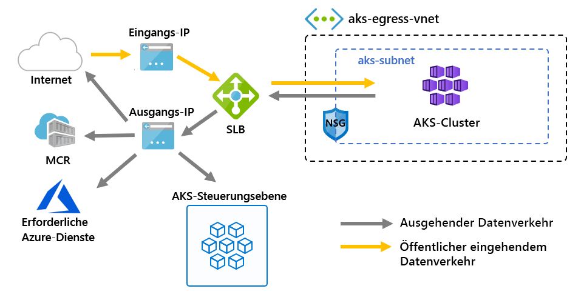

# <a name="customize-cluster-egress-with-a-user-defined-route-preview"></a>Anpassen des ausgehenden Clusterdatenverkehrs mit einer benutzerdefinierten Route (Vorschau)

Der von einem AKS-Cluster ausgehende Datenverkehr kann an verschiedene Szenarien angepasst werden. Standardmäßig stellt AKS eine Lastenausgleichsressource mit einer Standard-SKU bereit, die für ausgehenden Datenverkehr eingerichtet und verwendet werden kann. Das Standardsetup erfüllt aber möglicherweise nicht alle Anforderungen in allen Szenarien, wenn öffentliche IP-Adressen nicht zulässig oder zusätzliche Hops für den ausgehenden Datenverkehr erforderlich sind.

In diesem Artikel wird beschrieben, wie Sie die ausgehende Route eines Clusters an verschiedene Netzwerkszenarien anpassen, wenn beispielsweise öffentliche IP-Adressen nicht zulässig sind und der Cluster hinter einem virtuellen Netzwerkgerät platziert werden muss.

> [!IMPORTANT]
> AKS-Previewfunktionen stehen gemäß dem Self-Service-Prinzip und auf Aktivierungsbasis zur Verfügung. Vorschauversionen werden *wie besehen* und *wie verfügbar* bereitgestellt und sind von den Vereinbarungen zum Service Level (SLA) und der eingeschränkten Garantie ausgeschlossen. AKS-Vorschauversionen werden teilweise vom Kundensupport auf Grundlage der *bestmöglichen Leistung* abgedeckt. Daher sind die Funktionen nicht für den Einsatz in der Produktion vorgesehen. Weitere Informationen finden Sie in den folgenden Supportartikeln:
>
> * [Unterstützungsrichtlinien für Azure Kubernetes Service](support-policies.md)
> * [Häufig gestellte Fragen zum Azure-Support](faq.md)

## <a name="prerequisites"></a>Voraussetzungen
* Azure CLI, Version 2.0.81 oder höher
* Azure CLI Preview-Erweiterung, Version 0.4.28 oder höher
* API-Version `2020-01-01` oder höher

## <a name="install-the-latest-azure-cli-aks-preview-extension"></a>Installieren der neuesten AKS-Vorschauerweiterung für die Azure CLI
Um den Typ des ausgehenden Datenverkehrs für einen privaten Cluster festzulegen, benötigen Sie Version 0.4.18 oder höher der AKS-Vorschauerweiterung für die Azure CLI. Installieren Sie die AKS-Vorschauerweiterung für die Azure CLI, indem Sie den Befehl „az extension add“ verwenden und dann mit dem folgenden Befehl „az extension update“ nach verfügbaren Updates suchen:

```azure-cli
# Install the aks-preview extension
az extension add --name aks-preview

# Update the extension to make sure you have the latest version installed
az extension update --name aks-preview
```

## <a name="limitations"></a>Einschränkungen
* Während der Vorschau kann `outboundType` nur zum Zeitpunkt der Clustererstellung definiert werden. Eine spätere Aktualisierung ist nicht möglich.
* Während der Vorschau müssen AKS-Cluster mit `outboundType` Azure CNI verwenden. Kubenet ist konfigurierbar. Die Verwendung erfordert manuelle Zuordnungen der Routingtabelle zum AKS-Subnetz.
* Für `outboundType` sind AKS-Cluster erforderlich, bei denen `vm-set-type` als `VirtualMachineScaleSets` und `load-balancer-sku` als `Standard` festgelegt ist.
* Wenn Sie `outboundType` auf den Wert `UDR` festlegen, wird eine benutzerdefinierte Route mit gültiger ausgehender Konnektivität für den Cluster benötigt.
* Durch Festlegung von `outboundType` auf den Wert `UDR` wird impliziert, dass die IP-Quelladresse des eingehenden Datenverkehrs zum Routing an den Lastenausgleich **nicht** der IP-Zieladresse des vom Cluster ausgehenden Datenverkehrs entspricht.

## <a name="overview-of-outbound-types-in-aks"></a>Übersicht über ausgehende Datenverkehrstypen in AKS

Ein AKS-Cluster kann mit einem eindeutigen `outboundType` als Lastenausgleich oder benutzerdefinierte Route angepasst werden.

> [!IMPORTANT]
> Der ausgehende Typ betrifft nur den ausgehenden Datenverkehr Ihres Clusters. Weitere Informationen finden Sie unter [Einrichten von Eingangscontrollern](ingress-basic.md).

### <a name="outbound-type-of-loadbalancer"></a>Ausgehender Typ von loadBalancer

Wenn `loadBalancer` festgelegt ist, führt AKS das folgende Setup automatisch durch. Ein Lastenausgleich wird für ausgehenden Datenverkehr über eine von AKS zugewiesene öffentliche IP-Adresse verwendet. Ein ausgehender Typ von `loadBalancer` unterstützt Kubernetes-Dienste vom Typ `loadBalancer`, die ausgehenden Datenverkehr von der Lastenausgleichsressource erwarten, der vom AKS-Ressourcenanbieter erstellt wurde.

Das folgende Setup wird von AKS durchgeführt.
   * Für ausgehenden Datenverkehr vom Cluster wird eine öffentliche IP-Adresse bereitgestellt.
   * Die öffentliche IP-Adresse ist der Lastenausgleichsressource zugewiesen.
   * Für Agent-Knoten im Cluster werden Back-End-Pools für den Lastenausgleich eingerichtet.

Hier sehen Sie eine Netzwerktopologie, die standardmäßig in AKS-Clustern bereitgestellt wird und `loadBalancer` als `outboundType` verwendet.



### <a name="outbound-type-of-userdefinedrouting"></a>Ausgehender Typ von userDefinedRouting

> [!NOTE]
> Die Verwendung von ausgehenden Typen ist ein erweitertes Netzwerkszenario und erfordert eine ordnungsgemäße Netzwerkkonfiguration.

Wenn `userDefinedRouting` festgelegt ist, konfiguriert AKS ausgehende Datenpfade nicht automatisch. Folgende Konfiguration muss vom **Benutzer** vorgenommen werden.

Der AKS-Cluster muss in einem vorhandenen virtuellen Netzwerk mit einem konfigurierten Subnetz bereitgestellt werden. Bei Verwendung der Standardlastenausgleichs-Architektur müssen Sie expliziten ausgehenden Datenverkehr herstellen. Hierzu müssen ausgehende Anforderungen an ein Gerät, z. B. eine Firewall oder ein Gateway, gesendet werden, oder Sie müssen den ausgehenden Datenverkehr über eine öffentliche IP-Adresse zulassen, die dem Standardlastenausgleich oder einem bestimmten Knoten zugewiesen ist.

Der AKS-Ressourcenanbieter stellt eine standardmäßige Lastenausgleichsressource (Standard Load Balancer, SLB) bereit. Der Lastenausgleich wird ohne jede Regeln konfiguriert und [verursacht erst dann Gebühren, wenn eine Regel platziert wird](https://azure.microsoft.com/pricing/details/load-balancer/). AKS stellt **nicht** automatisch eine öffentliche IP-Adresse für das SLB-Front-End bereit. AKS konfiguriert den Back-End-Pool für den Lastenausgleich **nicht** automatisch.

## <a name="deploy-a-cluster-with-outbound-type-of-udr-and-azure-firewall"></a>Bereitstellen eines Clusters mit dem ausgehenden Typ „UDR“ und Azure Firewall

Um die Anwendung eines Clusters mit ausgehendem Typ und einer benutzerdefinierten Route zu veranschaulichen, kann der Cluster in einem virtuellen Netzwerk konfiguriert werden, das über ein Peernetzwerk mit einer Azure Firewall-Instanz verbunden ist.


* Der eingehende Datenverkehr muss durch Firewallfilter geleitet werden.
   * Ein isoliertes Subnetz enthält einen internen Lastenausgleich zur Weiterleitung an Agent-Knoten.
   * Agent-Knoten sind in einem dedizierten Subnetz isoliert.
* Ausgehende Anforderungen werden von Agent-Knoten über eine benutzerdefinierte Route an die interne IP-Adresse der Azure Firewall-Instanz geleitet.
   * Anforderungen von AKS-Agent-Knoten folgen einer benutzerdefinierten Route, die in dem Subnetz platziert wurde, in dem der AKS-Cluster bereitgestellt ist.
   * Azure Firewall leitet ausgehenden Datenverkehr über ein Front-End mit öffentlicher IP-Adresse aus dem virtuellen Netzwerk.
   * Der Zugriff auf die AKS-Steuerungsebene wird durch eine Netzwerksicherheitsgruppe geschützt, mit der die IP-Adresse des Firewall-Front-Ends aktiviert wurde.
   * Der Zugriff auf das öffentliche Internet oder andere Azure-Dienste erfolgt sowohl für eingehenden als auch für ausgehenden Datenverkehr über die IP-Adresse des Firewall-Front-Ends.

### <a name="set-configuration-via-environment-variables"></a>Festlegen der Konfiguration mit Umgebungsvariablen

Definieren Sie eine Reihe von Umgebungsvariablen, die bei der Erstellung von Ressourcen verwendet werden können.

```bash
PREFIX="contosofin"
RG="${PREFIX}-rg"
LOC="eastus"
NAME="${PREFIX}outboundudr"
AKS_NAME="${PREFIX}aks"
VNET_NAME="${PREFIX}vnet"
AKSSUBNET_NAME="${PREFIX}akssubnet"
SVCSUBNET_NAME="${PREFIX}svcsubnet"
# DO NOT CHANGE FWSUBNET_NAME - This is currently a requirement for Azure Firewall.
FWSUBNET_NAME="AzureFirewallSubnet"
FWNAME="${PREFIX}fw"
FWPUBLICIP_NAME="${PREFIX}fwpublicip"
FWIPCONFIG_NAME="${PREFIX}fwconfig"
FWROUTE_TABLE_NAME="${PREFIX}fwrt"
FWROUTE_NAME="${PREFIX}fwrn"
FWROUTE_NAME_INTERNET="${PREFIX}fwinternet"
DEVSUBNET_NAME="${PREFIX}dev"
```

Als Nächstes legen Sie Abonnement-IDs fest.

```azure-cli

# NOTE: Update Subscription Name
# Set Default Azure Subscription to be Used via Subscription ID

az account set -s <SUBSCRIPTION_ID_GOES_HERE>

# NOTE: Update Subscription Name for setting SUBID

SUBID=$(az account show -s '<SUBSCRIPTION_NAME_GOES_HERE>' -o tsv --query 'id')
```

## <a name="create-a-virtual-network-with-multiple-subnets"></a>Erstellen eines virtuellen Netzwerks mit mehreren Subnetzen

Stellen Sie ein virtuelles Netzwerk mit drei separaten Subnetzen bereit: jeweils eins für den Cluster, die Firewall und den eingehenden Dienstdatenverkehr.


Erstellen Sie eine Ressourcengruppe für alle Ressourcen.

```azure-cli
# Create Resource Group

az group create --name $RG --location $LOC
```

Erstellen Sie zwei virtuelle Netzwerke zum Hosten des AKS-Clusters und der Azure Firewall-Instanz. Cluster und Firewall verfügen jeweils über ein eigenes Subnetz. Beginnen wir mit dem AKS-Netzwerk.

```
# Dedicated virtual network with AKS subnet

az network vnet create \
    --resource-group $RG \
    --name $VNET_NAME \
    --address-prefixes 100.64.0.0/16 \
    --subnet-name $AKSSUBNET_NAME \
    --subnet-prefix 100.64.1.0/24

# Dedicated subnet for K8s services

az network vnet subnet create \
    --resource-group $RG \
    --vnet-name $VNET_NAME \
    --name $SVCSUBNET_NAME \
    --address-prefix 100.64.2.0/24

# Dedicated subnet for Azure Firewall (Firewall name cannot be changed)

az network vnet subnet create \
    --resource-group $RG \
    --vnet-name $VNET_NAME \
    --name $FWSUBNET_NAME \
    --address-prefix 100.64.3.0/24
```

## <a name="create-and-setup-an-azure-firewall-with-a-udr"></a>Erstellen und Einrichten einer Azure Firewall-Instanz mit einer benutzerdefinierten Route

Für Azure Firewall müssen Eingangs- und Ausgangsregeln konfiguriert werden. Die Firewall dient hauptsächlich dazu, es Organisationen zu ermöglichen, differenzierte Regeln für ein- und ausgehenden Datenverkehr in den und aus dem AKS-Cluster einzurichten.


Erstellen Sie eine öffentliche IP-Adresse mit einer Standard-SKU, die als Front-End-Adresse für Azure Firewall verwendet wird.

```azure-cli
az network public-ip create -g $RG -n $FWPUBLICIP_NAME -l $LOC --sku "Standard"
```

Registrieren Sie die Azure CLI Preview-Erweiterung, um eine Azure Firewall-Instanz zu erstellen.
```azure-cli
# Install Azure Firewall preview CLI extension

az extension add --name azure-firewall

# Deploy Azure Firewall

az network firewall create -g $RG -n $FWNAME -l $LOC
```

Die erstellte IP-Adresse kann jetzt dem Firewall-Front-End zugewiesen werden.
> [!NOTE]
> Das Einrichten der öffentlichen IP-Adresse für Azure Firewall kann einige Minuten dauern.
> 
> Wenn für den unten stehenden Befehl wiederholt Fehler zurückgegeben werden, löschen Sie die vorhandene Firewall und die zugewiesene IP-Adresse. Stellen Sie dann die öffentliche IP-Adresse und Azure Firewall gleichzeitig über das Portal bereit.

```azure-cli
# Configure Firewall IP Config

az network firewall ip-config create -g $RG -f $FWNAME -n $FWIPCONFIG_NAME --public-ip-address $FWPUBLICIP_NAME --vnet-name $VNET_NAME
```

Wenn der oben stehende Befehl erfolgreich ausgeführt wurde, speichern Sie die IP-Adresse des Firewall-Front-Ends zur späteren Konfiguration.

```bash
# Capture Firewall IP Address for Later Use

FWPUBLIC_IP=$(az network public-ip show -g $RG -n $FWPUBLICIP_NAME --query "ipAddress" -o tsv)
FWPRIVATE_IP=$(az network firewall show -g $RG -n $FWNAME --query "ipConfigurations[0].privateIpAddress" -o tsv)
```

### <a name="create-a-udr-with-a-hop-to-azure-firewall"></a>Erstellen einer benutzerdefinierten Route mit einem Hop zu Azure Firewall

Azure führt für Datenverkehr automatisch das Routing zwischen Azure-Subnetzen, virtuellen Netzwerken und lokalen Netzwerken durch. Wenn Sie das Standardrouting von Azure ändern möchten, erstellen Sie eine Routingtabelle.

Erstellen Sie eine leere Routingtabelle, die einem bestimmten Subnetz zugeordnet werden kann. Die Routingtabelle definiert die oben erstellte Azure Firewall-Instanz als nächsten Hop. Jedem Subnetz können null oder mehr Routentabellen zugeordnet sein.

```azure-cli
# Create UDR and add a route for Azure Firewall

az network route-table create -g $RG --name $FWROUTE_TABLE_NAME
az network route-table route create -g $RG --name $FWROUTE_NAME --route-table-name $FWROUTE_TABLE_NAME --address-prefix 0.0.0.0/0 --next-hop-type VirtualAppliance --next-hop-ip-address $FWPRIVATE_IP --subscription $SUBID
az network route-table route create -g $RG --name $FWROUTE_NAME_INTERNET --route-table-name $FWROUTE_TABLE_NAME --address-prefix $FWPUBLIC_IP/32 --next-hop-type Internet
```

Informationen zum Außerkraftsetzen der Standardsystemrouten von Azure sowie zum Hinzufügen zusätzlicher Routen zur Routingtabelle eines Subnetzes finden Sie in der [Dokumentation zu Routingtabellen für virtuelle Netzwerke](../virtual-network/virtual-networks-udr-overview.md#user-defined).

## <a name="adding-network-firewall-rules"></a>Hinzufügen von Netzwerkfirewallregeln

> [!WARNING]
> Im Folgenden sehen Sie ein Beispiel für das Hinzufügen einer Firewallregel. Alle in [erforderliche Endpunkte für ausgehenden Datenverkehr](egress.md) definierten Endpunkte müssen durch Anwendungsfirewallregeln aktiviert werden, damit die AKS-Cluster funktionieren. Ohne Aktivierung dieser Endpunkte ist Ihr Cluster nicht betriebsbereit.

Im Folgenden sehen Sie ein Beispiel für eine Netzwerk- und Anwendungsregel. Wir fügen eine Netzwerkregel hinzu, die alle Protokolle, Quelladressen, Zieladressen und Zielports zulässt. Wir fügen auch eine Anwendungsregel für **einige** der für AKS erforderlichen Endpunkte hinzu.

In einem Produktionsszenario sollten Sie nur den Zugriff auf die für Ihre Anwendung erforderlichen Endpunkte sowie auf die in [für AKS erforderlichen Endpunkte für ausgehenden Datenverkehr](egress.md) definierten Endpunkte zulassen.

```
# Add Network FW Rules

az network firewall network-rule create -g $RG -f $FWNAME --collection-name 'aksfwnr' -n 'netrules' --protocols 'Any' --source-addresses '*' --destination-addresses '*' --destination-ports '*' --action allow --priority 100

# Add Application FW Rules
# IMPORTANT: Add AKS required egress endpoints

az network firewall application-rule create -g $RG -f $FWNAME \
    --collection-name 'AKS_Global_Required' \
    --action allow \
    --priority 100 \
    -n 'required' \
    --source-addresses '*' \
    --protocols 'http=80' 'https=443' \
    --target-fqdns \
        'aksrepos.azurecr.io' \
        '*blob.core.windows.net' \
        'mcr.microsoft.com' \
        '*cdn.mscr.io' \
        '*.data.mcr.microsoft.com' \
        'management.azure.com' \
        'login.microsoftonline.com' \
        'ntp.ubuntu.com' \
        'packages.microsoft.com' \
        'acs-mirror.azureedge.net'
```

Weitere Informationen zum Azure Firewall-Dienst finden Sie in der [Azure Firewall-Dokumentation](https://docs.microsoft.com/azure/firewall/overview).

## <a name="associate-the-route-table-to-aks"></a>Zuordnen der Routingtabelle zu AKS

Um den Cluster der Firewall zuzuordnen, muss das dedizierte Subnetz für das Subnetz des Clusters auf die oben erstellte Routingtabelle verweisen. Zur Zuordnung geben Sie einen Befehl zum Aktualisieren der Routingtabelle des Clustersubnetzes an das virtuelle Netzwerk aus, in dem sich sowohl der Cluster als auch die Firewall befinden.

```azure-cli
# Associate route table with next hop to Firewall to the AKS subnet

az network vnet subnet update -g $RG --vnet-name $VNET_NAME --name $AKSSUBNET_NAME --route-table $FWROUTE_TABLE_NAME
```

## <a name="deploy-aks-with-outbound-type-of-udr-to-the-existing-network"></a>Bereitstellen von AKS mit dem ausgehenden Typ „UDR“ im vorhandenen Netzwerk

Jetzt kann ein AKS-Cluster im vorhandenen virtuellen Netzwerk bereitgestellt werden. Um einen Cluster mit dem ausgehenden Typ „UDR“ einzurichten, muss ein vorhandenes Netzwerk in AKS bereitgestellt werden.


### <a name="create-a-service-principal-with-access-to-provision-inside-the-existing-virtual-network"></a>Erstellen eines Dienstprinzipals mit Bereitstellungszugriff im vorhandenen virtuellen Netzwerk

AKS verwendet einen Dienstprinzipal zum Erstellen von Clusterressourcen. Mit dem Dienstprinzipal, der zum Zeitpunkt der Erstellung übergeben wird, werden zugrunde liegende AKS-Ressourcen wie VMs, Speicher und Lastenausgleichsressourcen erstellt, die von AKS verwendet werden. Wenn dem Dienstprinzipal keine ausreichenden Berechtigungen erteilt werden, ist die Bereitstellung eines AKS-Clusters nicht möglich.

```azure-cli
# Create SP and Assign Permission to Virtual Network

az ad sp create-for-rbac -n "${PREFIX}sp" --skip-assignment
```

Ersetzen Sie im folgenden Code `APPID` und `PASSWORD` durch die App-ID und das Kennwort für den Dienstprinzipal, die bzw. das von der vorherigen Befehlsausgabe automatisch generiert wurde. Wir verweisen auf die VNET-Ressourcen-ID, um dem Dienstprinzipal Berechtigungen zu erteilen, sodass AKS Ressourcen in diesem VNET bereitstellen kann.

```azure-cli
APPID="<SERVICE_PRINCIPAL_APPID_GOES_HERE>"
PASSWORD="<SERVICEPRINCIPAL_PASSWORD_GOES_HERE>"
VNETID=$(az network vnet show -g $RG --name $VNET_NAME --query id -o tsv)

# Assign SP Permission to VNET

az role assignment create --assignee $APPID --scope $VNETID --role Contributor

# View Role Assignment
az role assignment list --assignee $APPID --all -o table
```

### <a name="deploy-aks"></a>Bereitstellen von AKS

Schließlich kann der AKS-Cluster in dem vorhandenen Subnetz bereitgestellt werden, das dediziert für den Cluster erstellt wurde. Das Zielsubnetz, in dem die Bereitstellung erfolgen soll, wird mit der Umgebungsvariable `$SUBNETID` definiert. In den vorherigen Schritten wurde die `$SUBNETID`-Variable nicht definiert. Zum Festlegen des Werts für die Subnetz-ID können Sie den folgenden Befehl verwenden:

```azurecli
SUBNETID="/subscriptions/$SUBID/resourceGroups/$RG/providers/Microsoft.Network/virtualNetworks/$VNET_NAME/subnets/$AKSSUBNET_NAME"
```

Wir definieren den ausgehenden Typ so, dass er der im Subnetz vorhandenen benutzerdefinierten Route folgt. So kann AKS die Einrichtung und Bereitstellung einer IP-Adresse für die Lastenausgleichsressource überspringen, und der Lastenausgleich kann jetzt strikt intern erfolgen.

Das AKS-Feature für [vom API-Server autorisierte IP-Adressbereiche](api-server-authorized-ip-ranges.md) kann hinzugefügt werden, um den Zugriff des API-Servers auf den öffentlichen Endpunkt der Firewall zu beschränken. Das Feature für autorisierte IP-Adressbereiche ist im Diagramm als die Netzwerksicherheitsgruppe dargestellt, die zum Zugriff auf die Steuerungsebene passiert werden muss. Wenn Sie das Feature für autorisierte IP-Adressbereiche verwenden, um den API-Serverzugriff einzuschränken, müssen Ihre Entwicklertools eine Jumpbox für das virtuelle Netzwerk der Firewall verwenden, oder Sie müssen alle Entwicklerendpunkte zum autorisierten IP-Adressbereich hinzufügen.

> [!TIP]
> Der Clusterbereitstellung können weitere Features hinzugefügt werden, beispielsweise (Private Cluster)[]. Wenn Sie autorisierte IP-Adressbereiche verwenden, ist im Clusternetzwerk eine Jumpbox für den Zugriff auf den API-Server erforderlich.

```azure-cli
az aks create -g $RG -n $AKS_NAME -l $LOC \
  --node-count 3 \
  --network-plugin azure --generate-ssh-keys \
  --service-cidr 192.168.0.0/16 \
  --dns-service-ip 192.168.0.10 \
  --docker-bridge-address 172.22.0.1/29 \
  --vnet-subnet-id $SUBNETID \
  --service-principal $APPID \
  --client-secret $PASSWORD \
  --load-balancer-sku standard \
  --outbound-type userDefinedRouting \
  --api-server-authorized-ip-ranges $FWPUBLIC_IP
  ```

### <a name="enable-developer-access-to-the-api-server"></a>Ermöglichen des Entwicklerzugriffs auf den API-Server

Da für den Cluster autorisierte IP-Adressbereiche eingerichtet wurden, müssen Sie die IP-Adressen Ihrer Entwicklertools zur AKS-Clusterliste mit genehmigten IP-Adressen hinzufügen, um auf den API-Server zugreifen zu können. Eine andere Möglichkeit besteht darin, in einem separaten Subnetz innerhalb des virtuellen Netzwerks von Azure Firewall eine Jumpbox mit den erforderlichen Tools zu konfigurieren.

Mit dem folgenden Befehl fügen Sie dem Bereich der genehmigten IP-Adressen eine weitere Adresse hinzu.

```bash
# Retrieve your IP address
CURRENT_IP=$(dig @resolver1.opendns.com ANY myip.opendns.com +short)

# Add to AKS approved list
az aks update -g $RG -n $AKS_NAME --api-server-authorized-ip-ranges $CURRENT_IP/32

```

 Mit dem Befehl [az aks get-credentials][az-aks-get-credentials] können Sie `kubectl` für das Herstellen einer Verbindung mit Ihrem neu erstellten Kubernetes-Cluster konfigurieren. 

 ```azure-cli
 az aks get-credentials -g $RG -n $AKS_NAME
 ```

### <a name="setup-the-internal-load-balancer"></a>Einrichten des internen Lastenausgleichs

AKS stellt mit dem Cluster eine Lastenausgleichsressource bereit, die als [interner Lastenausgleich](internal-lb.md) eingerichtet werden kann.

Um einen internen Lastenausgleich einzurichten, erstellen Sie, wie im folgenden Beispiel gezeigt, ein Dienstmanifest namens „internal-lb.yaml“ mit dem Diensttyp „LoadBalancer“ und der Anmerkung „azure-load-balancer-internal“:

```yaml
apiVersion: v1
kind: Service
metadata:
  name: internal-app
  annotations:
    service.beta.kubernetes.io/azure-load-balancer-internal: "true"
    service.beta.kubernetes.io/azure-load-balancer-internal-subnet: "contosofinsvcsubnet"
spec:
  type: LoadBalancer
  ports:
  - port: 80
  selector:
    app: internal-app
```

Stellen Sie den internen Lastenausgleich über den Befehl „kubectl-apply“ bereit, und geben Sie den Namen Ihres YAML-Manifests an:

```bash
kubectl apply -f internal-lb.yaml
```

## <a name="deploy-a-kubernetes-service"></a>Bereitstellen eines Kubernetes-Diensts

Da der Typ des ausgehenden Datenverkehrs für den Clusters als „UDR“ festgelegt ist, wird die Zuordnung der Agent-Knoten als Back-End-Pool für den Lastenausgleich von AKS zum Zeitpunkt der Clustererstellung nicht automatisch abgeschlossen. Die Zuordnung des Back-End-Pools wird jedoch vom Kubernetes-Cloudanbieter in Azure verarbeitet, wenn der Kubernetes-Dienst bereitgestellt wird.

Stellen Sie die Azure-Abstimmungs-App bereit, indem Sie den folgenden YAML-Code in eine Datei namens `example.yaml` kopieren.

```yaml
apiVersion: apps/v1
kind: Deployment
metadata:
  name: azure-vote-back
spec:
  replicas: 1
  selector:
    matchLabels:
      app: azure-vote-back
  template:
    metadata:
      labels:
        app: azure-vote-back
    spec:
      nodeSelector:
        "beta.kubernetes.io/os": linux
      containers:
      - name: azure-vote-back
        image: redis
        resources:
          requests:
            cpu: 100m
            memory: 128Mi
          limits:
            cpu: 250m
            memory: 256Mi
        ports:
        - containerPort: 6379
          name: redis
---
apiVersion: v1
kind: Service
metadata:
  name: azure-vote-back
spec:
  ports:
  - port: 6379
  selector:
    app: azure-vote-back
---
apiVersion: apps/v1
kind: Deployment
metadata:
  name: azure-vote-front
spec:
  replicas: 1
  selector:
    matchLabels:
      app: azure-vote-front
  template:
    metadata:
      labels:
        app: azure-vote-front
    spec:
      nodeSelector:
        "beta.kubernetes.io/os": linux
      containers:
      - name: azure-vote-front
        image: microsoft/azure-vote-front:v1
        resources:
          requests:
            cpu: 100m
            memory: 128Mi
          limits:
            cpu: 250m
            memory: 256Mi
        ports:
        - containerPort: 80
        env:
        - name: REDIS
          value: "azure-vote-back"
---
apiVersion: v1
kind: Service
metadata:
  name: azure-vote-front
  annotations:
    service.beta.kubernetes.io/azure-load-balancer-internal: "true"
    service.beta.kubernetes.io/azure-load-balancer-internal-subnet: "contosofinsvcsubnet"
spec:
  type: LoadBalancer
  ports:
  - port: 80
  selector:
    app: azure-vote-front
```

Stellen Sie den Dienst bereit, indem Sie Folgendes ausführen:

```bash
kubectl apply -f example.yaml
```

## <a name="add-a-dnat-rule-to-azure-firewall"></a>Hinzufügen einer DNAT-Regel zu Azure Firewall

Um die eingehende Konnektivität zu konfigurieren, muss eine DNAT-Regel für die Azure Firewall-Instanz geschrieben werden. Um die Konnektivität mit unserem Cluster zu testen, wird eine Regel definiert, um die öffentliche IP-Adresse des Firewall-Front-Ends an die interne IP-Adresse zu routen, die vom internen Dienst verfügbar gemacht wurde.

Die Zieladresse kann angepasst werden, da es sich um den Port in der Firewall handelt, auf die zugegriffen werden soll. Die übersetzte Adresse muss die IP-Adresse des internen Lastenausgleichs sein. Der übersetzte Port muss der verfügbar gemachte Port für Ihren Kubernetes-Dienst sein.

Sie müssen die interne IP-Adresse angeben, die der vom Kubernetes-Dienst erstellten Lastenausgleichsressource zugewiesen wird. Rufen Sie die Adresse ab, indem Sie Folgendes ausführen:

```bash
kubectl get services
```

Die erforderliche IP-Adresse wird in der Spalte „EXTERNAL-IP“ aufgeführt, ähnlich wie im folgenden Beispiel.

```bash
NAME               TYPE           CLUSTER-IP       EXTERNAL-IP   PORT(S)        AGE
azure-vote-back    ClusterIP      192.168.92.209   <none>        6379/TCP       23m
azure-vote-front   LoadBalancer   192.168.19.183   100.64.2.5    80:32106/TCP   23m
kubernetes         ClusterIP      192.168.0.1      <none>        443/TCP        4d3h
```

```azure-cli
az network firewall nat-rule create --collection-name exampleset --destination-addresses $FWPUBLIC_IP --destination-ports 80 --firewall-name $FWNAME --name inboundrule --protocols Any --resource-group $RG --source-addresses '*' --translated-port 80 --action Dnat --priority 100 --translated-address <INSERT IP OF K8s SERVICE>
```

## <a name="clean-up-resources"></a>Bereinigen von Ressourcen

> [!NOTE]
> Wenn nach dem Löschen des internen Kubernetes-Diensts der interne Lastenausgleich von keinem Dienst mehr verwendet wird, löscht der Azure-Cloudanbieter den internen Lastenausgleich. Bei der nächsten Dienstbereitstellung wird ein Lastenausgleich bereitgestellt, wenn in der angeforderten Konfiguration keiner gefunden wird.

Um die Azure-Ressourcen zu bereinigen, löschen Sie die AKS-Ressourcengruppe.

```azure-cli
az group delete -g $RG
```

## <a name="validate-connectivity"></a>Überprüfen der Konnektivität

Navigieren Sie in einem Browser zur IP-Adresse des Azure Firewall-Front-Ends, um die Konnektivität zu überprüfen.

Es sollte ein Bild der Azure-Abstimmungs-App angezeigt werden.

## <a name="next-steps"></a>Nächste Schritte

Weitere Informationen finden Sie unter [Übersicht über benutzerdefinierte Routen in Azure-Netzwerken](https://docs.microsoft.com/azure/virtual-network/virtual-networks-udr-overview).

Weitere Informationen finden Sie auch unter [Erstellen, Ändern oder Löschen einer Routingtabelle](https://docs.microsoft.com/azure/virtual-network/manage-route-table).

<!-- LINKS - internal -->
[az-aks-get-credentials]: /cli/azure/aks?view=azure-cli-latest#az-aks-get-credentials
