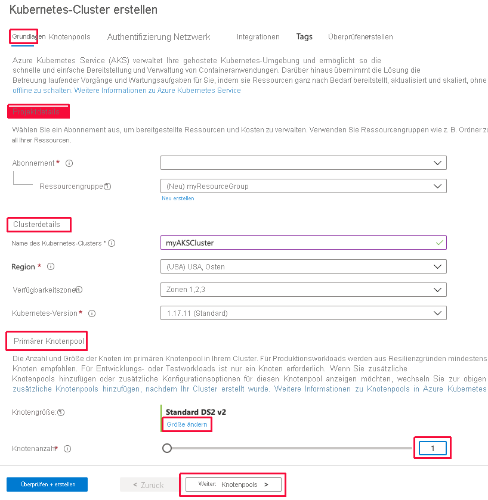

# <a name="quickstart-deploy-an-azure-kubernetes-service-aks-cluster-using-the-azure-portal"></a>Schnellstart: Bereitstellen eines AKS-Clusters (Azure Kubernetes Service) über das Azure-Portal

Azure Kubernetes Service (AKS) ist ein verwalteter Kubernetes-Dienst, mit dem Sie schnell Cluster bereitstellen und verwalten können. In diesem Schnellstart führen Sie folgende Schritte aus:
* Bereitstellen eines AKS-Clusters mithilfe des Azure-Portals 
* Ausführen einer Anwendung mit mehreren Containern im Cluster, die ein Web-Front-End und eine Redis-Instanz enthält 
* Überwachen der Integrität des Clusters und der Pods, in denen Ihre Anwendung ausgeführt wird


Für diese Schnellstartanleitung werden Grundkenntnisse in Bezug auf die Kubernetes-Konzepte vorausgesetzt. Weitere Informationen finden Sie unter [Grundlegende Kubernetes-Konzepte für Azure Kubernetes Service (AKS)][kubernetes-concepts].

Wenn Sie kein Azure-Abonnement besitzen, können Sie ein [kostenloses Konto](https://azure.microsoft.com/free/?WT.mc_id=A261C142F) erstellen, bevor Sie beginnen.

## <a name="prerequisites"></a>Voraussetzungen

Melden Sie sich unter [https://portal.azure.com](https://portal.azure.com) beim Azure-Portal an.

## <a name="create-an-aks-cluster"></a>Erstellen eines AKS-Clusters

1. Wählen Sie im Menü des Azure-Portals oder auf der **Startseite** die Option **Ressource erstellen** aus.

2. Wählen Sie **Container** > **Kubernetes-Dienst** aus.

3. Konfigurieren Sie auf der Seite **Grundlagen** die folgenden Optionen:
    - **Projektdetails**: 
        * Wählen Sie ein Azure-**Abonnement** aus.
        * Wählen Sie eine Azure-**Ressourcengruppe** wie z. B. *myResourceGroup* aus, oder erstellen Sie eine solche.
    - **Clusterdetails**: 
        * Geben Sie unter **Kubernetes cluster name** (Name des Kubernetes-Clusters) einen Namen ein, etwa *myAKSCluster*. 
        * Wählen Sie eine **Region** und eine **Kubernetes-Version** für den AKS-Cluster aus.
    - **Primärer Knotenpool**: 
        * Wählen Sie eine VM-**Knotengröße** für die AKS-Knoten aus. Die VM-Größe kann *nicht* geändert werden, sobald ein AKS-Cluster bereitgestellt wurde.
        * Wählen Sie die Anzahl von Knoten für die Bereitstellung im Cluster aus. Legen Sie für diese Schnellstartanleitung für **Anzahl von Knoten** die Option *1* fest. Die Knotenanzahl *kann* nach der Clusterbereitstellung angepasst werden.
    
    

4. Klicken Sie auf **Weiter: Knotenpools**, wenn Sie fertig sind.

5. Übernehmen Sie die Standardoptionen für **Knotenpools**. Klicken Sie im unteren Bildschirmbereich auf **Weiter: Authentifizierung**.
    > [!CAUTION]
    > Die Verteilung und Bereitstellung neu erstellter Azure AD-Dienstprinzipale kann mehrere Minuten dauern. Dadurch können im Azure-Portal Fehler vom Typ „Dienstprinzipal nicht gefunden“ sowie Validierungsfehler auftreten. Lesen Sie in diesem Fall den [Artikel zur Problembehandlung](troubleshooting.md#received-an-error-saying-my-service-principal-wasnt-found-or-is-invalid-when-i-try-to-create-a-new-cluster).

6. Konfigurieren Sie auf der Seite **Authentifizierung** die folgenden Optionen:
    - Erstellen Sie mit einer der folgenden Methoden eine neue Clusteridentität:
        * Übernehmen Sie im Feld **Authentifizierung** die Option **Systemseitig zugewiesene verwaltete Identität**.
        * Wählen Sie zur Verwendung eines Dienstprinzipals die Option **Dienstprinzipal** aus. 
            * Wählen Sie *(Neuer) Standarddienstprinzipal* aus, um einen Standarddienstprinzipal zu erstellen. Oder:
            * Wählen Sie *Dienstprinzipal konfigurieren* aus, um einen vorhandenen Dienstprinzipal zu verwenden. Sie müssen die SPN-Client-ID und das Geheimnis des vorhandenen Prinzipals angeben.
    - Aktivieren Sie die rollenbasierte Zugriffssteuerung für Kubernetes (Kubernetes RBAC), um eine präzisere Steuerung des Zugriffs auf die Kubernetes-Ressourcen zu ermöglichen, die in Ihrem AKS-Cluster bereitgestellt werden.

    Standardmäßig werden *Basis*-Netzwerke verwendet, und Azure Monitor für Container ist aktiviert. 

7. Klicken Sie auf **Überprüfen + erstellen** und danach auf **Erstellen**, wenn die Überprüfung abgeschlossen ist. 


8. Die Erstellung des AKS-Clusters dauert einige Minuten. Navigieren Sie nach Abschluss der Bereitstellung wie folgt zu Ihrer Ressource:
    * Klicken Sie auf **Zu Ressource wechseln**. Oder:
    * Navigieren Sie zur AKS-Clusterressourcengruppe, und wählen Sie die AKS-Ressource aus. 
        * Siehe folgendes Beispielclusterdashboard: Navigieren Sie zu *myResourceGroup*, und wählen Sie die Ressource *myAKSCluster* aus.

        

## <a name="connect-to-the-cluster"></a>Herstellen einer Verbindung mit dem Cluster

Verwenden Sie zum Verwalten eines Kubernetes-Clusters den Kubernetes-Befehlszeilenclient [kubectl][kubectl]. `kubectl` ist bei Verwendung von Azure Cloud Shell bereits installiert. 

1. Öffnen Sie Cloud Shell über die Schaltfläche `>_` oben im Azure-Portal.

    

    > [!NOTE]
    > So führen Sie diese Vorgänge in einer lokalen Shellinstallation durch:
    > 1. Überprüfen Sie, ob die Azure-Befehlszeilenschnittstelle installiert ist.
    > 2. Stellen Sie über den Befehl `az login` eine Verbindung mit Azure her.

2. Mit dem Befehl [az aks get-credentials][az-aks-get-credentials] können Sie `kubectl` für die Verbindungsherstellung mit Ihrem Kubernetes-Cluster konfigurieren. Der folgende Befehl lädt Anmeldeinformationen herunter und konfiguriert die Kubernetes-Befehlszeilenschnittstelle für deren Verwendung:

    ```azurecli
    az aks get-credentials --resource-group myResourceGroup --name myAKSCluster
    ```

3. Überprüfen Sie die Verbindung mit Ihrem Cluster mithilfe des Befehls `kubectl get`, um eine Liste der Clusterknoten zurückzugeben.

    ```console
    kubectl get nodes
    ```

    Die Ausgabe zeigt den in den vorherigen Schritten erstellten einzelnen Knoten. Stellen Sie sicher, dass der Knotenstatus *Bereit* lautet:

    ```output
    NAME                       STATUS    ROLES     AGE       VERSION
    aks-agentpool-14693408-0   Ready     agent     15m       v1.11.5
    ```

## <a name="run-the-application"></a>Ausführen der Anwendung

Eine Kubernetes-Manifestdatei definiert den gewünschten Zustand (Desired State) eines Clusters – also beispielsweise, welche Containerimages ausgeführt werden sollen. 

In dieser Schnellstartanleitung verwenden Sie ein Manifest, um alle Objekte zu erstellen, die zum Ausführen der Azure Vote-Anwendung benötigt werden. Dieses Manifest umfasst zwei Kubernetes-Bereitstellungen:
* Die Azure Vote-Python-Beispielanwendungen
* Eine Redis-Instanz 

Darüber hinaus werden zwei Kubernetes-Dienste erstellt:
* Ein interner Dienst für die Redis-Instanz
* Ein externer Dienst für den Zugriff auf die Azure Vote-Anwendung über das Internet

1. Verwenden Sie in der Cloud Shell einen Editor, um eine Datei namens `azure-vote.yaml` zu erstellen, z. B.:
    * `code azure-vote.yaml`
    * `nano azure-vote.yaml` oder 
    * `vi azure-vote.yaml`. 

1. Fügen Sie die folgende YAML-Definition ein:

    ```yaml
    apiVersion: apps/v1
    kind: Deployment
    metadata:
      name: azure-vote-back
    spec:
      replicas: 1
      selector:
        matchLabels:
          app: azure-vote-back
      template:
        metadata:
          labels:
            app: azure-vote-back
        spec:
          nodeSelector:
            "beta.kubernetes.io/os": linux
          containers:
          - name: azure-vote-back
            image: mcr.microsoft.com/oss/bitnami/redis:6.0.8
            env:
            - name: ALLOW_EMPTY_PASSWORD
              value: "yes"
            resources:
              requests:
                cpu: 100m
                memory: 128Mi
              limits:
                cpu: 250m
                memory: 256Mi
            ports:
            - containerPort: 6379
              name: redis
    ---
    apiVersion: v1
    kind: Service
    metadata:
      name: azure-vote-back
    spec:
      ports:
      - port: 6379
      selector:
        app: azure-vote-back
    ---
    apiVersion: apps/v1
    kind: Deployment
    metadata:
      name: azure-vote-front
    spec:
      replicas: 1
      selector:
        matchLabels:
          app: azure-vote-front
      template:
        metadata:
          labels:
            app: azure-vote-front
        spec:
          nodeSelector:
            "beta.kubernetes.io/os": linux
          containers:
          - name: azure-vote-front
            image: mcr.microsoft.com/azuredocs/azure-vote-front:v1
            resources:
              requests:
                cpu: 100m
                memory: 128Mi
              limits:
                cpu: 250m
                memory: 256Mi
            ports:
            - containerPort: 80
            env:
            - name: REDIS
              value: "azure-vote-back"
    ---
    apiVersion: v1
    kind: Service
    metadata:
      name: azure-vote-front
    spec:
      type: LoadBalancer
      ports:
      - port: 80
      selector:
        app: azure-vote-front
    ```

1. Stellen Sie die Anwendung über den Befehl `kubectl apply` bereit, und geben Sie den Namen Ihres YAML-Manifests an:

    ```console
    kubectl apply -f azure-vote.yaml
    ```

    Die Ausgabe zeigt die erfolgreich erstellten Bereitstellungen und Dienste:

    ```output
    deployment "azure-vote-back" created
    service "azure-vote-back" created
    deployment "azure-vote-front" created
    service "azure-vote-front" created
    ```

## <a name="test-the-application"></a>Testen der Anwendung

Wenn die Anwendung ausgeführt wird, macht ein Kubernetes-Dienst das Anwendungs-Front-End im Internet verfügbar. Dieser Vorgang kann einige Minuten dauern.

Verwenden Sie zum Überwachen des Fortschritts den Befehl `kubectl get service` mit dem Argument `--watch`.

```console
kubectl get service azure-vote-front --watch
```

Die Ausgabe von **EXTERNAL-IP** für den `azure-vote-front`-Dienst lautet zu Beginn *pending*:

```output
NAME               TYPE           CLUSTER-IP   EXTERNAL-IP   PORT(S)        AGE
azure-vote-front   LoadBalancer   10.0.37.27   <pending>     80:30572/TCP   6s
```

Nachdem die externe IP-Adresse (**EXTERNAL-IP**) von *ausstehend* in eine tatsächliche öffentliche IP-Adresse geändert wurde, verwenden Sie `CTRL-C`, um die `kubectl`-Überwachung zu beenden. Die folgende Beispielausgabe zeigt eine gültige öffentliche IP-Adresse, die dem Dienst zugewiesen ist:


```output
azure-vote-front   LoadBalancer   10.0.37.27   52.179.23.131   80:30572/TCP   2m
```

Öffnen Sie die externe IP-Adresse Ihres Diensts in einem Webbrowser, um die Azure-Abstimmungs-App in Aktion zu sehen.


## <a name="monitor-health-and-logs"></a>Überwachung von Integrität und Protokollen

Bei der Erstellung des Clusters wurde Azure Monitor für Container aktiviert. Mit Azure Monitor für Container werden Integritätsmetriken für den AKS-Cluster und für im Cluster ausgeführte Pods bereitgestellt.

Es dauert einige Minuten, bis Metrikdaten im Azure-Portal aufgefüllt werden. So zeigen Sie den aktuellen Status, die Betriebszeit und die Ressourcennutzung für die Azure Vote-Pods an:

1. Navigieren Sie zurück zur AKS-Ressource im Azure-Portal.
1. Wählen Sie auf der linken Seite unter **Überwachung** die Option **Erkenntnisse** aus.
1. Wählen Sie oben die Option **+ Filter hinzufügen aus**.
1. Wählen Sie **Namespace** als Eigenschaft und dann *\<All but kube-system\>* aus.
1. Wählen Sie **Container** aus, um diese anzuzeigen.

Die Container `azure-vote-back` und `azure-vote-front` werden wie im folgenden Beispiel angezeigt:


Wenn Sie Protokolle für den Pod `azure-vote-front` anzeigen möchten, wählen Sie im Dropdown der Containerliste die Option **Containerprotokolle anzeigen** aus. Diese Protokolle enthalten die Datenströme *stdout* und *stderr* aus dem Container.


## <a name="delete-cluster"></a>Löschen von Clustern

Zum Vermeiden von Azure-Gebühren sollten Sie nicht benötigte Ressourcen bereinigen. Wählen Sie auf dem AKS-Clusterdashboard die Schaltfläche **Löschen** aus. Sie können auch den Befehl [az aks delete][az-aks-delete] in Cloud Shell verwenden:

```azurecli
az aks delete --resource-group myResourceGroup --name myAKSCluster --no-wait
```
> [!NOTE]
> Wenn Sie den Cluster löschen, wird der vom AKS-Cluster verwendete Azure Active Directory-Dienstprinzipal nicht entfernt. Schritte zum Entfernen des Dienstprinzipals finden Sie unter den [Überlegungen zum AKS-Dienstprinzipal und dessen Löschung][sp-delete].
> 
> Wenn Sie eine verwaltete Identität verwendet haben, wird die Identität von der Plattform verwaltet und muss nicht entfernt werden.

## <a name="get-the-code"></a>Abrufen des Codes

In dieser Schnellstartanleitung wurden vorab erstellte Containerimages verwendet, um eine Kubernetes-Bereitstellung zu erstellen. Der dazugehörige Anwendungscode, die Dockerfile-Datei und die Kubernetes-Manifestdatei sind [auf GitHub verfügbar][azure-vote-app].

## <a name="next-steps"></a>Nächste Schritte

In dieser Schnellstartanleitung haben Sie einen Kubernetes-Cluster und eine Anwendung mit mehreren Containern dafür bereitgestellt. Greifen Sie für Ihren AKS-Cluster auf das Kubernetes-Webdashboard zu.


Fahren Sie mit dem Tutorial zu Kubernetes-Clustern fort, um anhand eines vollständigen Beispiels mehr über AKS zu erfahren, u. a. zum Erstellen einer Anwendung, Bereitstellen über Azure Container Registry, Aktualisieren einer ausgeführten Anwendung und Skalieren und Upgraden Ihres Clusters.

> [!div class="nextstepaction"]
> [AKS-Tutorial][aks-tutorial]

<!-- LINKS - external -->
[azure-vote-app]: https://github.com/Azure-Samples/azure-voting-app-redis.git
[kubectl]: https://kubernetes.io/docs/user-guide/kubectl/
[kubectl-apply]: https://kubernetes.io/docs/reference/generated/kubectl/kubectl-commands#apply
[kubectl-get]: https://kubernetes.io/docs/reference/generated/kubectl/kubectl-commands#get
[kubernetes-documentation]: https://kubernetes.io/docs/home/

<!-- LINKS - internal -->
[kubernetes-concepts]: concepts-clusters-workloads.md
[az-aks-get-credentials]: /cli/azure/aks#az_aks_get_credentials
[az-aks-delete]: /cli/azure/aks#az_aks_delete
[aks-monitor]: ../azure-monitor/containers/container-insights-overview.md
[aks-network]: ./concepts-network.md
[aks-tutorial]: ./tutorial-kubernetes-prepare-app.md
[http-routing]: ./http-application-routing.md
[sp-delete]: kubernetes-service-principal.md#additional-considerations