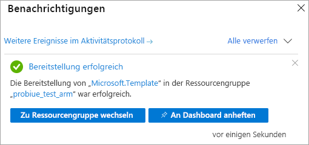

# <a name="quickstart-create-a-server---azure-resource-manager-template"></a>Schnellstart: Erstellen eines Servers – Azure Resource Manager-Vorlage

In dieser Schnellstartanleitung wird erläutert, wie eine Analysis Services-Serverressource in Ihrem Azure-Abonnement mithilfe einer Resource Manager-Vorlage erstellt wird.

[!INCLUDE [About Azure Resource Manager](../../includes/resource-manager-quickstart-introduction.md)]

## <a name="prerequisites"></a>Voraussetzungen

* **Azure-Abonnement**: Besuchen Sie die Webseite [Kostenlose Azure-Testversion](https://azure.microsoft.com/offers/ms-azr-0044p/), und erstellen Sie ein Konto.
* **Azure Active Directory:** Ihr Abonnement muss einem Azure Active Directory-Mandanten zugeordnet sein. Und Sie müssen bei Azure mit einem Konto in diesem Azure Active Directory angemeldet sein. Weitere Informationen finden Sie unter [Authentifizierung und Benutzerberechtigungen](analysis-services-manage-users.md).

## <a name="create-a-server"></a>Erstellen eines Servers

### <a name="review-the-template"></a>Überprüfen der Vorlage

Die in dieser Schnellstartanleitung verwendete Vorlage stammt von der Seite mit den [Azure-Schnellstartvorlagen](https://azure.microsoft.com/resources/templates/101-analysis-services-create/).

:::code language="json" source="~/quickstart-templates/101-analysis-services-create/azuredeploy.json":::

In der Vorlage ist eine einzelne [Microsoft.AnalysisServices/servers](https://docs.microsoft.com/azure/templates/microsoft.analysisservices/2017-08-01/servers)-Ressource mit einer Firewallregel definiert. 

### <a name="deploy-the-template"></a>Bereitstellen der Vorlage

1. Wählen Sie den folgenden „Bereitstellung in Azure“-Link aus, um sich bei Azure anzumelden und eine Vorlage zu öffnen. Die Vorlage wird zum Erstellen einer Analysis Services-Serverressource und Festlegen der erforderlichen und optionalen Eigenschaften verwendet.

   <a href="https://portal.azure.com/#create/Microsoft.Template/uri/https%3A%2F%2Fraw.githubusercontent.com%2FAzure%2Fazure-quickstart-templates%2Fmaster%2F101-analysis-services-create%2Fazuredeploy.json"></a>

2. Wählen Sie die folgenden Werte aus, bzw. geben Sie sie ein.

    Sofern nicht anders angegeben, verwenden Sie die Standardwerte.

    * **Abonnement**: Wählen Sie ein Azure-Abonnement aus.
    * **Ressourcengruppe**: Klicken Sie auf **Neu erstellen**, und geben Sie einen eindeutigen Namen für die neue Ressourcengruppe ein.
    * **Standort**: Wählen Sie einen Standardstandort für Ressourcen aus, die in der Ressourcengruppe erstellt werden.
    * **Server Name:** Geben Sie einen Namen für die Serverressource ein. 
    * **Standort**: Ignorieren Sie diese Einstellung für Analysis Services. Der Standort wird unter „Serverstandort“ angegeben.
    * **Serverstandort**: Geben Sie den Standort des Analysis Services-Servers ein. Dies ist häufig dieselbe Region wie der Standardstandort, der für die Ressourcengruppe angegeben wurde. Dies ist jedoch nicht erforderlich. Beispiel: **USA, Norden-Mitte**. Eine Liste der unterstützten Regionen finden Sie unter [Verfügbarkeit nach Region
](analysis-services-overview.md#availability-by-region).
    * **SKU-Name**: Geben Sie einen SKU-Namen für den Analysis Services-Server ein, der erstellt werden soll. Folgende Optionen stehen zur Auswahl: B1, B2, D1, S0, S1, S2, S3, S4, S8v2, S9v2. Die SKU-Verfügbarkeit variiert abhängig von der Region. Für Auswertung und Tests wird S0 oder D1 empfohlen.
    * **Capacity**: Geben Sie die Gesamtzahl der Aufskalierungsinstanzen für Abfragereplikate ein. Das Aufskalieren mit mehreren Instanzen wird nur in ausgewählten Regionen unterstützt.
    * **Firewalleinstellungen**: Geben Sie eingehende Firewallregeln für den Server ein. Wenn diese Einstellungen nicht angegeben werden, bleibt die Firewall deaktiviert.
    * **Sicherungsblobcontainer-URI**: Geben Sie den SAS-URI eines privaten Azure Blob Storage-Containers mit Berechtigungen zum Lesen, Schreiben und Auflisten ein. Diese Angabe ist nur erforderlich, wenn Sie die Option zum [Sichern/Wiederherstellen](analysis-services-backup.md) verwenden möchten.
    * **Ich stimme den oben genannten Geschäftsbedingungen zu**: Aktivieren Sie dieses Kontrollkästchen.

3. Wählen Sie die Option **Kaufen**. Nach der erfolgreichen Bereitstellung des Servers erhalten Sie eine Benachrichtigung:

   

## <a name="validate-the-deployment"></a>Überprüfen der Bereitstellung

Überprüfen Sie über das Azure-Portal oder über Azure PowerShell, ob die Ressourcengruppe und die Serverressource erstellt wurden.

#### <a name="powershell"></a>PowerShell

```azurepowershell-interactive
$resourceGroupName = Read-Host -Prompt "Enter the Resource Group name"
(Get-AzResource -ResourceType "Microsoft.AnalysisServices/servers" -ResourceGroupName $resourceGroupName).Name
 Write-Host "Press [ENTER] to continue..."
```

---

## <a name="clean-up-resources"></a>Bereinigen von Ressourcen

Wenn die Ressourcengruppe und die Serverressource nicht mehr benötigt werden, löschen Sie sie über das Azure-Portal, die Azure CLI oder Azure PowerShell.

# <a name="cli"></a>[BEFEHLSZEILENSCHNITTSTELLE (CLI)](#tab/CLI)

```azurecli-interactive
echo "Enter the Resource Group name:" &&
read resourceGroupName &&
az group delete --name $resourceGroupName &&
echo "Press [ENTER] to continue ..."
```

# <a name="powershell"></a>[PowerShell](#tab/PowerShell)

```azurepowershell-interactive
$resourceGroupName = Read-Host -Prompt "Enter the Resource Group name"
Remove-AzResourceGroup -Name $resourceGroupName
Write-Host "Press [ENTER] to continue..."
```

## <a name="next-steps"></a>Nächste Schritte

In dieser Schnellstartanleitung haben Sie eine Azure Resource Manager-Vorlage verwendet, um eine neue Ressourcengruppe und eine Azure Analysis Services-Serverressource zu erstellen. Nachdem Sie eine Serverressource anhand einer Vorlage erstellt haben, könnten die folgenden Themen für Sie relevant sein:
- [Schnellstart: Erstellen eines Servers – PowerShell](analysis-services-create-powershell.md)
- [Hinzufügen eines Beispielmodells über das Portal](analysis-services-create-sample-model.md)
- [Konfigurieren von Serveradministrator- und Benutzerrollen](tutorials/analysis-services-tutorial-roles.md)