# <a name="quickstart-create-an-aspnet-core-web-app-in-azure"></a>Schnellstart: Erstellen von ASP.NET Core-Web-Apps in Azure

In dieser Schnellstartanleitung wird beschrieben, wie Sie Ihre erste ASP.NET Core-Web-App erstellen und für [Azure App Service](overview.md) bereitstellen. 

Am Ende verfügen Sie über eine Azure-Ressourcengruppe, die einen App Service-Hostingplan und eine App Service-Instanz mit einer bereitgestellten Webanwendung umfasst.

## <a name="prerequisites"></a>Voraussetzungen

- Ein Azure-Konto mit einem aktiven Abonnement. Sie können [kostenlos ein Konto erstellen](https://azure.microsoft.com/free/dotnet/).
- In dieser Schnellstartanleitung wird eine App in App Service unter Windows bereitgestellt. Informationen zur Bereitstellung in App Service unter _Linux_ finden Sie unter [Erstellen einer .NET Core-Web-App in App Service unter Linux](./containers/quickstart-dotnetcore.md).
- Installieren Sie <a href="https://www.visualstudio.com/downloads/" target="_blank">Visual Studio 2019</a> mit der Workload **ASP.NET und Webentwicklung**.

  Sie haben Visual Studio 2019 bereits installiert:

  - Installieren Sie in Visual Studio die neuesten Updates, indem Sie **Hilfe** > **Nach Updates suchen** auswählen.
  - Fügen Sie die Workload hinzu. Wählen Sie dazu **Tools** > **Tools und Features abrufen** aus.


## <a name="create-an-aspnet-core-web-app"></a>Erstellen einer ASP.NET Core-Web-App

Führen Sie zum Erstellen einer ASP.NET Core-Web-App in Visual Studio die folgenden Schritte aus:

1. Öffnen Sie Visual Studio, und wählen Sie **Neues Projekt erstellen** aus.

1. Wählen Sie unter **Neues Projekt erstellen** die Option **ASP.NET Core-Webanwendung** aus, und vergewissern Sie sich, dass **C#** als Sprache für diese Option aufgeführt ist. Wählen Sie anschließend **Weiter** aus.

1. Geben Sie Ihrem Webanwendungsprojekt unter **Neues Projekt konfigurieren** den Namen *myFirstAzureWebApp*, und wählen Sie **Erstellen** aus.

   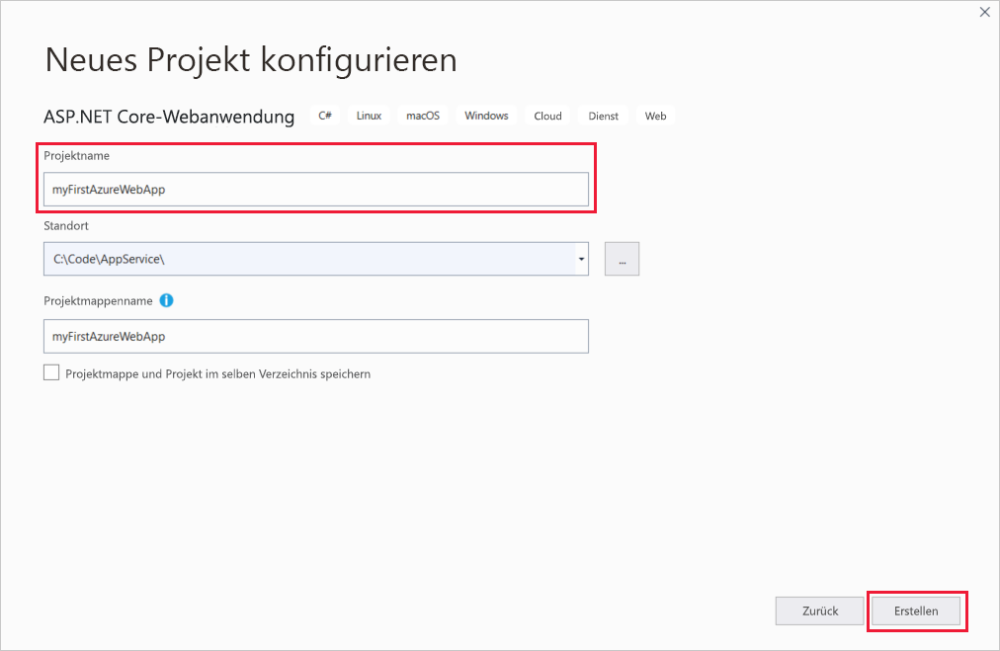

1. Sie können einen beliebigen Typ von ASP.NET Core-Web-App für Azure bereitstellen, aber für diese Schnellstartanleitung sollten Sie die Vorlage **Webanwendung** auswählen. Stellen Sie sicher, dass unter **Authentifizierung** die Option **Keine Authentifizierung** ausgewählt und keine andere Option festgelegt ist. Wählen Sie anschließend **Erstellen**.

   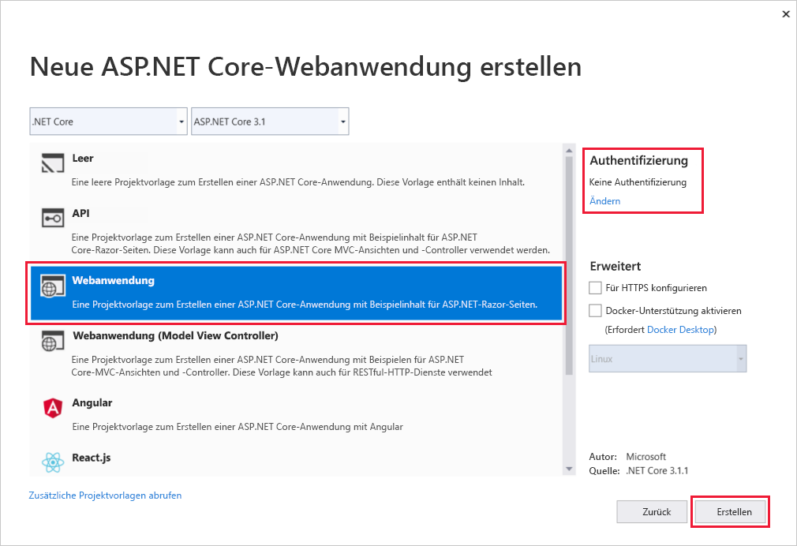 
   
1. Wählen Sie im Visual Studio-Menü **Debuggen** > **Starten ohne Debugging** aus, um Ihre Web-App lokal auszuführen.

   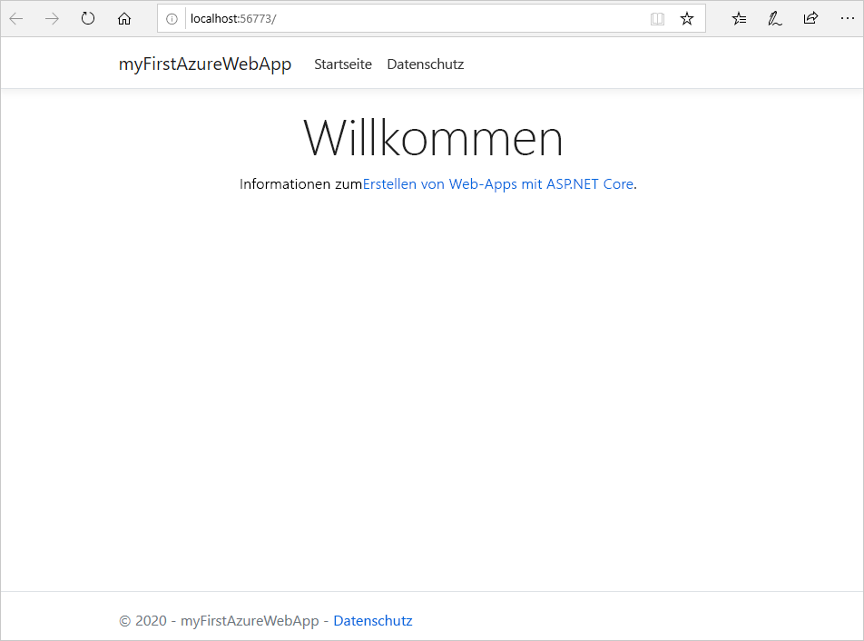

## <a name="publish-your-web-app"></a>Veröffentlichen Ihrer Web-App

Zum Veröffentlichen Ihrer Web-App müssen Sie zuerst eine neue App Service-Instanz erstellen und konfigurieren, auf der Sie Ihre App veröffentlichen können. 

Erstellen Sie bei der Einrichtung der App Service-Instanz Folgendes:

- Eine neue [Ressourcengruppe](https://docs.microsoft.com/azure/azure-resource-manager/management/overview#terminology), die alle Azure-Ressourcen für den Dienst enthalten soll.
- Einen neuen [Hostingplan](https://docs.microsoft.com/azure/app-service/overview-hosting-plans), mit dem der Standort, die Größe und die Funktionen der Webserverfarm zum Hosten Ihrer App angegeben werden.

Führen Sie die folgenden Schritte aus, um Ihre App Service-Instanz zu erstellen und Ihre Web-App zu veröffentlichen:

1. Klicken Sie im **Projektmappen-Explorer** mit der rechten Maustaste auf das Projekt **myFirstAzureWebApp**, und wählen Sie **Veröffentlichen** aus. Wählen Sie **Konto hinzufügen** oder **Anmelden** aus, falls Sie sich noch nicht über Visual Studio bei Ihrem Azure-Konto angemeldet haben. Sie können auch ein kostenloses Azure-Konto erstellen.

1. Wählen Sie im Dialogfeld **Veröffentlichungsziel auswählen** die Option **App Service** und dann **Neu erstellen** und **Profil erstellen** aus.

   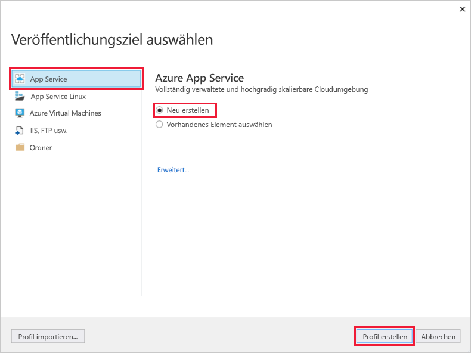

1. Verwenden Sie im Dialogfeld **App Service: Neu erstellen** einen global eindeutigen **Namen** für Ihre App, indem Sie entweder den Standardnamen übernehmen oder einen neuen Namen eingeben. Gültige Zeichen: `a-z`, `A-Z`, `0-9` und `-`. Dieser **Name** wird als URL-Präfix für Ihre Web-App im Format `http://<app_name>.azurewebsites.net` verwendet.

1. Akzeptieren Sie unter **Abonnement** das angegebene Abonnement, oder wählen Sie in der Dropdownliste ein neues Abonnement aus.

1. Wählen Sie unter **Ressourcengruppe** die Option **Neu** aus. Geben Sie unter **Name der neuen Ressourcengruppe** den Namen *myResourceGroup* ein, und wählen Sie **OK** aus. 

1. Wählen Sie unter **Hostingplan** die Option **Neu** aus. 

1. Geben Sie im Dialogfeld **Hostingplan: Neu erstellen** die Werte ein, die in der folgenden Tabelle angegeben sind:

   | Einstellung  | Empfohlener Wert | BESCHREIBUNG |
   | -------- | --------------- | ----------- |
   | **Hostingplan**  | *myFirstAzureWebAppPlan* | Name des App Service-Plans. |
   | **Location**      | *Europa, Westen* | Das Rechenzentrum, in dem die Web-App gehostet wird. |
   | **Größe**          | *Free* | Der [Tarif](https://azure.microsoft.com/pricing/details/app-service/?ref=microsoft.com&utm_source=microsoft.com&utm_medium=docs&utm_campaign=visualstudio) bestimmt die Hostingfeatures. |
   
   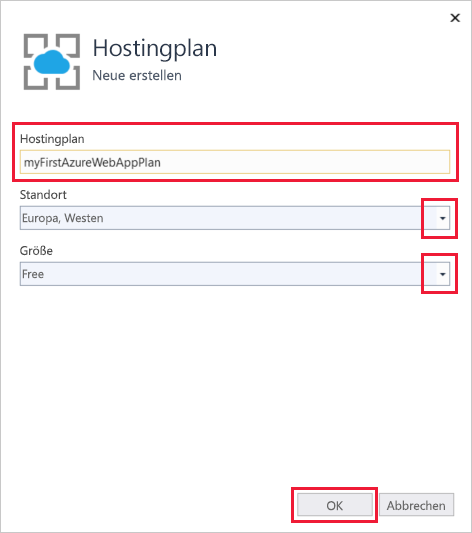

1. Übernehmen Sie für **Application Insights** die Einstellung auf *Keine*.

1. Verwenden Sie im Dialogfeld **App Service: Neu erstellen** die Option **Erstellen** aus, um mit der Erstellung der Azure-Ressourcen zu beginnen.

   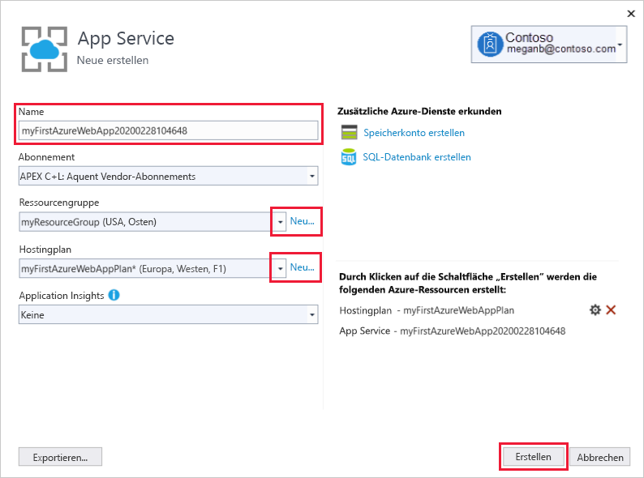

1. Wählen Sie nach Abschluss des Assistenten die Option **Veröffentlichen** aus.

   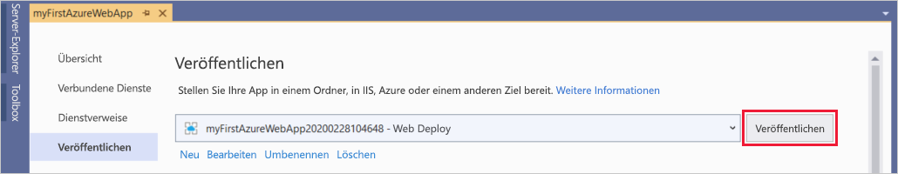

   Visual Studio veröffentlicht Ihre ASP.NET Core-Web-App in Azure und startet die App in Ihrem Standardbrowser. 

   

**Glückwunsch!** Ihre ASP.NET Core-Web-App wird live in Azure App Service ausgeführt.

## <a name="update-the-app-and-redeploy"></a>Aktualisieren der App und erneutes Bereitstellen

Führen Sie die folgenden Schritte aus, um Ihre Web-App zu aktualisieren und erneut bereitzustellen:

1. Öffnen Sie im **Projektmappen-Explorer** unter Ihrem Projekt **Seiten** > **Index.cshtml**.

1. Ersetzen Sie das gesamte `<div>`-Tag durch den folgenden Code:

   ```HTML
   <div class="jumbotron">
       <h1>ASP.NET in Azure!</h1>
       <p class="lead">This is a simple app that we've built that demonstrates how to deploy a .NET app to Azure App Service.</p>
   </div>
   ```

1. Klicken Sie zur erneuten Bereitstellung in Azure im **Projektmappen-Explorer** mit der rechten Maustaste auf das Projekt **myFirstAzureWebApp**, und wählen Sie **Veröffentlichen** aus.

1. Wählen Sie auf der Zusammenfassungsseite **Veröffentlichen** die Option **Veröffentlichen** aus.

   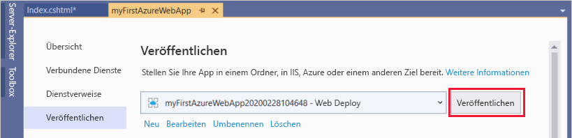

Nach Abschluss der Veröffentlichung wird in Visual Studio ein Browser mit der URL der Web-App gestartet.

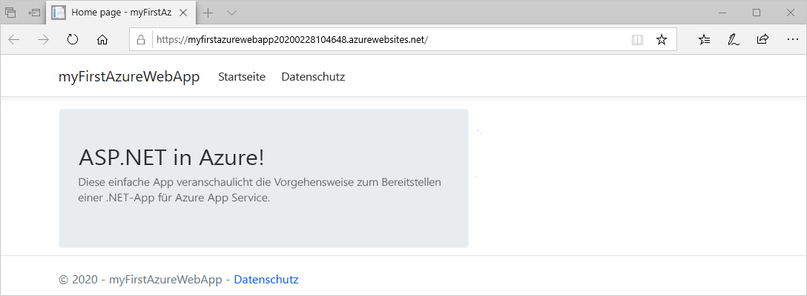

## <a name="manage-the-azure-app"></a>Verwalten der Azure-App

Wechseln Sie zum Verwalten Ihrer Web-App zum [Azure-Portal](https://portal.azure.com), und suchen Sie nach **App Services**. Wählen Sie diese Option anschließend aus.

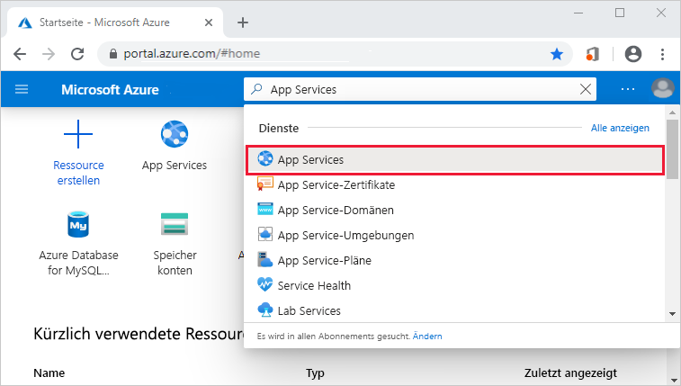

Wählen Sie auf der Seite **App Services** den Namen Ihrer Web-App aus.

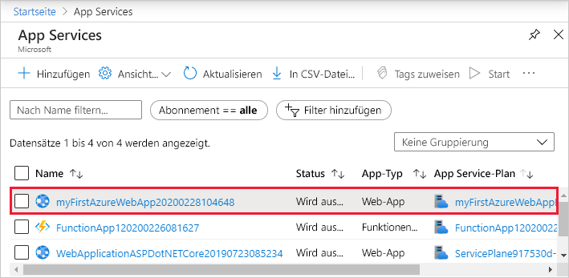

Die Seite **Übersicht** für Ihre Web-App enthält Optionen für die grundlegende Verwaltung, z. B. Durchsuchen, Beenden, Starten, Neustarten und Löschen. Im linken Menü können Sie auf weitere Seiten für die Konfiguration Ihrer App zugreifen.

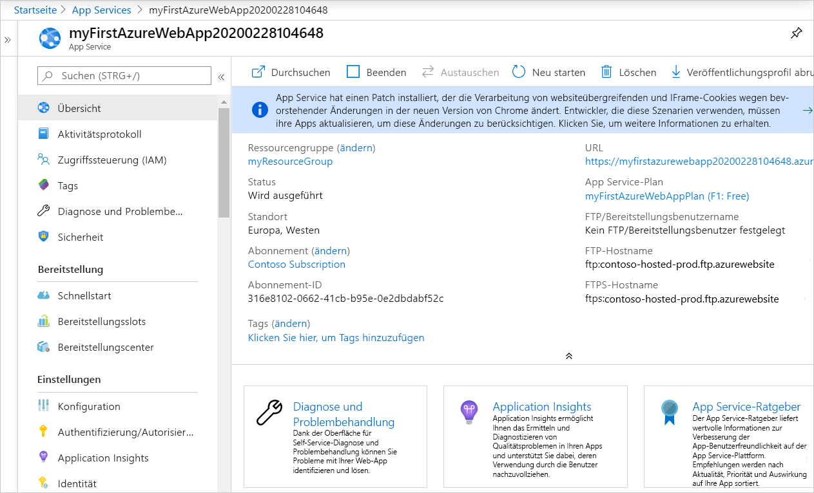

[!INCLUDE [Clean-up section](../../includes/clean-up-section-portal.md)]

## <a name="next-steps"></a>Nächste Schritte

In dieser Schnellstartanleitung haben Sie Visual Studio verwendet, um eine ASP.NET Core-Web-App zu erstellen und für Azure App Service bereitzustellen.

Fahren Sie mit dem nächsten Artikel fort, um sich darüber zu informieren, wie Sie eine .NET Core-App erstellen und dafür eine Verbindung mit einer SQL-Datenbank herstellen:

> [!div class="nextstepaction"]
> [ASP.NET Core mit SQL-Datenbank](app-service-web-tutorial-dotnetcore-sqldb.md)

> [!div class="nextstepaction"]
> [Konfigurieren der ASP.NET Core-App](configure-language-dotnetcore.md)
