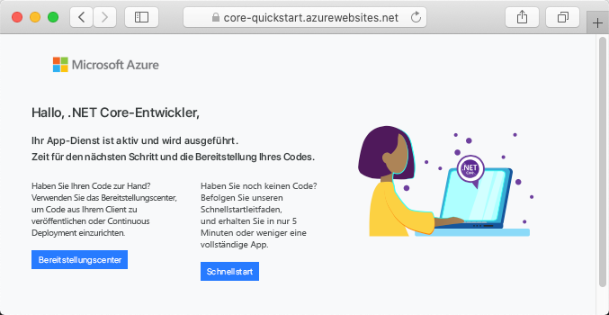

# <a name="create-an-aspnet-core-app-in-app-service-on-linux"></a>Erstellen einer ASP.NET Core-App in App Service unter Linux

> [!NOTE]
> In diesem Artikel wird eine App in App Service unter Linux bereitgestellt. Informationen zur Bereitstellung in App Service unter _Windows_ finden Sie unter [Erstellen einer ASP.NET Core-App in Azure](../app-service-web-get-started-dotnet.md).
>

[App Service unter Linux](app-service-linux-intro.md) bietet einen hochgradig skalierbaren Webhostingdienst mit Self-Patching unter Linux-Betriebssystemen. In diesem Schnellstartartikel wird erläutert, wie Sie eine [.NET Core](https://docs.microsoft.com/aspnet/core/)-App in App Service unter Linux erstellen. Sie erstellen die App mithilfe der [Azure CLI](https://docs.microsoft.com/cli/azure/get-started-with-azure-cli) und stellen mit Git den .NET Core-Code für die App bereit.


Die Schritte in diesem Artikel können unter Mac, Windows oder Linux ausgeführt werden.

[!INCLUDE [quickstarts-free-trial-note](../../../includes/quickstarts-free-trial-note.md)]

## <a name="prerequisites"></a>Voraussetzungen

So führen Sie diesen Schnellstart durch:

* <a href="https://git-scm.com/" target="_blank">Installation von Git</a>
* <a href="https://dotnet.microsoft.com/download/dotnet-core/3.1" target="_blank">Installation des aktuellen .NET Core 3.1 SDK</a>

## <a name="create-the-app-locally"></a>Lokales Erstellen der App

Erstellen Sie in einem Terminalfenster auf Ihrem Computer ein Verzeichnis mit dem Namen `hellodotnetcore`, und wechseln Sie dorthin.

```bash
mkdir hellodotnetcore
cd hellodotnetcore
```

Erstellen Sie eine neue .NET Core-App.

```bash
dotnet new web
```

## <a name="run-the-app-locally"></a>Lokales Ausführen der App

Führen Sie die Anwendung lokal aus, damit Sie sehen, wie sie beim Bereitstellen in Azure aussehen sollte. 

Stellen Sie die NuGet-Pakete wieder her, und führen Sie die App aus.

```bash
dotnet run
```

Öffnen Sie einen Webbrowser, und navigieren Sie zu der App auf `http://localhost:5000`.

Auf der Seite wird die Nachricht **Hello World** aus der Beispiel-App angezeigt.


Drücken Sie in Ihrem Terminalfenster **STRG+C**, um den Webserver zu beenden. Initialisieren Sie ein Git-Repository für das .NET Core-Projekt.

```bash
git init
git add .
git commit -m "first commit"
```

[!INCLUDE [cloud-shell-try-it.md](../../../includes/cloud-shell-try-it.md)]

[!INCLUDE [Configure deployment user](../../../includes/configure-deployment-user.md)]

[!INCLUDE [Create resource group](../../../includes/app-service-web-create-resource-group-linux.md)]

[!INCLUDE [Create app service plan](../../../includes/app-service-web-create-app-service-plan-linux.md)]

## <a name="create-a-web-app"></a>Erstellen einer Web-App

[!INCLUDE [Create web app](../../../includes/app-service-web-create-web-app-dotnetcore-linux-no-h.md)]

Wechseln Sie zu Ihrer neu erstellten App. Ersetzen Sie _&lt;app-name>_ durch Ihren App-Namen.

```bash
https://<app-name>.azurewebsites.net
```

Ihre neue App sollte nun wie folgt aussehen:



[!INCLUDE [Push to Azure](../../../includes/app-service-web-git-push-to-azure.md)] 

<pre>
Enumerating objects: 5, done.
Counting objects: 100% (5/5), done.
Compressing objects: 100% (3/3), done.
Writing objects: 100% (3/3), 285 bytes | 95.00 KiB/s, done.
Total 3 (delta 2), reused 0 (delta 0), pack-reused 0
remote: Deploy Async
remote: Updating branch 'master'.
remote: Updating submodules.
remote: Preparing deployment for commit id 'd6b54472f7'.
remote: Repository path is /home/site/repository
remote: Running oryx build...
remote: Build orchestrated by Microsoft Oryx, https://github.com/Microsoft/Oryx
remote: You can report issues at https://github.com/Microsoft/Oryx/issues
remote:
remote: Oryx Version      : 0.2.20200114.13, Commit: 204922f30f8e8d41f5241b8c218425ef89106d1d, ReleaseTagName: 20200114.13
remote: Build Operation ID: |imoMY2y77/s=.40ca2a87_
remote: Repository Commit : d6b54472f7e8e9fd885ffafaa64522e74cf370e1
.
.
.
remote: Deployment successful.
remote: Deployment Logs : 'https://&lt;app-name&gt;.scm.azurewebsites.net/newui/jsonviewer?view_url=/api/deployments/d6b54472f7e8e9fd885ffafaa64522e74cf370e1/log'
To https://&lt;app-name&gt;.scm.azurewebsites.net:443/&lt;app-name&gt;.git
   d87e6ca..d6b5447  master -> master
</pre>

## <a name="browse-to-the-app"></a>Navigieren zur App

Navigieren Sie in Ihrem Webbrowser zu der bereitgestellten Anwendung.

```bash
http://<app_name>.azurewebsites.net
```

Der .NET Core-Beispielcode wird in App Service unter Linux mit einem integrierten Image ausgeführt.


**Glückwunsch!** Sie haben Ihre erste .NET Core-App für App Service unter Linux bereitgestellt.

## <a name="update-and-redeploy-the-code"></a>Aktualisieren und erneutes Bereitstellen des Codes

Öffnen Sie im lokalen Verzeichnis die Datei _Startup.cs_. Nehmen Sie eine kleine Änderung am Text im Methodenaufruf `context.Response.WriteAsync` vor:

```csharp
await context.Response.WriteAsync("Hello Azure!");
```

Führen Sie für Ihre Änderungen in Git einen Commit aus, und übertragen Sie dann die Codeänderungen mithilfe von Push an Azure.

```bash
git commit -am "updated output"
git push azure master
```

Wechseln Sie nach Abschluss der Bereitstellung wieder zu dem Browserfenster, das im Schritt **Navigieren zur App** geöffnet wurde, und wählen Sie die Option „Aktualisieren“ aus.


## <a name="manage-your-new-azure-app"></a>Verwalten Ihrer neuen Azure-App

Wechseln Sie zum <a href="https://portal.azure.com" target="_blank">Azure-Portal</a>, um die erstellte App zu verwalten.

Klicken Sie im linken Menü auf **App Services** und anschließend auf den Namen Ihrer Azure-App.


Die Übersichtsseite Ihrer App wird angezeigt. Hier können Sie einfache Verwaltungsaufgaben wie Durchsuchen, Beenden, Neustarten und Löschen durchführen. 


Im linken Menü werden verschiedene Seiten für die Konfiguration Ihrer App angezeigt. 

[!INCLUDE [cli-samples-clean-up](../../../includes/cli-samples-clean-up.md)]

## <a name="next-steps"></a>Nächste Schritte

> [!div class="nextstepaction"]
> [Tutorial: ASP.NET Core-App mit SQL-Datenbank](tutorial-dotnetcore-sqldb-app.md)

> [!div class="nextstepaction"]
> [Konfigurieren der ASP.NET Core-App](configure-language-dotnetcore.md)
