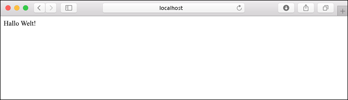

# <a name="quickstart-create-a-python-app-in-azure-app-service-on-linux"></a>Schnellstart: Erstellen einer Python-App in Azure App Service für Linux

In diesem Schnellstart stellen Sie eine Python-Web-App für [App Service für Linux](app-service-linux-intro.md) bereit. Dies ist der überaus skalierbare Webhostingdienst von Azure mit automatisiertem Patchen. Sie verwenden auf einem Mac-, Linux- oder Windows-Computer die lokale [Azure-Befehlszeilenschnittstelle (CLI)](/cli/azure/install-azure-cli). Die Web-App, die Sie konfigurieren, nutzt einen kostenlosen App-Service-Tarif, sodass Ihnen im Laufe dieses Artikels keine Kosten entstehen.

Wenn Sie Apps lieber über eine IDE bereitstellen möchten, lesen Sie [Bereitstellen von Python-Apps in App Service aus Visual Studio Code](/azure/developer/python/tutorial-deploy-app-service-on-linux-01).

## <a name="set-up-your-initial-environment"></a>Einrichten der anfänglichen Umgebung

Bevor Sie mit diesem Lernprogramm beginnen können, benötigen Sie Folgendes:

1. Sie benötigen ein Azure-Konto mit einem aktiven Abonnement. Sie können [kostenlos ein Konto erstellen](https://azure.microsoft.com/free/?ref=microsoft.com&utm_source=microsoft.com&utm_medium=docs&utm_campaign=visualstudio).
1. Installieren Sie <a href="https://www.python.org/downloads/" target="_blank">Python 3.6 oder höher</a>.
1. Installieren Sie die <a href="/cli/azure/install-azure-cli" target="_blank">Azure CLI</a> 2.0.80 oder höher, mit der Sie Befehle in einer beliebigen Shell ausführen, um Azure-Ressourcen bereitzustellen und zu konfigurieren.

Öffnen Sie ein Terminalfenster, und überprüfen Sie, ob mindestens die Python-Version 3.6 installiert ist:

# <a name="bash"></a>[Bash](#tab/bash)

```bash
python3 --version
```

# <a name="powershell"></a>[PowerShell](#tab/powershell)

```cmd
py -3 --version
```

# <a name="cmd"></a>[Cmd](#tab/cmd)

```cmd
py -3 --version
```

---

Vergewissern Sie sich, dass Sie mindestens Version 2.0.80 der Azure CLI verwenden:

```azurecli
az --version
```

Melden Sie sich anschließend über die CLI bei Azure an:

```azurecli
az login
```

Dieser Befehl öffnet einen Browser zum Erfassen Ihrer Anmeldeinformationen. Wenn der Befehl abgeschlossen ist, wird eine JSON-Ausgabe mit Informationen zu Ihren Abonnements angezeigt.

Nachdem Sie sich angemeldet haben, können Sie Azure-Befehle mit der Azure CLI ausführen, um Ressourcen in Ihrem Abonnement zu verwenden.

## <a name="clone-the-sample"></a>Klonen des Beispiels

Führen Sie den folgenden Befehl aus, um das Beispielrepository zu klonen. ([Installieren Sie Git](https://git-scm.com/downloads), sofern noch nicht vorhanden.)

```terminal
git clone https://github.com/Azure-Samples/python-docs-hello-world
```

Wechseln Sie dann zu diesem Ordner:

```terminal
cd python-docs-hello-world
```

Der Beispielcode enthält die Datei *application.py*, die App Service informiert, dass der Code eine Flask-App enthält. Weitere Informationen finden Sie unter [Startprozess und Anpassungen für Container](how-to-configure-python.md).

## <a name="run-the-sample"></a>Ausführen des Beispiels

# <a name="bash"></a>[Bash](#tab/bash)

Erstellen Sie zunächst eine virtuelle Umgebung und installieren die Abhängigkeiten:

```bash
python3 -m venv venv
source venv/bin/activate
pip install -r requirements.txt
```

Legen Sie dann die Umgebungsvariable `FLASK_APP` auf das Eingabemodul der App fest, und führen Sie den Flask-Entwicklungsserver aus:

```
export FLASK_APP=application.py
flask run
```

# <a name="powershell"></a>[PowerShell](#tab/powershell)

Erstellen Sie zunächst eine virtuelle Umgebung und installieren die Abhängigkeiten:

```powershell
py -3 -m venv env
env\scripts\activate
pip install -r requirements.txt
```

Legen Sie dann die Umgebungsvariable `FLASK_APP` auf das Eingabemodul der App fest, und führen Sie den Flask-Entwicklungsserver aus:

```powershell
Set-Item Env:FLASK_APP ".\application.py"
flask run
```

# <a name="cmd"></a>[Cmd](#tab/cmd)

Erstellen Sie zunächst eine virtuelle Umgebung und installieren die Abhängigkeiten:

```cmd
py -3 -m venv env
env\scripts\activate
pip install -r requirements.txt
```

Legen Sie dann die Umgebungsvariable `FLASK_APP` auf das Eingabemodul der App fest, und führen Sie den Flask-Entwicklungsserver aus:

```cmd
SET FLASK_APP=application.py
flask run
```

---

Öffnen Sie einen Webbrowser, und navigieren Sie zu der Beispiel-App unter `http://localhost:5000/`. Die App zeigt die Meldung **Hello World!** .



Drücken Sie in Ihrem Terminalfenster **STRG**+**C**, um den Flask-Entwicklungsserver zu beenden.

## <a name="deploy-the-sample"></a>Bereitstellen des Beispiels

Stellen Sie mithilfe des Befehls `az webapp up` den Code in Ihrem lokalen Ordner (*python-docs-hello-world*) bereit:

```azurecli
az webapp up --sku F1 -n <app-name>
```

- Wird der Befehl `az` nicht erkannt, vergewissern Sie sich, dass die Azure CLI wie unter [Einrichten der anfänglichen Umgebung](#set-up-your-initial-environment) beschrieben installiert wurde.
- Ersetzen Sie `<app_name>` durch einen Namen, der innerhalb von Azure eindeutig ist (*gültige Zeichen: `a-z`, `0-9` und `-`* ). Ein bewährtes Muster ist eine Kombination aus Ihrem Firmennamen und einer App-ID.
- Mit dem Argument `--sku F1` wird die Web-App im Tarif „Free“ erstellt. Lassen Sie dieses Argument weg, um einen schnelleren Premium-Tarif zu verwenden. Dieser verursacht jedoch stündlich Kosten.
- Außerdem können Sie optional das Argument `-l <location-name>` einschließen. `<location_name>` ist hierbei eine Azure-Region wie **centralus**, **eastasia**, **westeurope**, **koreasouth**, **brazilsouth**, **centralindia** und so weiter. Sie können eine Liste der zulässigen Regionen für Ihr Azure-Konto abrufen, indem Sie den Befehl [`az account list-locations`](/cli/azure/appservice?view=azure-cli-latest.md#az-appservice-list-locations) ausführen.

Die Ausführung dieses Befehls kann einige Minuten in Anspruch nehmen. Bei der Ausführung werden Nachrichten zur Erstellung der Ressourcengruppe, des App Service-Plans und der Hosting-App, zur Konfiguration der Protokollierung und zur anschließenden ZIP-Bereitstellung bereitgestellt. Anschließend wird die Meldung „You can launch the app at http://&lt;app-name&gt;.azurewebsites.net“ (Sie können die App unter http://<App-Name>.azurewebsites.net starten.) angezeigt. Dabei handelt es sich um die URL der App in Azure.


[!INCLUDE [AZ Webapp Up Note](../../../includes/app-service-web-az-webapp-up-note.md)]

## <a name="browse-to-the-app"></a>Navigieren zur App

Navigieren Sie in Ihrem Webbrowser zur an der URL `http://<app-name>.azurewebsites.net` bereitgestellten Anwendung.

Der Python-Beispielcode führt einen Linux-Container in App Service mit einem integrierten Image aus.


**Glückwunsch!** Sie haben Ihre Python-App in App Service unter Linux bereitgestellt.

## <a name="redeploy-updates"></a>Erneutes Bereitstellen von Updates

Öffnen Sie *application.py* in Ihrem bevorzugten Code-Editor, und aktualisieren Sie die Funktion `hello` wie folgt. Durch diese Änderung wird eine Anweisung vom Typ `print` hinzugefügt, um die Protokollierungsausgabe für den nächsten Abschnitt zu generieren. 

```python
def hello():
    print("Handling request to home page.")
    return "Hello Azure!"
```

Speichern Sie Ihre Änderungen, und beenden Sie den Editor. 

Stellen Sie die App mithilfe des Befehls `az webapp up` erneut bereit:

```azurecli
az webapp up
```

In diesem Befehl werden lokal zwischengespeicherte Werte aus der Datei *.azure/config* verwendet (einschließlich App-Name, Ressourcengruppe und App Service-Plan).

Wechseln Sie nach Abschluss der Bereitstellung wieder zum Browserfenster, in dem `http://<app-name>.azurewebsites.net` geöffnet ist. Aktualisieren Sie die Seite. Nun sollte die geänderte Meldung angezeigt werden:


> [!TIP]
> Visual Studio Code bietet leistungsstarke Erweiterungen für Python und Azure App Service, die die Bereitstellung von Python-Web-Apps in App Service vereinfachen. Weitere Informationen finden Sie unter [Bereitstellen von Python-Apps in App Service aus Visual Studio Code](/azure/python/tutorial-deploy-app-service-on-linux-01).

## <a name="stream-logs"></a>Streaming von Protokollen

Sie können auf die Konsolenprotokolle zugreifen, die innerhalb der App und des Containers, in dem sie ausgeführt wird, generiert wurden. Protokolle enthalten alle Ausgaben, die mit `print`-Anweisungen generiert werden.

Führen Sie zum Streamen von Protokollen den folgenden Befehl aus:

```azurecli
az webapp log tail
```

Aktualisieren Sie die App im Browser, um Konsolenprotokolle zu erstellen, die Meldungen mit einer Beschreibung der HTTP-Anforderungen an die App enthalten. Wenn nicht sofort eine Ausgabe angezeigt wird, versuchen Sie es nach 30 Sekunden erneut.

Sie können die Protokolldateien auch im Browser unter `https://<app-name>.scm.azurewebsites.net/api/logs/docker` untersuchen.

Zum Beenden des Protokollstreamings können Sie jederzeit **STRG**+**C** drücken.

## <a name="manage-the-azure-app"></a>Verwalten der Azure-App

Wechseln Sie zum <a href="https://portal.azure.com" target="_blank">Azure-Portal</a>, um die erstellte App zu verwalten. Suchen Sie nach **App Services**, und wählen Sie diese Option aus.


Wählen Sie den Namen Ihrer Azure-App aus.


Wenn Sie die App auswählen, wird die Seite **Übersicht** geöffnet. Dort können Sie grundlegende Verwaltungsaufgaben wie Durchsuchen, Beenden, Starten, Neustarten und Löschen ausführen.


Im Menü „App Service“ werden verschiedene Seiten für die Konfiguration Ihrer App angezeigt.

## <a name="clean-up-resources"></a>Bereinigen von Ressourcen

In den vorherigen Schritten haben Sie Azure-Ressourcen in einer Ressourcengruppe erstellt. Die Ressourcengruppe hat abhängig von Ihrem Standort einen Namen wie appsvc_rg_Linux_CentralUS. Wenn Sie eine andere App Service-SKU als den kostenlosen Tarif „F1“ verwenden, fallen laufende Kosten für diese Ressourcen an (siehe [App Service – Preise](https://azure.microsoft.com/pricing/details/app-service/linux/)).

Wenn Sie diese Ressourcen voraussichtlich nicht mehr benötigen, löschen Sie die Ressourcengruppen mit folgendem Befehl:

```azurecli
az group delete
```

Der Befehl verwendet den Ressourcengruppennamen, der in der Datei *.azure/config* zwischengespeichert ist.

Die Ausführung des Befehls kann eine Minute in Anspruch nehmen.

## <a name="next-steps"></a>Nächste Schritte

> [!div class="nextstepaction"]
> [Tutorial: Python-Web-App (Django) mit PostgreSQL](tutorial-python-postgresql-app.md)

> [!div class="nextstepaction"]
> [Schnellstart: Hinzufügen von „Mit Microsoft anmelden“ zu einer Python-Web-App](../../active-directory/develop/quickstart-v2-python-webapp.md)

> [!div class="nextstepaction"]
> [Konfigurieren einer Python-App](how-to-configure-python.md)

> [!div class="nextstepaction"]
> [Tutorial: Ausführen einer Python-App in einem benutzerdefinierten Container](tutorial-custom-docker-image.md)
