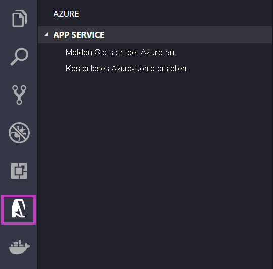
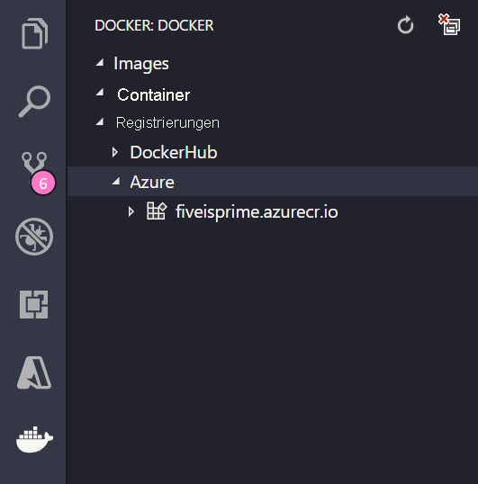

# <a name="run-a-custom-container-in-azure"></a>Ausführen eines benutzerdefinierten Containers in Azure

::: zone pivot="container-windows"
[Azure App Service](overview.md) stellt vordefinierte Anwendungsstapel unter Windows wie ASP.NET oder Node.js bereit (ausgeführt unter IIS). Die vorkonfigurierte Umgebung für Windows-Container sperrt das Betriebssystem, um Administratorzugriff, Softwareinstallationen, Änderungen am globalen Assemblycache usw. zu verhindern. Weitere Informationen finden Sie unter [Betriebssystemfunktionen für Azure App Service](operating-system-functionality.md). Wenn für Ihre Anwendung umfangreichere Zugriffsrechte erforderlich sind, als die vorkonfigurierte Umgebung zulässt, können Sie stattdessen einen benutzerdefinierten Windows-Container bereitstellen.

In dieser Schnellstartanleitung erfahren Sie, wie Sie über Visual Studio in [Docker Hub](https://hub.docker.com/) eine ASP.NET-App (in einem Windows-Image) bereitstellen. Die App wird in einem benutzerdefinierten Container in Azure App Service ausgeführt.

> [!NOTE]
> Windows-Container sind auf Azure Files beschränkt und unterstützen derzeit kein Azure-Blob.


## <a name="prerequisites"></a>Voraussetzungen

Für dieses Tutorial benötigen Sie Folgendes:

- <a href="https://hub.docker.com/" target="_blank">Registrierung für ein Docker-Hub-Konto</a>
- <a href="https://docs.docker.com/docker-for-windows/install/" target="_blank">Installieren Sie Docker für Windows</a>.
- <a href="/virtualization/windowscontainers/quick-start/quick-start-windows-10" target="_blank">Wechseln Sie Docker, um Windows-Container auszuführen</a>.
- <a href="https://www.visualstudio.com/downloads/" target="_blank">Installieren Sie Visual Studio 2019</a> mit den Workloads **ASP.NET und Webentwicklung** und **Azure-Entwicklung**. Sie haben Visual Studio 2019 bereits installiert:

    - Installieren Sie in Visual Studio die neuesten Updates, indem Sie **Hilfe** > **Nach Updates suchen** auswählen.
    - Fügen Sie in Visual Studio die Workloads hinzu, indem Sie **Tools** > **Tools und Features abrufen** auswählen.

## <a name="create-an-aspnet-web-app"></a>Erstellen einer ASP.NET-Web-App

Führen Sie zum Erstellen einer ASP.NET-Web-App die folgenden Schritte aus:

1. Öffnen Sie Visual Studio, und wählen Sie **Neues Projekt erstellen** aus.

1. Suchen Sie unter **Neues Projekt erstellen** die Option **ASP.NET-Webanwendung (.NET Framework)** für C#, und wählen Sie sie aus. Wählen Sie anschließend **Weiter** aus.

1. Geben Sie der Anwendung unter **Neues Projekt konfigurieren** den Namen _myfirstazurewebapp_, und wählen Sie dann **Erstellen** aus.

   

1. Sie können jede Art von ASP.NET Web-App für Azure bereitstellen. Wählen Sie für diese Schnellstartanleitung die Vorlage **MVC** aus.

1. Wählen Sie **Docker-Unterstützung** aus, und vergewissern Sie sich, dass die Authentifizierung auf **Keine Authentifizierung** festgelegt ist. Klicken Sie auf **Erstellen**.

   

1. Wenn die _Dockerfile_-Datei nicht automatisch geöffnet wird, öffnen Sie sie im **Projektmappen-Explorer**.

1. Sie benötigen ein [unterstütztes übergeordnetes Image](configure-custom-container.md#supported-parent-images). Ändern Sie das übergeordnete Image, indem Sie die Zeile `FROM` durch den folgenden Code ersetzen und die Datei dann speichern:

   ```dockerfile
   FROM mcr.microsoft.com/dotnet/framework/aspnet:4.7.2-windowsservercore-ltsc2019
   ```

1. Wählen Sie im Visual Studio-Menü **Debuggen** > **Starten ohne Debugging** aus, um die Web-App lokal auszuführen.

   

## <a name="publish-to-docker-hub"></a>Veröffentlichen in Docker Hub

1. Klicken Sie im **Projektmappen-Explorer** mit der rechten Maustaste auf das Projekt **myfirstazurewebapp**, und wählen Sie **Veröffentlichen** aus.

1. Wählen Sie **App Service** und dann **Veröffentlichen** aus.

1. Wählen Sie unter **Veröffentlichungsziel auswählen** die Optionen **Container Registry** und **Docker Hub** aus, und klicken Sie anschließend auf **Veröffentlichen**.

   

1. Geben Sie die Anmeldeinformationen für Ihr Docker Hub-Konto ein, und wählen Sie **Speichern** aus.

   Warten Sie, bis die Bereitstellung abgeschlossen ist. Auf der Seite **Veröffentlichen** wird jetzt der Name des Repositorys zur späteren Verwendung angezeigt.

   

1. Kopieren Sie diesen Repositorynamen für die spätere Verwendung.

## <a name="create-a-windows-container-app"></a>Erstellen einer Windows-Container-App

1. Melden Sie sich beim [Azure-Portal]( https://portal.azure.com) an.

1. Klicken Sie im Azure-Portal links oben auf **Ressource erstellen**.

1. Wählen Sie unter **Beliebte Dienste** unter **Web-App** die Option **Erstellen** aus.

1. Wählen Sie auf der Seite **Web-App erstellen** Ihr Abonnement und eine **Ressourcengruppe** aus. Bei Bedarf kann eine neue Ressourcengruppe erstellt werden.

1. Geben Sie einen App-Namen an, z. B. *win-container-demo*. Wählen Sie für **Veröffentlichen** die Option **Docker-Container** und für **Betriebssystem** die Option **Windows** aus. Klicken Sie auf **Weiter: Docker** aus, um den Vorgang fortzusetzen.

   

1. Wählen Sie unter **Imagequelle** die Option **Docker Hub** aus, und geben Sie unter **Image und Tag** den Repositorynamen ein, den Sie im Schritt [Veröffentlichen in Docker Hub](#publish-to-docker-hub) kopiert haben.

   

    Wenn Sie an anderer Stelle, etwa in [Azure Container Registry](../container-registry/index.yml) oder einem anderen privaten Repository, ein benutzerdefiniertes Image für Ihre Webanwendung besitzen, können Sie es hier konfigurieren.

1. Wählen Sie **Überprüfen und erstellen** > **Erstellen** aus, und warten Sie, bis Azure die erforderlichen Ressourcen erstellt hat.

## <a name="browse-to-the-container-app"></a>Navigieren zur Container-App

Wenn der Azure-Vorgang abgeschlossen ist, wird ein Benachrichtigungsfeld angezeigt.


1. Klicken Sie auf **Zu Ressource wechseln**.

1. Folgen Sie in der Übersicht dieser Ressource dem Link neben **URL**.

Daraufhin wird eine neue Browserseite geöffnet:


Warten Sie einige Minuten, und wiederholen Sie den Vorgang, bis die ASP.NET-Standardhomepage angezeigt wird:


**Glückwunsch!** Sie führen Ihren ersten benutzerdefinierten Windows-Container in Azure App Service aus.

## <a name="see-container-start-up-logs"></a>Anzeigen der Startprotokolle des Containers

Das Laden des Windows-Containers kann eine Weile dauern. Wenn Sie den Status anzeigen möchten, navigieren Sie zur folgenden URL. Ersetzen Sie dabei *\<app_name>* durch den Namen Ihrer App.
```
https://<app_name>.scm.azurewebsites.net/api/logstream
```

Die gestreamten Protokolle sehen wie folgt aus:

```
2018-07-27T12:03:11  Welcome, you are now connected to log-streaming service.
27/07/2018 12:04:10.978 INFO - Site: win-container-demo - Start container succeeded. Container: facbf6cb214de86e58557a6d073396f640bbe2fdec88f8368695c8d1331fc94b
27/07/2018 12:04:16.767 INFO - Site: win-container-demo - Container start complete
27/07/2018 12:05:05.017 INFO - Site: win-container-demo - Container start complete
27/07/2018 12:05:05.020 INFO - Site: win-container-demo - Container started successfully
```

## <a name="update-locally-and-redeploy"></a>Lokales Aktualisieren und erneutes Bereitstellen

1. Öffnen Sie in Visual Studio im **Projektmappen-Explorer** unter Ihrem Projekt **Ansichten** > **Start** > **Index.cshtml**.

1. Suchen Sie im oberen Bereich nach dem HTML-Tag `<div class="jumbotron">`, und ersetzen Sie das gesamte Element durch folgenden Code:

   ```html
   <div class="jumbotron">
       <h1>ASP.NET in Azure!</h1>
       <p class="lead">This is a simple app that we've built that demonstrates how to deploy a .NET app to Azure App Service.</p>
   </div>
   ```

1. Klicken Sie zum erneuten Bereitstellen in Azure im **Projektmappen-Explorer** mit der rechten Maustaste auf das Projekt **myfirstazurewebapp**, und wählen Sie **Veröffentlichen** aus.

1. Wählen Sie auf der Seite „Veröffentlichen“ die Option **Veröffentlichen** aus, und warten Sie, bis die Veröffentlichung abgeschlossen ist.

1. Damit App Service das neue Image von Docker Hub abruft, starten Sie die App neu. Klicken Sie auf der App-Seite im Portal auf **Neu starten** > **Ja**.

   

[Navigieren Sie erneut zur Container-App](#browse-to-the-container-app). Wenn Sie die Webseite aktualisieren, sollte die App zunächst zurück zur Seite „Starting up“ (Starten) wechseln und dann nach einigen Minuten wieder die aktualisierte Webseite anzeigen.


## <a name="next-steps"></a>Nächste Schritte

> [!div class="nextstepaction"]
> [Migrieren zum Windows-Container in Azure](tutorial-custom-container.md)

Oder sehen Sie sich weitere Ressourcen an:

> [!div class="nextstepaction"]
> [Konfigurieren eines benutzerdefinierten Containers](configure-custom-container.md)

::: zone-end  

::: zone pivot="container-linux"
Bei App Service für Linux werden vordefinierte Anwendungsstapel unter Linux mit Unterstützung für verschiedene Sprachen bereitgestellt, z. B. .NET, PHP, Node.js und andere. Sie können auch ein benutzerdefiniertes Docker-Image verwenden, um Ihre Web-App in einem Anwendungsstapel auszuführen, der nicht bereits in Azure definiert ist. In dieser Schnellstartanleitung erfahren Sie, wie Sie ein Image aus einer [Azure Container Registry](../container-registry/index.yml)-Instanz (ACR) in App Service bereitstellen.

## <a name="prerequisites"></a>Voraussetzungen

* Ein [Azure-Konto](https://azure.microsoft.com/free/?utm_source=campaign&utm_campaign=vscode-tutorial-docker-extension&mktingSource=vscode-tutorial-docker-extension)
* [Docker](https://www.docker.com/community-edition)
* [Visual Studio Code](https://code.visualstudio.com/)
* Die [Azure App Service-Erweiterung für VS Code](https://marketplace.visualstudio.com/items?itemName=ms-azuretools.vscode-azureappservice). Sie können diese Erweiterung zum Erstellen, Verwalten und Bereitstellen von Linux-Web-Apps in Azure Platform-as-a-Service (PAS) verwenden.
* Die [Docker-Erweiterung für VS Code](https://marketplace.visualstudio.com/items?itemName=ms-azuretools.vscode-docker). Mit dieser Erweiterung können Sie die Verwaltung lokaler Docker-Images und -Befehle vereinfachen und erstellte App-Images in Azure bereitstellen.

## <a name="create-a-container-registry"></a>Erstellen einer Containerregistrierung

In diesem Schnellstart wird Azure Container Registry als Registrierung ausgewählt. Sie können auch andere Registrierungen verwenden, aber die Schritte können sich dann geringfügig unterscheiden.

Verwenden Sie für das Erstellen einer Containerregistrierung die Anweisungen unter [Schnellstart: Erstellen einer privaten Containerregistrierung im Azure-Portal](../container-registry/container-registry-get-started-portal.md).

> [!IMPORTANT]
> Stellen Sie sicher, dass Sie beim Erstellen der Containerregistrierung in Azure die Option **Administratorbenutzer** auf **Aktivieren** festlegen. Sie können die Option auch im Azure-Portal im Abschnitt **Zugriffsschlüssel** Ihrer Registrierungsseite festlegen. Diese Einstellung ist für den App Service-Zugriff erforderlich.

## <a name="sign-in"></a>Anmelden

1. Starten Sie Visual Studio Code. 
1. Wählen Sie das **Azure**-Logo auf der [Aktivitätsleiste](https://code.visualstudio.com/docs/getstarted/userinterface) aus, navigieren Sie zum **APP SERVICE**-Explorer, wählen Sie dann **Bei Azure anmelden** aus, und folgen Sie den Anweisungen.

    

1. Überprüfen Sie unten auf der [Statusleiste](https://code.visualstudio.com/docs/getstarted/userinterface), ob die E-Mail-Adresse Ihres Azure-Kontos angezeigt wird. Im **APP SERVICE**-Explorer sollte Ihr Abonnement angezeigt werden.

1. Wählen Sie auf der Aktivitätsleiste das **Docker**-Logo aus. Überprüfen Sie im **REGISTRIERUNGS**-Explorer, ob die von Ihnen erstellte Containerregistrierung angezeigt wird.

    

## <a name="check-prerequisites"></a>Überprüfen der Voraussetzungen

Überprüfen Sie, ob Docker installiert ist und ausgeführt wird. Wenn Docker ausgeführt wird, zeigt der folgende Befehl die Version an.

```bash
docker --version
```

## <a name="create-and-build-image"></a>Erstellen und Kompilieren eines Images

1. Öffnen Sie in Visual Studio Code einen leeren Ordner, und fügen Sie eine Datei mit dem Namen `Dockerfile` hinzu. Fügen Sie im Dockerfile den Inhalt basierend auf Ihrem gewünschten Sprachframework ein:

# <a name="net"></a>[.NET](#tab/dotnet)

<!-- https://mcr.microsoft.com/v2/appsvc%2Fdotnetcore/tags/list -->
```dockerfile
FROM mcr.microsoft.com/appsvc/dotnetcore:lts

ENV PORT 8080
EXPOSE 8080

ENV ASPNETCORE_URLS "http://*:${PORT}"

ENTRYPOINT ["dotnet", "/defaulthome/hostingstart/hostingstart.dll"]
```

In diesem Dockerfile ist das übergeordnete Image einer der integrierten .NET-Container von App Service. Sie finden die zugehörigen Quelldateien im [GitHub-Repository „Azure-App-Service/ImageBuilder“ unter „GenerateDockerFiles/dotnetcore“](https://github.com/Azure-App-Service/ImageBuilder/tree/master/GenerateDockerFiles/dotnetcore). Das [Dockerfile](https://github.com/Azure-App-Service/ImageBuilder/blob/master/GenerateDockerFiles/dotnetcore/debian-9/Dockerfile) kopiert eine einfache .NET-App in `/defaulthome/hostingstart`. Ihr Dockerfile startet einfach nur diese App.

# <a name="nodejs"></a>[Node.js](#tab/node)

<!-- https://mcr.microsoft.com/v2/appsvc%2Fnode/tags/list -->
```dockerfile
FROM mcr.microsoft.com/appsvc/node:10-lts

ENV HOST 0.0.0.0
ENV PORT 8080
EXPOSE 8080

ENTRYPOINT ["pm2", "start", "--no-daemon", "/opt/startup/default-static-site.js"]
```

In diesem Dockerfile ist das übergeordnete Image einer der integrierten Node.js-Container von App Service. Sie finden die zugehörigen Quelldateien im [GitHub-Repository „Azure-App-Service/ImageBuilder“ unter „GenerateDockerFiles/node/node-template“](https://github.com/Azure-App-Service/ImageBuilder/tree/master/GenerateDockerFiles/node/node-template). Das [Dockerfile](https://github.com/Azure-App-Service/ImageBuilder/blob/master/GenerateDockerFiles/node/node-template/Dockerfile) kopiert eine einfache Node.js-App in `/opt/startup`. Ihr Dockerfile startet diese App einfach mit PM2, das bereits vom übergeordneten Image installiert wurde.

# <a name="python"></a>[Python](#tab/python)

<!-- https://mcr.microsoft.com/v2/appsvc%2Fpython/tags/list -->
```dockerfile
FROM mcr.microsoft.com/appsvc/python:latest

ENV PORT 8080
EXPOSE 8080

ENTRYPOINT ["gunicorn", "--timeout", "600", "--access-logfile", "'-'", "--error-logfile", "'-'", "--chdir=/opt/defaultsite", "application:app"]
```

In diesem Dockerfile ist das übergeordnete Image einer der integrierten Python-Container von App Service. Sie finden die zugehörigen Quelldateien im [GitHub-Repository „Azure-App-Service/ImageBuilder“ unter „GenerateDockerFiles/python/template-3.9“](https://github.com/Azure-App-Service/ImageBuilder/tree/master/GenerateDockerFiles/python/template-3.9). Das [Dockerfile](https://github.com/Azure-App-Service/ImageBuilder/blob/master/GenerateDockerFiles/python/template-3.9/Dockerfile) kopiert eine einfache Python-App in `/opt/defaultsite`. Ihr Dockerfile startet diese App einfach mithilfe von Gunicorn, das bereits vom übergeordneten Image installiert wurde.

# <a name="java"></a>[Java](#tab/java)

<!-- https://mcr.microsoft.com/v2/azure-app-service%2Fjava/tags/list -->
```dockerfile
FROM mcr.microsoft.com/azure-app-service/java:11-java11_stable

ENV PORT 80
EXPOSE 80

ENTRYPOINT ["java", "-Dserver.port=80", "-jar", "/tmp/appservice/parkingpage.jar"]
```

In diesem Dockerfile ist das übergeordnete Image einer der integrierten Java-Container von App Service. Sie finden die zugehörigen Quelldateien im [GitHub-Repository „Azure-App-Service/java“ unter „java/tree/dev/java11-alpine“](https://github.com/Azure-App-Service/java/tree/dev/java11-alpine). Das [Dockerfile](https://github.com/Azure-App-Service/java/blob/dev/java11-alpine/Dockerfile) kopiert eine einfache Java-App in `/tmp/appservice`. Ihr Dockerfile startet einfach nur diese App.

-----

2. [Öffnen Sie die Befehlspalette](https://code.visualstudio.com/docs/getstarted/userinterface#_command-palette), und geben Sie **Docker Images: Build Image** ein. Drücken Sie die **EINGABETASTE**, um den Befehl auszuführen.

3. Geben Sie im Feld „Imagetag“ das gewünschte Tag im Format `<acr-name>.azurecr.io/<image-name>/<tag>` an. Dabei ist `<acr-name>` der Name der von Ihnen erstellten Containerregistrierung. Drücken Sie die **EINGABETASTE**.

4. Klicken Sie nach Abschluss der Imageerstellung oben im **IMAGES**-Explorer auf **Aktualisieren**, und überprüfen Sie, ob das Image erfolgreich erstellt wurde.

    

## <a name="deploy-to-container-registry"></a>Bereitstellen der Containerregistrierung

1. Klicken Sie auf der Aktivitätsleiste auf das Symbol **Docker**. Suchen Sie im **IMAGES**-Explorer nach dem Image, das Sie gerade erstellt haben.
1. Erweitern Sie das Image, klicken Sie mit der rechten Maustaste auf das gewünschte Tag, und klicken Sie auf **Pushen**.
1. Achten Sie darauf, dass das Imagetag mit `<acr-name>.azurecr.io` beginnt, und drücken Sie die **EINGABETASTE**.
1. Wenn Visual Studio Code das Pushen des Images in Ihre Containerregistrierung abgeschlossen hat, klicken Sie oben im **REGISTRIERUNGS**-Explorer auf **Aktualisieren**, und vergewissern Sie sich, dass das Image erfolgreich gepusht wurde.

    

## <a name="deploy-to-app-service"></a>Bereitstellen in App Service

1. Erweitern Sie das Image im **REGISTRIERUNGS**-Explorer, klicken Sie mit der rechten Maustaste auf das Tag, und klicken Sie dann auf **Deploy image to Azure App Service** (Image in Azure App Service bereitstellen).
1. Befolgen Sie die Aufforderungen, um ein Abonnement, einen global eindeutigen App-Namen, eine Ressourcengruppe und einen App Service-Plan auszuwählen. Wählen Sie als Tarif **B1 Basic** sowie eine Region in Ihrer Nähe aus.

Nach der Bereitstellung ist Ihre App unter `http://<app-name>.azurewebsites.net` verfügbar.

Eine **Ressourcengruppe** ist eine benannte Sammlung aller Ressourcen Ihrer Anwendung in Azure. Eine Ressourcengruppe kann z. B. einen Verweis auf eine Website, eine Datenbank und eine Azure-Funktion enthalten.

Ein **App Service-Plan** definiert die physischen Ressourcen, die zum Hosten Ihrer Website verwendet werden. In diesem Schnellstart wird ein Hostingplan vom Typ **Basic** für die **Linux**-Infrastruktur verwendet. Dies bedeutet, dass die Website neben anderen Websites auf einem Linux-Computer gehostet wird. Wenn Sie mit dem **Basic**-Plan beginnen, können Sie das Azure-Portal zum zentralen Hochskalieren verwenden, sodass Ihre die einzige Website ist, die auf einem Computer ausgeführt wird.

## <a name="browse-the-website"></a>Navigieren auf der Website

Im Bereich **Ausgabe** wird der Status der Bereitstellungsvorgänge angezeigt. Klicken Sie nach Abschluss des Vorgangs in der Popupbenachrichtigung auf **Website öffnen**, um die Website in Ihrem Browser zu öffnen.

> [!div class="nextstepaction"]
> [Ich bin auf ein Problem gestoßen](https://www.research.net/r/PWZWZ52?tutorial=quickstart-docker&step=deploy-app)

## <a name="next-steps"></a>Nächste Schritte

Herzlichen Glückwunsch! Sie haben diesen Schnellstart erfolgreich abgeschlossen.

Die App Service-App führt bei jedem Start einen Pull aus der Containerregistrierung aus. Wenn Sie Ihr Image neu erstellen, müssen Sie es nur in Ihre Containerregistrierung pushen. Die App pullt dann das aktualisierte Image, wenn es neu gestartet wird. Wenn Ihre App das aktualisierte Image sofort pullen soll, starten Sie sie neu.

> [!div class="nextstepaction"]
> [Konfigurieren eines benutzerdefinierten Containers](configure-custom-container.md)

> [!div class="nextstepaction"]
> [Tutorial: Benutzerdefinierte Container](tutorial-custom-container.md)

> [!div class="nextstepaction"]
> [Tutorial: App mit mehreren Containern](tutorial-multi-container-app.md)

Weitere Azure-Erweiterungen:

* [Cosmos DB](https://marketplace.visualstudio.com/items?itemName=ms-azuretools.vscode-cosmosdb)
* [Azure-Funktionen](https://marketplace.visualstudio.com/items?itemName=ms-azuretools.vscode-azurefunctions)
* [Azure CLI-Tools](https://marketplace.visualstudio.com/items?itemName=ms-vscode.azurecli)
* [Azure Resource Manager Tools](https://marketplace.visualstudio.com/items?itemName=msazurermtools.azurerm-vscode-tools)
* Das Erweiterungspaket [Azure-Tools](https://marketplace.visualstudio.com/items?itemName=ms-vscode.vscode-node-azure-pack) enthält alle oben genannten Erweiterungen.

::: zone-end
