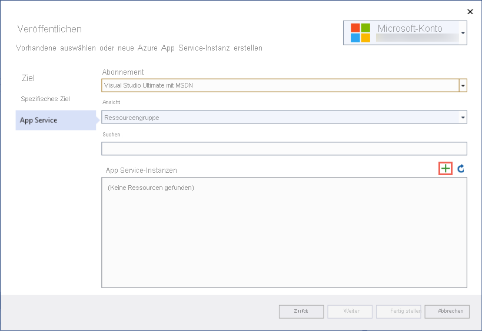

# <a name="quickstart-create-an-aspnet-core-web-app-in-azure"></a>Schnellstart: Erstellen von ASP.NET Core-Web-Apps in Azure

::: zone pivot="platform-windows"  

In diesem Schnellstart finden Sie Informationen zum Erstellen und Bereitstellen Ihrer ersten ASP.NET Core-Web-App in <abbr title="Ein HTTP-basierter Dienst zum Hosten von Webanwendungen, REST-APIs und mobilen Back-End-Anwendungen">Azure App Service</abbr>. Von App Service werden .NET. 5.0-Apps unterstützt.

Wenn Sie fertig sind, verfügen Sie über eine Azure- <abbr title="Ein logischer Container für verwandte Azure-Ressourcen, die Sie als Einheit verwalten können.">Ressourcengruppe</abbr>, bestehend aus einem <abbr title="Dieser Plan gibt den Standort, die Größe und die Features der Webserverfarm an, die Ihre App hostet.">App Service-Plan</abbr> und einer <abbr title="Die Darstellung Ihrer Web-App, die den Code Ihrer App, die DNS-Hostnamen, die Zertifikate und verwandte Ressourcen enthält.">App Service-App</abbr> mit einer bereitgestellten ASP.NET Core-Beispielanwendung.

<hr/> 

## <a name="1-prepare-your-environment"></a>1. Vorbereiten der Umgebung

- **Erstellen Sie ein Azure-Konto** mit einem aktiven <abbr title="Die grundlegende Organisationsstruktur, in der Sie Ressourcen in Azure verwalten. Diese wird in der Regel einer Einzelperson oder Abteilung innerhalb einer Organisation zugeordnet.">Abonnement</abbr>. Sie können [kostenlos ein Konto erstellen](https://azure.microsoft.com/free/dotnet/).
- **Installieren Sie <a href="https://www.visualstudio.com/downloads/" target="_blank">Visual Studio 2019</a>** mit der Workload **ASP.NET und Webentwicklung**.

<details>
<summary>Besitzen Sie Visual Studio 2019 bereits?</summary>
  Sie haben Visual Studio 2019 bereits installiert:

  - **Installieren Sie die neuesten Updates** in Visual Studio, indem Sie auf **Hilfe** > **Nach Updates suchen** klicken. Die neuesten Updates enthalten das .NET 5.0 SDK.
  - **Fügen Sie die Workload hinzu**, indem Sie auf **Extras** > **Tools und Features abrufen** klicken.
</details>

<hr/> 

## <a name="2-create-an-aspnet-core-web-app"></a>2. Erstellen einer ASP.NET Core-Web-App

1. Öffnen Sie Visual Studio, und wählen Sie **Neues Projekt erstellen** aus.

1. Wählen Sie unter **Neues Projekt erstellen** die Option **ASP.NET Core-Webanwendung** aus, und vergewissern Sie sich, dass **C#** als Sprache für diese Option aufgeführt ist. Wählen Sie anschließend **Weiter** aus.

1. Geben Sie Ihrem Webanwendungsprojekt unter **Neues Projekt konfigurieren** den Namen *myFirstAzureWebApp*, und wählen Sie **Erstellen** aus.

   

1. Wählen Sie für eine .NET 5.0-App in der Dropdownliste die Option **ASP.NET Core 5.0** aus. Andernfalls verwenden Sie den Standardwert.

1. Sie können eine beliebige Art von ASP.NET Core-Web-App für Azure bereitstellen. In dieser Schnellstartanleitung wird allerdings die Vorlage **ASP.NET Core-Web-App** verwendet. Stellen Sie sicher, dass unter **Authentifizierung** die Option **Keine Authentifizierung** ausgewählt und keine andere Option festgelegt ist. Wählen Sie anschließend **Erstellen**.

    
   
1. Wählen Sie im Visual Studio-Menü **Debuggen** > **Starten ohne Debugging** aus, um Ihre Web-App lokal auszuführen.

   

<hr/> 

## <a name="3-publish-your-web-app"></a>3. Veröffentlichen Ihrer Web-App

1. Klicken Sie im **Projektmappen-Explorer** mit der rechten Maustaste auf das Projekt **myFirstAzureWebApp**, und wählen Sie **Veröffentlichen** aus. 

1. Wählen Sie unter **Veröffentlichen** die Option **Azure** aus, und klicken Sie auf **Weiter**.

1. Ihre Optionen hängen davon ab, ob Sie bereits bei Azure angemeldet sind und ob Sie über ein Visual Studio-Konto verfügen, das mit einem Azure-Konto verknüpft ist. Wählen Sie entweder **Konto hinzufügen** oder **Anmelden** aus, um sich bei Ihrem Azure-Abonnement anzumelden. Wenn Sie bereits angemeldet sind, wählen Sie das gewünschte Konto aus.

   

1. Klicken Sie rechts von **App Service-Instanzen** auf **+** .

   

1. Akzeptieren Sie unter **Abonnement** das angegebene Abonnement, oder wählen Sie in der Dropdownliste ein neues Abonnement aus.

1. Wählen Sie unter **Ressourcengruppe** die Option **Neu** aus. Geben Sie unter **Name der neuen Ressourcengruppe** den Namen *myResourceGroup* ein, und wählen Sie **OK** aus. 

1. Wählen Sie unter **Hostingplan** die Option **Neu** aus. 

1. Geben Sie im Dialogfeld **Hostingplan: Neu erstellen** die Werte ein, die in der folgenden Tabelle angegeben sind:

   | Einstellung  | Empfohlener Wert |
   | -------- | --------------- |
   | **Hostingplan**  | *myFirstAzureWebAppPlan* |
   | **Location**      | *Europa, Westen* |
   | **Größe**          | *Free* |
   
   

1. Geben Sie unter **Name** einen eindeutigen App-Namen ein.

    <details>
        <summary>Welche Zeichen können verwendet werden?</summary>
        Gültige Zeichen sind: a-z, A-Z, 0-9 und -. Sie können den automatisch generierten eindeutigen Namen übernehmen. Die URL der Web-App lautet „http://<code>&lt;app-name&gt;.azurewebsites.net</code>“, wobei <code>&lt;app-name&gt;</code> dem App-Namen entspricht.
    </details>

1. Wählen Sie **Erstellen** aus, um die Azure-Ressourcen zu erstellen. 

   

1. Warten Sie, bis der Assistent mit dem Erstellen von Azure-Ressourcen fertig ist. Wählen Sie **Fertig stellen** aus, um den Assistenten zu schließen.

1. Klicken Sie auf der Seite **Veröffentlichen** auf **Veröffentlichen**, um Ihr Projekt bereitzustellen. 

    <details>
        <summary>Was macht Visual Studio?</summary>
        Visual Studio erstellt, packt und veröffentlicht die App in Azure und startet sie anschließend im Standardbrowser.
    </details>

   

<hr/> 

## <a name="4-update-the-app-and-redeploy"></a>4. Aktualisieren der App und erneutes Bereitstellen

1. Öffnen Sie im **Projektmappen-Explorer** unter Ihrem Projekt **Seiten** > **Index.cshtml**.

1. Ersetzen Sie das gesamte `<div>`-Tag durch den folgenden Code:

   ```html
   <div class="jumbotron">
       <h1>ASP.NET in Azure!</h1>
       <p class="lead">This is a simple app that we've built that demonstrates how to deploy a .NET app to Azure App Service.</p>
   </div>
   ```

1. Klicken Sie zur erneuten Bereitstellung in Azure im **Projektmappen-Explorer** mit der rechten Maustaste auf das Projekt **myFirstAzureWebApp**, und wählen Sie **Veröffentlichen** aus.

1. Wählen Sie auf der Zusammenfassungsseite **Veröffentlichen** die Option **Veröffentlichen** aus.

   <!--  -->

    Nach Abschluss der Veröffentlichung wird in Visual Studio ein Browser mit der URL der Web-App gestartet.

    

<hr/> 

## <a name="5-manage-the-azure-app"></a>5. Verwalten der Azure-App

1. Öffnen Sie das [Azure-Portal](https://portal.azure.com), suchen Sie nach **App Services**, und wählen Sie diese Option aus.

    
    
1. Wählen Sie auf der Seite **App Services** den Namen Ihrer Web-App aus.

    :::image type="content" source="./media/quickstart-dotnetcore/select-app-service.png" alt-text="Screenshot: Seite „App Services“ mit einer ausgewählten Beispiel-Web-App":::

1. Die Seite **Übersicht** für Ihre Web-App enthält Optionen für die grundlegende Verwaltung, z. B. Durchsuchen, Beenden, Starten, Neustarten und Löschen. Im linken Menü können Sie auf weitere Seiten für die Konfiguration Ihrer App zugreifen.

    
    
<hr/> 

## <a name="6-clean-up-resources"></a>6. Bereinigen von Ressourcen

1. Wählen Sie im Azure-Portalmenü oder auf der **Startseite** die Option **Ressourcengruppen** aus. Wählen Sie auf der Seite **Ressourcengruppen** die Option **myResourceGroup** aus.

1. Stellen Sie auf der Seite **myResourceGroup** sicher, dass die Ressourcen aufgelistet sind, die Sie löschen möchten.

1. Wählen Sie die Option **Löschen** aus, geben Sie zur Bestätigung im Textfeld **myResourceGroup** ein, und wählen Sie anschließend **Löschen** aus.

<hr/> 

## <a name="next-steps"></a>Nächste Schritte

Fahren Sie mit dem nächsten Artikel fort, um sich darüber zu informieren, wie Sie eine .NET Core-App erstellen und dafür eine Verbindung mit einer SQL-Datenbank herstellen:

- [ASP.NET Core mit SQL-Datenbank](tutorial-dotnetcore-sqldb-app.md)
- [Konfigurieren der ASP.NET Core-App](configure-language-dotnetcore.md)

::: zone-end  

::: zone pivot="platform-linux"
Dieser Schnellstart zeigt das Erstellen einer [.NET Core](/aspnet/core/)-App in <abbr title="App Service unter Linux bietet einen hochgradig skalierbaren Webhostingdienst mit Self-Patching unter Linux-Betriebssystemen.">App Service unter Linux</abbr>. Sie erstellen die App mithilfe der [Azure CLI](/cli/azure/get-started-with-azure-cli) und stellen mit Git den .NET Core-Code für die App bereit.

<hr/> 

## <a name="1-prepare-your-environment"></a>1. Vorbereiten der Umgebung

- **Erstellen Sie ein Azure-Konto** mit einem aktiven Abonnement. Sie können [kostenlos ein Konto erstellen](https://azure.microsoft.com/free/dotnet/).
- **Installieren** Sie das neueste <a href="https://dotnet.microsoft.com/download/dotnet-core/3.1" target="_blank">.NET Core 3.1 SDK</a> oder das <a href="https://dotnet.microsoft.com/download/dotnet/5.0" target="_blank">.NET 5.0 SDK</a>.
- **<a href="/cli/azure/install-azure-cli" target="_blank">Installieren Sie die neueste Version der Azure CLI</a>** .

[Treten Probleme auf? Informieren Sie uns darüber.](https://aka.ms/DotNetAppServiceLinuxQuickStart)

<hr/> 

## <a name="2-create-the-app-locally"></a>2. Lokales Erstellen der App

1. Führen Sie `mkdir hellodotnetcore` aus, um das Verzeichnis zu erstellen.

    ```bash
    mkdir hellodotnetcore
    ```

1. Führen Sie `cd hellodotnetcore` aus, um das Verzeichnis zu ändern. 

    ```bash
    cd hellodotnetcore
    ```

1. Führen Sie `dotnet new web` aus, um eine neue .NET Core-App zu erstellen.

    ```bash
    dotnet new web
    ```

<hr/> 

## <a name="3-run-the-app-locally"></a>3. Lokales Ausführen der App

1. Führen Sie `dotnet run` aus, um zu sehen, wie die Bereitstellung in Azure aussieht.

    ```bash
    dotnet run
    ```
    
1. **Öffnen Sie einen Webbrowser**, und navigieren Sie zur App unter `http://localhost:5000`.


[Treten Probleme auf? Informieren Sie uns darüber.](https://aka.ms/DotNetAppServiceLinuxQuickStart)

<hr/> 

## <a name="4-sign-into-azure"></a>4. Anmelden bei Azure

Führen Sie `az login` aus, um sich bei Azure anzumelden.

```azurecli
az login
```

[Treten Probleme auf? Informieren Sie uns darüber.](https://aka.ms/DotNetAppServiceLinuxQuickStart)

<hr/> 

## <a name="5-deploy-the-app"></a>5. Bereitstellen der App

1. **Führen Sie `az webapp up` in Ihrem lokalen Ordner aus**. **Ersetzen** Sie <app-name> durch einen global eindeutigen Namen.

    ```azurecli
    az webapp up --sku F1 --name <app-name> --os-type linux
    ```
    
    <details>
    <summary>Problembehandlung</summary>
    <ul>
    <li>Wenn der Befehl <code>az</code> nicht erkannt wird, stellen Sie sicher, dass Sie die Azure CLI gemäß der Beschreibung im Abschnitt <a href="#1-prepare-your-environment">Vorbereiten der Umgebung</a> installiert haben.</li>
    <li>Ersetzen Sie <code>&lt;app-name&gt;</code> durch einen Namen, der innerhalb von Azure eindeutig ist (<em>gültige Zeichen: <code>a-z</code>, <code>0-9</code> und <code>-</code></em>). Ein bewährtes Muster ist eine Kombination aus Ihrem Firmennamen und einer App-ID.</li>
    <li>Mit dem Argument <code>--sku F1</code> wird die Web-App im Tarif „Free“ erstellt. Lassen Sie dieses Argument weg, um einen schnelleren Premium-Tarif zu verwenden. Dieser verursacht jedoch stündlich Kosten.</li>
    <li>Optional können Sie das Argument <code>--location &lt;location-name&gt;</code> einfügen, wobei <code>&lt;location-name&gt;</code> eine verfügbare Azure-Region ist. Sie können eine Liste der zulässigen Regionen für Ihr Azure-Konto abrufen, indem Sie den Befehl <a href="/cli/azure/appservice#az-appservice-list-locations"><code>az account list-locations</code></a> ausführen.</li>
    </ul>
    </details>
    
1. Warten Sie, bis der Befehl ausgeführt ist. Dies kann einige Minuten dauern und endet mit „You can launch the app at http://&lt;app-name&gt;.azurewebsites.net“ (Sie können die App unter „http://<app-name>.azurewebsites.net“ starten).

    <details>
    <summary>Was bewirkt der Befehl <code>az webapp up</code>?</summary>
    <p>Der Befehl <code>az webapp up</code> bewirkt Folgendes:</p>
    <ul>
    <li>Erstellen einer Standardressourcengruppe</li>
    <li>Er erstellt einen App Service-Standardplan.</li>
    <li>Er <a href="/cli/azure/webapp#az-webapp-create">erstellt eine App Service-App</a> mit dem angegebenen Namen.</li>
    <li><a href="/azure/app-service/deploy-zip">Bereitstellen von ZIP-Dateien</a> aus dem aktuellen Arbeitsverzeichnis für die App</li>
    <li>Während der Ausführung werden Meldungen zur Ressourcenerstellung, Protokollierung und ZIP-Bereitstellung angezeigt.</li>
    </ul>
    </details>
    
# <a name="net-core-31"></a>[.NET Core 3.1](#tab/netcore31)


# <a name="net-50"></a>[.NET 5.0](#tab/net50)


---

[Treten Probleme auf? Informieren Sie uns darüber.](https://aka.ms/DotNetAppServiceLinuxQuickStart)

<hr/> 

## <a name="6-browse-to-the-app"></a>6. Navigieren zur App

**Navigieren Sie in Ihrem Webbrowser zur bereitgestellten Anwendung**.

```bash
http://<app_name>.azurewebsites.net
```


[Treten Probleme auf? Informieren Sie uns darüber.](https://aka.ms/DotNetAppServiceLinuxQuickStart)

<hr/> 

## <a name="7-update-and-redeploy-the-code"></a>7. Aktualisieren und erneutes Bereitstellen des Codes

1. **Öffnen Sie die Datei _Startup.cs_** im lokalen Verzeichnis. 

1. **Nehmen Sie eine kleine Änderung** am Text im Methodenaufruf `context.Response.WriteAsync` vor.

    ```csharp
    await context.Response.WriteAsync("Hello Azure!");
    ```
    
1. **Speichern Sie Ihre Änderungen**.

1. **Führen Sie `az webapp up` aus**, um die Bereitstellung noch mal durchzuführen:

```azurecli
az webapp up --os-type linux
```

<details>
<summary>Was bewirkt der Befehl <code>az webapp up</code> diesmal?</summary>
Als Sie den Befehl zum ersten Mal ausgeführt haben, hat dieser den App-Namen, die Ressourcengruppe und den App Service-Plan in der Datei <i>.azure/config</i> im Projektstamm gespeichert. Wenn Sie den Befehl noch mal im Projektstamm ausführen, verwendet er die in <i>.azure/config</i> gespeicherten Werte, erkennt, dass die App Service-Ressourcen bereits vorhanden sind, und führt die ZIP-Bereitstellung noch mal durch.
</details>

1. **Klicken Sie im zuvor geöffneten Browserfenster auf aktualisieren**, sobald die Bereitstellung abgeschlossen ist.


[Treten Probleme auf? Informieren Sie uns darüber.](https://aka.ms/DotNetAppServiceLinuxQuickStart)

<hr/> 

## <a name="8-manage-your-new-azure-app"></a>8. Verwalten Ihrer neuen Azure-App

1. Öffnen Sie das <a href="https://portal.azure.com" target="_blank">Azure-Portal</a>.

1. Klicken Sie im linken Menü auf **App Services** und anschließend auf den Namen Ihrer Azure-App.

    :::image type="content" source="./media/quickstart-dotnetcore/portal-app-service-list-up.png" alt-text="Screenshot: Seite „App Services“ mit einer ausgewählten Beispiel-Azure-App":::

1. Auf der Seite „Übersicht“ können Sie einfache Verwaltungsaufgaben wie das Durchsuchen, Anhalten, Starten, Neustarten und Löschen durchführen. Im linken Menü werden verschiedene Seiten für die Konfiguration Ihrer App angezeigt. 


<hr/> 

## <a name="9-clean-up-resources"></a>9. Bereinigen von Ressourcen

**Führen Sie den Befehl `az group delete --name myResourceGroup` aus**, um die Ressourcengruppe zu löschen.

```azurecli-interactive
az group delete --name myResourceGroup
```

[Treten Probleme auf? Informieren Sie uns darüber.](https://aka.ms/DotNetAppServiceLinuxQuickStart)

<hr/> 

## <a name="next-steps"></a>Nächste Schritte

- [Tutorial: ASP.NET Core-App mit SQL-Datenbank](tutorial-dotnetcore-sqldb-app.md)
- [Konfigurieren der ASP.NET Core-App](configure-language-dotnetcore.md)

::: zone-end
