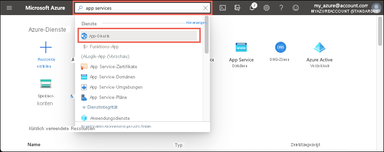

# <a name="quickstart-create-an-aspnet-core-web-app-in-azure"></a>Schnellstart: Erstellen von ASP.NET Core-Web-Apps in Azure

::: zone pivot="platform-windows"  

In dieser Schnellstartanleitung wird beschrieben, wie Sie Ihre erste ASP.NET Core-Web-App erstellen und für [Azure App Service](overview.md) bereitstellen. 

Am Ende verfügen Sie über eine Azure-Ressourcengruppe, die einen App Service-Hostingplan und eine App Service-Instanz mit einer bereitgestellten Webanwendung umfasst.

## <a name="prerequisites"></a>Voraussetzungen

- Ein Azure-Konto mit einem aktiven Abonnement. Sie können [kostenlos ein Konto erstellen](https://azure.microsoft.com/free/dotnet/).
- In dieser Schnellstartanleitung wird eine App in App Service unter Windows bereitgestellt. Informationen zur Bereitstellung in App Service für _Linux_ finden Sie unter [Erstellen einer .NET Core-Web-App in App Service](./quickstart-dotnetcore.md).
- Installieren Sie <a href="https://www.visualstudio.com/downloads/" target="_blank">Visual Studio 2019</a> mit der Workload **ASP.NET und Webentwicklung**.

  Sie haben Visual Studio 2019 bereits installiert:

  - Installieren Sie in Visual Studio die neuesten Updates, indem Sie **Hilfe** > **Nach Updates suchen** auswählen.
  - Fügen Sie die Workload hinzu. Wählen Sie dazu **Tools** > **Tools und Features abrufen** aus.


## <a name="create-an-aspnet-core-web-app"></a>Erstellen einer ASP.NET Core-Web-App

Führen Sie zum Erstellen einer ASP.NET Core-Web-App in Visual Studio die folgenden Schritte aus:

1. Öffnen Sie Visual Studio, und wählen Sie **Neues Projekt erstellen** aus.

1. Wählen Sie unter **Neues Projekt erstellen** die Option **ASP.NET Core-Webanwendung** aus, und vergewissern Sie sich, dass **C#** als Sprache für diese Option aufgeführt ist. Wählen Sie anschließend **Weiter** aus.

1. Geben Sie Ihrem Webanwendungsprojekt unter **Neues Projekt konfigurieren** den Namen *myFirstAzureWebApp*, und wählen Sie **Erstellen** aus.

   

1. Sie können einen beliebigen Typ von ASP.NET Core-Web-App für Azure bereitstellen, aber für diese Schnellstartanleitung sollten Sie die Vorlage **Webanwendung** auswählen. Stellen Sie sicher, dass unter **Authentifizierung** die Option **Keine Authentifizierung** ausgewählt und keine andere Option festgelegt ist. Wählen Sie anschließend **Erstellen**.

    
   
1. Wählen Sie im Visual Studio-Menü **Debuggen** > **Starten ohne Debugging** aus, um Ihre Web-App lokal auszuführen.

   

## <a name="publish-your-web-app"></a>Veröffentlichen Ihrer Web-App

Zum Veröffentlichen Ihrer Web-App müssen Sie zuerst eine neue App Service-Instanz erstellen und konfigurieren, auf der Sie Ihre App veröffentlichen können. 

Erstellen Sie bei der Einrichtung der App Service-Instanz Folgendes:

- Eine neue [Ressourcengruppe](../azure-resource-manager/management/overview.md#terminology), die alle Azure-Ressourcen für den Dienst enthalten soll.
- Einen neuen [Hostingplan](./overview-hosting-plans.md), mit dem der Standort, die Größe und die Funktionen der Webserverfarm zum Hosten Ihrer App angegeben werden.

Führen Sie die folgenden Schritte aus, um Ihre App Service-Instanz zu erstellen und Ihre Web-App zu veröffentlichen:

1. Klicken Sie im **Projektmappen-Explorer** mit der rechten Maustaste auf das Projekt **myFirstAzureWebApp**, und wählen Sie **Veröffentlichen** aus. Wählen Sie **Konto hinzufügen** oder **Anmelden** aus, falls Sie sich noch nicht über Visual Studio bei Ihrem Azure-Konto angemeldet haben. Sie können auch ein kostenloses Azure-Konto erstellen.

1. Wählen Sie im Dialogfeld **Veröffentlichungsziel auswählen** die Option **App Service** und dann **Neu erstellen** und **Profil erstellen** aus.

   

1. Verwenden Sie im Dialogfeld **App Service: Neu erstellen** einen global eindeutigen **Namen** für Ihre App, indem Sie entweder den Standardnamen übernehmen oder einen neuen Namen eingeben. Gültige Zeichen: `a-z`, `A-Z`, `0-9` und `-`. Dieser **Name** wird als URL-Präfix für Ihre Web-App im Format `http://<app_name>.azurewebsites.net` verwendet.

1. Akzeptieren Sie unter **Abonnement** das angegebene Abonnement, oder wählen Sie in der Dropdownliste ein neues Abonnement aus.

1. Wählen Sie unter **Ressourcengruppe** die Option **Neu** aus. Geben Sie unter **Name der neuen Ressourcengruppe** den Namen *myResourceGroup* ein, und wählen Sie **OK** aus. 

1. Wählen Sie unter **Hostingplan** die Option **Neu** aus. 

1. Geben Sie im Dialogfeld **Hostingplan: Neu erstellen** die Werte ein, die in der folgenden Tabelle angegeben sind:

   | Einstellung  | Empfohlener Wert | BESCHREIBUNG |
   | -------- | --------------- | ----------- |
   | **Hostingplan**  | *myFirstAzureWebAppPlan* | Name des App Service-Plans. |
   | **Location**      | *Europa, Westen* | Das Rechenzentrum, in dem die Web-App gehostet wird. |
   | **Größe**          | *Free* | Der [Tarif](https://azure.microsoft.com/pricing/details/app-service/?ref=microsoft.com&utm_source=microsoft.com&utm_medium=docs&utm_campaign=visualstudio) bestimmt die Hostingfeatures. |
   
   

1. Übernehmen Sie für **Application Insights** die Einstellung auf *Keine*.

1. Verwenden Sie im Dialogfeld **App Service: Neu erstellen** die Option **Erstellen** aus, um mit der Erstellung der Azure-Ressourcen zu beginnen.

   

1. Wählen Sie nach Abschluss des Assistenten die Option **Veröffentlichen** aus.

   

   Visual Studio veröffentlicht Ihre ASP.NET Core-Web-App in Azure und startet die App in Ihrem Standardbrowser. 

   

**Glückwunsch!** Ihre ASP.NET Core-Web-App wird live in Azure App Service ausgeführt.

## <a name="update-the-app-and-redeploy"></a>Aktualisieren der App und erneutes Bereitstellen

Führen Sie die folgenden Schritte aus, um Ihre Web-App zu aktualisieren und erneut bereitzustellen:

1. Öffnen Sie im **Projektmappen-Explorer** unter Ihrem Projekt **Seiten** > **Index.cshtml**.

1. Ersetzen Sie das gesamte `<div>`-Tag durch den folgenden Code:

   ```html
   <div class="jumbotron">
       <h1>ASP.NET in Azure!</h1>
       <p class="lead">This is a simple app that we've built that demonstrates how to deploy a .NET app to Azure App Service.</p>
   </div>
   ```

1. Klicken Sie zur erneuten Bereitstellung in Azure im **Projektmappen-Explorer** mit der rechten Maustaste auf das Projekt **myFirstAzureWebApp**, und wählen Sie **Veröffentlichen** aus.

1. Wählen Sie auf der Zusammenfassungsseite **Veröffentlichen** die Option **Veröffentlichen** aus.

   

Nach Abschluss der Veröffentlichung wird in Visual Studio ein Browser mit der URL der Web-App gestartet.


## <a name="manage-the-azure-app"></a>Verwalten der Azure-App

Wechseln Sie zum Verwalten Ihrer Web-App zum [Azure-Portal](https://portal.azure.com), und suchen Sie nach **App Services**. Wählen Sie diese Option anschließend aus.



Wählen Sie auf der Seite **App Services** den Namen Ihrer Web-App aus.

:::image type="content" source="./media/quickstart-dotnetcore/select-app-service.png" alt-text="Screenshot: Seite „App Services“ mit einer ausgewählten Beispiel-Web-App":::

Die Seite **Übersicht** für Ihre Web-App enthält Optionen für die grundlegende Verwaltung, z. B. Durchsuchen, Beenden, Starten, Neustarten und Löschen. Im linken Menü können Sie auf weitere Seiten für die Konfiguration Ihrer App zugreifen.


[!INCLUDE [Clean-up section](../../includes/clean-up-section-portal.md)]

## <a name="next-steps"></a>Nächste Schritte

In dieser Schnellstartanleitung haben Sie Visual Studio verwendet, um eine ASP.NET Core-Web-App zu erstellen und für Azure App Service bereitzustellen.

Fahren Sie mit dem nächsten Artikel fort, um sich darüber zu informieren, wie Sie eine .NET Core-App erstellen und dafür eine Verbindung mit einer SQL-Datenbank herstellen:

> [!div class="nextstepaction"]
> [ASP.NET Core mit SQL-Datenbank](tutorial-dotnetcore-sqldb-app.md)

> [!div class="nextstepaction"]
> [Konfigurieren der ASP.NET Core-App](configure-language-dotnetcore.md)

::: zone-end  

::: zone pivot="platform-linux"
[App Service unter Linux](overview.md#app-service-on-linux) bietet einen hochgradig skalierbaren Webhostingdienst mit Self-Patching unter Linux-Betriebssystemen. In diesem Schnellstartartikel wird erläutert, wie Sie eine [.NET Core](/aspnet/core/)-App in App Service unter Linux erstellen. Sie erstellen die App mithilfe der [Azure CLI](/cli/azure/get-started-with-azure-cli) und stellen mit Git den .NET Core-Code für die App bereit.


Die Schritte in diesem Artikel können unter Mac, Windows oder Linux ausgeführt werden.

[!INCLUDE [quickstarts-free-trial-note](../../includes/quickstarts-free-trial-note.md)]

## <a name="prerequisites"></a>Voraussetzungen

So führen Sie diesen Schnellstart durch:

* <a href="https://git-scm.com/" target="_blank">Installation von Git</a>
* <a href="https://dotnet.microsoft.com/download/dotnet-core/3.1" target="_blank">Installation des aktuellen .NET Core 3.1 SDK</a>

[Treten Probleme auf? Informieren Sie uns darüber.](https://aka.ms/DotNetAppServiceLinuxQuickStart)

## <a name="create-the-app-locally"></a>Lokales Erstellen der App

Erstellen Sie in einem Terminalfenster auf Ihrem Computer ein Verzeichnis mit dem Namen `hellodotnetcore`, und wechseln Sie dorthin.

```bash
mkdir hellodotnetcore
cd hellodotnetcore
```

Erstellen Sie eine neue .NET Core-App.

```bash
dotnet new web
```

## <a name="run-the-app-locally"></a>Lokales Ausführen der App

Führen Sie die Anwendung lokal aus, damit Sie sehen, wie sie beim Bereitstellen in Azure aussehen sollte. 

Stellen Sie die NuGet-Pakete wieder her, und führen Sie die App aus.

```bash
dotnet run
```

Öffnen Sie einen Webbrowser, und navigieren Sie zu der App auf `http://localhost:5000`.

Auf der Seite wird die Nachricht **Hello World** aus der Beispiel-App angezeigt.


Drücken Sie in Ihrem Terminalfenster **STRG+C**, um den Webserver zu beenden. Initialisieren Sie ein Git-Repository für das .NET Core-Projekt.

```bash
git init
git add .
git commit -m "first commit"
```

[Treten Probleme auf? Informieren Sie uns darüber.](https://aka.ms/DotNetAppServiceLinuxQuickStart)

[!INCLUDE [cloud-shell-try-it.md](../../includes/cloud-shell-try-it.md)]

[Treten Probleme auf? Informieren Sie uns darüber.](https://aka.ms/DotNetAppServiceLinuxQuickStart)

[!INCLUDE [Configure deployment user](../../includes/configure-deployment-user.md)]

[Treten Probleme auf? Informieren Sie uns darüber.](https://aka.ms/DotNetAppServiceLinuxQuickStart)

[!INCLUDE [Create resource group](../../includes/app-service-web-create-resource-group-linux.md)]

[Treten Probleme auf? Informieren Sie uns darüber.](https://aka.ms/DotNetAppServiceLinuxQuickStart)

[!INCLUDE [Create app service plan](../../includes/app-service-web-create-app-service-plan-linux.md)]

[Treten Probleme auf? Informieren Sie uns darüber.](https://aka.ms/DotNetAppServiceLinuxQuickStart)

## <a name="create-a-web-app"></a>Erstellen einer Web-App

[!INCLUDE [Create web app](../../includes/app-service-web-create-web-app-dotnetcore-linux-no-h.md)]

Wechseln Sie zu Ihrer neu erstellten App. Ersetzen Sie _&lt;app-name>_ durch Ihren App-Namen.

```bash
https://<app-name>.azurewebsites.net
```

Ihre neue App sollte nun wie folgt aussehen:


[!INCLUDE [Push to Azure](../../includes/app-service-web-git-push-to-azure.md)] 

<pre>
Enumerating objects: 5, done.
Counting objects: 100% (5/5), done.
Compressing objects: 100% (3/3), done.
Writing objects: 100% (3/3), 285 bytes | 95.00 KiB/s, done.
Total 3 (delta 2), reused 0 (delta 0), pack-reused 0
remote: Deploy Async
remote: Updating branch 'master'.
remote: Updating submodules.
remote: Preparing deployment for commit id 'd6b54472f7'.
remote: Repository path is /home/site/repository
remote: Running oryx build...
remote: Build orchestrated by Microsoft Oryx, https://github.com/Microsoft/Oryx
remote: You can report issues at https://github.com/Microsoft/Oryx/issues
remote:
remote: Oryx Version      : 0.2.20200114.13, Commit: 204922f30f8e8d41f5241b8c218425ef89106d1d, ReleaseTagName: 20200114.13
remote: Build Operation ID: |imoMY2y77/s=.40ca2a87_
remote: Repository Commit : d6b54472f7e8e9fd885ffafaa64522e74cf370e1
.
.
.
remote: Deployment successful.
remote: Deployment Logs : 'https://&lt;app-name&gt;.scm.azurewebsites.net/newui/jsonviewer?view_url=/api/deployments/d6b54472f7e8e9fd885ffafaa64522e74cf370e1/log'
To https://&lt;app-name&gt;.scm.azurewebsites.net:443/&lt;app-name&gt;.git
   d87e6ca..d6b5447  master -> master
</pre>

[Treten Probleme auf? Informieren Sie uns darüber.](https://aka.ms/DotNetAppServiceLinuxQuickStart)

## <a name="browse-to-the-app"></a>Navigieren zur App

Navigieren Sie in Ihrem Webbrowser zu der bereitgestellten Anwendung.

```bash
http://<app_name>.azurewebsites.net
```

Der .NET Core-Beispielcode wird in App Service unter Linux mit einem integrierten Image ausgeführt.


**Glückwunsch!** Sie haben Ihre erste .NET Core-App für App Service unter Linux bereitgestellt.

[Treten Probleme auf? Informieren Sie uns darüber.](https://aka.ms/DotNetAppServiceLinuxQuickStart)

## <a name="update-and-redeploy-the-code"></a>Aktualisieren und erneutes Bereitstellen des Codes

Öffnen Sie im lokalen Verzeichnis die Datei _Startup.cs_. Nehmen Sie eine kleine Änderung am Text im Methodenaufruf `context.Response.WriteAsync` vor:

```csharp
await context.Response.WriteAsync("Hello Azure!");
```

Führen Sie für Ihre Änderungen in Git einen Commit aus, und übertragen Sie dann die Codeänderungen mithilfe von Push an Azure.

```bash
git commit -am "updated output"
git push azure master
```

Wechseln Sie nach Abschluss der Bereitstellung wieder zu dem Browserfenster, das im Schritt **Navigieren zur App** geöffnet wurde, und wählen Sie die Option „Aktualisieren“ aus.


[Treten Probleme auf? Informieren Sie uns darüber.](https://aka.ms/DotNetAppServiceLinuxQuickStart)

## <a name="manage-your-new-azure-app"></a>Verwalten Ihrer neuen Azure-App

Wechseln Sie zum <a href="https://portal.azure.com" target="_blank">Azure-Portal</a>, um die erstellte App zu verwalten.

Klicken Sie im linken Menü auf **App Services** und anschließend auf den Namen Ihrer Azure-App.

:::image type="content" source="./media/quickstart-dotnetcore/portal-app-service-list.png" alt-text="Screenshot: Seite „App Services“ mit einer ausgewählten Beispiel-Web-App":::

Die Übersichtsseite Ihrer App wird angezeigt. Hier können Sie einfache Verwaltungsaufgaben wie Durchsuchen, Beenden, Neustarten und Löschen durchführen. 


Im linken Menü werden verschiedene Seiten für die Konfiguration Ihrer App angezeigt. 

[!INCLUDE [cli-samples-clean-up](../../includes/cli-samples-clean-up.md)]

[Treten Probleme auf? Informieren Sie uns darüber.](https://aka.ms/DotNetAppServiceLinuxQuickStart)

## <a name="next-steps"></a>Nächste Schritte

> [!div class="nextstepaction"]
> [Tutorial: ASP.NET Core-App mit SQL-Datenbank](tutorial-dotnetcore-sqldb-app.md)

> [!div class="nextstepaction"]
> [Konfigurieren der ASP.NET Core-App](configure-language-dotnetcore.md)

::: zone-end