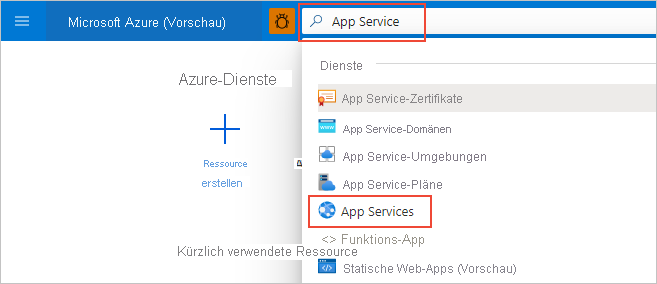

# Schnellstart: Erstellen einer Python-App mithilfe von Azure App Service für Linux (Azure-Portal)

In diesem Schnellstart stellen Sie eine Python-Web-App für [App Service für Linux](overview.md#app-service-on-linux) bereit. Dies ist der überaus skalierbare Webhostingdienst von Azure mit automatisiertem Patchen. Sie verwenden das Azure-Portal, um mit den Frameworks Flask oder Django ein Beispiel bereitzustellen. Die Web-App, die Sie konfigurieren, verwendet einen einfachen App Service-Tarif, der in Ihrem Azure-Abonnement geringe Kosten verursacht.

## Konfigurieren von Konten

- Sie können ein [kostenloses Konto erstellen](https://azure.microsoft.com/free/?ref=microsoft.com&utm_source=microsoft.com&utm_medium=docs&utm_campaign=visualstudio), sofern Sie noch nicht über ein Azure-Konto mit einem aktiven Abonnement verfügen.

- Wenn Sie kein GitHub-Konto haben, besuchen Sie [GitHub.com](https://github.com), um eines zu erstellen. 

## Forken des GitHub-Beispielrepositorys

1. Öffnen Sie [GitHub.com](https://github.com), und melden Sie sich an.

1. Navigieren Sie zu einem der folgenden Beispielrepositorys:
    - [Flask „Hallo Welt“](https://github.com/Azure-Samples/python-docs-hello-world)
    - [Django „Hallo Welt“](https://github.com/Azure-Samples/python-docs-hello-django)

1. Wählen Sie oben rechts auf der GitHub-Seite die Option **Fork** aus, um in Ihrem eigenen GitHub-Konto eine Kopie des Repositorys zu erstellen:

    

    Azure erfordert, dass Sie Zugriff auf die GitHub-Organisation haben, in der das Repository enthalten ist. Wenn Sie das Beispiel in Ihr eigenes GitHub-Konto forken, verfügen Sie automatisch über die notwendigen Zugriffsrechte und können auch Änderungen am Code vornehmen.

## Bereitstellen der App Service-Web-App

Bei einer App Service-Web-App handelt es sich um den Webserver, auf dem Sie Ihren Code bereitstellen.

1. Öffnen Sie das Azure-Portal unter [https://portal.azure.com](https://portal.azure.com), und melden Sie sich ggf. an.

1. Geben Sie in der Suchleiste am oberen Rand des Azure-Portals „App Service“ ein, und wählen Sie dann **App Services** aus.

    

1. Wählen Sie auf der Seite **App Services** die Option „ **+ Hinzufügen** aus:

    

1. Gehen Sie auf der Seite **Web-App erstellen** folgendermaßen vor:
    
    | Feld | Aktion |
    | --- | --- |
    | Subscription | Wählen Sie das Azure-Abonnement aus, das Sie verwenden möchten. |
    | Ressourcengruppe | Wählen Sie unterhalb der Dropdown-Liste die Option **Neue erstellen** aus. Geben Sie im Popup Fenster „AppService-PythonQuickstart“ ein, und wählen Sie „**OK**“ aus. |
    | Name | Geben Sie einen Namen ein, der überall in Azure eindeutig ist. In der Regel wird eine Kombination aus dem Namen einer Person oder Firma, wie z B. *contoso-testapp-123*, verwendet. |
    | Veröffentlichen | Wählen Sie **Code** aus. |
    | Laufzeitstapel | Wählen Sie **Python 3.8** aus. |
    | Betriebssystem | Wählen Sie **Linux** (Python wird nur unter Linux unterstützt) aus. |
    | Region | Wählen Sie eine Region in Ihrer Nähe. |
    | Linux-Plan | Wählen Sie einen vorhandenen App Service-Plan aus, oder verwenden Sie **Neu erstellen**, um einen neuen Plan zu erstellen. Es wird empfohlen, den Plan **Basic B1** zu verwenden. |

    

1. Wählen Sie unten auf der Seite **Überprüfen + Erstellen** aus, überprüfen Sie die Details, und wählen Sie dann **Erstellen** aus.

1. Wählen Sie nach Abschluss der Bereitstellung die Option **Zu Ressource wechseln**, um zur neuen App Service-Seite zu navigieren. Ihre Web-App enthält zu diesem Zeitpunkt nur eine Standardseite, sodass im nächsten Schritt Beispielcode bereitgestellt wird.

Treten Probleme auf? [Informieren Sie uns darüber.](https://aka.ms/FlaskPortalQuickstartHelp)

## Bereitstellen des Beispielcodes

1. Wählen Sie auf der Web-App-Seite im Azure-Portal die Option **Bereitstellungscenter** aus:
    
    

1. Wenn sie noch nicht geöffnet ist, wählen Sie auf der Seite **Bereitstellungscenter** die Registerkarte **Einstellungen** aus:

    

1. Wählen Sie unter **Quelle** die Option **GitHub** aus, und führen Sie dann im angezeigten **GitHub**-Formular die folgenden Aktionen aus:

    | Feld | Aktion |
    | --- | --- |
    | Angemeldet als | Wenn Sie noch nicht bei GitHub angemeldet sind, holen Sie dies jetzt nach, oder wählen Sie bei Bedarf **Konto ändern* aus. |
    | Organization | Wählen Sie ggf. Ihre GitHub-Organisation aus. |
    | Repository | Wählen Sie den Namen des Beispielrepositorys aus, das Sie zuvor geforkt haben, also entweder **python-docs-hello-world** (Flask) oder **python-docs-hello-django** (Django). |
    | Verzweigung | Wählen Sie **main** aus. |

    

1. Klicken Sie oben auf der Seite auf **Speichern**, um die Einstellungen zu übernehmen.

    

1. Wählen Sie die Registerkarte **Protokolle** aus, um den Status der Bereitstellung anzuzeigen. Es dauert einige Minuten, bis das Beispiel erstellt und bereitgestellt wird. Während dieses Prozesses werden weitere Protokolle angezeigt. Nach Abschluss sollten die Protokolle den Status **Erfolg (aktiv)** wiedergeben:

    

Treten Probleme auf? [Informieren Sie uns darüber.](https://aka.ms/FlaskPortalQuickstartHelp)

## Navigieren zur App

1. Wählen Sie nach Abschluss der Bereitstellung im Menü auf der linken Seite die Option **Übersicht**, um zur Hauptseite der Web-App zurückzukehren.

1. Wählen Sie die **URL** mit der Adresse der Web-App aus:

    

1. Überprüfen Sie, ob die App „Hallo Welt!“ ausgibt:

    

Treten Probleme auf? Lesen Sie zunächst das [Handbuch zur Problembehandlung](configure-language-python.md#troubleshooting), andernfalls [informieren Sie uns darüber](https://aka.ms/FlaskPortalQuickstartHelp).

## Durchführen einer Änderung und erneutes Bereitstellen

Da Sie App Service mit Ihrem Repository verbunden haben, werden Änderungen, die Sie in Ihrem Quellrepository committen, automatisch in der Web-App bereitgestellt.

1. Sie können Änderungen direkt in Ihrem geforkten Repository auf GitHub vornehmen, oder Sie können das Repository lokal klonen, Änderungen vornehmen und committen und diese Änderungen anschließend per Push an GitHub übertragen. Beide Methoden bewirken eine Änderung an dem Repository, das mit App Service verbunden ist.

1. Ändern Sie **in Ihrem geforkten Repository** die Meldung der APP von „Hallo Welt!“ in „Hello Azure!“ wie folgt auswählen:
    - Flask (Beispiel python-docs-hello-world): Ändern Sie die Zeichenfolge in Zeile 6 der Datei *application.py*.
    - Django (Beispiel python-docs-hello-django): Ändern Sie die Zeichenfolge in Zeile 5 der Datei *views.py* im Ordner „*hello*“.

1. Committen Sie die Änderung im Repository.

    Wenn Sie einen lokalen Klon verwenden, übergeben Sie diese Änderungen per Push auch an GitHub.

1. Kehren Sie im Azure-Portal für die Web-App zum **Bereitstellungscenter** zurück, wählen Sie die Registerkarte **Protokolle** aus, und beachten Sie die neue Bereitstellungsaktivität, die gerade ausgeführt werden sollte.

1. Kehren Sie nach Abschluss der Bereitstellung zur Seite **Übersicht** der Web-App zurück, öffnen Sie erneut die URL der Web-App, und beobachten Sie die Veränderungen in der App:

    

Treten Probleme auf? Lesen Sie zunächst das [Handbuch zur Problembehandlung](configure-language-python.md#troubleshooting), andernfalls [informieren Sie uns darüber](https://aka.ms/FlaskCLIQuickstartHelp).

## Bereinigen von Ressourcen

In den vorherigen Schritten haben Sie Azure-Ressourcen in einer Ressourcengruppe mit dem Namen „AppService-PythonQuickstart“ erstellt, die auf der Seite *Übersicht** der Web-App angezeigt wird. Wenn Sie die Web-App im ausgeführten Zustand belassen, fallen laufende Kosten an (siehe [App Service-Preise](https://azure.microsoft.com/pricing/details/app-service/linux/)).

Wenn Sie davon ausgehen, dass Sie diese Ressourcen in Zukunft nicht benötigen werden, wählen Sie auf der Seite **Übersicht** der Web-App den Namen der Ressourcengruppe aus, um zur Ressourcengruppenübersicht zu navigieren. Klicken Sie auf **Ressourcengruppe löschen**, und befolgen Sie die Anweisungen.

Treten Probleme auf? [Informieren Sie uns darüber.](https://aka.ms/FlaskCLIQuickstartHelp)

## Nächste Schritte

> [!div class="nextstepaction"]
> [Tutorial: Python-Web-App (Django) mit PostgreSQL](/azure/developer/python/tutorial-python-postgresql-app-portal)

> [!div class="nextstepaction"]
> [Konfigurieren einer Python-App](configure-language-python.md)

> [!div class="nextstepaction"]
> [Schnellstart: Hinzufügen von „Mit Microsoft anmelden“ zu einer Python-Web-App](../active-directory/develop/quickstart-v2-python-webapp.md)

> [!div class="nextstepaction"]
> [Tutorial: Ausführen einer Python-App in einem benutzerdefinierten Container](tutorial-custom-container.md)
