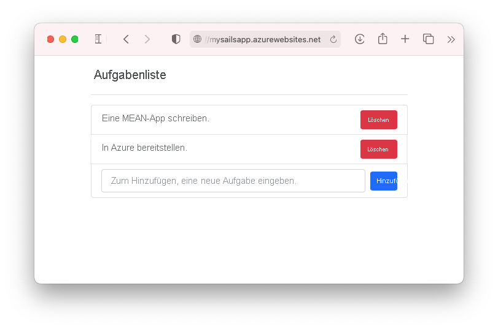
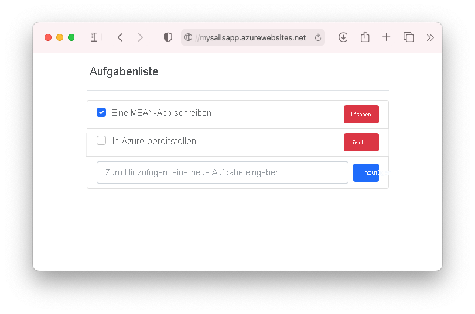

# <a name="tutorial-build-a-nodejs-and-mongodb-app-in-azure"></a>Tutorial: Erstellen einer Node.js- und MongoDB-App in Azure

::: zone pivot="platform-windows"  

Von [Azure App Service](overview.md) wird ein hochgradig skalierbarer Webhostingdienst mit Self-Patching bereitgestellt. In diesem Tutorial wird gezeigt, wie Sie eine Node.js-App in App Service unter Windows erstellen und mit einer MongoDB-Datenbank verbinden. Wenn Sie fertig sind, wird eine MEAN-Anwendung (MongoDB, Express, AngularJS und Node.js) in [Azure App Service](overview.md) ausgeführt. Die Beispielanwendung verwendet eine Kombination aus [Sails.js](https://sailsjs.com/) und [Angular 12](https://angular.io/).

::: zone-end

::: zone pivot="platform-linux"


[Azure App Service](overview.md) bietet einen hochgradig skalierbaren Webhostingdienst mit Self-Patching unter dem Linux-Betriebssystem. In diesem Tutorial wird gezeigt, wie eine Node.js-App in App Service für Linux erstellt, lokal mit einer MongoDB-Datenbank verbunden und dann in einer Datenbank in der Azure Cosmos DB-API für MongoDB bereitgestellt wird. Nachdem Sie diese Schritte ausgeführt haben, wird eine MEAN-Anwendung (MongoDB, Express, AngularJS und Node.js) in App Service unter Linux ausgeführt. Die Beispielanwendung verwendet eine Kombination aus [Sails.js](https://sailsjs.com/) und [Angular 12](https://angular.io/).

::: zone-end



Sie lernen Folgendes:

> [!div class="checklist"]
> * Erstellen einer MongoDB-Datenbank in Azure
> * Verbinden einer Node.js-App mit MongoDB
> * Bereitstellen der Anwendung in Azure
> * Aktualisieren des Datenmodells und erneutes Bereitstellen der App
> * Streamen von Diagnoseprotokollen aus Azure
> * Verwalten der App im Azure-Portal

[!INCLUDE [quickstarts-free-trial-note](../../includes/quickstarts-free-trial-note.md)]

## <a name="prerequisites"></a>Voraussetzungen

Für dieses Tutorial benötigen Sie Folgendes:

- [Installation von Git](https://git-scm.com/)
- [Installieren von Node.js und npm](https://nodejs.org/)
[!INCLUDE [azure-cli-prepare-your-environment-no-header.md](../../includes/azure-cli-prepare-your-environment-no-header.md)] 

## <a name="create-local-nodejs-app"></a>Erstellen einer lokalen Node.js-App

In diesem Schritt richten Sie das lokale Node.js-Projekt ein.

### <a name="clone-the-sample-application"></a>Klonen der Beispielanwendung

Wechseln Sie im Terminalfenster mit `cd` in ein Arbeitsverzeichnis.  

Führen Sie den folgenden Befehl aus, um das Beispielrepository zu klonen. 

```bash
git clone https://github.com/Azure-Samples/mean-todoapp.git
```

> [!NOTE]
> Informationen zum Erstellen der Beispiel-App finden Sie unter [https://github.com/Azure-Samples/mean-todoapp](https://github.com/Azure-Samples/mean-todoapp).

### <a name="run-the-application"></a>Ausführen der Anwendung

Führen Sie die folgenden Befehle aus, um die erforderlichen Pakete zu installieren und die Anwendung zu starten.

```bash
cd mean-todoapp
npm install
node app.js --alter
```

Wenn die App vollständig geladen wurde, sollte eine ähnliche Meldung wie diese angezeigt werden:

<pre>
debug: -------------------------------------------------------
debug: :: Fri Jul 09 2021 13:10:34 GMT+0200 (Central European Summer Time)

debug: Environment : development
debug: Port        : 1337
debug: -------------------------------------------------------
</pre>

Navigieren Sie in einem Browser zu `http://localhost:1337`. Fügen Sie einige Aufgaben hinzu.

Die MEAN-Beispielanwendung speichert Benutzerdaten in der Datenbank. Standardmäßig wird dazu eine datenträgerbasierte Entwicklungsdatenbank verwendet. Wenn Sie Aufgaben erstellen und anzeigen können, liest und schreibt Ihre App Daten.


Sie können Node.js jederzeit beenden, indem Sie im Terminal `Ctrl+C` drücken. 

## <a name="create-production-mongodb"></a>Erstellen einer Produktions-MongoDB

In diesem Schritt erstellen Sie eine MongoDB-Datenbank in Azure. Wenn Ihre App in Azure bereitgestellt ist, nutzt sie diese Clouddatenbank.

Für MongoDB verwendet dieses Tutorial [Azure Cosmos DB](/azure/cosmos-db/). Cosmos DB unterstützt MongoDB-Clientverbindungen.

### <a name="create-a-resource-group"></a>Erstellen einer Ressourcengruppe

[!INCLUDE [Create resource group](../../includes/app-service-web-create-resource-group-no-h.md)] 

### <a name="create-a-cosmos-db-account"></a>Erstellen eines Cosmos DB-Kontos

> [!NOTE]
> Wenn Sie die Azure Cosmos DB-Datenbanken im Rahmen dieses Tutorials in Ihrem eigenen Azure-Abonnement erstellen, fallen Kosten an. Alternativ können Sie sieben Tage lang ein kostenloses Azure Cosmos DB-Konto verwenden. Informationen hierzu finden Sie unter [Azure Cosmos DB kostenlos testen](https://azure.microsoft.com/try/cosmosdb/). Klicken Sie einfach auf die Schaltfläche **Erstellen** auf der MongoDB-Kachel, um eine kostenlose MongoDB-Datenbank in Azure zu erstellen. Navigieren Sie nach der Erstellung der Datenbank zu **Verbindungszeichenfolge** im Portal, und rufen Sie die Azure Cosmos DB-Verbindungszeichenfolge zur späteren Verwendung im Tutorial ab.
>

Erstellen Sie in Cloud Shell mit dem Befehl [`az cosmosdb create`](/cli/azure/cosmosdb#az_cosmosdb_create) ein Cosmos DB-Konto.

Ersetzen Sie im folgenden Befehl den Platzhalter *\<cosmosdb-name>* durch einen eindeutigen Cosmos DB-Namen. Dieser eindeutige Name wird als Teil des Cosmos DB-Endpunkts (`https://<cosmosdb-name>.documents.azure.com/`) verwendet, daher muss er für alle Cosmos DB-Konten in Azure eindeutig sein. Der Name darf nur Kleinbuchstaben, Ziffern und Bindestriche (-) enthalten, und er muss zwischen 3 und 50 Zeichen lang sein.

```azurecli-interactive
az cosmosdb create --name <cosmosdb-name> --resource-group myResourceGroup --kind MongoDB
```

Der *--kind MongoDB*-Parameter ermöglicht MongoDB-Clientverbindungen.

Nach dem Erstellen des Cosmos DB-Kontos zeigt die Azure-Befehlszeilenschnittstelle ähnliche Informationen wie im folgenden Beispiel an:

<pre>
{
  "apiProperties": {
    "serverVersion": "3.6"
  },
  "backupPolicy": {
    "periodicModeProperties": {
      "backupIntervalInMinutes": 240,
      "backupRetentionIntervalInHours": 8,
      "backupStorageRedundancy": "Geo"
    },
    "type": "Periodic"
  },
  "capabilities": [
    {
      "name": "EnableMongo"
    }
  ],
  "connectorOffer": null,
  "consistencyPolicy": {
    "defaultConsistencyLevel": "Session",
    "maxIntervalInSeconds": 5,
    "maxStalenessPrefix": 100
  },
  "cors": [],
  "databaseAccountOfferType": "Standard",
  "defaultIdentity": "FirstPartyIdentity",
  "disableKeyBasedMetadataWriteAccess": false,
  "documentEndpoint": "https://&lt;cosmosdb-name&gt;.documents.azure.com:443/",
  ...
  &lt; Output truncated for readability &gt;
}
</pre>

## <a name="connect-app-to-production-mongodb"></a>Verbinden der App mit der MongoDB-Produktionsinstanz

In diesem Schritt verbinden Sie die Beispielanwendung mithilfe einer MongoDB-Verbindungszeichenfolge mit der soeben erstellten Cosmos DB-Datenbank. 

### <a name="retrieve-the-database-key"></a>Abrufen des Datenbankschlüssels

Um eine Verbindung mit der Cosmos DB-Datenbank herstellen zu können, benötigen Sie den Datenbankschlüssel. Rufen Sie in Cloud Shell mit dem Befehl [`az cosmosdb keys list`](/cli/azure/cosmosdb#az_cosmosdb_keys_list) den Primärschlüssel ab.

```azurecli-interactive
az cosmosdb keys list --name <cosmosdb-name> --resource-group myResourceGroup
```

An der Azure-CLI werden Informationen ähnlich wie im folgenden Beispiel angezeigt:

<pre>
{
  "primaryMasterKey": "RS4CmUwzGRASJPMoc0kiEvdnKmxyRILC9BWisAYh3Hq4zBYKr0XQiSE4pqx3UchBeO4QRCzUt1i7w0rOkitoJw==",
  "primaryReadonlyMasterKey": "HvitsjIYz8TwRmIuPEUAALRwqgKOzJUjW22wPL2U8zoMVhGvregBkBk9LdMTxqBgDETSq7obbwZtdeFY7hElTg==",
  "secondaryMasterKey": "Lu9aeZTiXU4PjuuyGBbvS1N9IRG3oegIrIh95U6VOstf9bJiiIpw3IfwSUgQWSEYM3VeEyrhHJ4rn3Ci0vuFqA==",
  "secondaryReadonlyMasterKey": "LpsCicpVZqHRy7qbMgrzbRKjbYCwCKPQRl0QpgReAOxMcggTvxJFA94fTi0oQ7xtxpftTJcXkjTirQ0pT7QFrQ=="
}
</pre>

Kopieren Sie den Wert von `primaryMasterKey`. Sie benötigen diese Informationen im nächsten Schritt.

<a name="devconfig"></a>
### <a name="configure-the-connection-string-in-your-sample-application"></a>Konfigurieren der Verbindungszeichenfolge in der Beispielanwendung

Ersetzen Sie in Ihrem lokalen Repository in _config/datastores.js_ den vorhandenen Inhalt durch den folgenden Code, und speichern Sie Ihre Änderungen.

```javascript
module.exports.datastores = {
  default: {
    adapter: 'sails-mongo',
    url: process.env.MONGODB_URI,
    ssl: true,
  },
};
```

Die Option `ssl: true` ist erforderlich, da [TLS/SSL für Cosmos DB erforderlich ist](../cosmos-db/connect-mongodb-account.md#connection-string-requirements). `url` wird auf eine Umgebungsvariable festgelegt, die Sie als Nächstes definieren. 

Legen Sie die Umgebungsvariable `MONGODB_URI` im Terminal fest. Achten Sie darauf, dass Sie die beiden Platzhalter \<cosmosdb-name> durch den Namen Ihrer Cosmos DB-Datenbank und den Platzhalter \<cosmosdb-key> durch den Schlüssel ersetzen, den Sie im vorherigen Schritt kopiert haben.

```bash
export MONGODB_URI=mongodb://<cosmosdb-name>:<cosmosdb-key>@<cosmosdb-name>.documents.azure.com:10250/todoapp
```

> [!NOTE]
> Diese Verbindungszeichenfolge folgt dem Format, das in der [Dokumentation zu Sails.js](https://sailsjs.com/documentation/reference/configuration/sails-config-datastores#?the-connection-url) definiert ist.

### <a name="test-the-application-with-mongodb"></a>Testen der Anwendung mit MongoDB

Führen Sie in einem lokalen Terminalfenster erneut `node app.js --alter` aus.

```bash
node app.js --alter
```

Navigieren Sie erneut zu `http://localhost:1337`. Wenn Sie Aufgaben erstellen und anzeigen können, liest und schreibt Ihre App Daten mithilfe der Cosmos DB-Datenbank in Azure. 

Geben Sie `Ctrl+C` im Terminal ein, um „Node.js“ zu beenden. 

## <a name="deploy-app-to-azure"></a>Bereitstellen von Apps in Azure

In diesem Schritt stellen Sie die mit MongoDB verbundene Node.js-Anwendung in Azure App Service bereit.

### <a name="configure-a-deployment-user"></a>Konfigurieren eines Bereitstellungsbenutzers

[!INCLUDE [Configure deployment user](../../includes/configure-deployment-user-no-h.md)]

### <a name="create-an-app-service-plan"></a>Wie erstelle ich einen Plan?

::: zone pivot="platform-windows"  

Erstellen Sie in Cloud Shell mit dem Befehl [`az appservice plan create`](/cli/azure/appservice/plan) einen App Service-Plan.

Im folgenden Beispiel wird ein App Service-Plan namens `myAppServicePlan` mit dem Tarif **B1** erstellt:

```azurecli-interactive
az appservice plan create --name myAppServicePlan --resource-group myResourceGroup --sku B1
```

Nach Erstellung des App Service-Plans zeigt die Azure-Befehlszeilenschnittstelle Informationen wie im folgenden Beispiel an:

<pre>
{ 
  "freeOfferExpirationTime": null,
  "geoRegion": "UK West",
  "hostingEnvironmentProfile": null,
  "hyperV": false,
  "id": "/subscriptions/0000-0000/resourceGroups/myResourceGroup/providers/Microsoft.Web/serverfarms/myAppServicePlan",
  "isSpot": false,
  "isXenon": false,
  "kind": "app",
  "location": "ukwest",
  "maximumElasticWorkerCount": 1,
  "maximumNumberOfWorkers": 0,
  &lt; JSON data removed for brevity. &gt;
} 
</pre>

::: zone-end

::: zone pivot="platform-linux"

Erstellen Sie in Cloud Shell mit dem Befehl [`az appservice plan create`](/cli/azure/appservice/plan) einen App Service-Plan.

<!-- [!INCLUDE [app-service-plan](app-service-plan.md)] -->

Im folgenden Beispiel wird ein App Service-Plan namens `myAppServicePlan` mit dem Tarif **B1** erstellt:

```azurecli-interactive
az appservice plan create --name myAppServicePlan --resource-group myResourceGroup --sku B1 --is-linux
```

Nach Erstellung des App Service-Plans zeigt die Azure-Befehlszeilenschnittstelle Informationen wie im folgenden Beispiel an:

<pre>
{ 
  "freeOfferExpirationTime": null,
  "geoRegion": "West Europe",
  "hostingEnvironmentProfile": null,
  "id": "/subscriptions/0000-0000/resourceGroups/myResourceGroup/providers/Microsoft.Web/serverfarms/myAppServicePlan",
  "kind": "linux",
  "location": "West Europe",
  "maximumNumberOfWorkers": 1,
  "name": "myAppServicePlan",
  &lt; JSON data removed for brevity. &gt;
  "targetWorkerSizeId": 0,
  "type": "Microsoft.Web/serverfarms",
  "workerTierName": null
} 
</pre>

::: zone-end

<a name="create"></a>
### <a name="create-a-web-app"></a>Erstellen einer Web-App

::: zone pivot="platform-windows"  

[!INCLUDE [Create web app](../../includes/app-service-web-create-web-app-nodejs-no-h.md)] 

::: zone-end

::: zone pivot="platform-linux"

[!INCLUDE [Create web app](../../includes/app-service-web-create-web-app-nodejs-linux-no-h.md)] 

::: zone-end

### <a name="configure-an-environment-variable"></a>Konfigurieren einer Umgebungsvariablen

Beachten Sie, dass die Beispielanwendung bereits für die Verwendung der Umgebungsvariable `MONGODB_URI` in `config/datastores.js` konfiguriert ist. Sie können diese Variable in App Service mithilfe einer [App-Einstellung](configure-common.md#configure-app-settings) einfügen. 

Verwenden Sie zum Festlegen der App-Einstellungen den Befehl [`az webapp config appsettings set`](/cli/azure/webapp/config/appsettings#az_webapp_config_appsettings_set) in Cloud Shell. 

Im folgenden Beispiel wird die App-Einstellung `MONGODB_URI` in der Azure-App konfiguriert. Ersetzen Sie die Platzhalter *\<app-name>* , *\<cosmosdb-name>* und *\<cosmosdb-key>* .

```azurecli-interactive
az webapp config appsettings set --name <app-name> --resource-group myResourceGroup --settings MONGODB_URI='mongodb://<cosmosdb-name>:<cosmosdb-key>@<cosmosdb-name>.documents.azure.com:10250/todoapp' DEPLOYMENT_BRANCH='main'
```

> [!NOTE]
> `DEPLOYMENT_BRANCH` ist eine spezielle App-Einstellung, die die Bereitstellungs-Engine darüber informiert, welchen Git-Branch Sie in App Service bereitstellen.

### <a name="push-to-azure-from-git"></a>Übertragen von Git an Azure mithilfe von Push

[!INCLUDE [app-service-plan-no-h](../../includes/app-service-web-git-push-to-azure-no-h.md)]

::: zone pivot="platform-windows"

<pre>
Enumerating objects: 5, done.
Counting objects: 100% (5/5), done.
Delta compression using up to 8 threads
Compressing objects: 100% (3/3), done.
Writing objects: 100% (3/3), 318 bytes | 318.00 KiB/s, done.
Total 3 (delta 2), reused 0 (delta 0), pack-reused 0
remote: Updating branch 'main'.
remote: Updating submodules.
remote: Preparing deployment for commit id '4eb0ca7190'.
remote: Generating deployment script.
remote: Running deployment command...
remote: Handling node.js deployment.
remote: Creating app_offline.htm
remote: KuduSync.NET from: 'D:\home\site\repository' to: 'D:\home\site\wwwroot'
remote: Copying file: 'package.json'
remote: Deleting app_offline.htm
remote: Looking for app.js/server.js under site root.
remote: Using start-up script app.js
remote: Generated web.config.
.
.
.
remote: Deployment successful.
To https://&lt;app-name&gt;.scm.azurewebsites.net/&lt;app-name&gt;.git
 * [new branch]      main -> main
</pre>

> [!TIP]
> Während der Git-Bereitstellung führt die Bereitstellungs-Engine `npm install --production` im Rahmen der Buildautomatisierung aus.
>
> - Wie in `package.json` definiert, wird das Skript `postinstall` von `npm install` verwendet. Es führt `ng build` aus, um die Produktionsdateien für Angular zu generieren und im Ordner [assets](https://sailsjs.com/documentation/concepts/assets) bereitzustellen.
> - `scripts` in `package.json` kann Tools verwenden, die in `node_modules/.bin` installiert sind. Da `npm install` auch `node_modules/.bin/ng` installiert hat, können Sie damit Ihre Angular-Clientdateien bereitzustellen. Dieses npm-Verhalten ist in Azure App Service identisch.
> Pakete unter `devDependencies` in `package.json` werden nicht installiert. Alle Pakete, die Sie in der Produktionsumgebung benötigen, müssen unter `dependencies` verschoben werden.
>
> Wenn Ihre App die Standardautomatisierung umgehen und eine benutzerdefinierte Automatisierung ausführen muss, finden Sie unter [Ausführen von Grunt/Bower/Gulp](configure-language-nodejs.md#run-gruntbowergulp) weitere Informationen.

::: zone-end

::: zone pivot="platform-linux"

<pre>
Enumerating objects: 5, done.
Counting objects: 100% (5/5), done.
Delta compression using up to 8 threads
Compressing objects: 100% (3/3), done.
Writing objects: 100% (3/3), 347 bytes | 347.00 KiB/s, done.
Total 3 (delta 2), reused 0 (delta 0), pack-reused 0
remote: Deploy Async
remote: Updating branch 'main'.
remote: Updating submodules.
remote: Preparing deployment for commit id 'f776be774a'.
remote: Repository path is /home/site/repository
remote: Running oryx build...
remote: Operation performed by Microsoft Oryx, https://github.com/Microsoft/Oryx
remote: You can report issues at https://github.com/Microsoft/Oryx/issues
remote: 
remote: Oryx Version: 0.2.20210420.1, Commit: 85c6e9278aae3980b86cb1d520aaad532c814ed7, ReleaseTagName: 20210420.1
remote: 
remote: Build Operation ID: |qwejn9R4StI=.5e8a3529_
remote: Repository Commit : f776be774a3ea8abc48e5ee2b5132c037a636f73
.
.
.
remote: Deployment successful.
remote: Deployment Logs : 'https://&lt;app-name&gt;.scm.azurewebsites.net/newui/jsonviewer?view_url=/api/deployments/a6fcf811136739f145e0de3be82ff195bca7a68b/log'
To https://&lt;app-name&gt;.scm.azurewebsites.net/&lt;app-name&gt;.git
   4f7e3ac..a6fcf81  main -> main
</pre>

> [!TIP]
> Während der Git-Bereitstellung führt die Bereitstellungs-Engine `npm install` im Rahmen der Buildautomatisierung aus.
>
> - Wie in `package.json` definiert, wird das Skript `postinstall` von `npm install` verwendet. Es führt `ng build` aus, um die Produktionsdateien für Angular zu generieren und im Ordner [assets](https://sailsjs.com/documentation/concepts/assets) bereitzustellen.
> - `scripts` in `package.json` kann Tools verwenden, die in `node_modules/.bin` installiert sind. Da `npm install` auch `node_modules/.bin/ng` installiert hat, können Sie damit Ihre Angular-Clientdateien bereitzustellen. Dieses npm-Verhalten ist in Azure App Service identisch.
> Wenn die Buildautomatisierung abgeschlossen ist, wird das gesamte fertige Repository in den Ordner `/home/site/wwwroot` kopiert, aus dem heraus Ihre App gehostet wird.
>
> Wenn Ihre App die Standardautomatisierung umgehen und eine benutzerdefinierte Automatisierung ausführen muss, finden Sie unter [Ausführen von Grunt/Bower/Gulp](configure-language-nodejs.md#run-gruntbowergulp) weitere Informationen.

::: zone-end

### <a name="browse-to-the-azure-app"></a>Navigieren zur Azure-App 

Navigieren Sie in Ihrem Webbrowser zur bereitgestellten App. 

```bash 
https://<app-name>.azurewebsites.net 
``` 

Wenn Sie Aufgaben im Browser erstellen und anzeigen können, kann Ihre Beispiel-App in Azure eine Verbindung mit der MongoDB-Datenbank (Cosmos DB) herstellen. 


**Glückwunsch!** Sie führen eine datengesteuerte Node.js-app in Azure App Service aus.

## <a name="update-data-model-and-redeploy"></a>Aktualisieren und erneutes Bereitstellen des Datenmodells

In diesem Schritt ändern Sie das `Todo`-Datenmodell und veröffentlichen die Änderung in Azure.

### <a name="update-the-server-side-model"></a>Aktualisieren des serverseitigen Modells

In Sails.js ist das Ändern des serverseitigen Modells und des API-Codes so einfach wie das Ändern des Datenmodells, da [Sails.js bereits standardmäßig die allgemeinen Routen für ein Modell definiert](https://sailsjs.com/documentation/concepts/blueprints/blueprint-routes#?restful-routes). 

Öffnen Sie in Ihrem lokalen Repository _api/models/Todo.js_, und fügen Sie das Attribut `done` hinzu. Anschließend sollte Ihr Schemacode wie folgt aussehen:

```javascript
module.exports = {

  attributes: {
    value: {type: 'string'},
    done: {type: 'boolean', defaultsTo: false}
  },

};
```

### <a name="update-the-client-code"></a>Aktualisieren des Clientcodes

Es gibt drei Dateien, die Sie ändern müssen: das Clientmodell, die HTML-Vorlage und die Komponentendatei. 

Öffnen Sie _client/src/app/todo.ts_, und fügen Sie eine `done`-Eigenschaft hinzu. Anschließend sollte Ihr Modell wie folgt aussehen:

```typescript
export class Todo {
    id!: String;
    value!: String;
    done!: Boolean;
}
```

Öffnen Sie _client/src/app/app.component.html_. Fügen Sie direkt über dem einzigen `<span>`-Element den folgenden Code hinzu, um am Anfang jeder Aufgabe ein Kontrollkästchen hinzuzufügen:

```html
<input class="form-check-input me-2" type="checkbox" [checked]="todo.done" (click)="toggleDone(todo.id, i)" [disabled]="isProcessing">
```

Öffnen Sie _client/src/app/app.component.ts_. Fügen Sie direkt über der letzten schließenden geschweiften Klammer (`}`) die folgende Methode ein. Sie wird durch den obigen Vorlagencode aufgerufen, wenn auf das Kontrollkästchen geklickt wird, und aktualisiert die serverseitigen Daten.

```typescript
toggleDone(id:any, i:any) {
  console.log("Toggled checkbox for " + id);
  this.isProcessing = true;
  this.Todos[i].done = !this.Todos[i].done;
  this.restService.updateTodo(id, this.Todos[i])
  .subscribe((res) => {
      console.log('Data updated successfully!');
      this.isProcessing = false;
    }, (err) => {
      console.log(err);
      this.Todos[i].done = !this.Todos[i].done;
  });
}
```

### <a name="test-your-changes-locally"></a>Lokales Testen der Änderungen

Kompilieren Sie im lokalen Terminalfenster den aktualisierten Angular-Clientcode mit dem in `package.json` definierten Buildskript.

```bash
npm run build
```

Testen Sie Ihre Änderungen erneut mit `node app.js --alter`. Da Sie Ihr serverseitiges Modell geändert haben, kann `Sails.js` aufgrund des Flags `--alter` die Datenstruktur in Ihrer Cosmos DB-Datenbank ändern.

```bash
node app.js --alter
```

Navigieren Sie zu `http://localhost:1337`. Nun sollte ein Kontrollkästchen vor der Aufgabe angezeigt werden. Wenn Sie ein Kontrollkästchen aktivieren oder deaktivieren, wird die Cosmos DB-Datenbank in Azure aktualisiert, um anzugeben, dass die Aufgabe erledigt wurde.


Geben Sie `Ctrl+C` im Terminal ein, um „Node.js“ zu beenden. 

### <a name="publish-changes-to-azure"></a>Veröffentlichen von Änderungen in Azure

Committen Sie Ihre Änderungen im lokalen Terminalfenster in Git, und übertragen Sie die Codeänderungen mithilfe von Push an Azure.

```bash
git commit -am "added done field"
git push azure main
```

Wechseln Sie nach Abschluss des Vorgangs `git push` zu Ihrer Azure-App, und testen Sie die neuen Funktionen.



Alle zuvor hinzugefügten Artikel werden weiterhin angezeigt. Vorhandene Daten in der Cosmos DB sind nicht verloren gegangen. Außerdem sind Ihre Änderungen am Datenschema und Ihre vorhandenen Daten erhalten geblieben.

## <a name="stream-diagnostic-logs"></a>Streamen von Diagnoseprotokollen 

::: zone pivot="platform-windows"  

Wenn Ihre Node.js-Anwendung in Azure App Service ausgeführt wird, können Sie die Konsolenprotokolle auf Ihr Terminal umleiten. Auf diese Weise erhalten Sie die gleichen Diagnosemeldungen, die Ihnen beim Debuggen von Anwendungsfehlern helfen.

Verwenden Sie zum Starten des Streamings von Protokolldateien den Befehl [`az webapp log tail`](/cli/azure/webapp/log#az_webapp_log_tail) in Cloud Shell.

```azurecli-interactive
az webapp log tail --name <app-name> --resource-group myResourceGroup
``` 

Nachdem das Protokollstreaming gestartet wurde, aktualisieren Sie die Azure-App im Browser, um Webdatenverkehr zu generieren. Sie stellen fest, dass Konsolenprotokolle jetzt auf Ihr Terminal umgeleitet werden.

Geben Sie `Ctrl+C` ein, um das Protokollstreaming zu einem beliebigen Zeitpunkt zu beenden. 

::: zone-end

::: zone pivot="platform-linux"

[!INCLUDE [Access diagnostic logs](../../includes/app-service-web-logs-access-no-h.md)]

::: zone-end

## <a name="manage-your-azure-app"></a>Verwalten der Azure-App

Wechseln Sie zum [Azure-Portal](https://portal.azure.com), um die erstellte App anzuzeigen.

Klicken Sie im linken Menü auf **App Services**, und klicken Sie dann auf den Namen Ihrer Azure-App.


Standardmäßig wird im Portal die Seite **Übersicht** Ihrer App angezeigt. Diese Seite bietet einen Überblick über den Status Ihrer App. Hier können Sie auch einfache Verwaltungsaufgaben wie Durchsuchen, Beenden, Neustarten und Löschen durchführen. Die Registerkarten links auf der Seite zeigen die verschiedenen Konfigurationsseiten, die Sie öffnen können.


[!INCLUDE [cli-samples-clean-up](../../includes/cli-samples-clean-up.md)]

<a name="next"></a>
## <a name="next-steps"></a>Nächste Schritte

Sie haben Folgendes gelernt:

> [!div class="checklist"]
> * Erstellen einer MongoDB-Datenbank in Azure
> * Verbinden einer Node.js-App mit MongoDB
> * Bereitstellen der Anwendung in Azure
> * Aktualisieren des Datenmodells und erneutes Bereitstellen der App
> * Streamen von Protokollen von Azure auf Ihr Terminal
> * Verwalten der App im Azure-Portal

Fahren Sie mit dem nächsten Tutorial fort, um zu erfahren, wie Sie der App einen benutzerdefinierten DNS-Namen zuordnen.

> [!div class="nextstepaction"] 
> [Zuordnen eines vorhandenen benutzerdefinierten DNS-Namens zu Azure App Service](app-service-web-tutorial-custom-domain.md)

Oder sehen Sie sich weitere Ressourcen an:

> [!div class="nextstepaction"]
> [Konfigurieren der Node.js-App](configure-language-nodejs.md)
