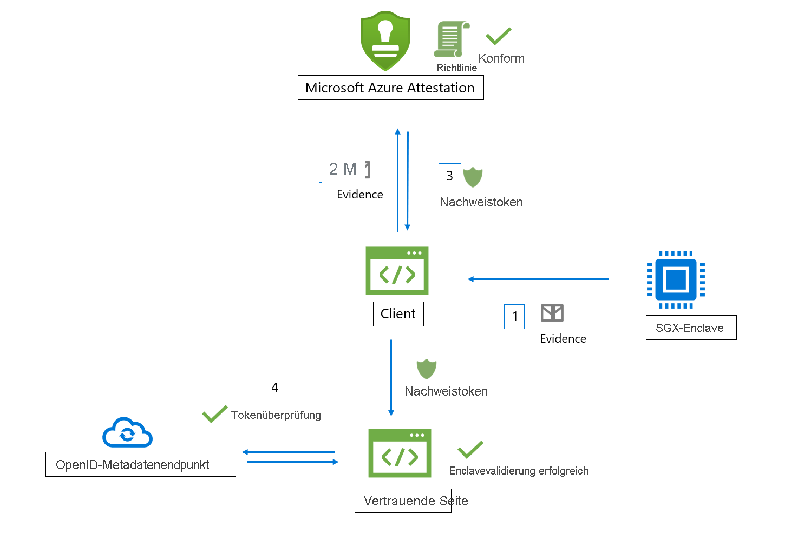
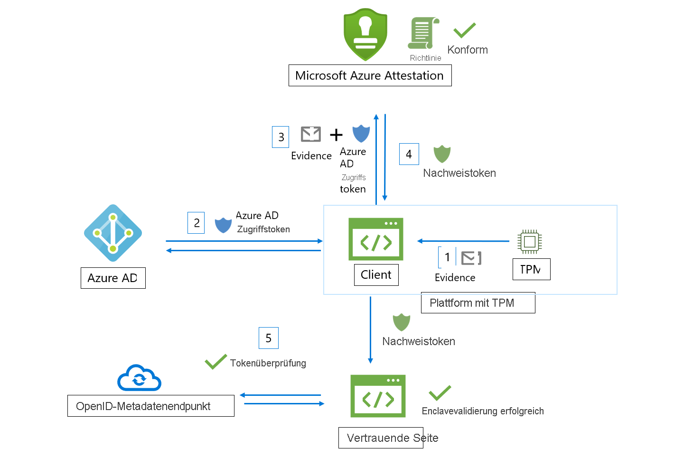

# Workflow

Microsoft Azure Attestation erhält Beweise von Enclaves und wertet sie auf der Grundlage von Azure-Sicherheitsbaseline und konfigurierbaren Richtlinien aus. Nach erfolgreicher Überprüfung wird von Azure Attestation ein Nachweistoken generiert, um die Vertrauenswürdigkeit der Enclave zu bestätigen.

An einem Azure Attestation-Workflow sind folgenden Akteure beteiligt:

- **Vertrauende Seite:** Die Komponente, für die Azure Attestation die Enclave-Gültigkeit überprüft. 
- **Client:** Die Komponente, von der Informationen aus einer Enclave erfasst und Anforderungen an Azure Attestation gesendet werden. 
- **Azure Attestation:** Die Komponente, die den Enclave-Nachweis vom Client entgegennimmt, ihn überprüft und das Nachweistoken an den Client zurückgibt.

## Überprüfungsworkflow für Intel® SGX-Enclave (Software Guard Extensions)

Ein typischer SGX-Enclave-Nachweisworkflow (mit Azure Attestation) umfasst folgende allgemeine Schritte:

1. Der Client sammelt Beweise aus einer Enclave. Beweise sind Informationen zur Enclave-Umgebung und zu der Clientbibliothek, die innerhalb der Enclave ausgeführt wird.
1. Der Client verfügt über einen URI, der auf eine Azure Attestation-Instanz verweist. Der Client sendet Beweise an Azure Attestation. Welche Informationen genau an den Anbieter übermittelt werden, hängt von der Art der Enclave ab.
1. Azure Attestation überprüft die übermittelten Informationen und wertet sie auf der Grundlage einer konfigurierten Richtlinie aus. War die Überprüfung erfolgreich, gibt Azure Attestation ein Nachweistoken an den Client zurück. Andernfalls meldet Azure Attestation einen Fehler an den Client. 
1. Der Client sendet das Nachweistoken an die vertrauende Seite. Die vertrauende Seite ruft den Azure Attestation-Metadatenendpunkt für den öffentlichen Schlüssel auf, um Signaturzertifikate abzurufen. Die vertrauende Seite überprüft die Signatur des Nachweistokens sowie die Vertrauenswürdigkeit der Enclave. 

> [!Note]
> Wenn Sie Nachweisanforderungen in der API-Version [2018-09-01-preview](https://github.com/Azure/azure-rest-api-specs/tree/master/specification/attestation/data-plane/Microsoft.Attestation/stable/2018-09-01-preview) senden, muss der Client zusammen mit dem Azure AD-Zugriffstoken auch Beweise an Azure Attestation senden.

## Enclave-Überprüfungsworkflow für TPM (Trusted Platform Module)

Ein typischer TPM-Enclave-Nachweisworkflow (mit Azure Attestation) umfasst folgende allgemeine Schritte:

1.  Beim Geräte-/Plattformstart messen verschiedene Startladeprogramme und Startdienste Ereignisse, die vom TPM unterstützt und sicher gespeichert (TCG-Protokoll) werden.
2.  Der Client sammelt die TCG-Protokolle vom Gerät und die TPM-Quote, die als Beweis für den Nachweis fungieren.
3.  Der Client verfügt über einen URI, der auf eine Azure Attestation-Instanz verweist. Der Client sendet Beweise an Azure Attestation. Welche Informationen genau an den Anbieter übermittelt werden, hängt von der Plattform ab.
4.  Azure Attestation überprüft die übermittelten Informationen und wertet sie auf der Grundlage einer konfigurierten Richtlinie aus. War die Überprüfung erfolgreich, gibt Azure Attestation ein Nachweistoken an den Client zurück. Andernfalls meldet Azure Attestation einen Fehler an den Client. Die Kommunikation zwischen dem Client und dem Nachweisdienst wird durch das TPM-Protokoll des Azure-Nachweises vorgegeben.
5.  Der Client sendet das Nachweistoken dann an die vertrauende Seite. Die vertrauende Seite ruft den Azure Attestation-Metadatenendpunkt für den öffentlichen Schlüssel auf, um Signaturzertifikate abzurufen. Die vertrauende Seite überprüft die Signatur des Nachweistokens sowie die Vertrauenswürdigkeit der Plattformen.

## Nächste Schritte
- [Erstellen und Signieren einer Nachweisrichtlinie](author-sign-policy.md)
- [Einrichten von Azure Attestation mithilfe von PowerShell](quickstart-powershell.md)
