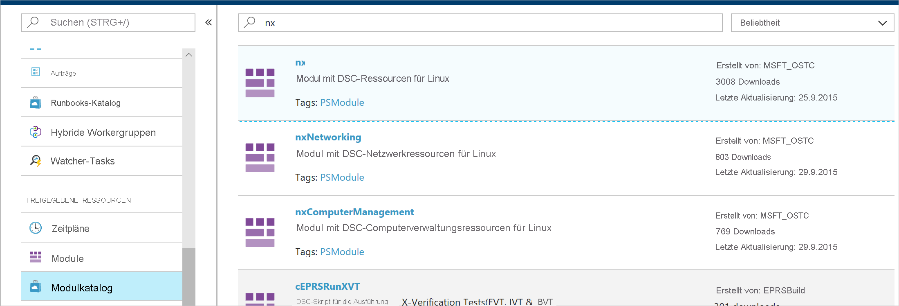
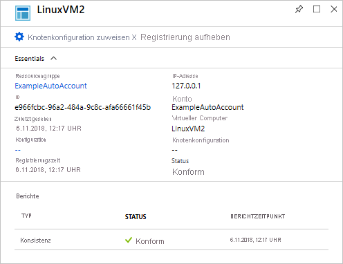

# <a name="configure-a-virtual-machine-with-desired-state-configuration"></a>Konfigurieren eines virtuellen Computers mit Desired State Configuration

Wenn Sie Azure Automation State Configuration aktivieren, können Sie die Konfigurationen Ihrer Windows- und Linux-Server per Desired State Configuration (DSC) verwalten und überwachen. Abweichungen von der gewünschten Konfiguration können identifiziert oder automatisch korrigiert werden. In dieser Schnellstartanleitung werden das Integrieren einer Linux-VM und das Bereitstellen eines LAMP-Stapels per DSC Schritt für Schritt beschrieben.

## <a name="prerequisites"></a>Voraussetzungen

Für die Durchführung dieses Schnellstarts benötigen Sie Folgendes:

* Ein Azure-Abonnement. Wenn Sie kein Azure-Abonnement besitzen, können Sie ein [kostenloses Konto erstellen](https://azure.microsoft.com/free/).
* Ein Azure Automation-Konto. Informationen zum Erstellen eines ausführenden Azure Automation-Kontos finden Sie unter [Azure Run As Account](automation-sec-configure-azure-runas-account.md)(Ausführendes Azure-Konto).
* Eine Azure Resource Manager-VM (nicht klassisch) mit Red Hat Enterprise Linux, CentOS oder Oracle Linux. Eine Anleitung zum Erstellen einer VM finden Sie unter [Erstellen Ihres ersten virtuellen Linux-Computers im Azure-Portal](../virtual-machines/linux/quick-create-portal.md).

## <a name="sign-in-to-azure"></a>Anmelden bei Azure
Melden Sie sich unter https://portal.azure.com bei Azure an.

## <a name="onboard-a-virtual-machine"></a>Integrieren eines virtuellen Computers

Es gibt viele verschiedene Methoden, um einen Computer zu integrieren und DSC zu aktivieren. In dieser Schnellstartanleitung wird die Integration über ein Automation-Konto behandelt. Weitere Informationen zu den verschiedenen Methoden für die Integration Ihrer Computer in State Configuration finden Sie im Artikel zur [Integration](https://docs.microsoft.com/azure/automation/automation-dsc-onboarding).

1. Wählen Sie links im Azure-Portal die Option **Automation-Konten**. Sollte die Option im linken Bereich nicht angezeigt werden, können Sie auf **Alle Dienste** klicken und in der daraufhin angezeigten Ansicht danach suchen.
1. Wählen Sie in der Liste ein Automation-Konto aus.
1. Wählen Sie im linken Bereich des Automation-Kontos die Option **Zustandskonfiguration (DSC)** aus.
2. Klicken Sie auf **Hinzufügen**, um die Seite zum Auswählen des virtuellen Computers zu öffnen.
3. Suchen Sie nach dem virtuellen Computer, für den DSC aktiviert werden soll. Sie können das Suchfeld verwenden und die Optionen filtern, um einen bestimmten virtuellen Computer zu ermitteln.
4. Klicken Sie auf den virtuellen Computer und anschließend auf **Verbinden**.
5. Wählen Sie die gewünschten DSC-Einstellungen für den virtuellen Computer aus. Wenn Sie bereits eine Konfiguration vorbereitet haben, können Sie sie als `Node Configuration Name` angeben. Sie können den [Konfigurationsmodus](https://docs.microsoft.com/powershell/scripting/dsc/managing-nodes/metaConfig) festlegen, um das Konfigurationsverhalten für den Computer zu steuern.
6. Klicken Sie auf **OK**. Während der Bereitstellung der DSC-Erweiterung auf dem virtuellen Computer wird der Status `Connecting` angezeigt.


## <a name="import-modules"></a>Importieren von Modulen

Module enthalten DSC-Ressourcen. Viele davon stehen im [PowerShell-Katalog](https://www.powershellgallery.com) zur Verfügung. Alle Ressourcen, die in Ihren Konfigurationen verwendet werden, müssen vor dem Kompilieren in das Automation-Konto importiert werden. Für dieses Tutorial ist das Modul mit dem Namen **nx** erforderlich.

1. Wählen Sie im linken Bereich des Automation-Kontos unter **Freigegebene Ressourcen** die Option **Modulkatalog** aus.
1. Suchen Sie nach dem zu importierenden Modul, indem Sie einen Teil seines Namens eingeben: `nx`.
1. Klicken Sie auf das zu importierende Modul.
1. Klicken Sie auf **Importieren**.



## <a name="import-the-configuration"></a>Importieren der Konfiguration

In dieser Schnellstartanleitung wird eine DSC-Konfiguration verwendet, mit der Apache HTTP Server, MySQL und PHP auf dem Computer konfiguriert werden. Weitere Informationen finden Sie unter [DSC-Konfigurationen](https://docs.microsoft.com/powershell/scripting/dsc/configurations/configurations).

Geben Sie in einem Texteditor Folgendes ein, und speichern Sie die Datei lokal als **AMPServer.ps1**.

```powershell-interactive
configuration LAMPServer {
   Import-DSCResource -module "nx"

   Node localhost {

        $requiredPackages = @("httpd","mod_ssl","php","php-mysql","mariadb","mariadb-server")
        $enabledServices = @("httpd","mariadb")

        #Ensure packages are installed
        ForEach ($package in $requiredPackages){
            nxPackage $Package{
                Ensure = "Present"
                Name = $Package
                PackageManager = "yum"
            }
        }

        #Ensure daemons are enabled
        ForEach ($service in $enabledServices){
            nxService $service{
                Enabled = $true
                Name = $service
                Controller = "SystemD"
                State = "running"
            }
        }
   }
}
```

Gehen Sie wie folgt vor, um die Konfiguration zu importieren:

1. Wählen Sie im linken Bereich des Automation-Kontos die Option **Zustandskonfiguration (DSC)** aus, und klicken Sie anschließend auf die Registerkarte **Konfigurationen**.
2. Klicken Sie auf **+ Hinzufügen**.
3. Wählen Sie die Konfigurationsdatei aus, die Sie im vorherigen Schritt gespeichert haben.
4. Klicken Sie auf **OK**.

## <a name="compile-a-configuration"></a>Kompilieren einer Konfiguration

Eine DSC-Konfiguration muss als Knotenkonfiguration (MOF-Dokument) kompiliert werden, damit sie einem Knoten zugewiesen werden kann. Bei der Kompilierung wird die Konfiguration überprüft, und es können Parameterwerte eingegeben werden. Weitere Informationen zum Kompilieren einer Konfiguration finden Sie unter [Kompilieren von DSC-Konfigurationen in Azure Automation State Configuration](automation-dsc-compile.md).

1. Wählen Sie im linken Bereich des Automation-Kontos die Option **Zustandskonfiguration (DSC)** aus, und klicken Sie anschließend auf die Registerkarte **Konfigurationen**.
1. Wählen Sie die Konfiguration `LAMPServer` aus.
1. Wählen Sie in den Menüoptionen **Kompilieren** aus, und klicken Sie anschließend auf **Ja**.
1. In der Konfigurationsansicht sehen Sie, dass ein neuer Kompilierungsauftrag in die Warteschlange eingereiht wurde. Nachdem der Auftrag erfolgreich abgeschlossen wurde, können Sie mit dem nächsten Schritt fortfahren. Im Falle eines Fehlers können Sie auf den Kompilierungsauftrag klicken, um Details anzuzeigen.

## <a name="assign-a-node-configuration"></a>Zuweisen einer Knotenkonfiguration

Eine kompilierte Knotenkonfiguration kann einem DSC-Knoten zugewiesen werden. Bei der Zuweisung wird die Konfiguration auf den Computer angewendet, und es erfolgt eine Überwachung bzw. automatische Korrektur der Abweichungen von dieser Konfiguration.

1. Wählen Sie im linken Bereich des Automation-Kontos die Option **State Configuration (DSC)** aus, und klicken Sie anschließend auf die Registerkarte **Knoten**.
1. Wählen Sie den Knoten aus, dem Sie eine Konfiguration zuweisen möchten.
1. Klicken Sie auf **Knotenkonfiguration zuweisen**.
1. Wählen Sie die Knotenkonfiguration `LAMPServer.localhost` aus, und klicken Sie auf **OK**. Von State Configuration wird daraufhin die kompilierte Konfiguration dem Knoten zugewiesen, und der Knotenstatus ändert sich in `Pending`. Bei der nächsten planmäßigen Überprüfung ruft der Knoten die Konfiguration ab, wendet sie an und meldet den Status. Es kann bis zu 30 Minuten dauern, bis der Knoten die Konfiguration abruft. Dies ist abhängig von den Knoteneinstellungen. 
1. Um eine sofortige Überprüfung zu erzwingen, können Sie den folgenden Befehl lokal auf dem virtuellen Linux-Computer ausführen: `sudo /opt/microsoft/dsc/Scripts/PerformRequiredConfigurationChecks.py`.



## <a name="view-node-status"></a>Anzeigen des Knotenstatus

Sie können den Status aller von State Configuration verwalteten Knoten in Ihrem Automation-Konto anzeigen. Wählen Sie zum Anzeigen der entsprechenden Informationen **State Configuration (DSC)** aus, und klicken Sie anschließend auf die Registerkarte **Knoten**. Sie können die Anzeige nach Status, Knotenkonfiguration oder Name filtern.


## <a name="next-steps"></a>Nächste Schritte

In dieser Schnellstartanleitung haben Sie einen virtuellen Linux-Computer in State Configuration integriert sowie eine Konfiguration für einen LAMP-Stapel erstellt und für den virtuellen Computer bereitgestellt. Im nächsten Artikel erfahren Sie, wie Sie Continuous Deployment mithilfe von Azure Automation State Configuration aktivieren:

> [!div class="nextstepaction"]
> [Fortlaufende Bereitstellung auf virtuellen Computern mit Automation DSC und Chocolatey](./automation-dsc-cd-chocolatey.md)

* Weitere Informationen zu PowerShell DSC finden Sie unter [Windows PowerShell DSC – Übersicht](https://docs.microsoft.com/powershell/scripting/dsc/overview/overview).
* Weitere Informationen zur Verwaltung von State Configuration mit PowerShell finden Sie unter [Azure PowerShell](https://docs.microsoft.com/powershell/module/azurerm.automation/).
* Informationen zum Weiterleiten von DSC-Berichten an Azure Monitor-Protokolle für Berichte und Warnungen finden Sie unter [Weiterleiten von Azure Automation DSC-Berichtsdaten an Azure Monitor-Protokolle](automation-dsc-diagnostics.md).