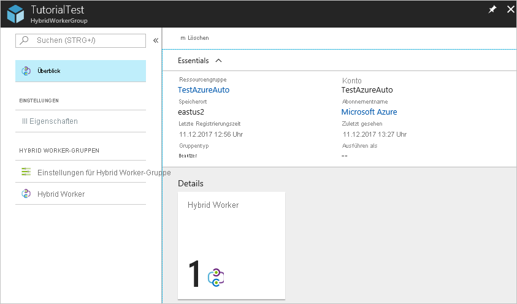
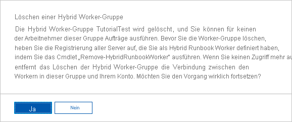

# <a name="deploy-a-windows-hybrid-runbook-worker"></a>Bereitstellen eines Windows Hybrid Runbook Workers

Sie können mit dem Azure Automation-Feature „Hybrid Runbook Worker“ Runbooks direkt auf dem Computer ausführen, der die Rolle hostet, und außerhalb für Ressourcen in der Umgebung zur Verwaltung dieser lokalen Ressourcen. Azure Automation speichert und verwaltet Runbooks und übermittelt sie dann an dafür festgelegte Computer. Dieser Artikel beschreibt, wie Sie einen Hybrid Runbook Worker auf einem Windows-Computer bereitstellen, den Worker entfernen und eine Hybrid Runbook Worker-Gruppe entfernen.

Lesen Sie nach dem erfolgreichen Bereitstellen eines Runbook Workers [Running runbooks on a Hybrid Runbook Worker (Ausführen von Runbooks auf einem Hybrid Runbook Worker)](automation-hrw-run-runbooks.md), um zu erfahren, wie Sie Ihre Runbooks für die Automatisierung von Prozessen in Ihrem lokalen Datencenter oder in einer anderen Cloudumgebung konfigurieren.

## <a name="prerequisites"></a>Voraussetzungen

Stellen Sie zunächst sicher, dass Sie über Folgendes verfügen.

### <a name="a-log-analytics-workspace"></a>Einen Log Analytics-Arbeitsbereich.

Die „Hybrid Runbook Worker“-Rolle ist hinsichtlich ihrer Installation und Konfiguration von einem Azure Monitor Log Analytics-Arbeitsbereich abhängig. Sie können ihn über den [Azure Resource Manager](../azure-monitor/samples/resource-manager-workspace.md#create-a-log-analytics-workspace) erstellen, mithilfe der [PowerShell](../azure-monitor/scripts/powershell-sample-create-workspace.md?toc=/powershell/module/toc.json) oder im [Azure-Portal](../azure-monitor/learn/quick-create-workspace.md).

Wenn Sie über keinen Azure Monitor Log Analytics-Arbeitsbereich verfügen, lesen Sie zuerst die [Entwurfsanleitung für Azure Monitor-Protokolle](../azure-monitor/platform/design-logs-deployment.md), bevor Sie einen Arbeitsbereich erstellen.

Wenn Sie einen Arbeitsbereich besitzen, dieser aber nicht mit Ihrem Automation-Konto verknüpft ist, fügt das Aktivieren einer Automation-Funktion Funktionen für Azure Automation hinzu, einschließlich der Unterstützung für den Hybrid Runbook Worker. Wenn Sie eine der Azure Automation-Funktionen in Ihrem Log Analytics-Arbeitsbereich aktivieren, insbesondere [Updateverwaltung](automation-update-management.md) oder [Änderungsnachverfolgung und Bestand](change-tracking.md), werden die Workerkomponenten automatisch auf den Agentcomputer gepusht.

   Um Ihrem Arbeitsbereich die Funktion „Updateverwaltung“ hinzuzufügen, führen Sie das folgende PowerShell-Cmdlet aus:

```powershell-interactive
   Set-AzOperationalInsightsIntelligencePack -ResourceGroupName <logAnalyticsResourceGroup> -WorkspaceName <logAnalyticsWorkspaceName> -IntelligencePackName "Updates" -Enabled $true
```

   Um Ihrem Arbeitsbereich die Funktion „Änderungsnachverfolgung und Bestand“ hinzuzufügen, führen Sie das folgende PowerShell-Cmdlet aus:

```powershell-interactive
   Set-AzOperationalInsightsIntelligencePack -ResourceGroupName <logAnalyticsResourceGroup> -WorkspaceName <logAnalyticsWorkspaceName> -IntelligencePackName "ChangeTracking" -Enabled $true
```

### <a name="log-analytics-agent"></a>Log Analytics-Agent

Die „Hybrid Runbook Worker“-Rolle erfordert den [Log Analytics-Agent](../azure-monitor/platform/log-analytics-agent.md) für das unterstützte Windows-Betriebssystem.

### <a name="supported-windows-operating-system"></a>Unterstützte Windows-Betriebssysteme

Die folgenden Versionen des Windows-Betriebssystems werden für einen Windows Hybrid Runbook Worker offiziell unterstützt:

* Windows Server 2019
* Windows Server 2016, Version 1709 und 1803
* Windows Server 2012, 2012 R2
* Windows Server 2008 SP2 (x64), 2008 R2
* Windows 10 Enterprise (einschließlich Multisession) und Pro
* Windows 8 Enterprise und Pro
* Windows 7 SP1

### <a name="minimum-requirements"></a>Mindestanforderungen

Die folgenden Mindestanforderungen gelten für einen Windows Hybrid Runbook Worker:

* Windows PowerShell 5.1 oder höher ([WMF 5.1 herunterladen](https://www.microsoft.com/download/details.aspx?id=54616))
* .NET Framework 4.6.2 oder höher
* Zwei Kerne
* 4 GB RAM
* Port 443 (ausgehend)

### <a name="network-configuration"></a>Netzwerkkonfiguration

Weitere Netzwerkanforderungen für den Hybrid Runbook Worker finden Sie unter [Konfigurieren des Netzwerks](automation-hybrid-runbook-worker.md#network-planning).

### <a name="adding-a-machine-to-a-hybrid-runbook-worker-group"></a>Hinzufügen eines Computers zu einer Hybrid Runbook Worker-Gruppe

Sie können den Workercomputer einer Hybrid Runbook Worker-Gruppe in Ihrem Automation-Konto hinzufügen. Beachten Sie, dass Sie Automation-Runbooks unterstützen müssen, sofern Sie sowohl für die Azure Automation-Funktion als auch die Mitgliedschaft in der Hybrid Runbook Worker-Gruppe dasselbe Konto verwenden. Diese Funktionalität wurde Version 7.2.12024.0 des Hybrid Runbook Worker hinzugefügt.

>[!NOTE]
>Beim Aktivieren der Azure Automation-[Updateverwaltung](automation-update-management.md) werden alle mit dem Log Analytics-Arbeitsbereich verbundenen Windows-Computer automatisch als Hybrid Runbook Worker konfiguriert, um die Verwaltung seiner Betriebssystemupdates zu unterstützen. Es erfolgt jedoch keine Registrierung des Workers für Hybrid Runbook Worker-Gruppen, die in Ihrem Automation-Konto bereits definiert wurden.

## <a name="enabling-machines-for-management-with-azure-automation-state-configuration"></a>Aktivieren von Computern für die Verwaltung mit Azure Automation State Configuration

Informationen zum Aktivieren von Computern für die Verwaltung mit Azure Automation State Configuration finden Sie unter [Aktivieren von Computern für die Verwaltung mit Azure Automation State Configuration](automation-dsc-onboarding.md).

> [!NOTE]
> Um die Konfiguration der Computer zu verwalten, die die Hybrid Runbook Worker-Rolle mit DSC (Desired State Configuration) unterstützen, müssen Sie die Computer als DSC-Knoten hinzufügen.

## <a name="windows-hybrid-runbook-worker-installation-options"></a>Installationsoptionen für Windows Hybrid Runbook Worker

Zum Installieren und Konfigurieren eines Windows Hybrid Runbook Workers können Sie eine der folgenden Methoden verwenden.

* Für Azure-VMs installieren Sie den Log Analytics-Agent für Windows mithilfe der [VM-Erweiterung für Windows](../virtual-machines/extensions/oms-windows.md). Die Erweiterung installiert den Log Analytics-Agent auf virtuellen Azure-Computern und registriert virtuelle Computer mithilfe einer Azure Resource Manager-Vorlage oder von PowerShell in einem vorhandenen Log Analytics-Arbeitsbereich. Nachdem der Agent installiert wurde, können Sie die VM einer Hybrid Runbook Worker-Gruppe in Ihrem Automation-Konto hinzufügen.

* Für Nicht-Azure-VMs installieren Sie den Log Analytics-Agent für Windows mithilfe der im Artikel [Verbinden von Windows-Computern mit Azure Monitor](../azure-monitor/platform/agent-windows.md) beschriebenen Bereitstellungsoptionen. Sie können diesen Vorgang für mehrere Computer wiederholen, um Ihrer Umgebung mehrere Worker hinzuzufügen. Nachdem der Agent installiert wurde, können Sie die VMs einer Hybrid Runbook Worker-Gruppe in Ihrem Automation-Konto hinzufügen.

* Verwenden Sie ein bereitgestelltes PowerShell-Skript, um den Prozess des Konfigurierens eines oder mehrerer Windows-Computer vollständig zu [automatisieren](#automated-deployment). Dies ist die empfohlene Methode für Computer in Ihrem Rechenzentrum oder einer anderen Cloudumgebung.

## <a name="automated-deployment"></a>Automatisierte Bereitstellung

Führen Sie auf dem Zielcomputer die folgenden Schritte aus, um die Installation und Konfiguration der Windows Hybrid Worker-Rolle mit dem PowerShell-Skript **New-OnPremiseHybridWorker.ps1** zu automatisieren. Mit diesem Skript werden die folgenden Schritte ausgeführt:

* Installation der erforderlichen Module
* Anmelden mit Ihrem Azure-Konto
* Überprüfen des Vorhandenseins der angegebenen Ressourcengruppe und des Automation-Kontos
* Erstellen von Verweisen auf Automation-Kontoattribute
* Erstellen eines Azure Monitor Log Analytics-Arbeitsbereichs, falls nicht angegeben
* Aktivieren der Azure Automation-Lösung im Arbeitsbereich
* Herunterladen und Installieren des Log Analytics-Agents für Windows
* Registrieren des Computers als Hybrid Runbook Worker

### <a name="step-1---download-the-powershell-script"></a>Schritt 1: Herunterladen des PowerShell-Skripts

Laden Sie das Skript **New-OnPremiseHybridWorker.ps1** aus dem [PowerShell-Katalog](https://www.powershellgallery.com/packages/New-OnPremiseHybridWorker) herunter. Nachdem Sie das Skript heruntergeladen haben, kopieren Sie es auf den Zielcomputer, oder führen Sie es darauf aus. Das Skript **New-OnPremiseHybridWorker.ps1** verwendet bei der Ausführung die nachstehend beschriebenen Parameter.

| Parameter | Status | BESCHREIBUNG |
| --------- | ------ | ----------- |
| `AAResourceGroupName` | Obligatorisch. | Der Name der Ressourcengruppe, die Ihrem Automation-Konto zugeordnet ist. |
| `AutomationAccountName` | Obligatorisch. | Der Name Ihres Automation-Kontos.
| `Credential` | Optional | Die Anmeldeinformationen, die beim Anmelden bei der Azure-Umgebung verwendet werden sollen. |
| `HybridGroupName` | Obligatorisch. | Der Name einer Hybrid Runbook Worker-Gruppe, die Sie als Ziel für die Runbooks angeben, die dieses Szenario unterstützen. |
| `OMSResourceGroupName` | Optional | Der Name der Ressourcengruppe für den Log Analytics-Arbeitsbereich. Wenn diese Ressourcengruppe nicht angegeben ist, wird der Wert von `AAResourceGroupName` verwendet. |
| `SubscriptionID` | Obligatorisch. | Der Bezeichner des Azure-Abonnements, das Ihrem Automation-Konto zugeordnet ist. |
| `TenantID` | Optional | Der Bezeichner der Mandantenorganisation, die Ihrem Automation-Konto zugeordnet ist. |
| `WorkspaceName` | Optional | Name des Log Analytics-Arbeitsbereichs. Falls kein Log Analytics-Arbeitsbereich vorhanden ist, wird dieser durch das Skript erstellt und konfiguriert. |

> [!NOTE]
> Wenn Sie Funktionen aktivieren, unterstützt Azure Automation nur bestimmte Regionen für das Verknüpfen mit einem Log Analytics-Arbeitsbereich und einem Automation-Konto. Eine Liste der unterstützten Zuordnungspaare finden Sie unter [Regionszuordnung für Automation-Konto und Log Analytics-Arbeitsbereich](how-to/region-mappings.md).

### <a name="step-2---open-windows-powershell-command-line-shell"></a>Schritt 2: Öffnen einer Windows PowerShell-Befehlszeilenshell

Klicken Sie im **Startmenü** auf **Start**, geben Sie **PowerShell** ein, klicken Sie mit der rechten Maustaste auf **Windows PowerShell**, und klicken Sie dann auf **Als Administrator ausführen**.

### <a name="step-3---run-the-powershell-script"></a>Schritt 3: Ausführen des PowerShell-Skripts

Navigieren Sie in der PowerShell-Befehlszeilenshell zu dem Ordner, der das heruntergeladene Skript enthält. Ändern Sie die Werte der Parameter `AutomationAccountName`, `AAResourceGroupName`, `OMSResourceGroupName`, `HybridGroupName`, `SubscriptionID` und `WorkspaceName`. Führen Sie das Skript dann aus.

Nach dem Ausführen des Skripts werden Sie aufgefordert, sich bei Azure zu authentifizieren. Sie müssen sich mit einem Konto anmelden, das Mitglied der Rolle „Abonnement-Administratoren“ sowie Co-Administrator des Abonnements ist.

```powershell-interactive
.\New-OnPremiseHybridWorker.ps1 -AutomationAccountName <nameOfAutomationAccount> -AAResourceGroupName <nameOfResourceGroup>`
-OMSResourceGroupName <nameOfOResourceGroup> -HybridGroupName <nameOfHRWGroup> `
-SubscriptionID <subscriptionId> -WorkspaceName <nameOfLogAnalyticsWorkspace>
```

### <a name="step-4---install-nuget"></a>Schritt 4: Installieren von NuGet

Sie werden aufgefordert, der Installation von NuGet zuzustimmen und sich mit Ihren Azure-Anmeldeinformationen zu authentifizieren. Wenn Sie nicht über die neueste Version von NuGet verfügen, können Sie sie über [Verfügbare NuGet-Distributionsversionen](https://www.nuget.org/downloads) herunterladen.

### <a name="step-5---verify-the-deployment"></a>Schritt 5: Überprüfen der Bereitstellung

Nachdem das Skript abgeschlossen wurde, werden auf der Seite „Hybrid Worker-Gruppen“ in Ihrem Automation-Konto die neue Gruppe und die Anzahl der Mitglieder angezeigt. Wenn die Gruppe bereits vorhanden ist, wird die Anzahl der Mitglieder erhöht. Sie können die Gruppe in der Liste auf der Seite „Hybrid Worker-Gruppen“ und dann die Kachel **Hybrid Worker** auswählen. Auf der Seite „Hybrid Worker“ werden die einzelnen Mitglieder der Gruppe aufgelistet.

## <a name="manual-deployment"></a>Manuelle Bereitstellung

Zum Installieren und Konfigurieren eines Windows Hybrid Runbook Workers führen Sie die folgenden Schritte durch.

### <a name="step-1---verify-agent-is-reporting-to-workspace"></a>Schritt 1: Überprüfen, ob der Agent an den Arbeitsbereich meldet

Der Log Analytics-Agent für Windows verbindet Computer mit einem Azure Monitor Log Analytics-Arbeitsbereich. Wenn Sie den Agent auf Ihrem Computer installieren und mit Ihrem Arbeitsbereich verbinden, werden automatisch die erforderlichen Komponenten für Hybrid Runbook Worker heruntergeladen.

Nachdem der Agent nach einigen Minuten eine Verbindung mit dem Log Analytics-Arbeitsbereich hergestellt hat, können Sie über die folgende Abfrage überprüfen, ob er Heartbeatdaten an den Arbeitsbereich sendet.

```kusto
Heartbeat 
| where Category == "Direct Agent"
| where TimeGenerated > ago(30m)
```

In den Suchergebnissen sollten Heartbeat-Datensätze für den Computer angezeigt werden, die angeben, dass dieser verbunden ist und Berichte an den Dienst übermittelt. Standardmäßig leitet jeder Agent einen Heartbeat-Datensatz an seinen zugewiesenen Arbeitsbereich weiter. Führen Sie die folgenden Schritte aus, um Installation und Einrichtung des Agents abzuschließen.

1. Aktivieren Sie das Feature, um den Agentcomputer hinzuzufügen. Informationen zur Updateverwaltung und zu Azure-VMs finden Sie unter [Aktivieren von virtuellen Azure-Computern](automation-onboard-solutions-from-automation-account.md#enable-azure-vms) und zu Nicht-Azure-VMs unter [Aktivieren von Computern im Arbeitsbereich](automation-onboard-solutions-from-automation-account.md#enable-machines-in-the-workspace). Informationen zur Änderungsnachverfolgung und zu Azure-VMs finden Sie unter [Aktivieren von virtuellen Azure-Computern](automation-enable-changes-from-auto-acct.md#enable-azure-vms) und zu Nicht-Azure-VMs unter [Aktivieren von Computern im Arbeitsbereich](automation-enable-changes-from-auto-acct.md#enable-machines-in-the-workspace).

2. Zum Überprüfen der Hybrid Runbook Worker-Version wechseln Sie zu `C:\Program Files\Microsoft Monitoring Agent\Agent\AzureAutomation\`, und sehen Sie im Unterordner **version** nach.

### <a name="step-3---install-the-runbook-environment-and-connect-to-azure-automation"></a>Schritt 3: Installieren der Runbookumgebung und Herstellen einer Verbindung mit Azure Automation

Wenn Sie einen Agent für die Berichterstattung an einen Log Analytics-Arbeitsbereich konfigurieren, lädt das Azure Automation-Feature das PowerShell-Modul `HybridRegistration`, in dem das Cmdlet `Add-HybridRunbookWorker` enthalten ist, per Push herunter. Verwenden Sie dieses Cmdlet zum Installieren der Runbookumgebung auf dem Computer und zu deren Registrierung bei Azure Automation.

Öffnen Sie eine PowerShell-Sitzung im Administratormodus, und führen Sie die folgenden Befehle zum Importieren des Moduls aus.

```powershell-interactive
cd "C:\Program Files\Microsoft Monitoring Agent\Agent\AzureAutomation\<version>\HybridRegistration"
Import-Module .\HybridRegistration.psd1
```

Führen Sie nun das Cmdlet `Add-HybridRunbookWorker` mit der folgenden Syntax aus.

```powershell-interactive
Add-HybridRunbookWorker –GroupName <String> -Url <Url> -Key <String>
```

Sie finden die für die Parameter `Url` und `Key` erforderlichen Informationen in Ihrem Automation-Konto auf der Seite **Schlüssel**. Wählen Sie im linken Bereich der Seite im Abschnitt **Kontoeinstellungen** die Option **Schlüssel** aus.


* Kopieren Sie für den Parameter `Url` den Wert für **URL**.

* Kopieren Sie für den Parameter `Key` den Wert für **PRIMÄRER ZUGRIFFSSCHLÜSSEL**.

* Verwenden Sie für den Parameter `GroupName` den Namen der Hybrid Runbook Worker-Gruppe. Wenn diese Gruppe bereits im Automation-Konto vorhanden ist, wird ihr der aktuelle Computer hinzugefügt. Wenn diese Gruppe nicht vorhanden ist, wird sie hinzugefügt.

* Legen Sie bei Bedarf den Parameter `Verbose`fest, um Details zur Installation zu erhalten.

### <a name="step-4----install-powershell-modules"></a>Schritt 4: Installieren von PowerShell-Modulen

Runbooks können beliebige Aktivitäten und Cmdlets der Module verwenden, die Sie in Ihrer Azure Automation-Umgebung installiert haben. Da diese Module nicht automatisch auf den lokalen Computern bereitgestellt werden, müssen Sie sie manuell installieren. Die Ausnahme ist das Azure-Modul. Dieses Modul wird standardmäßig installiert und bietet Zugriff auf Cmdlets für alle Azure-Dienste und -Aktivitäten für Azure Automation.

Da der primäre Zweck des Hybrid Runbook Workers in der Verwaltung lokaler Ressourcen besteht, müssen Sie sehr wahrscheinlich die Module zur Unterstützung dieser Ressourcen installieren, insbesondere das Modul `PowerShellGet`. Informationen zum Installieren von Windows PowerShell-Modulen finden Sie unter [Windows PowerShell](https://docs.microsoft.com/powershell/scripting/developer/windows-powershell).

Installierte Module müssen sich an einem Speicherort befinden, auf den von der Umgebungsvariablen `PSModulePath` verwiesen wird, damit sie vom Hybrid Worker automatisch importiert werden. Weitere Informationen finden Sie unter [Installieren von Modulen in PSModulePath](https://docs.microsoft.com/powershell/scripting/developer/module/installing-a-powershell-module?view=powershell-7).

## <a name="remove-the-hybrid-runbook-worker-from-an-on-premises-windows-machine"></a><a name="remove-windows-hybrid-runbook-worker"></a>Entfernen des Hybrid Runbook Workers von einem lokalen Windows-Computer

1. Navigieren Sie im Azure-Portal zu Ihrem Automation-Konto.

2. Wählen Sie unter **Kontoeinstellungen** die Option **Schlüssel** aus, und notieren Sie sich die Werte für **URL** und **Primärer Zugriffsschlüssel**.

3. Öffnen Sie eine PowerShell-Sitzung im Administratormodus, und führen Sie den folgenden Befehl aus. Verwenden Sie dabei Ihre Werte für URL und primären Zugriffsschlüssel. Verwenden Sie den Parameter `Verbose`, um ein ausführliches Protokoll zum Entfernungsvorgang zu erhalten. Verwenden Sie zum Entfernen veralteter Computer aus Ihrer Hybrid Worker-Gruppe den optionalen Parameter `machineName`.

```powershell-interactive
Remove-HybridRunbookWorker -Url <URL> -Key <primaryAccessKey> -MachineName <computerName>
```

## <a name="remove-a-hybrid-worker-group"></a>Entfernen einer Hybrid Worker-Gruppe

Um eine Hybrid Runbook Worker-Gruppe zu entfernen, müssen Sie zunächst den Hybrid Runbook Worker von allen Computern entfernen, die Mitglied der Gruppe sind. Führen Sie dann die folgenden Schritte aus, um die Gruppe zu entfernen:

1. Wählen Sie im Azure-Portal das Automation-Konto aus.

2. Wählen Sie unter **Prozessautomatisierung** die Option **Hybrid Worker-Gruppen** aus. Wählen Sie die Gruppe aus, die Sie löschen möchten. Die Seite „Eigenschaften“ für diese Gruppe wird angezeigt.

   

3. Wählen Sie auf der Seite „Eigenschaften“ der ausgewählten Gruppe die Option **Löschen** aus. Eine Meldung fordert Sie zur Bestätigung dieser Aktion auf. Klicken Sie auf **Ja**, wenn Sie den Vorgang wirklich fortsetzen möchten.

   

   Der Abschluss dieses Vorgangs kann mehrere Sekunden in Anspruch nehmen. Sie können den Fortschritt im Menü unter **Benachrichtigungen** nachverfolgen.

## <a name="next-steps"></a>Nächste Schritte

* Um zu erfahren, wie Sie Ihre Runbooks für die Automatisierung von Prozessen in Ihrem lokalen Rechenzentrum oder in einer anderen Cloudumgebung konfigurieren, lesen Sie sich [Ausführen von Runbooks auf einem Hybrid Runbook Worker](automation-hrw-run-runbooks.md) durch.

* Informationen zum Behandeln von Problemen mit Ihren Hybrid Runbook Workern finden Sie unter [Problembehandlung von Hybrid Runbook Workern](troubleshoot/hybrid-runbook-worker.md#general).
