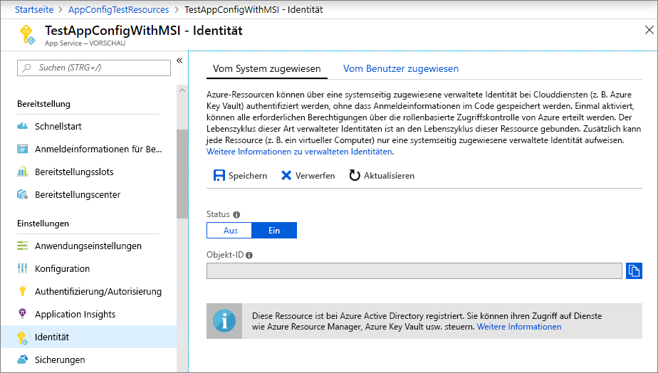
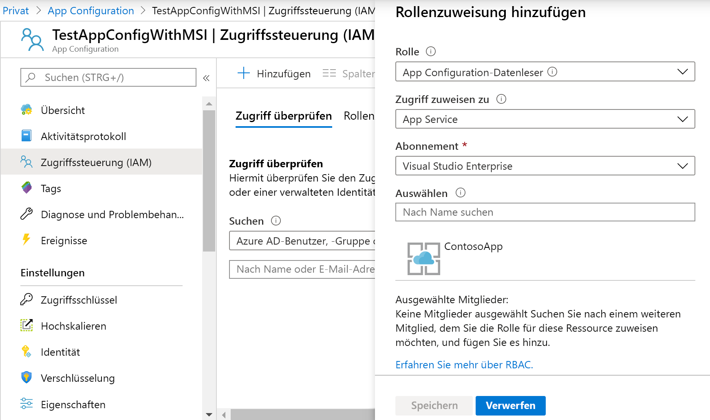

# <a name="use-managed-identities-to-access-app-configuration"></a>Verwenden verwalteter Identitäten für den Zugriff auf App Configuration

Mit [verwalteten Identitäten](../active-directory/managed-identities-azure-resources/overview.md) von Azure Active Directory wird die Verwaltung von Geheimnissen für Ihre Cloudanwendung vereinfacht. Mit einer verwalteten Identität kann Ihr Code den Dienstprinzipal verwenden, der für den Azure-Dienst, auf dem er ausgeführt wird, erstellt wurde. Eine verwaltete Identität wird anstelle von separaten Anmeldeinformationen verwendet, die in Azure Key Vault oder in einer lokalen Verbindungszeichenfolge gespeichert sind.

Azure App Configuration und die zugehörigen .NET Core-, .NET Framework- und Java Spring-Clientbibliotheken verfügen über integrierte Unterstützung für die verwaltete Dienstidentität. Zwar müssen Sie die verwaltete Identität nicht verwenden, jedoch entfällt durch deren Verwendung die Notwendigkeit für ein Zugriffstoken mit Geheimnissen. Ihr Code kann nur mithilfe des Dienstendpunkts auf den App Configuration-Speicher zuzugreifen. Sie können diese URL direkt in Ihren Code einbetten, ohne Geheimnisse offenzulegen.

In diesem Artikel wird veranschaulicht, wie Sie die verwaltete Identität für den Zugriff auf App Configuration nutzen können. Dies baut auf der Web-App auf, die in den Schnellstartanleitungen vorgestellt wurde. Bevor Sie fortfahren, [erstellen Sie eine ASP.NET Core-App mit App Configuration](./quickstart-aspnet-core-app.md).

In diesem Artikel wird außerdem gezeigt, wie Sie die verwaltete Identität in Verbindung mit den Key Vault-Verweisen von App Configuration verwenden können. Mit einer einzelnen verwalteten Identität können Sie nahtlos aus Key Vault auf beide Geheimnisse und aus App Configuration auf Konfigurationswertezugreifen. Wenn Sie diese Funktion erkunden möchten, stellen Sie zuerst [Verwenden von Key Vault-Verweisen mit ASP.NET Core](./use-key-vault-references-dotnet-core.md) fertig.

Für die Ausführung der Schritte dieses Tutorials können Sie einen beliebigen Code-Editor verwenden. [Visual Studio Code](https://code.visualstudio.com/) ist eine hervorragende Option, die auf Windows-, macOS- und Linux-Plattformen verfügbar ist.

In diesem Artikel werden folgende Vorgehensweisen behandelt:

> [!div class="checklist"]
> * Gewähren des Zugriffs auf App Configuration für eine verwaltete Identität.
> * Konfigurieren Ihrer App für die Verwendung einer verwalteten Identität bei der Verbindungsherstellung mit App Configuration.
> * Konfigurieren Sie optional Ihre App für die Verwendung einer verwalteten Identität, wenn Sie eine Verbindung mit Key Vault über einen Key Vault-Verweis von App Configuration herstellen.

## <a name="prerequisites"></a>Voraussetzungen

Für dieses Tutorial benötigen Sie Folgendes:

* [.NET Core SDK](https://www.microsoft.com/net/download/windows).
* [Konfigurierte Azure Cloud Shell](https://docs.microsoft.com/azure/cloud-shell/quickstart).

[!INCLUDE [quickstarts-free-trial-note](../../includes/quickstarts-free-trial-note.md)]

## <a name="add-a-managed-identity"></a>Hinzufügen einer verwalteten Identität

Um eine verwaltete Entität im Portal einzurichten, erstellen Sie zuerst eine Anwendung und aktivieren dann das Feature.

1. Erstellen Sie im [Azure-Portal](https://portal.azure.com) wie gewohnt eine App Services-Instanz. Wechseln Sie im Portal zu dieser App.

1. Scrollen Sie im linken Bereich nach unten zur Gruppe **Einstellungen**, und wählen Sie **Identität**.

1. Ändern Sie auf der Registerkarte **Systemseitig zugewiesen** den **Status** in **Ein**, und wählen Sie **Speichern** aus.

1. Antworten Sie mit **Ja**, wenn Sie gefragt werden, ob Sie die systemseitig zugewiesene verwaltete Identität aktivieren möchten.

    

## <a name="grant-access-to-app-configuration"></a>Gewähren des Zugriffs auf App Configuration

1. Klicken Sie im [Azure-Portal](https://portal.azure.com) auf **Alle Ressourcen**, und wählen Sie dann den App Configuration-Speicher aus, den Sie in der Schnellstartanleitung erstellt haben.

1. Wählen Sie die Option **Zugriffssteuerung (IAM)** aus.

1. Wählen Sie auf der Registerkarte **Zugriff überprüfen** im Kartenelement **Rollenzuweisung hinzufügen** den Befehl **Hinzufügen** aus.

1. Wählen Sie unter **Rolle** die Option **App Configuration-Datenleser** aus. Wählen Sie unter **Zugriff zuweisen zu** unter **Systemseitig zugewiesene verwaltete Identität** die Option **App Service** aus.

1. Wählen Sie unter **Abonnement** Ihr Azure-Abonnement aus. Wählen Sie die App Service-Ressource für Ihre App aus.

1. Wählen Sie **Speichern** aus.

    

1. Optional: Wenn Sie auch Zugriff auf Key Vault gewähren möchten, befolgen Sie die Anweisungen unter [Zuweisen einer Key Vault-Zugriffsrichtlinie](/azure/key-vault/assign-access-policy-portal).

## <a name="use-a-managed-identity"></a>Verwenden einer verwalteten Identität

1. Fügen Sie einen Verweis auf das Paket *Azure.Identity* hinzu.

    ```cli
    dotnet add package Azure.Identity
    ```

1. Suchen Sie den Endpunkt Ihres App Configuration-Speichers. Diese URL wird auf der Registerkarte **Zugriffsschlüssel** für den Speicher im Azure-Portal aufgelistet.

1. Öffnen Sie die Datei *appsettings.json*, und fügen Sie das folgende Skript hinzu. Ersetzen Sie *\<service_endpoint>* (einschließlich der spitzen Klammern) durch die URL für Ihren App Configuration-Speicher.

    ```json
    "AppConfig": {
        "Endpoint": "<service_endpoint>"
    }
    ```

1. Öffnen Sie *Program.cs*, und fügen Sie einen Verweis auf die Namespaces `Azure.Identity` und `Microsoft.Azure.Services.AppAuthentication` hinzu:

    ```csharp-interactive
    using Azure.Identity;
    ```

1. Wenn Sie nur auf Werte zugreifen möchten, die direkt in App Configuration gespeichert sind, aktualisieren Sie die `CreateWebHostBuilder`-Methode, indem Sie die `config.AddAzureAppConfiguration()`-Methode ersetzen.

    > [!IMPORTANT]
    > `CreateHostBuilder` ersetzt `CreateWebHostBuilder` in .NET Core 3.0.  Wählen Sie auf der Grundlage ihrer Umgebung die richtige Syntax aus.

    ### <a name="net-core-2x"></a>[.NET Core 2.x](#tab/core2x)

    ```csharp
        public static IWebHostBuilder CreateWebHostBuilder(string[] args) =>
            WebHost.CreateDefaultBuilder(args)
                .ConfigureAppConfiguration((hostingContext, config) =>
                {
                    var settings = config.Build();
                    config.AddAzureAppConfiguration(options =>
                        options.Connect(new Uri(settings["AppConfig:Endpoint"]), new ManagedIdentityCredential()));
                })
                .UseStartup<Startup>();
    ```

    ### <a name="net-core-3x"></a>[.NET Core 3.x](#tab/core3x)

    ```csharp
        public static IHostBuilder CreateHostBuilder(string[] args) =>
            Host.CreateDefaultBuilder(args)
            .ConfigureWebHostDefaults(webBuilder =>
            webBuilder.ConfigureAppConfiguration((hostingContext, config) =>
            {
                var settings = config.Build();
                    config.AddAzureAppConfiguration(options =>
                        options.Connect(new Uri(settings["AppConfig:Endpoint"]), new ManagedIdentityCredential()));
                })
                .UseStartup<Startup>());
    ```
    ---

1. Um sowohl App Configuration-Werte als auch Key Vault-Verweise zu verwenden, aktualisieren Sie *Program.cs*, wie unten gezeigt. Dieser Code erstellt einen neuen `KeyVaultClient`, der einen `AzureServiceTokenProvider` verwendet und diesen Verweis an einen Aufruf der `UseAzureKeyVault`-Methode übergibt.

    ### <a name="net-core-2x"></a>[.NET Core 2.x](#tab/core2x)

    ```csharp
            public static IWebHostBuilder CreateWebHostBuilder(string[] args) =>
                WebHost.CreateDefaultBuilder(args)
                    .ConfigureAppConfiguration((hostingContext, config) =>
                    {
                        var settings = config.Build();
                        var credentials = new ManagedIdentityCredential();

                        config.AddAzureAppConfiguration(options =>
                        {
                            options.Connect(new Uri(settings["AppConfig:Endpoint"]), credentials)
                                    .ConfigureKeyVault(kv =>
                                    {
                                        kv.SetCredential(credentials);
                                    });
                        });
                    })
                    .UseStartup<Startup>();
    ```

    ### <a name="net-core-3x"></a>[.NET Core 3.x](#tab/core3x)

    ```csharp
        public static IHostBuilder CreateHostBuilder(string[] args) =>
            Host.CreateDefaultBuilder(args)
            .ConfigureWebHostDefaults(webBuilder =>
            webBuilder.ConfigureAppConfiguration((hostingContext, config) =>
                    {
                        var settings = config.Build();
                        var credentials = new ManagedIdentityCredential();

                        config.AddAzureAppConfiguration(options =>
                        {
                            options.Connect(new Uri(settings["AppConfig:Endpoint"]), credentials)
                                    .ConfigureKeyVault(kv =>
                                    {
                                        kv.SetCredential(credentials);
                                    });
                        });
                    })
                    .UseStartup<Startup>());
    ```
    ---

    Sie können jetzt auf Key Vault-Verweise zugreifen wie auf jeden anderen App Configuration-Schlüssel. Der Konfigurationsanbieter verwendet den `KeyVaultClient`, den Sie für die Authentifizierung bei Key Vault konfiguriert haben, und ruft den Wert ab.

> [!NOTE]
> `ManagedIdentityCredential` unterstützt nur die Authentifizierung der verwalteten Identität. Dies funktioniert nicht in lokalen Umgebungen. Wenn Sie den Code lokal ausführen möchten, sollten Sie `DefaultAzureCredential` verwenden, wodurch auch die Dienstprinzipalauthentifizierung unterstützt wird. Nähere Informationen finden Sie unter diesem [Link](https://docs.microsoft.com/dotnet/api/azure.identity.defaultazurecredential).

[!INCLUDE [Prepare repository](../../includes/app-service-deploy-prepare-repo.md)]

## <a name="deploy-from-local-git"></a>Bereitstellen über lokales Git

Die einfachste Möglichkeit zum Aktivieren einer lokalen Git-Bereitstellung für Ihre App mit dem Kudu-Buildserver ist die Verwendung von [Azure Cloud Shell](https://shell.azure.com).

### <a name="configure-a-deployment-user"></a>Konfigurieren eines Bereitstellungsbenutzers

[!INCLUDE [Configure a deployment user](../../includes/configure-deployment-user-no-h.md)]

### <a name="enable-local-git-with-kudu"></a>Aktivieren von lokalem Git mit Kudu
Wenn Sie über kein lokales Git-Repository für Ihre App verfügen, müssen Sie eins initialisieren. Um ein lokales Git-Repository zu initialisieren, führen Sie die folgenden Befehle aus dem Projektverzeichnis Ihrer App aus:

```cmd
git init
git add .
git commit -m "Initial version"
```

Zum Aktivieren einer lokalen Git-Bereitstellung für Ihre App mit dem Kudu-Buildserver führen Sie [`az webapp deployment source config-local-git`](/cli/azure/webapp/deployment/source?view=azure-cli-latest#az-webapp-deployment-source-config-local-git) in Cloud Shell aus.

```azurecli-interactive
az webapp deployment source config-local-git --name <app_name> --resource-group <group_name>
```

Die Ausgabe dieses Befehls sieht ungefähr wie folgt aus:

```json
{
  "url": "https://<username>@<app_name>.scm.azurewebsites.net/<app_name>.git"
}
```

### <a name="deploy-your-project"></a>Bereitstellen des Projekts

Fügen Sie Ihrem lokalen Git-Repository im _lokalen Terminalfenster_ ein Azure-Remoterepository hinzu. Ersetzen Sie _\<url>_ durch die URL des Git-Remoterepositorys, das Sie durch [Aktivieren von lokalem Git mit Kudu](#enable-local-git-with-kudu) erhalten haben.

```bash
git remote add azure <url>
```

Führen Sie einen Pushvorgang zum Azure-Remotespeicherort durch, um Ihre App mit dem folgenden Befehl bereitzustellen. Geben Sie bei Aufforderung zur Eingabe eines Kennworts das Kennwort ein, das Sie in [Konfigurieren eines Bereitstellungsbenutzers](#configure-a-deployment-user) erstellt haben. Verwenden Sie nicht das Kennwort, mit dem Sie sich beim Azure-Portal anmelden.

```bash
git push azure master
```

Die Ausgabe enthält u. U. laufzeitspezifische Automatisierungen wie MSBuild für ASP.NET, `npm install` für Node.js und `pip install` für Python.

### <a name="browse-to-the-azure-web-app"></a>Navigieren Sie zur Azure-Web-App.

Navigieren Sie in einem Browser zu Ihrer Web-App, um sicherzustellen, dass der Inhalt bereitgestellt wird.

```bash
http://<app_name>.azurewebsites.net
```

## <a name="use-managed-identity-in-other-languages"></a>Verwenden einer verwalteten Identität in anderen Sprachen

App Configuration-Anbieter für .NET Framework und Java Spring verfügen auch über integrierte Unterstützung für verwaltete Identitäten. Sie können beim Konfigurieren eines dieser Anbieter den URL-Endpunkt Ihres Speichers verwenden anstelle seiner vollständigen Verbindungszeichenfolge.

Beispielsweise können Sie die in der Schnellstartanleitung erstellte .NET Framework-Konsolen-App aktualisieren, um die folgenden Einstellungen in der Datei *App.config* anzugeben:

```xml
    <configSections>
        <section name="configBuilders" type="System.Configuration.ConfigurationBuildersSection, System.Configuration, Version=4.0.0.0, Culture=neutral, PublicKeyToken=b03f5f7f11d50a3a" restartOnExternalChanges="false" requirePermission="false" />
    </configSections>

    <configBuilders>
        <builders>
            <add name="MyConfigStore" mode="Greedy" endpoint="${Endpoint}" type="Microsoft.Configuration.ConfigurationBuilders.AzureAppConfigurationBuilder, Microsoft.Configuration.ConfigurationBuilders.AzureAppConfiguration" />
            <add name="Environment" mode="Greedy" type="Microsoft.Configuration.ConfigurationBuilders.EnvironmentConfigBuilder, Microsoft.Configuration.ConfigurationBuilders.Environment" />
        </builders>
    </configBuilders>

    <appSettings configBuilders="Environment,MyConfigStore">
        <add key="AppName" value="Console App Demo" />
        <add key="Endpoint" value ="Set via an environment variable - for example, dev, test, staging, or production endpoint." />
    </appSettings>
```

## <a name="clean-up-resources"></a>Bereinigen von Ressourcen

[!INCLUDE [azure-app-configuration-cleanup](../../includes/azure-app-configuration-cleanup.md)]

## <a name="next-steps"></a>Nächste Schritte
In diesem Tutorial haben Sie eine verwaltete Azure-Identität hinzugefügt, um den Zugriff auf App Configuration zu optimieren und die Verwaltung der Anmeldeinformationen für Ihre App zu verbessern. Fahren Sie mit den Azure CLI-Beispielen fort, um mehr über die Verwendung von App Configuration zu erfahren.

> [!div class="nextstepaction"]
> [CLI-Beispiele](./cli-samples.md)
