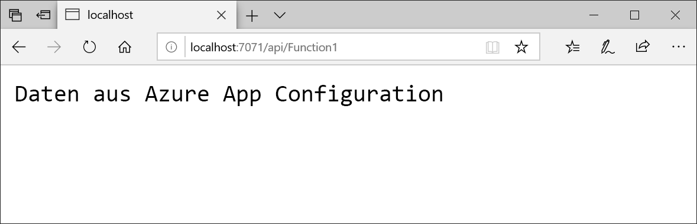

# <a name="quickstart-create-an-azure-functions-app-with-azure-app-configuration"></a>Schnellstart: Erstellen einer Azure Functions-App mit Azure App Configuration

In diesem Schnellstart integrieren Sie den Azure App Configuration-Dienst in eine Azure Functions-App, um die Speicherung und Verwaltung von allen Anwendungseinstellungen getrennt von Ihrem Code zu zentralisieren.

## <a name="prerequisites"></a>Voraussetzungen

- Azure-Abonnement – [Erstellen eines kostenlosen Kontos](https://azure.microsoft.com/free/)
- [Visual Studio 2019](https://visualstudio.microsoft.com/vs) mit der Workload **Azure-Entwicklung**.
- [Azure Functions-Tools](../azure-functions/functions-develop-vs.md#check-your-tools-version)

## <a name="create-an-app-configuration-store"></a>Erstellen eines App Configuration-Speichers

[!INCLUDE [azure-app-configuration-create](../../includes/azure-app-configuration-create.md)]

6. Wählen Sie **Konfigurations-Explorer** >  **+ Erstellen** aus, um die folgenden Schlüssel-Wert-Paare hinzuzufügen:

    | Key | value |
    |---|---|
    | TestApp:Settings:Message | Daten aus Azure App Configuration |

    Lassen Sie **Bezeichnung** und **Inhaltstyp** vorerst leer.

## <a name="create-a-functions-app"></a>Erstellen einer Functions-App

[!INCLUDE [Create a project using the Azure Functions template](../../includes/functions-vstools-create.md)]

## <a name="connect-to-an-app-configuration-store"></a>Herstellen einer Verbindung mit einem App Configuration-Speicher

1. Klicken Sie mit der rechten Maustaste auf Ihr Projekt, und wählen Sie **NuGet-Pakete verwalten** aus. Suchen Sie auf der Registerkarte **Durchsuchen** das NuGet-Paket `Microsoft.Extensions.Configuration.AzureAppConfiguration`, und fügen Sie es Ihrem Projekt hinzu. Wenn Sie es nicht finden können, aktivieren Sie das Kontrollkästchen **Vorabversion einbeziehen**.

2. Öffnen Sie *Function1.cs*, und fügen Sie die Namespaces der .NET Core-Konfiguration und den Konfigurationsanbieter App Configuration hinzu.

    ```csharp
    using Microsoft.Extensions.Configuration;
    using Microsoft.Extensions.Configuration.AzureAppConfiguration;
    ```

3. Fügen Sie eine `static`-Eigenschaft namens `Configuration` hinzu, um eine Singletoninstanz von `IConfiguration` zu erstellen. Fügen Sie dann einen `static`-Konstruktor hinzu, um eine Verbindung mit App Configuration herzustellen, indem Sie `AddAzureAppConfiguration()` aufrufen. Damit wird die Konfiguration einmal beim Starten der Anwendung geladen. Dieselbe Konfigurationsinstanz wird später für alle Funktionsaufrufe verwendet.

    ```csharp
    private static IConfiguration Configuration { set; get; }

    static Function1()
    {
        var builder = new ConfigurationBuilder();
        builder.AddAzureAppConfiguration(Environment.GetEnvironmentVariable("ConnectionString"));
        Configuration = builder.Build();
    }
    ```

4. Aktualisieren Sie die `Run`-Methode, um Werte aus der Konfiguration zu lesen.

    ```csharp
    public static async Task<IActionResult> Run(
        [HttpTrigger(AuthorizationLevel.Anonymous, "get", "post", Route = null)] HttpRequest req, ILogger log)
    {
        log.LogInformation("C# HTTP trigger function processed a request.");

        string keyName = "TestApp:Settings:Message";
        string message = Configuration[keyName];

        return message != null
            ? (ActionResult)new OkObjectResult(message)
            : new BadRequestObjectResult($"Please create a key-value with the key '{keyName}' in App Configuration.");
    }
    ```

## <a name="test-the-function-locally"></a>Lokales Testen der Funktion

1. Legen Sie eine Umgebungsvariable mit dem Namen **ConnectionString** fest, und geben Sie dafür den Zugriffsschlüssel für Ihren App Configuration-Speicher an. Führen Sie bei Verwendung einer Windows-Eingabeaufforderung den folgenden Befehl aus, und starten Sie die Eingabeaufforderung neu, damit die Änderung wirksam wird:

    ```CLI
        setx ConnectionString "connection-string-of-your-app-configuration-store"
    ```

    Führen Sie bei Verwendung von Windows PowerShell den folgenden Befehl aus:

    ```azurepowershell
        $Env:ConnectionString = "connection-string-of-your-app-configuration-store"
    ```

    Führen Sie bei Verwendung von macOS oder Linux den folgenden Befehl aus:

    ```bash
        export ConnectionString='connection-string-of-your-app-configuration-store'
    ```

2. Drücken Sie F5, um Ihre Funktion zu testen. Akzeptieren Sie die entsprechende Aufforderung von Visual Studio zum Herunterladen und Installieren der **Azure Functions Core (CLI)** -Tools. Sie müssen möglicherweise auch eine Firewallausnahme aktivieren, damit die Tools HTTP-Anforderungen verarbeiten können.

3. Kopieren Sie die URL Ihrer Funktion aus der Azure Functions-Laufzeitausgabe.

    

4. Fügen Sie die URL der HTTP-Anforderung in die Adresszeile des Browsers ein. In der folgenden Abbildung sehen Sie die Antwort des Browsers auf die von der Funktion zurückgegebene lokale GET-Anforderung.

    

## <a name="clean-up-resources"></a>Bereinigen von Ressourcen

[!INCLUDE [azure-app-configuration-cleanup](../../includes/azure-app-configuration-cleanup.md)]

## <a name="next-steps"></a>Nächste Schritte

In diesem Schnellstart haben Sie über den [Anbieter App Configuration](https://go.microsoft.com/fwlink/?linkid=2074664) einen neuen App Configuration-Speicher erstellt und mit einer Azure Functions-App verwendet. Fahren Sie mit dem nächsten Tutorial fort, um zu erfahren, wie Sie Ihre Azure Functions-App für das dynamische Aktualisieren der Konfigurationseinstellungen konfigurieren.

> [!div class="nextstepaction"]
> [Tutorial: Verwenden der dynamischen Konfiguration in einer .NET Framework-App](./enable-dynamic-configuration-azure-functions-csharp.md)
